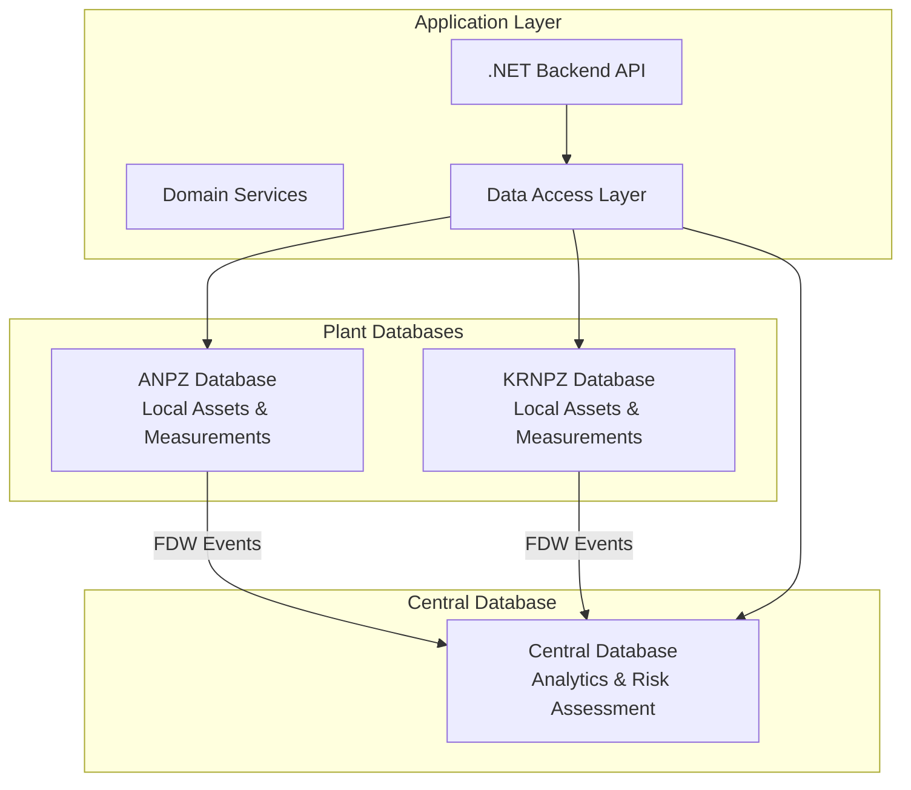
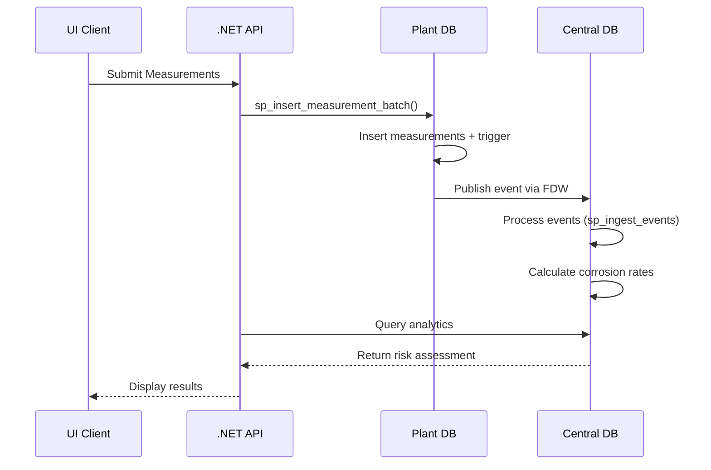

# ERP Distributed SQL System Analysis & Application Design

## Overview

This document provides a comprehensive analysis of the distributed ERP SQL system and outlines the design for developing a .NET application that interfaces with the database infrastructure. The system implements a multi-plant industrial asset management solution with distributed data collection and centralized analytics.

## Architecture

### System Components

The system consists of three main database components:

1. **Central Database** - Main analytical and coordination hub
2. **Plant Databases (ANPZ/KRNPZ)** - Local measurement collection points
3. **Application Layer** - .NET backend with domain-driven design



## Database Schema Analysis

### Central Database Schema

| Table | Purpose | Key Fields |
|-------|---------|------------|
| assets_global | Master asset registry | asset_code (PK), name, type, plant_code |
| risk_policies | Risk assessment thresholds | name (PK), threshold_low/med/high |
| analytics_cr | Corrosion rate analytics | asset_code, prev_thk, last_thk, cr |
| events_inbox | Event processing queue | event_type, source_plant, payload_json |

### Plant Database Schema (ANPZ/KRNPZ)

| Table | Purpose | Key Fields |
|-------|---------|------------|
| assets_local | Local asset registry | asset_code, location, status |
| measurement_points | Asset measurement locations | asset_id, label |
| measurements | Thickness measurements | point_id, ts, thickness |
| local_events | Local event logging | event_type, payload_json |

## Data Flow Architecture



## Core Database Functions & Procedures

### Central Database Operations

| Function/Procedure | Purpose | Parameters |
|-------------------|---------|------------|
| fn_calc_cr | Calculate corrosion rate | prev_thk, prev_date, last_thk, last_date |
| fn_asset_upsert | Create/update assets | asset_code, name, type, plant_code |
| fn_ingest_events | Process event queue | p_limit |
| fn_eval_risk | Risk assessment | asset_code, policy_name |
| fn_asset_summary_json | Complete asset info | asset_code, policy_name |
| sp_ingest_events | Event processing wrapper | p_limit |

### Plant Database Operations

| Function/Procedure | Purpose | Parameters |
|-------------------|---------|------------|
| sp_insert_measurement_batch | Batch measurement insert | asset_code, points_json, source_plant |
| trg_measurements_ai_fn | Measurement insert trigger | - |

## Application Layer Design

### Domain Entities Architecture

The .NET application implements domain-driven design with the following entity relationships:

```mermaid
classDiagram
    class Asset {
        +Id: long
        +AssetCode: string
        +Name: string
        +Type: string
        +PlantCode: string
        +Location: string
        +Status: string
    }
    
    class MeasurementPoint {
        +Id: long
        +AssetId: long
        +Label: string
        +Asset: Asset
    }
    
    class Reading {
        +Id: long
        +PointId: long
        +Timestamp: DateTime
        +Thickness: decimal
        +Note: string
        +MeasurementPoint: MeasurementPoint
    }
    
    class RiskAssessment {
        +AssetCode: string
        +CorrosionRate: decimal
        +RiskLevel: string
        +Thresholds: RiskThresholds
    }
    
    Asset ||--o{ MeasurementPoint
    MeasurementPoint ||--o{ Reading
    Asset ||--o| RiskAssessment
```

### Service Layer Architecture

| Service | Responsibility | Key Methods |
|---------|----------------|-------------|
| AssetService | Asset management | GetAsset, CreateAsset, UpdateAsset |
| MeasurementService | Measurement processing | SubmitBatchMeasurements, GetMeasurements |
| RiskAssessmentService | Risk analysis | EvaluateRisk, GetRiskSummary |
| WorkOrderService | Maintenance workflows | CreateWorkOrder, GetWorkOrders |

### Repository Pattern Implementation

| Repository | Database Target | Key Operations |
|------------|----------------|---------------|
| AssetRepository | Central + Plants | CRUD operations, cross-plant queries |
| ReadingRepository | Plant DBs | Batch inserts, measurement queries |
| RiskRepository | Central | Analytics queries, risk calculations |

## API Endpoints Reference

### Asset Management Endpoints

| Endpoint | Method | Purpose | Request/Response |
|----------|--------|---------|------------------|
| /api/assets/{code} | GET | Get asset details | AssetSummaryResponse |
| /api/assets | POST | Create/update asset | AssetRequest → AssetResponse |
| /api/assets/risk/{code} | GET | Get risk assessment | RiskAssessmentResponse |

### Measurement Endpoints

| Endpoint | Method | Purpose | Request/Response |
|----------|--------|---------|------------------|
| /api/measurements/batch | POST | Submit measurements | BatchMeasurementRequest → BatchResponse |
| /api/measurements/{assetCode} | GET | Get measurements | MeasurementHistoryResponse |

### Analytics Endpoints

| Endpoint | Method | Purpose | Request/Response |
|----------|--------|---------|------------------|
| /api/analytics/top-risk | GET | High-risk assets | TopRiskAssetsResponse |
| /api/analytics/summary | GET | System summary | AnalyticsSummaryResponse |

## Testing Strategy

### Database Integration Tests

| Test Category | Purpose | Test Methods |
|---------------|---------|--------------|
| Measurement Processing | Verify batch insert flow | TestBatchMeasurementInsert |
| Event Processing | Verify FDW event flow | TestEventProcessing |
| Risk Calculations | Verify corrosion rate logic | TestCorrosionRateCalculation |
| Cross-Database Operations | Verify distributed queries | TestCrossDatabaseQueries |

### Unit Tests for Services

| Service Test | Focus | Key Scenarios |
|--------------|-------|---------------|
| AssetServiceTests | Business logic | Asset creation, validation, updates |
| MeasurementServiceTests | Data processing | Batch validation, error handling |
| RiskAssessmentServiceTests | Risk algorithms | Threshold evaluation, policy application |

## Future Enhancement Options

### Option 1: Advanced Analytics Module

**Database Enhancements:**
- Predictive maintenance functions
- Trend analysis procedures  
- Statistical correlation calculations
- Machine learning integration via stored procedures

**Application Features:**
- Predictive failure modeling
- Maintenance scheduling optimization
- Cost-benefit analysis tools
- Advanced reporting dashboards

### Option 2: Real-time Monitoring System

**Database Enhancements:**
- Real-time event streaming procedures
- Alert threshold management functions
- Automated response trigger system
- Performance monitoring procedures

**Application Features:**
- Live measurement streaming
- Real-time alert system
- Mobile notifications
- Operator dashboard with live updates

### Option 3: Multi-Plant Coordination Platform

**Database Enhancements:**
- Cross-plant correlation functions
- Resource sharing procedures
- Centralized scheduling system
- Inter-plant communication protocols

**Application Features:**
- Multi-plant asset tracking
- Resource allocation system
- Centralized maintenance planning
- Cross-plant performance comparison

## Implementation Phases

### Phase 1: Core Database Integration
- Implement repository pattern for all database operations
- Create service layer with basic CRUD operations
- Develop integration tests for database procedures
- Build API endpoints for asset and measurement management

### Phase 2: Analytics Integration
- Implement risk assessment service
- Create analytics repository with complex queries
- Build dashboard API endpoints
- Develop comprehensive test suite

### Phase 3: Advanced Features
- Choose and implement one of the enhancement options
- Add advanced testing scenarios
- Implement monitoring and logging
- Performance optimization and scalability testing- Inter-plant communication protocols

**Application Features:**
- Multi-plant asset tracking
- Resource allocation system
- Centralized maintenance planning
- Cross-plant performance comparison

## Implementation Phases

### Phase 1: Core Database Integration
- Implement repository pattern for all database operations
- Create service layer with basic CRUD operations
- Develop integration tests for database procedures
- Build API endpoints for asset and measurement management

### Phase 2: Analytics Integration
- Implement risk assessment service
- Create analytics repository with complex queries
- Build dashboard API endpoints
- Develop comprehensive test suite

### Phase 3: Advanced Features
- Choose and implement one of the enhancement options
- Add advanced testing scenarios
- Implement monitoring and logging
- Performance optimization and scalability testing


