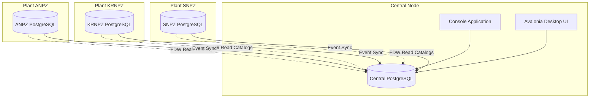
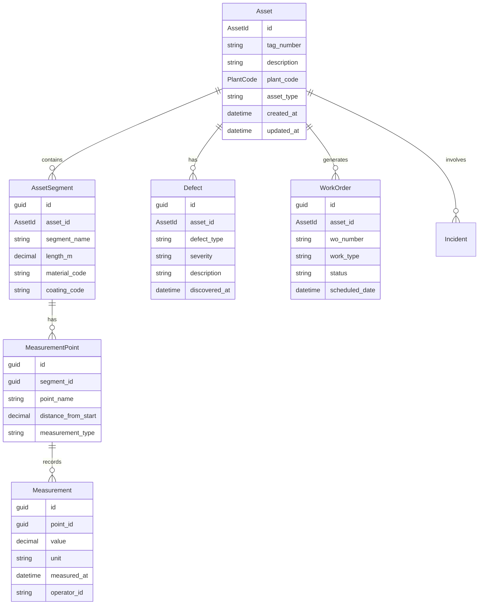
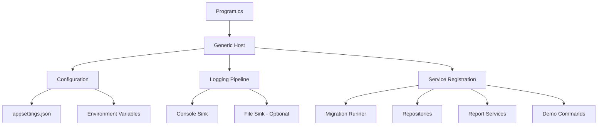
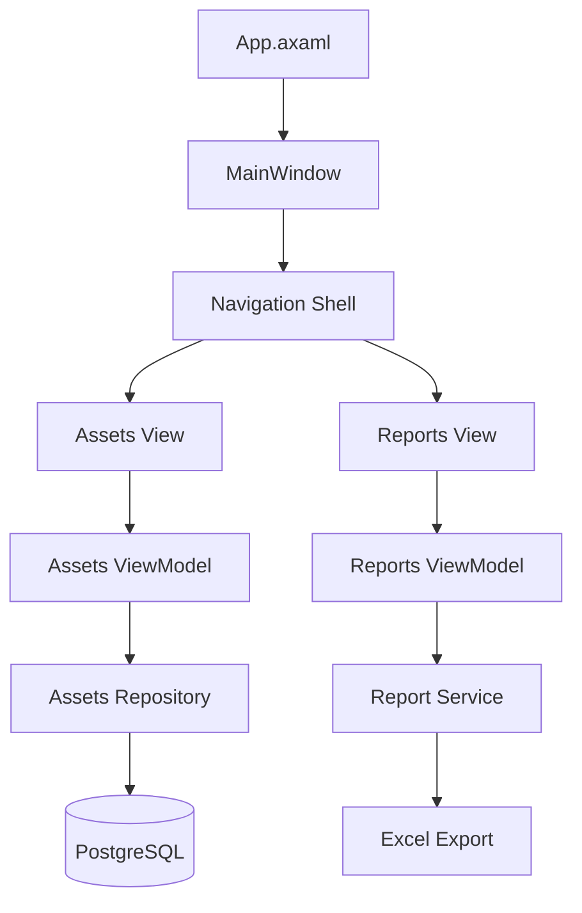
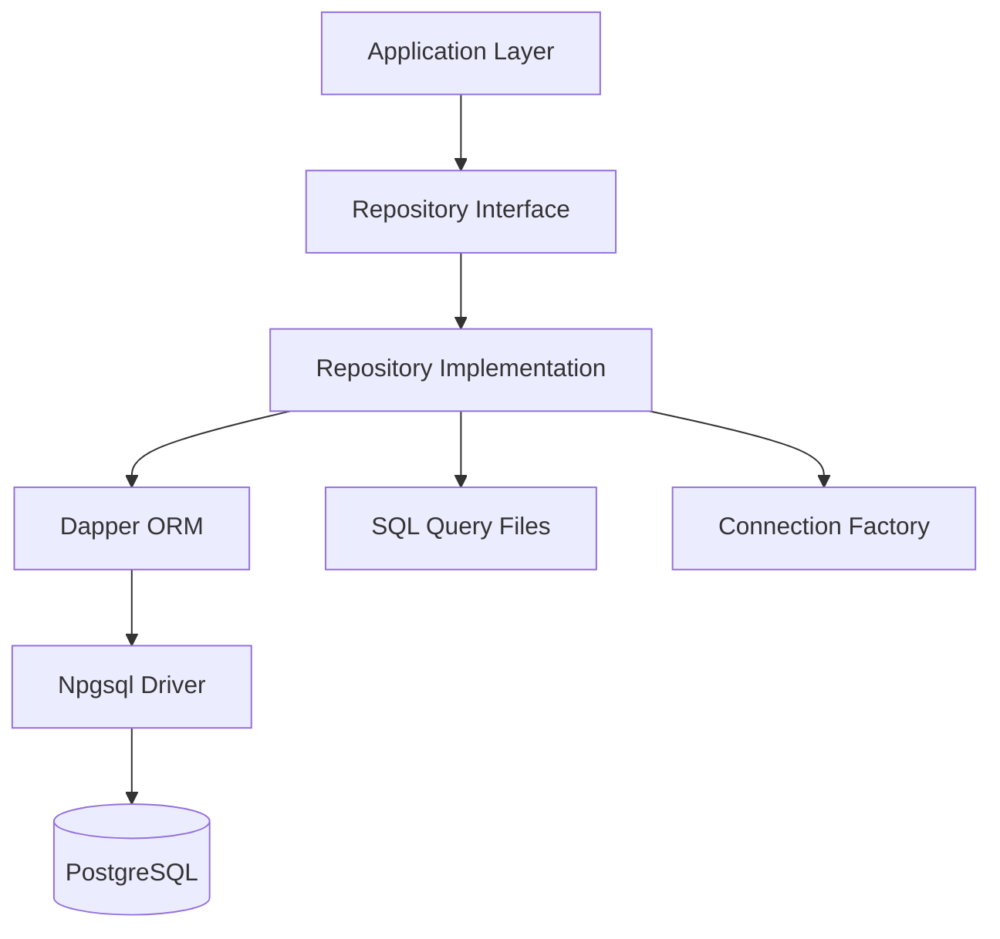
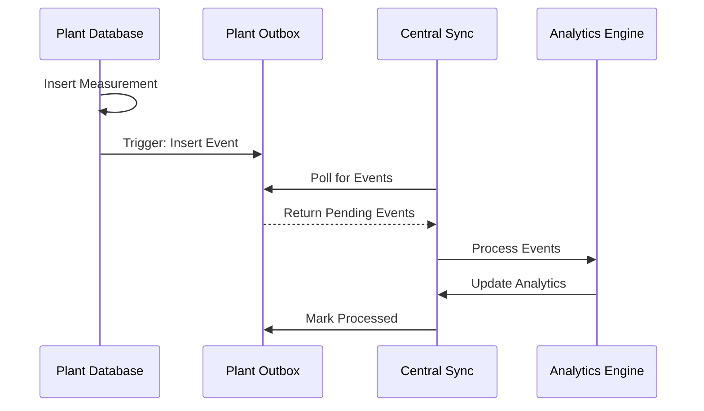

# ERP Asset Registry and Integrity Tracking System Design

## Overview

This document outlines the design for a comprehensive .NET 8 C# solution implementing an ERP-style asset registry and integrity tracking system specifically designed for oil company operations. The system manages asset integrity across multiple plants with centralized analytics and distributed data collection.

### Core Objectives
- Track oil company assets across multiple plants (ANPZ, KRNPZ, SNPZ)
- Monitor asset integrity through measurements, defects, and work orders
- Provide centralized analytics for corrosion rates and remaining asset life
- Enable distributed operations with central coordination
- Support both console-based operations and desktop UI

### System Scope
- **Central Hub**: Global asset registry, analytics, risk policies, incidents
- **Plant Operations**: Local asset measurements, defect tracking, work orders
- **Data Integration**: PostgreSQL with Foreign Data Wrappers (FDW)
- **User Interfaces**: Console application and Avalonia desktop UI

## Technology Stack & Dependencies

### Core Framework
- **.NET 8** with C# 12
- **Target Platform**: macOS (primary), cross-platform compatible

### Database Technology
```
PostgreSQL (Primary Database)
├── Central Database (Master)
├── Plant Databases (ANPZ, KRNPZ, SNPZ)
└── Foreign Data Wrappers (FDW) for integration
```

### Package Dependencies
| Package | Purpose | Version |
|---------|---------|---------|
| Npgsql | PostgreSQL driver | Latest |
| Dapper | Micro-ORM for data access | Latest |
| Microsoft.Extensions.Hosting | Generic Host pattern | .NET 8 |
| Microsoft.Extensions.Configuration.Json | JSON configuration | .NET 8 |
| Microsoft.Extensions.Logging.Console | Console logging | .NET 8 |
| Serilog | Structured logging | Latest |
| Serilog.Sinks.File | File logging sink | Latest |
| ClosedXML | Excel report generation | Latest |
| xUnit | Unit testing framework | Latest |
| Avalonia | Cross-platform UI framework | Latest |
| Avalonia.ReactiveUI | MVVM support | Latest |
| CommunityToolkit.Mvvm | MVVM helpers | Latest |

## Architecture

### System Architecture Overview



### Repository Structure

```
/OilErp.sln
/src/
  OilErp.App/                       # Console Application
  OilErp.Ui/                        # Avalonia Desktop UI
  OilErp.Domain/                    # Domain Models & Services
  OilErp.Data/                      # Data Access Layer
  OilErp.Tests/                     # Test Suite
/sql/                               # Database Scripts
  central/                          # Central DB DDL/DML
  plants/                           # Plant DB DDL/DML
/docs/                              # Documentation
```

### Data Distribution Strategy

**Central Database Responsibilities:**
- Global asset registry and catalogs
- Material, coating, and fluid specifications
- Risk policies and assessment matrices
- Corrosion analytics and remaining life calculations
- Global incident tracking
- Event synchronization (outbox/inbox pattern)

**Plant Database Responsibilities:**
- Local asset instances and segments
- Measurement points and readings
- Defect records and work orders
- Local event generation
- Catalog access via FDW

## Domain Models & Data Architecture

### Core Domain Entities



### Value Objects

**AssetId**: Strongly-typed identifier for assets
```csharp
public readonly record struct AssetId(string Value)
{
    public static AssetId Parse(string value) => new(value);
    public override string ToString() => Value;
}
```

**PlantCode**: Enumerated plant identifiers
```csharp
public enum PlantCode
{
    ANPZ,   // Ангарский НПЗ
    KRNPZ,  // Киришский НПЗ  
    SNPZ    // Сызранский НПЗ
}
```

## Database Schema Design

### Central Database Tables

| Table Group | Tables | Purpose |
|-------------|--------|---------|
| **Catalogs** | materials, coatings, fluids, corrosion_mechanisms | Reference data |
| **Assets** | global_assets | Master asset registry |
| **Risk** | risk_policies, risk_matrix | Risk assessment rules |
| **Analytics** | analytics_corrosion, remaining_life | Computed analytics |
| **Incidents** | incidents_global | Company-wide incidents |
| **Sync** | sync_outbox, sync_inbox | Event synchronization |

### Plant Database Tables

| Table Group | Tables | Purpose |
|-------------|--------|---------|
| **Local Assets** | local_assets, segments, measurement_points | Plant-specific assets |
| **Measurements** | measurements | Sensor and manual readings |
| **Maintenance** | defects, work_orders | Maintenance tracking |
| **Events** | local_events | Plant event log |
| **Foreign** | foreign_catalogs | FDW views to central |

### SQL Migration Strategy

**File Naming Convention:**
- `NNNN_description.sql` where NNNN is ordering number
- Central: 0001-0999
- Plants: 0001-0999 (common), 0000 (plant-specific)

**Migration Execution:**
1. Folder-based discovery
2. Filename-ordered execution
3. Per-file transaction wrapping
4. Error-stop behavior
5. Idempotent DDL preferred

## Application Architecture

### Console Application (OilErp.App)

**Architecture Pattern**: Generic Host with Dependency Injection



**Core Components:**

| Component | Responsibility |
|-----------|----------------|
| **Program.cs** | Application bootstrap and host configuration |
| **AppHost.cs** | Service registration and application lifecycle |
| **LoggingConfig.cs** | Multi-sink logging configuration |
| **MigrationRunner.cs** | SQL file discovery and execution |
| **DemoCommands.cs** | Prototype operations and testing |
| **ExcelReportService.cs** | Report generation with ClosedXML |

### Avalonia Desktop UI (OilErp.Ui)

**Architecture Pattern**: MVVM with ReactiveUI



**MVVM Structure:**

| Layer | Components | Purpose |
|-------|------------|---------|
| **Views** | MainWindow, AssetsView, ReportsView | UI presentation |
| **ViewModels** | MainWindowViewModel, AssetsViewModel, ReportsViewModel | UI logic and binding |
| **Services** | Repository interfaces, report services | Business operations |
| **Models** | Domain entities, DTOs | Data representation |

### Data Access Layer (OilErp.Data)

**Repository Pattern with Dapper:**



**Repository Interfaces:**
- `IAssetsRepository` - Asset CRUD operations
- `IMeasurementsRepository` - Measurement data access
- `IDefectsRepository` - Defect tracking
- `IWorkOrdersRepository` - Work order management
- `IIncidentsRepository` - Incident reporting

## Database Integration & Synchronization

### Foreign Data Wrapper Setup

**Central to Plants Connection:**
```sql
-- On each plant database
CREATE SERVER central_server
  FOREIGN DATA WRAPPER postgres_fdw
  OPTIONS (host 'central-host', dbname 'central', port '5432');

CREATE USER MAPPING FOR plant_user
  SERVER central_server
  OPTIONS (user 'central_reader', password 'password');

-- Import catalogs
IMPORT FOREIGN SCHEMA catalogs
  FROM SERVER central_server
  INTO public;
```

### Event Synchronization Pattern

**Outbox Pattern Implementation:**
1. Plant operations write to local tables + outbox
2. Central polling service reads plant outboxes
3. Events processed into central analytics
4. Acknowledgment clears outbox entries



## Business Logic Layer

### Corrosion Analytics Service

**Core Calculations:**
- **Corrosion Rate**: `(initial_thickness - current_thickness) / time_period`
- **Remaining Life**: `current_thickness / corrosion_rate`
- **Risk Assessment**: Based on remaining life vs. policy thresholds

**Implementation Pattern:**
```csharp
public interface ICorrosionAnalyticsService
{
    Task<CorrosionRate> CalculateCorrosionRateAsync(AssetId assetId, TimeRange period);
    Task<RemainingLife> EstimateRemainingLifeAsync(AssetId assetId);
    Task<RiskLevel> AssessRiskLevelAsync(AssetId assetId);
}
```

### Risk Assessment Matrix

| Remaining Life | Corrosion Rate | Risk Level |
|----------------|----------------|------------|
| > 10 years | Low | Green |
| 5-10 years | Medium | Yellow |
| 2-5 years | High | Orange |
| < 2 years | Critical | Red |

## Configuration Management

### Configuration Structure

```json
{
  "ConnectionStrings": {
    "Central": "Server=localhost;Database=central;...",
    "ANPZ": "Server=localhost;Database=anpz;...",
    "KRNPZ": "Server=localhost;Database=krnpz;...",
    "SNPZ": "Server=localhost;Database=snpz;..."
  },
  "Logging": {
    "WriteToFile": true,
    "LogLevel": {
      "Default": "Information",
      "Microsoft": "Warning"
    }
  },
  "Reports": {
    "OutputPath": "./out/reports",
    "ExcelTemplates": "./templates"
  },
  "Migration": {
    "SqlPath": "./sql",
    "AutoMigrate": true
  }
}
```

### Environment-Specific Overrides

| Environment | File | Purpose |
|-------------|------|---------|
| Development | `appsettings.Development.json` | Local dev settings |
| Production | `appsettings.Production.json` | Production configuration |
| Environment Variables | System env vars | Sensitive data overrides |

## Reporting System

### Excel Report Generation

**Report Types:**
1. **Asset Integrity Summary** - Current status across all assets
2. **Corrosion Trends** - Historical corrosion rate analysis  
3. **Maintenance Schedule** - Upcoming work orders
4. **Risk Assessment** - Assets by risk level

**Implementation with ClosedXML:**
```csharp
public class ExcelReportService
{
    public async Task<string> GenerateAssetIntegrityReportAsync(ReportCriteria criteria)
    {
        using var workbook = new XLWorkbook();
        var worksheet = workbook.Worksheets.Add("Asset Integrity");
        
        // TODO: Populate with data from repositories
        // TODO: Apply formatting and charts
        
        var outputPath = Path.Combine(_config.OutputPath, $"integrity_{DateTime.Now:yyyyMMdd}.xlsx");
        workbook.SaveAs(outputPath);
        return outputPath;
    }
}
```

## Testing Strategy

### Unit Testing Structure

```
OilErp.Tests/
├── Domain/
│   ├── AssetTests.cs
│   └── ValueObjectTests.cs
├── Data/
│   ├── RepositoryTests.cs
│   └── MigrationTests.cs
├── Smoke/
│   └── ConnectivityTests.cs
└── Integration/
    └── EndToEndTests.cs
```

**Test Categories:**
- **Unit Tests**: Domain logic, value objects, business rules
- **Integration Tests**: Repository operations, database connectivity
- **Smoke Tests**: Basic system functionality verification
- **End-to-End Tests**: Complete workflow validation

### Test Database Strategy

**Approach**: Separate test databases with automated setup/teardown
```csharp
[Collection("Database")]
public class AssetRepositoryTests : IDisposable
{
    private readonly ITestDatabase _testDb;
    
    public AssetRepositoryTests()
    {
        _testDb = TestDatabaseFactory.Create();
        _testDb.ApplyMigrations();
    }
    
    [Fact]
    public async Task Should_Create_Asset_Successfully()
    {
        // Arrange
        var repository = new AssetsRepository(_testDb.ConnectionString);
        var asset = new Asset(AssetId.Parse("TEST-001"), "Test Asset", PlantCode.ANPZ);
        
        // Act
        await repository.CreateAsync(asset);
        
        // Assert
        var retrieved = await repository.GetByIdAsync(asset.Id);
        Assert.NotNull(retrieved);
        Assert.Equal("Test Asset", retrieved.Description);
    }
    
    public void Dispose() => _testDb.Dispose();
}
```