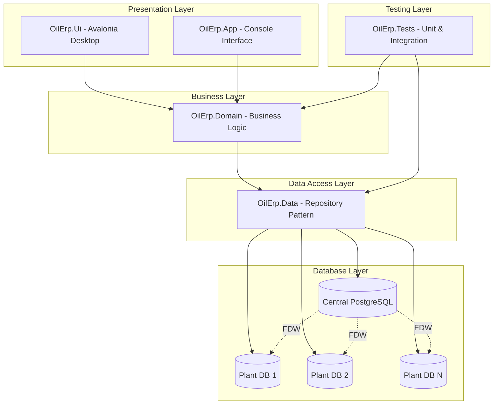
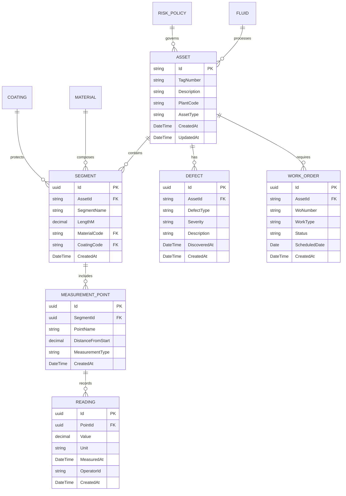
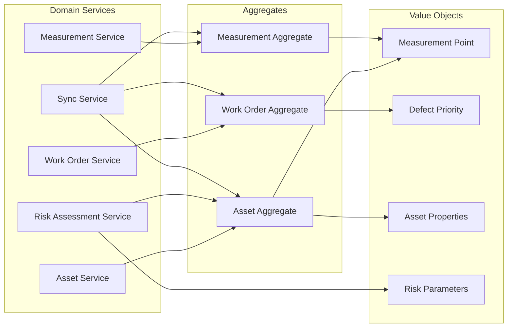
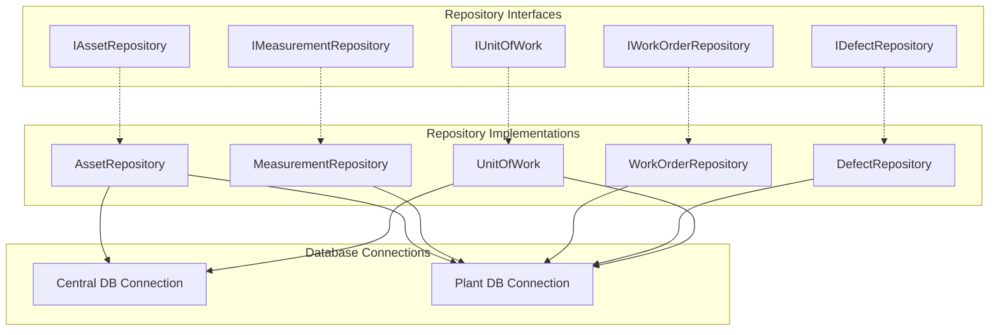
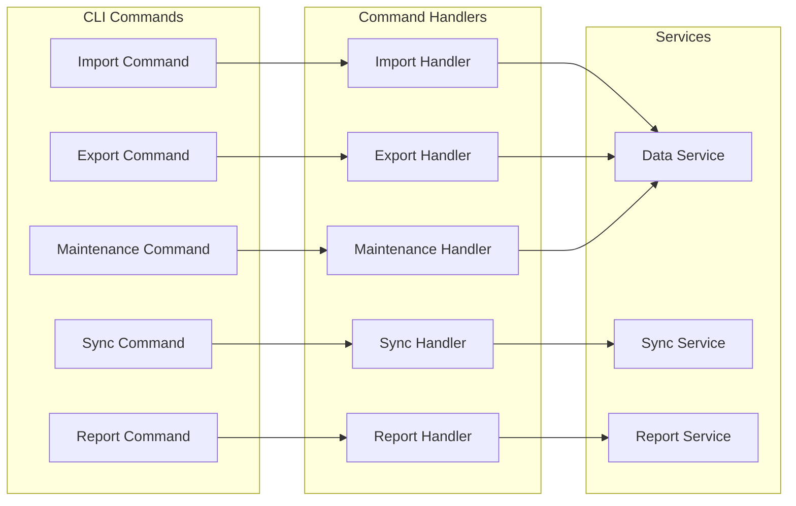
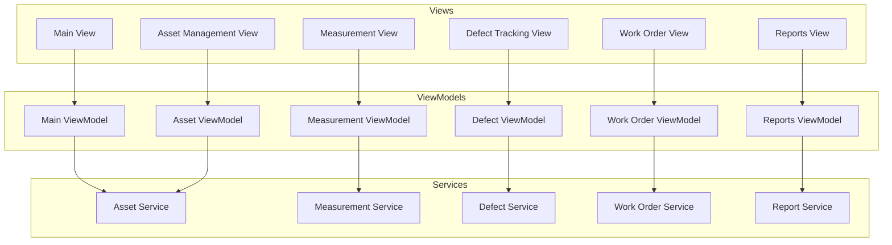
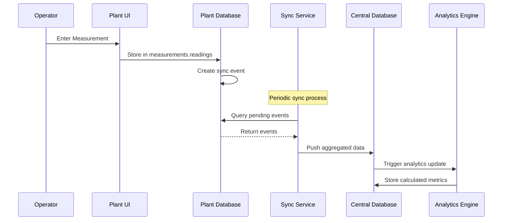
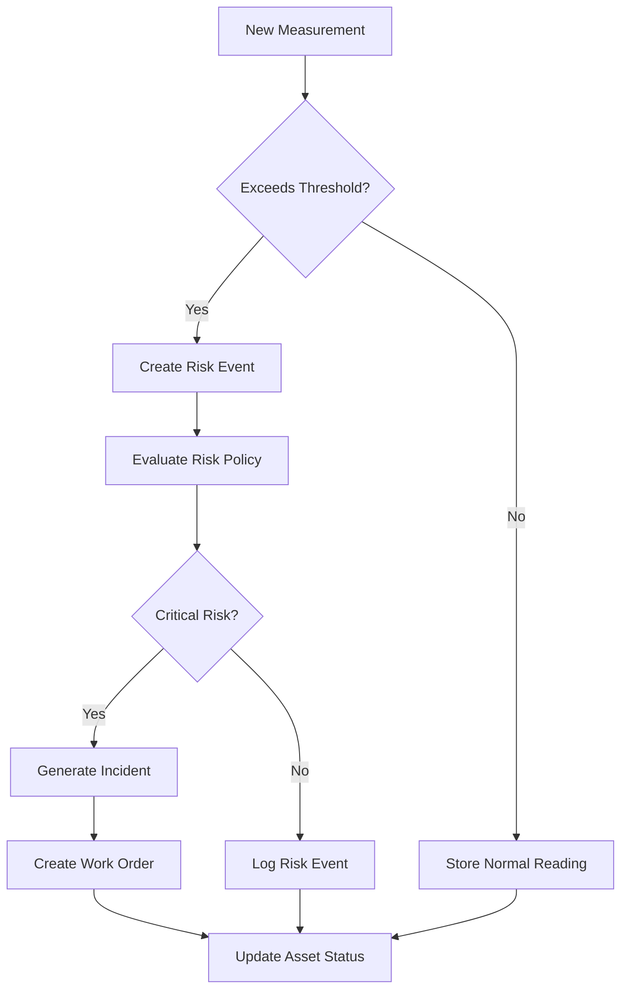
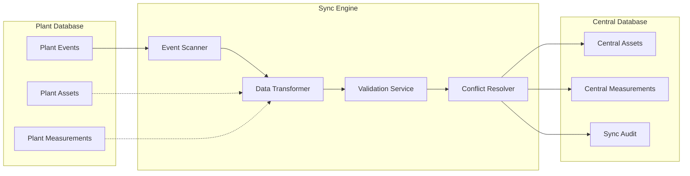
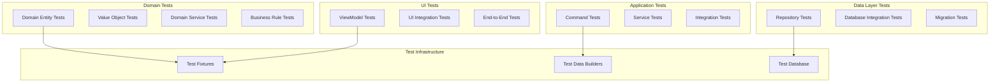

# Oil ERP Asset Registry System - C# Application Design

## Overview

The Oil ERP Asset Registry System is a comprehensive .NET 8-based enterprise application designed for oil company operations, focusing on asset integrity tracking and management across multiple industrial plants. The system provides centralized analytics and risk monitoring while supporting distributed data collection at plant-level databases.

### Core Objectives
- Centralized management of asset integrity data across geographically dispersed plants
- Real-time integration between local plant operations and central analytics
- Tracking of defects, work orders, and risk policies with full auditability
- Data consistency using PostgreSQL Foreign Data Wrappers (FDW)

### Key Features
- Global asset registry with lifecycle tracking
- Plant-specific defect and measurement data management  
- Risk policy enforcement and incident reporting
- Cross-platform desktop UI for operators and engineers
- Automated testing and console-based operational workflows

## Architecture

### System Architecture Overview

### Project Structure

| Project | Responsibility | Key Components |
|---------|---------------|----------------|
| **OilErp.Domain** | Business Logic & Models | Entities, Value Objects, Domain Services, Business Rules |
| **OilErp.Data** | Data Access | Repositories, Database Context, Dapper Integration |
| **OilErp.App** | Console Application | CLI Commands, Data Import/Export, System Operations |
| **OilErp.Ui** | Desktop Interface | Avalonia Views, ViewModels, User Controls |
| **OilErp.Tests** | Testing | Unit Tests, Integration Tests, Test Fixtures |

### Technology Stack

- **Framework**: .NET 8
- **Language**: C# 12
- **Database**: PostgreSQL 14+ with Foreign Data Wrappers
- **Data Access**: Dapper (lightweight ORM)
- **UI Framework**: Avalonia (cross-platform desktop)
- **Testing**: xUnit
- **Logging**: Serilog
- **Architecture Pattern**: Layered Architecture with Repository Pattern

## Domain Model Design

### Core Domain Entities

### Domain Services Architecture

## Data Layer Architecture

### Repository Pattern Implementation

### Database Schema Integration

#### Central Database Tables
- `catalogs.materials` - Material definitions and properties
- `catalogs.coatings` - Coating types and specifications  
- `catalogs.fluids` - Fluid properties and corrosivity data
- `assets.global_assets` - Master asset registry
- `risk.policies` - Risk assessment policies and thresholds
- `analytics.*` - Aggregated analytics and reporting data
- `incidents.*` - Incident tracking and management
- `sync.*` - Synchronization metadata and status

#### Plant Database Tables
- `local_assets.assets` - Local asset instances
- `local_assets.segments` - Asset segments and components
- `measurements.points` - Measurement point definitions
- `measurements.readings` - Actual measurement data
- `maintenance.defects` - Identified defects and issues
- `maintenance.work_orders` - Maintenance work orders
- `events.local_events` - Event sourcing for synchronization

## Application Layer Design

### Console Application (OilErp.App)

#### Command Structure
| Command | Purpose | Parameters |
|---------|---------|------------|
| `import` | Import asset data from CSV/Excel | `--file`, `--type`, `--plant` |
| `export` | Export data for reporting | `--format`, `--date-range`, `--plant` |
| `sync` | Synchronize plant data to central | `--plant`, `--force` |
| `report` | Generate analytics reports | `--type`, `--output`, `--date-range` |
| `maintain` | Run maintenance operations | `--operation`, `--target` |

### Desktop Application (OilErp.Ui)

#### UI Components Architecture
- **Navigation**: Tree-based navigation with plant and asset hierarchy
- **Data Grids**: Sortable, filterable grids for asset lists and measurements
- **Forms**: Asset creation/editing with validation
- **Charts**: Real-time measurement visualization and trend analysis
- **Reports**: Printable reports with export capabilities

## Data Flow Architecture

### Measurement Data Flow

### Risk Assessment Flow

## Business Logic Layer

### Asset Management

#### Asset Lifecycle States
- **Planned** - Asset designed but not yet installed
- **Active** - Asset in operation and collecting data
- **Maintenance** - Asset temporarily out of service
- **Retired** - Asset permanently decommissioned

#### Asset Operations
- **Create Asset**: Validate asset data and register in global registry
- **Update Asset**: Modify asset properties with audit trail
- **Add Segment**: Define physical segments with materials and coatings
- **Record Measurement**: Capture measurement data with validation
- **Report Defect**: Log defects with severity assessment
- **Schedule Maintenance**: Create work orders based on defects or schedules

### Risk Management

#### Risk Assessment Rules
- **Threshold Monitoring**: Compare measurements against policy thresholds
- **Trend Analysis**: Identify deteriorating conditions over time
- **Correlation Analysis**: Detect patterns across multiple assets
- **Predictive Maintenance**: Schedule maintenance based on risk scores

#### Risk Policy Engine
- **Policy Definition**: Configure thresholds and response actions
- **Policy Evaluation**: Apply policies to incoming measurements
- **Escalation Rules**: Define escalation paths for different risk levels
- **Compliance Tracking**: Monitor adherence to risk management procedures

## Integration Architecture

### Plant-to-Central Synchronization

### Event-Driven Architecture

#### Event Types
- **AssetCreated**: New asset registered
- **MeasurementRecorded**: New measurement data
- **DefectDetected**: Defect identified
- **WorkOrderCreated**: Maintenance scheduled
- **RiskThresholdExceeded**: Risk policy violation
- **SyncCompleted**: Data synchronization finished

#### Event Processing
- **Event Store**: Persist all events for audit and replay
- **Event Handlers**: Process events asynchronously
- **Event Projection**: Build read models from events
- **Event Replay**: Reconstruct system state from events

## Testing Strategy

### Unit Testing Architecture

### Test Categories

#### Unit Tests
- **Domain Entity Tests**: Validate business logic and invariants
- **Repository Tests**: Verify data access logic with mocked databases
- **Service Tests**: Test business services with mocked dependencies
- **ViewModel Tests**: Validate UI logic and data binding

#### Integration Tests
- **Database Integration**: Test repository implementations with real database
- **API Integration**: Verify external service integrations
- **Sync Integration**: Test plant-to-central synchronization
- **End-to-End**: Complete user workflow testing

### Test Data Management

#### Test Database Strategy
- **In-Memory Database**: Fast unit tests with SQLite in-memory
- **Docker PostgreSQL**: Integration tests with containerized database
- **Test Data Builders**: Fluent builders for creating test data
- **Database Migrations**: Separate test migration scripts

#### Mock Strategy
- **Repository Mocks**: Mock data layer for business logic tests
- **Service Mocks**: Mock external dependencies
- **Time Mocks**: Control time for temporal testing
- **Event Mocks**: Mock event publishing for unit tests

## Deployment and Infrastructure

### Database Deployment

#### Central Database Setup
- Install PostgreSQL 14+ with FDW extensions
- Run central schema migrations from `sql/central/`
- Configure FDW connections to plant databases
- Set up backup and replication strategies

#### Plant Database Setup
- Install PostgreSQL at each plant location
- Run plant schema migrations from `sql/plants/`
- Configure local backup strategies
- Establish secure connections to central database

### Application Deployment

#### Desktop Application Distribution
- Build cross-platform binaries for Windows, Linux, macOS
- Package with installer for easy deployment
- Include database connection configuration
- Provide offline operation capabilities

#### Console Application Deployment
- Deploy as scheduled service for automated operations
- Configure command-line interfaces for operators
- Set up logging and monitoring
- Implement error handling and recovery

### Security Architecture

#### Database Security
- Role-based access control for different user types
- Encrypted connections between plants and central
- Audit logging for all data modifications
- Backup encryption and secure storage

#### Application Security
- User authentication and authorization
- Secure configuration management
- Input validation and sanitization
- Error handling without information disclosure

## Performance Considerations

### Database Optimization

#### Query Performance
- Proper indexing strategy for frequent queries
- Partitioning for large measurement tables
- Query optimization for cross-database joins via FDW
- Connection pooling for high-throughput scenarios

#### Data Archival
- Archive old measurement data to separate tables
- Implement data retention policies
- Compress archived data for storage efficiency
- Maintain query performance with proper indexing

### Application Performance

#### UI Responsiveness
- Asynchronous data loading with progress indicators
- Virtual scrolling for large data grids
- Lazy loading of detailed data
- Caching frequently accessed data

#### Sync Performance
- Batch processing for large data sets
- Delta synchronization to minimize data transfer
- Compression for network efficiency
- Retry logic with exponential backoff