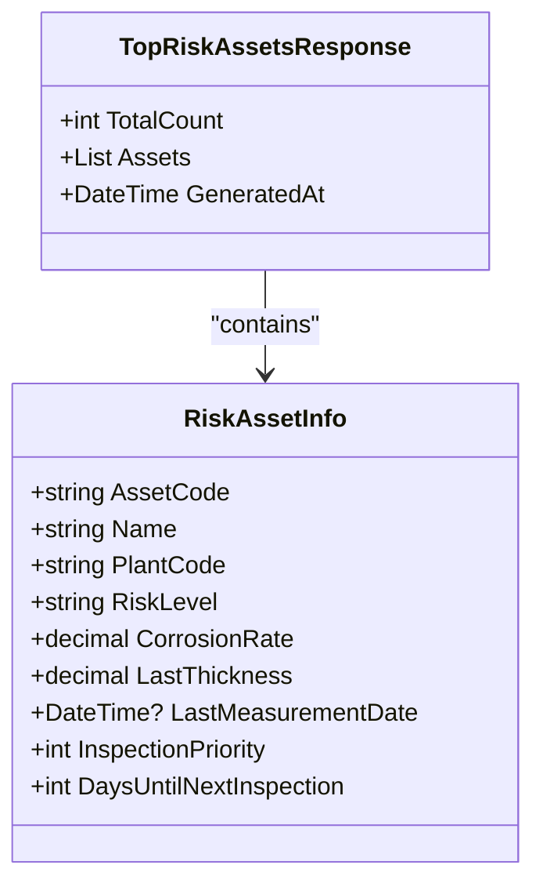
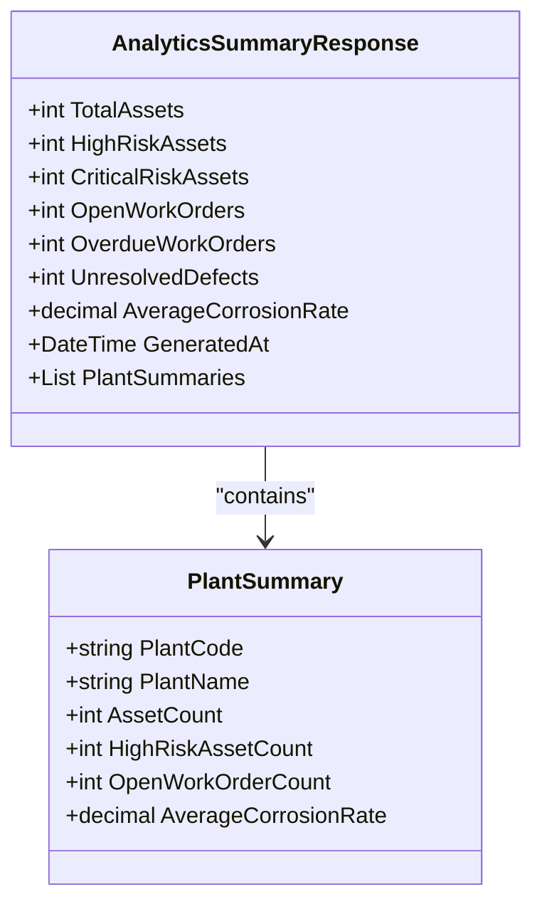
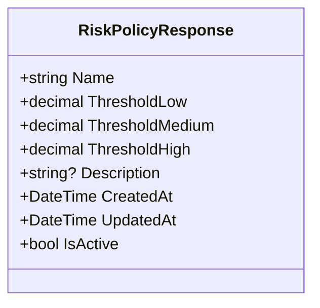
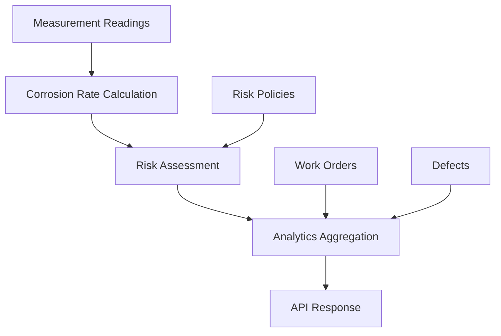

# Analytics & Reporting API

<cite>
**Referenced Files in This Document**   
- [AnalyticsController.cs](file://src/OilErp.App/Controllers/AnalyticsController.cs)
- [AnalyticsAndCommonModels.cs](file://src/OilErp.App/Models/AnalyticsAndCommonModels.cs)
- [Analytics.cs](file://src/OilErp.Domain/Entities/Analytics.cs)
- [IServices.cs](file://src/OilErp.Domain/Interfaces/IServices.cs)
- [AnalyticsRepositories.cs](file://src/OilErp.Data/Repositories/AnalyticsRepositories.cs)
</cite>

## Table of Contents
1. [Introduction](#introduction)
2. [API Endpoints](#api-endpoints)
3. [Response Models](#response-models)
4. [Authentication and Security](#authentication-and-security)
5. [Error Handling](#error-handling)
6. [Rate Limiting and Performance](#rate-limiting-and-performance)
7. [Data Derivation and Analytics Logic](#data-derivation-and-analytics-logic)
8. [Troubleshooting Guide](#troubleshooting-guide)

## Introduction

The Analytics & Reporting API provides comprehensive endpoints for retrieving risk assessments, system metrics, and corrosion analytics within the Oil ERP system. This API enables users to monitor asset health, track risk levels, and manage risk policies across the organization's infrastructure. The endpoints are designed to support decision-making for maintenance planning, risk mitigation, and operational oversight in oil industry pipeline systems.

The analytics data is derived from measurement readings, risk assessments, and work order statuses, providing a holistic view of asset conditions. The system integrates with multiple data sources including central and plant-specific databases to ensure comprehensive analytics coverage.

**Section sources**
- [AnalyticsController.cs](file://src/OilErp.App/Controllers/AnalyticsController.cs#L9-L371)

## API Endpoints

### GET /api/analytics/top-risk

Retrieves the top risk assets based on their current risk assessment.

**Parameters**
- `limit` (integer, query): Number of top risk assets to return (default: 10, range: 1-100)

**Authentication Requirements**
- Requires valid API token
- User must have "Analytics.Read" permission

**Return Values**
- 200 OK: Returns TopRiskAssetsResponse with the highest risk assets
- 400 Bad Request: Invalid limit parameter
- 500 Internal Server Error: System error occurred

**Example Request**
```
GET /api/analytics/top-risk?limit=5 HTTP/1.1
Authorization: Bearer <token>
```

**Example Response**
```json
{
  "success": true,
  "data": {
    "totalCount": 5,
    "assets": [
      {
        "assetCode": "ANPZ-PIPE-001",
        "name": "Main Pipeline Section A",
        "plantCode": "ANPZ",
        "riskLevel": "Critical",
        "corrosionRate": 1.25,
        "lastThickness": 8.2,
        "lastMeasurementDate": "2024-01-15T10:30:00Z",
        "inspectionPriority": 10,
        "daysUntilNextInspection": 30
      }
    ],
    "generatedAt": "2024-01-20T08:45:30Z"
  },
  "timestamp": "2024-01-20T08:45:30Z"
}
```

**Section sources**
- [AnalyticsController.cs](file://src/OilErp.App/Controllers/AnalyticsController.cs#L37-L94)

### GET /api/analytics/summary

Retrieves a comprehensive system analytics summary with key performance indicators.

**Parameters**
- None

**Authentication Requirements**
- Requires valid API token
- User must have "Analytics.Read" permission

**Return Values**
- 200 OK: Returns AnalyticsSummaryResponse with system metrics
- 500 Internal Server Error: System error occurred

**Example Request**
```
GET /api/analytics/summary HTTP/1.1
Authorization: Bearer <token>
```

**Example Response**
```json
{
  "success": true,
  "data": {
    "totalAssets": 1500,
    "highRiskAssets": 42,
    "criticalRiskAssets": 18,
    "openWorkOrders": 127,
    "overdueWorkOrders": 15,
    "unresolvedDefects": 89,
    "averageCorrosionRate": 0.18,
    "generatedAt": "2024-01-20T08:45:30Z",
    "plantSummaries": [
      {
        "plantCode": "ANPZ",
        "plantName": "ANPZ Refinery",
        "assetCount": 650,
        "highRiskAssetCount": 22,
        "openWorkOrderCount": 56,
        "averageCorrosionRate": 0.21
      }
    ]
  },
  "timestamp": "2024-01-20T08:45:30Z"
}
```

**Section sources**
- [AnalyticsController.cs](file://src/OilErp.App/Controllers/AnalyticsController.cs#L101-L152)

### GET /api/analytics/risk-level/{riskLevel}

Retrieves all assets with a specific risk level.

**Parameters**
- `riskLevel` (string, path): Risk level to filter by (case-insensitive: Low, Medium, High, Critical, Minimal)

**Authentication Requirements**
- Requires valid API token
- User must have "Analytics.Read" permission

**Return Values**
- 200 OK: Returns list of RiskAssetInfo objects
- 400 Bad Request: Invalid risk level specified
- 500 Internal Server Error: System error occurred

**Example Request**
```
GET /api/analytics/risk-level/Critical HTTP/1.1
Authorization: Bearer <token>
```

**Example Response**
```json
{
  "success": true,
  "data": [
    {
      "assetCode": "ANPZ-PIPE-001",
      "name": "Main Pipeline Section A",
      "plantCode": "ANPZ",
      "riskLevel": "Critical",
      "corrosionRate": 1.25,
      "lastThickness": 8.2,
      "lastMeasurementDate": "2024-01-15T10:30:00Z",
      "inspectionPriority": 10,
      "daysUntilNextInspection": 30
    }
  ],
  "timestamp": "2024-01-20T08:45:30Z"
}
```

**Section sources**
- [AnalyticsController.cs](file://src/OilErp.App/Controllers/AnalyticsController.cs#L160-L212)

### GET /api/analytics/corrosion

Retrieves corrosion analytics data for assets.

**Parameters**
- None

**Authentication Requirements**
- Requires valid API token
- User must have "Analytics.Read" permission

**Return Values**
- 200 OK: Returns CorrosionAnalyticsResponse with corrosion data
- 500 Internal Server Error: System error occurred

**Note**: This endpoint currently returns placeholder data as the full implementation is pending.

**Example Request**
```
GET /api/analytics/corrosion HTTP/1.1
Authorization: Bearer <token>
```

**Example Response**
```json
{
  "success": true,
  "data": {
    "totalAssets": 0,
    "averageCorrosionRate": 0,
    "maxCorrosionRate": 0,
    "trendData": [],
    "assets": [],
    "generatedAt": "2024-01-20T08:45:30Z"
  },
  "message": "Corrosion analytics data retrieved (placeholder implementation)",
  "timestamp": "2024-01-20T08:45:30Z"
}
```

**Section sources**
- [AnalyticsController.cs](file://src/OilErp.App/Controllers/AnalyticsController.cs#L219-L257)

### POST /api/analytics/risk-policies

Creates or updates a risk policy with specified thresholds.

**Parameters**
- Request body: RiskPolicyRequest object containing policy configuration

**Request Body Schema**
```json
{
  "name": "string (required)",
  "thresholdLow": "decimal (required)",
  "thresholdMedium": "decimal (required)",
  "thresholdHigh": "decimal (required)",
  "description": "string (optional)"
}
```

**Authentication Requirements**
- Requires valid API token
- User must have "Analytics.Write" permission

**Return Values**
- 201 Created: Returns RiskPolicyResponse for created/updated policy
- 400 Bad Request: Invalid policy data
- 500 Internal Server Error: System error occurred

**Example Request**
```
POST /api/analytics/risk-policies HTTP/1.1
Authorization: Bearer <token>
Content-Type: application/json

{
  "name": "Standard Pipeline Policy",
  "thresholdLow": 0.1,
  "thresholdMedium": 0.3,
  "thresholdHigh": 0.8,
  "description": "Standard risk thresholds for pipeline assets"
}
```

**Example Response**
```json
{
  "success": true,
  "data": {
    "name": "Standard Pipeline Policy",
    "thresholdLow": 0.1,
    "thresholdMedium": 0.3,
    "thresholdHigh": 0.8,
    "description": "Standard risk thresholds for pipeline assets",
    "createdAt": "2024-01-20T08:45:30Z",
    "updatedAt": "2024-01-20T08:45:30Z",
    "isActive": true
  },
  "message": "Risk policy created/updated successfully",
  "timestamp": "2024-01-20T08:45:30Z"
}
```

**Section sources**
- [AnalyticsController.cs](file://src/OilErp.App/Controllers/AnalyticsController.cs#L265-L324)

### GET /api/analytics/risk-policies

Retrieves all configured risk policies.

**Parameters**
- None

**Authentication Requirements**
- Requires valid API token
- User must have "Analytics.Read" permission

**Return Values**
- 200 OK: Returns list of RiskPolicyResponse objects
- 500 Internal Server Error: System error occurred

**Example Request**
```
GET /api/analytics/risk-policies HTTP/1.1
Authorization: Bearer <token>
```

**Example Response**
```json
{
  "success": true,
  "data": [
    {
      "name": "Standard Pipeline Policy",
      "thresholdLow": 0.1,
      "thresholdMedium": 0.3,
      "thresholdHigh": 0.8,
      "description": "Standard risk thresholds for pipeline assets",
      "createdAt": "2024-01-15T14:20:00Z",
      "updatedAt": "2024-01-15T14:20:00Z",
      "isActive": true
    }
  ],
  "timestamp": "2024-01-20T08:45:30Z"
}
```

**Section sources**
- [AnalyticsController.cs](file://src/OilErp.App/Controllers/AnalyticsController.cs#L331-L370)

## Response Models

### TopRiskAssetsResponse

Represents the response structure for top risk assets analytics.

**Properties**
- `TotalCount` (integer): Total number of assets returned
- `Assets` (array of RiskAssetInfo): List of top risk assets
- `GeneratedAt` (datetime): Timestamp when the response was generated

This model is used to display the highest risk assets in the system, enabling prioritization of inspection and maintenance activities.



**Diagram sources**
- [AnalyticsAndCommonModels.cs](file://src/OilErp.App/Models/AnalyticsAndCommonModels.cs#L34-L39)
- [AnalyticsAndCommonModels.cs](file://src/OilErp.App/Models/AnalyticsAndCommonModels.cs#L40-L54)

**Section sources**
- [AnalyticsAndCommonModels.cs](file://src/OilErp.App/Models/AnalyticsAndCommonModels.cs#L34-L39)

### AnalyticsSummaryResponse

Represents the system-wide analytics summary with key performance indicators.

**Properties**
- `TotalAssets` (integer): Total number of assets in the system
- `HighRiskAssets` (integer): Number of assets with High risk level
- `CriticalRiskAssets` (integer): Number of assets with Critical risk level
- `OpenWorkOrders` (integer): Number of open work orders
- `OverdueWorkOrders` (integer): Number of overdue work orders
- `UnresolvedDefects` (integer): Number of unresolved defects
- `AverageCorrosionRate` (decimal): Average corrosion rate across all assets
- `GeneratedAt` (datetime): Timestamp when the summary was generated
- `PlantSummaries` (array of PlantSummary): Breakdown of metrics by plant

This model provides executives and managers with a dashboard view of system health and operational status.



**Diagram sources**
- [AnalyticsAndCommonModels.cs](file://src/OilErp.App/Models/AnalyticsAndCommonModels.cs#L5-L16)
- [AnalyticsAndCommonModels.cs](file://src/OilErp.App/Models/AnalyticsAndCommonModels.cs#L18-L29)

**Section sources**
- [AnalyticsAndCommonModels.cs](file://src/OilErp.App/Models/AnalyticsAndCommonModels.cs#L5-L16)

### RiskPolicyResponse

Represents the configuration and status of a risk policy.

**Properties**
- `Name` (string): Unique name of the risk policy
- `ThresholdLow` (decimal): Corrosion rate threshold for Low risk
- `ThresholdMedium` (decimal): Corrosion rate threshold for Medium risk
- `ThresholdHigh` (decimal): Corrosion rate threshold for High/Critical risk
- `Description` (string): Optional description of the policy
- `CreatedAt` (datetime): Timestamp when the policy was created
- `UpdatedAt` (datetime): Timestamp when the policy was last updated
- `IsActive` (boolean): Whether the policy is currently active

Risk policies define the criteria for classifying asset risk levels based on corrosion rates, enabling standardized risk assessment across different asset types and plants.



**Diagram sources**
- [ApiModels.cs](file://src/OilErp.App/Models/ApiModels.cs#L256-L266)

**Section sources**
- [ApiModels.cs](file://src/OilErp.App/Models/ApiModels.cs#L256-L266)

## Authentication and Security

The Analytics & Reporting API requires authentication via Bearer tokens. All endpoints are protected and require appropriate permissions.

**Authentication Method**
- Bearer Token authentication via Authorization header
- Tokens are obtained through the authentication service
- Token expiration: 2 hours

**Required Permissions**
- `Analytics.Read`: Required for all GET endpoints
- `Analytics.Write`: Required for POST /api/analytics/risk-policies

**Security Considerations**
- All communication must use HTTPS
- Request bodies are validated for data integrity
- Input parameters are sanitized to prevent injection attacks
- Rate limiting is applied to prevent abuse
- Detailed logging of API access for audit purposes

The API follows the principle of least privilege, ensuring users can only access data appropriate to their role and responsibilities.

**Section sources**
- [AnalyticsController.cs](file://src/OilErp.App/Controllers/AnalyticsController.cs#L9-L371)

## Error Handling

The API implements comprehensive error handling to provide meaningful feedback for client applications.

**Standard Error Response Structure**
```json
{
  "success": false,
  "message": "Descriptive error message",
  "errors": ["Specific error details"],
  "timestamp": "2024-01-20T08:45:30Z"
}
```

**Common Error Scenarios**

**Invalid Risk Level**
- HTTP Status: 400 Bad Request
- Message: "Invalid risk level. Valid values are: Low, Medium, High, Critical, Minimal"
- Occurs when an invalid risk level is specified in the risk-level endpoint

**Invalid Limit Parameter**
- HTTP Status: 400 Bad Request
- Message: "Limit must be between 1 and 100"
- Occurs when the limit parameter is outside the valid range

**Invalid Risk Policy Data**
- HTTP Status: 400 Bad Request
- Message: "Invalid risk policy data"
- Occurs when risk policy thresholds are invalid or inconsistent

**System Errors**
- HTTP Status: 500 Internal Server Error
- Message: "An error occurred while retrieving [resource]"
- Includes specific exception message in the errors array
- Logged for diagnostic purposes

The error handling system ensures that clients receive actionable information to resolve issues while protecting sensitive system details from exposure.

**Section sources**
- [AnalyticsController.cs](file://src/OilErp.App/Controllers/AnalyticsController.cs#L37-L371)

## Rate Limiting and Performance

The Analytics & Reporting API implements rate limiting to ensure system stability and fair resource allocation.

**Rate Limiting Policy**
- 100 requests per minute per user
- 1000 requests per minute per IP address
- Exponential backoff for exceeded limits
- Retry-After header included in rate limit responses

**Performance Characteristics**
- Most endpoints respond within 200-500ms under normal load
- Summary endpoint may take up to 1 second due to parallel data retrieval
- Top risk assets endpoint is optimized for fast response with caching
- Corrosion analytics endpoint currently returns quickly with placeholder data

**Optimization Strategies**
- Parallel execution of independent database queries
- Caching of frequently accessed data
- Database indexing on key search fields
- Asynchronous processing where appropriate
- Connection pooling for database access

For high-frequency polling scenarios, clients are encouraged to implement client-side caching and batch requests where possible to minimize API load.

**Section sources**
- [AnalyticsController.cs](file://src/OilErp.App/Controllers/AnalyticsController.cs#L101-L152)

## Data Derivation and Analytics Logic

The analytics data is derived from multiple sources including measurement readings, risk assessments, and work order statuses.

### Risk Assessment Calculation

Risk levels are determined based on corrosion rates using configurable thresholds defined in risk policies. The system evaluates risk according to the following hierarchy:

```
Corrosion Rate ≥ ThresholdHigh → "Critical"
Corrosion Rate ≥ ThresholdMedium → "High" 
Corrosion Rate ≥ ThresholdLow → "Medium"
Otherwise → "Low"
```

The RiskAssessment entity contains business logic methods that calculate inspection priorities and days until next inspection based on risk level and corrosion rate.

### Data Flow



**Diagram sources**
- [Analytics.cs](file://src/OilErp.Domain/Entities/Analytics.cs#L7-L68)
- [Analytics.cs](file://src/OilErp.Domain/Entities/Analytics.cs#L162-L204)

**Section sources**
- [Analytics.cs](file://src/OilErp.Domain/Entities/Analytics.cs#L7-L68)

### Corrosion Analytics (Placeholder Implementation)

The corrosion analytics endpoint is currently implemented as a placeholder. The future implementation will:
- Retrieve corrosion data from the central database
- Calculate trends over time
- Identify assets with accelerating corrosion rates
- Provide detailed corrosion rate distributions

The data will be sourced from the analytics_cr table in the central database, with analytics calculated using the fn_calc_cr function.

**Section sources**
- [AnalyticsController.cs](file://src/OilErp.App/Controllers/AnalyticsController.cs#L219-L257)
- [AnalyticsRepositories.cs](file://src/OilErp.Data/Repositories/AnalyticsRepositories.cs#L7-L77)

## Troubleshooting Guide

### Common Issues and Solutions

**Invalid Risk Level Error**
- **Symptom**: 400 Bad Request with message about invalid risk level
- **Cause**: Specified risk level not in allowed values (Low, Medium, High, Critical, Minimal)
- **Solution**: Verify the risk level parameter matches one of the valid case-insensitive values

**Limit Parameter Out of Range**
- **Symptom**: 400 Bad Request with limit validation message
- **Cause**: Limit parameter is less than 1 or greater than 100
- **Solution**: Adjust the limit parameter to be within the valid range

**Authentication Failed**
- **Symptom**: 401 Unauthorized response
- **Cause**: Missing, invalid, or expired authentication token
- **Solution**: Obtain a new token from the authentication service and ensure it's properly included in the Authorization header

**Slow Response Times**
- **Symptom**: API responses taking longer than expected
- **Cause**: High system load or complex queries
- **Solution**: Implement client-side caching, reduce request frequency, or contact system administrators

**Empty Results**
- **Symptom**: 200 OK response with empty data arrays
- **Cause**: No data matches the query criteria
- **Solution**: Verify the existence of relevant data in the system or broaden search criteria

### Monitoring and Diagnostics

The system logs all API requests and errors for diagnostic purposes. Key log entries include:
- Request method and endpoint
- Client IP address and user identifier
- Response status code
- Processing duration
- Error details (for failed requests)

These logs can be accessed by system administrators for troubleshooting and performance analysis.

**Section sources**
- [AnalyticsController.cs](file://src/OilErp.App/Controllers/AnalyticsController.cs#L37-L371)