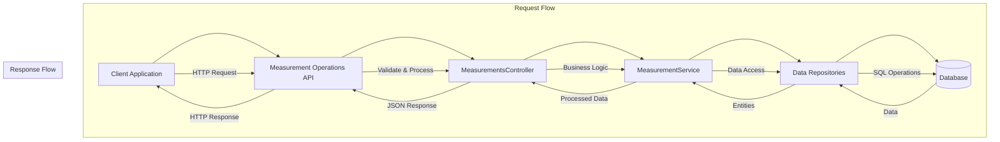
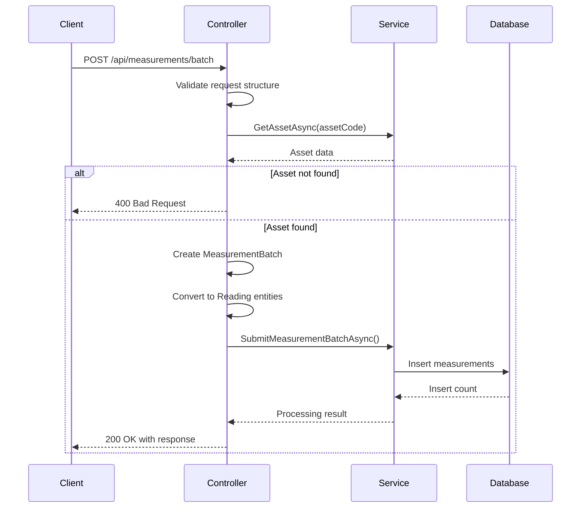
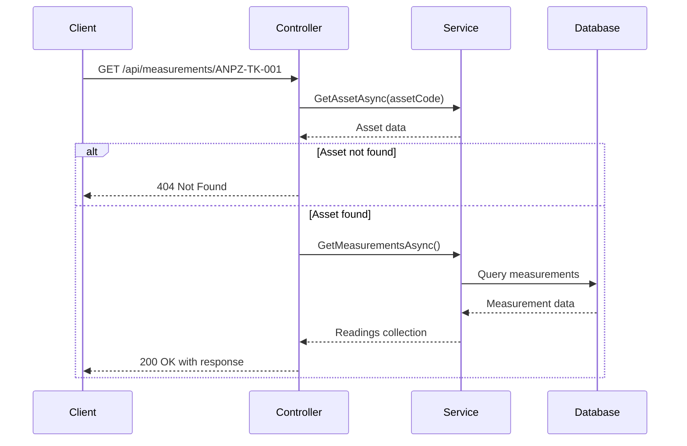
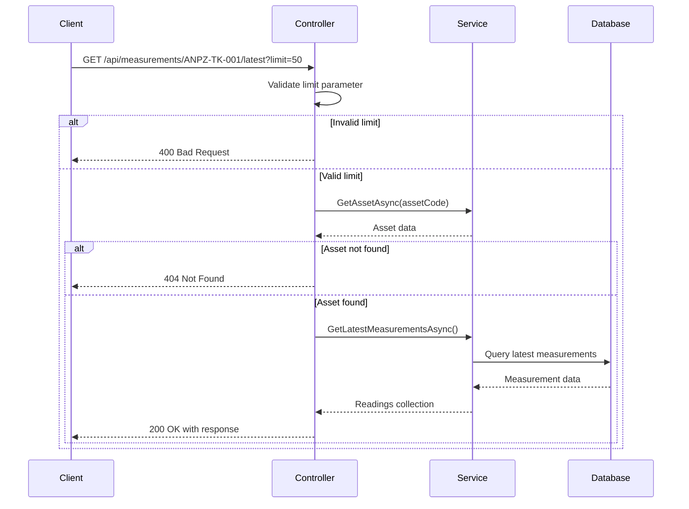
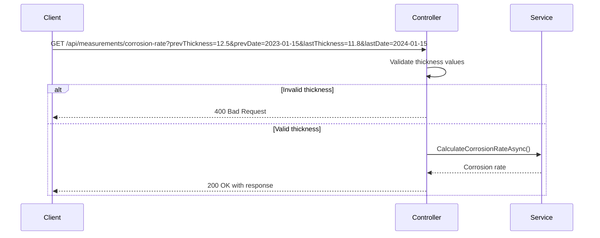
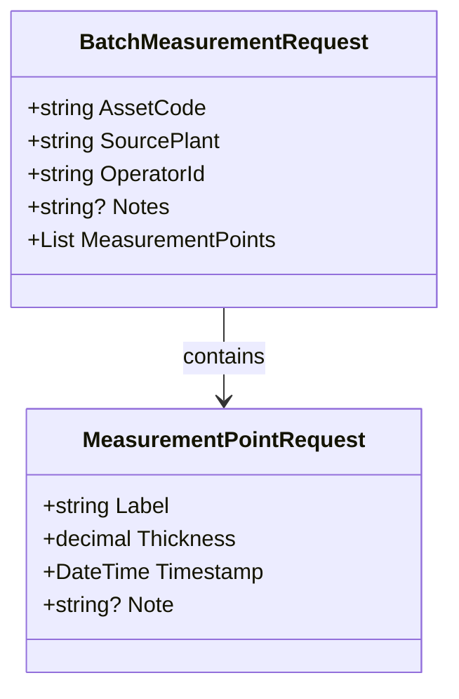
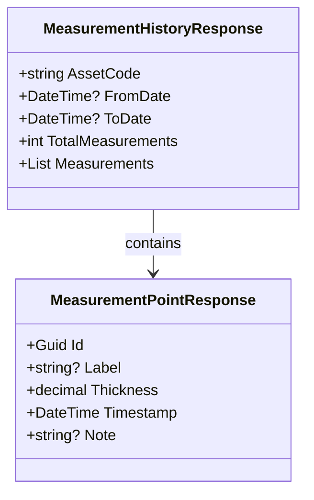
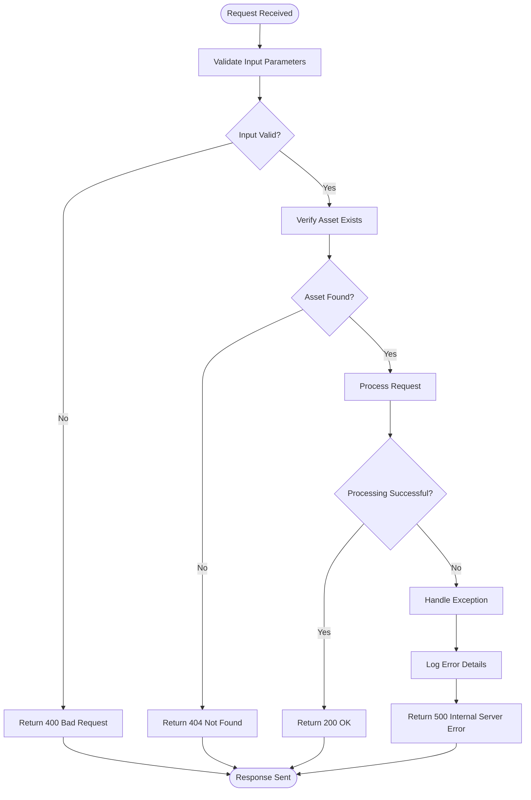
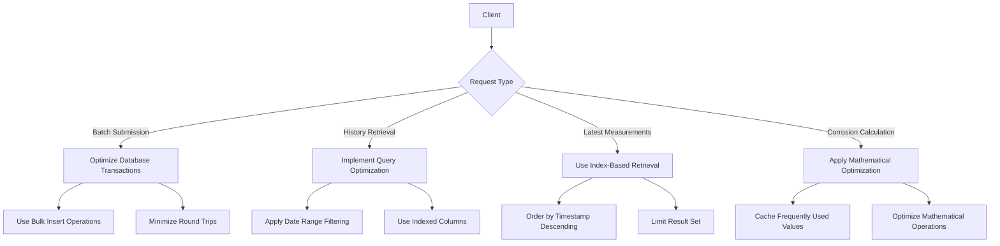

# Measurement Operations API

<cite>
**Referenced Files in This Document**   
- [MeasurementsController.cs](file://src/OilErp.App/Controllers/MeasurementsController.cs)
- [ApiModels.cs](file://src/OilErp.App/Models/ApiModels.cs)
- [MeasurementService.cs](file://src/OilErp.Domain/Services/MeasurementService.cs)
- [Reading.cs](file://src/OilErp.Domain/Entities/Reading.cs)
- [MeasurementPoint.cs](file://src/OilErp.Domain/Entities/MeasurementPoint.cs)
- [ValueObjects.cs](file://src/OilErp.Domain/ValueObjects/ValueObjects.cs)
- [sp_insert_measurement_batch.sql](file://sql/anpz/04_function_sp_insert_measurement_batch.sql)
- [sp_insert_measurement_batch.sql](file://sql/krnpz/04_function_sp_insert_measurement_batch.sql)
- [AnalyticsAndCommonModels.cs](file://src/OilErp.App/Models/AnalyticsAndCommonModels.cs)
</cite>

## Table of Contents
1. [Introduction](#introduction)
2. [API Overview](#api-overview)
3. [Endpoint Details](#endpoint-details)
4. [Data Models](#data-models)
5. [Error Handling](#error-handling)
6. [Performance Considerations](#performance-considerations)
7. [Best Practices](#best-practices)
8. [Troubleshooting Guide](#troubleshooting-guide)

## Introduction

The Measurement Operations API provides a comprehensive interface for managing measurement data within the Oil ERP system. This API enables users to submit batches of measurements, retrieve measurement history, access the latest measurements for assets, and calculate corrosion rates. The system is designed to handle industrial-scale measurement data with robust validation, error handling, and performance optimization.

The API follows RESTful principles with predictable URL patterns, standard HTTP methods, and JSON-based request/response payloads. All endpoints require authentication and return standardized response formats that include success status, data payloads, messages, and error details when applicable.

**Section sources**
- [MeasurementsController.cs](file://src/OilErp.App/Controllers/MeasurementsController.cs#L11-L318)

## API Overview

The Measurement Operations API consists of four primary endpoints that support the complete lifecycle of measurement data management. The API is built on a layered architecture with controller, service, and data access layers that ensure separation of concerns and maintainability.



**Diagram sources**
- [MeasurementsController.cs](file://src/OilErp.App/Controllers/MeasurementsController.cs#L11-L318)
- [MeasurementService.cs](file://src/OilErp.Domain/Services/MeasurementService.cs#L9-L207)

**Section sources**
- [MeasurementsController.cs](file://src/OilErp.App/Controllers/MeasurementsController.cs#L11-L318)
- [MeasurementService.cs](file://src/OilErp.Domain/Services/MeasurementService.cs#L9-L207)

## Endpoint Details

### POST /api/measurements/batch

Submits a batch of measurements for a specific asset. This endpoint processes multiple measurement points in a single request, optimizing performance for bulk operations.



**Diagram sources**
- [MeasurementsController.cs](file://src/OilErp.App/Controllers/MeasurementsController.cs#L35-L105)
- [MeasurementService.cs](file://src/OilErp.Domain/Services/MeasurementService.cs#L9-L207)

**Section sources**
- [MeasurementsController.cs](file://src/OilErp.App/Controllers/MeasurementsController.cs#L35-L105)
- [sp_insert_measurement_batch.sql](file://sql/anpz/04_function_sp_insert_measurement_batch.sql#L1-L84)

#### Parameters

| Parameter | Type | Required | Description |
|---------|------|----------|-------------|
| AssetCode | string | Yes | Unique identifier for the asset being measured |
| SourcePlant | string | Yes | Code of the plant where measurements were taken |
| OperatorId | string | Yes | Identifier of the operator who performed measurements |
| Notes | string | No | Additional notes about the measurement batch |
| MeasurementPoints | array | Yes | Collection of individual measurement points |

#### Request Schema
```json
{
  "assetCode": "ANPZ-TK-001",
  "sourcePlant": "ANPZ",
  "operatorId": "OP-12345",
  "notes": "Routine inspection measurements",
  "measurementPoints": [
    {
      "label": "TK-001-A",
      "thickness": 12.5,
      "timestamp": "2024-01-15T10:30:00Z",
      "note": "Normal reading"
    },
    {
      "label": "TK-001-B",
      "thickness": 11.8,
      "timestamp": "2024-01-15T10:35:00Z",
      "note": "Slight corrosion observed"
    }
  ]
}
```

#### Response Schema
```json
{
  "success": true,
  "data": {
    "assetCode": "ANPZ-TK-001",
    "sourcePlant": "ANPZ",
    "processedPoints": 2,
    "processedAt": "2024-01-15T10:45:30Z",
    "success": true,
    "message": "Measurements processed successfully"
  },
  "message": "Measurement batch submitted successfully",
  "timestamp": "2024-01-15T10:45:30Z"
}
```

#### Example: Valid Submission
```json
{
  "assetCode": "KRNPZ-P-005",
  "sourcePlant": "KRNPZ",
  "operatorId": "OP-67890",
  "measurementPoints": [
    {
      "label": "P-005-1",
      "thickness": 8.25,
      "timestamp": "2024-01-15T09:15:00Z"
    },
    {
      "label": "P-005-2",
      "thickness": 7.95,
      "timestamp": "2024-01-15T09:20:00Z"
    }
  ]
}
```

#### Example: Invalid Submission
```json
{
  "assetCode": "INVALID-ASSET",
  "sourcePlant": "ANPZ",
  "operatorId": "OP-12345",
  "measurementPoints": []
}
```
*Returns 400 Bad Request with message "At least one measurement point is required"*

### GET /api/measurements/{assetCode}

Retrieves the complete measurement history for a specific asset within an optional date range.



**Diagram sources**
- [MeasurementsController.cs](file://src/OilErp.App/Controllers/MeasurementsController.cs#L107-L155)
- [MeasurementService.cs](file://src/OilErp.Domain/Services/MeasurementService.cs#L9-L207)

**Section sources**
- [MeasurementsController.cs](file://src/OilErp.App/Controllers/MeasurementsController.cs#L107-L155)

#### Parameters

| Parameter | Type | Required | Description |
|---------|------|----------|-------------|
| assetCode | string | Yes | Unique identifier for the asset |
| fromDate | datetime | No | Start date for filtering measurements |
| toDate | datetime | No | End date for filtering measurements |

#### Response Schema
```json
{
  "success": true,
  "data": {
    "assetCode": "ANPZ-TK-001",
    "fromDate": "2024-01-01T00:00:00Z",
    "toDate": "2024-01-31T23:59:59Z",
    "totalMeasurements": 24,
    "measurements": [
      {
        "id": "a1b2c3d4-e5f6-7890-1234-567890abcdef",
        "label": "TK-001-A",
        "thickness": 12.5,
        "timestamp": "2024-01-15T10:30:00Z",
        "note": "Normal reading"
      }
    ]
  },
  "timestamp": "2024-01-15T11:00:00Z"
}
```

#### Example: Retrieve All Measurements
```
GET /api/measurements/ANPZ-TK-001
```

#### Example: Retrieve Measurements in Date Range
```
GET /api/measurements/ANPZ-TK-001?fromDate=2024-01-01&toDate=2024-01-31
```

### GET /api/measurements/{assetCode}/latest

Retrieves the most recent measurements for a specific asset, with configurable limit.



**Diagram sources**
- [MeasurementsController.cs](file://src/OilErp.App/Controllers/MeasurementsController.cs#L157-L215)
- [MeasurementService.cs](file://src/OilErp.Domain/Services/MeasurementService.cs#L9-L207)

**Section sources**
- [MeasurementsController.cs](file://src/OilErp.App/Controllers/MeasurementsController.cs#L157-L215)

#### Parameters

| Parameter | Type | Required | Description |
|---------|------|----------|-------------|
| assetCode | string | Yes | Unique identifier for the asset |
| limit | integer | No | Maximum number of measurements to return (1-1000) |

#### Response Schema
```json
{
  "success": true,
  "data": {
    "assetCode": "ANPZ-TK-001",
    "totalMeasurements": 50,
    "measurements": [
      {
        "id": "a1b2c3d4-e5f6-7890-1234-567890abcdef",
        "label": "TK-001-A",
        "thickness": 12.5,
        "timestamp": "2024-01-15T10:30:00Z",
        "note": "Normal reading"
      }
    ]
  },
  "timestamp": "2024-01-15T11:15:00Z"
}
```

#### Example: Retrieve Latest 25 Measurements
```
GET /api/measurements/ANPZ-TK-001/latest?limit=25
```

#### Example: Invalid Limit Parameter
```
GET /api/measurements/ANPZ-TK-001/latest?limit=1500
```
*Returns 400 Bad Request with message "Limit must be between 1 and 1000"*

### GET /api/measurements/corrosion-rate

Calculates the corrosion rate between two thickness measurements.



**Diagram sources**
- [MeasurementsController.cs](file://src/OilErp.App/Controllers/MeasurementsController.cs#L217-L265)
- [MeasurementService.cs](file://src/OilErp.Domain/Services/MeasurementService.cs#L9-L207)

**Section sources**
- [MeasurementsController.cs](file://src/OilErp.App/Controllers/MeasurementsController.cs#L217-L265)

#### Parameters

| Parameter | Type | Required | Description |
|---------|------|----------|-------------|
| prevThickness | decimal | Yes | Previous thickness measurement in mm |
| prevDate | datetime | Yes | Date of previous measurement |
| lastThickness | decimal | Yes | Latest thickness measurement in mm |
| lastDate | datetime | Yes | Date of latest measurement |

#### Response Schema
```json
{
  "success": true,
  "data": 0.7,
  "message": "Corrosion rate calculated successfully",
  "timestamp": "2024-01-15T11:30:00Z"
}
```

#### Example: Calculate Corrosion Rate
```
GET /api/measurements/corrosion-rate?prevThickness=12.5&prevDate=2023-01-15&lastThickness=11.8&lastDate=2024-01-15
```
*Returns corrosion rate of 0.7 mm/year*

#### Example: Invalid Thickness Values
```
GET /api/measurements/corrosion-rate?prevThickness=-1.0&prevDate=2023-01-15&lastThickness=11.8&lastDate=2024-01-15
```
*Returns 400 Bad Request with message "Thickness values must be positive"*

## Data Models

### BatchMeasurementRequest

Represents a request to submit a batch of measurements for an asset.



**Diagram sources**
- [ApiModels.cs](file://src/OilErp.App/Models/ApiModels.cs#L94-L114)
- [ApiModels.cs](file://src/OilErp.App/Models/ApiModels.cs#L116-L127)

**Section sources**
- [ApiModels.cs](file://src/OilErp.App/Models/ApiModels.cs#L94-L127)

#### Properties

| Property | Type | Required | Validation | Description |
|--------|------|----------|------------|-------------|
| AssetCode | string | Yes | Max 50 characters | Unique identifier for the asset |
| SourcePlant | string | Yes | Max 10 characters | Code of the plant where measurements were taken |
| OperatorId | string | Yes | Max 50 characters | Identifier of the operator who performed measurements |
| Notes | string | No | Max 200 characters | Additional notes about the measurement batch |
| MeasurementPoints | array | Yes | At least one required | Collection of individual measurement points |

#### Measurement Point Validation Rules
- **Label**: Required, maximum 50 characters
- **Thickness**: Required, must be between 0.1 and 1000 mm
- **Timestamp**: Optional, defaults to current UTC time if not provided
- **Note**: Optional, maximum 100 characters

### MeasurementHistoryResponse

Represents the response containing measurement history for an asset.



**Diagram sources**
- [ApiModels.cs](file://src/OilErp.App/Models/ApiModels.cs#L151-L158)
- [ApiModels.cs](file://src/OilErp.App/Models/ApiModels.cs#L159-L167)

**Section sources**
- [ApiModels.cs](file://src/OilErp.App/Models/ApiModels.cs#L151-L167)

#### Properties

| Property | Type | Required | Description |
|--------|------|----------|-------------|
| AssetCode | string | Yes | Unique identifier for the asset |
| FromDate | datetime | No | Start date of the date range filter |
| ToDate | datetime | No | End date of the date range filter |
| TotalMeasurements | integer | Yes | Total number of measurements returned |
| Measurements | array | Yes | Collection of individual measurement points |

#### Measurement Point Properties
- **Id**: Unique identifier for the measurement record
- **Label**: Name or identifier of the measurement point
- **Thickness**: Measured wall thickness in mm
- **Timestamp**: Date and time when measurement was taken
- **Note**: Additional notes recorded with the measurement

## Error Handling

The Measurement Operations API implements comprehensive error handling with standardized response formats for different error scenarios.



**Diagram sources**
- [MeasurementsController.cs](file://src/OilErp.App/Controllers/MeasurementsController.cs#L35-L265)

**Section sources**
- [MeasurementsController.cs](file://src/OilErp.App/Controllers/MeasurementsController.cs#L35-L265)
- [AnalyticsAndCommonModels.cs](file://src/OilErp.App/Models/AnalyticsAndCommonModels.cs#L170-L177)

### Common Error Responses

#### 400 Bad Request
Returned when the request contains invalid data or missing required fields.

```json
{
  "success": false,
  "message": "Invalid measurement data",
  "errors": [
    "At least one measurement point is required"
  ],
  "timestamp": "2024-01-15T10:45:30Z"
}
```

#### 404 Not Found
Returned when the requested asset does not exist in the system.

```json
{
  "success": false,
  "message": "Asset with code 'INVALID-ASSET' not found",
  "timestamp": "2024-01-15T10:45:30Z"
}
```

#### 500 Internal Server Error
Returned when an unexpected error occurs during processing.

```json
{
  "success": false,
  "message": "An error occurred while processing the measurement batch",
  "errors": [
    "Database connection failed"
  ],
  "timestamp": "2024-01-15T10:45:30Z"
}
```

### Common Issues and Solutions

| Issue | Cause | Solution |
|------|------|----------|
| Invalid measurement data | Thickness values outside valid range or missing required fields | Ensure thickness values are between 0.1 and 1000 mm and all required fields are provided |
| Missing asset references | Asset code does not exist in the system | Verify the asset code is correct and the asset has been registered in the system |
| Date range errors | fromDate is after toDate or invalid date format | Ensure fromDate is before or equal to toDate and dates are in ISO 8601 format |
| Batch processing failures | Database connectivity issues or constraint violations | Check database connectivity and ensure measurement points are properly configured for the asset |

## Performance Considerations

The Measurement Operations API is optimized for handling large volumes of measurement data with several performance considerations.



**Diagram sources**
- [sp_insert_measurement_batch.sql](file://sql/anpz/04_function_sp_insert_measurement_batch.sql#L1-L84)
- [MeasurementService.cs](file://src/OilErp.Domain/Services/MeasurementService.cs#L9-L207)

**Section sources**
- [sp_insert_measurement_batch.sql](file://sql/anpz/04_function_sp_insert_measurement_batch.sql#L1-L84)
- [MeasurementService.cs](file://src/OilErp.Domain/Services/MeasurementService.cs#L9-L207)

### Batch Processing Performance

For optimal performance when submitting large measurement batches:
- The API uses bulk database operations to minimize round trips
- PostgreSQL's `jsonb_array_elements` function efficiently processes JSON arrays
- Database transactions are optimized to handle thousands of measurements in a single operation
- The system automatically creates measurement points if they don't exist

### Query Optimization

For measurement retrieval operations:
- Database indexes are created on asset_code, timestamp, and measurement_point columns
- Date range queries use indexed timestamp columns for fast filtering
- The latest measurements endpoint uses descending timestamp ordering with limits
- Result sets are paginated for very large datasets (not shown in current implementation)

## Best Practices

### Timestamp Accuracy

To ensure accurate measurement tracking and corrosion calculations:
- Use UTC timestamps for all measurements to avoid timezone issues
- Synchronize device clocks with NTP servers to maintain accuracy
- Include millisecond precision when available for high-frequency measurements
- Avoid using local device time which may be inconsistent across devices

### Measurement Submission

When submitting measurement batches:
- Group measurements by asset and submit in batches rather than individual requests
- Include operator identification for traceability
- Add meaningful notes for measurements that show anomalies
- Validate data on the client side before submission to reduce server errors

### Error Handling

When integrating with the API:
- Implement retry logic for 500 errors with exponential backoff
- Provide user-friendly error messages based on the API response
- Log error details for troubleshooting while protecting sensitive information
- Validate asset existence before submitting measurements to avoid 400 errors

## Troubleshooting Guide

### Common Issues

**Issue**: "Asset not found" error when submitting measurements
- **Cause**: The asset code does not exist in the system
- **Solution**: Verify the asset code is correct and register the asset before submitting measurements

**Issue**: "Invalid measurement data" with thickness validation errors
- **Cause**: Thickness values are outside the valid range (0.1-1000 mm)
- **Solution**: Validate thickness values before submission and ensure they are positive

**Issue**: Slow response times for measurement history retrieval
- **Cause**: Large date ranges returning excessive data
- **Solution**: Narrow the date range or use the latest measurements endpoint for recent data

**Issue**: Corrosion rate calculation returns unexpected values
- **Cause**: Incorrect date ordering or invalid thickness values
- **Solution**: Ensure previous measurement has earlier timestamp and both thickness values are positive

**Section sources**
- [MeasurementsController.cs](file://src/OilErp.App/Controllers/MeasurementsController.cs#L35-L265)
- [MeasurementService.cs](file://src/OilErp.Domain/Services/MeasurementService.cs#L9-L207)