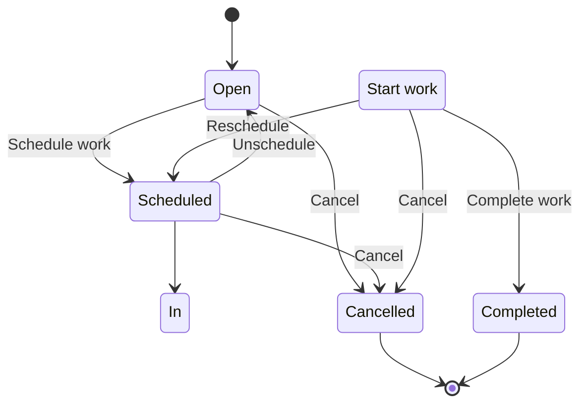

# Work Order Management API

<cite>
**Referenced Files in This Document**   
- [WorkOrdersController.cs](file://src/OilErp.App/Controllers/WorkOrdersController.cs)
- [WorkOrder.cs](file://src/OilErp.Domain/Entities/WorkOrder.cs)
- [ApiModels.cs](file://src/OilErp.App/Models/ApiModels.cs)
- [WorkOrderRepository.cs](file://src/OilErp.Data/Repositories/WorkOrderRepository.cs)
- [IServices.cs](file://src/OilErp.Domain/Interfaces/IServices.cs)
</cite>

## Table of Contents
1. [Introduction](#introduction)
2. [API Endpoints](#api-endpoints)
3. [Request and Response Models](#request-and-response-models)
4. [Status Transitions and Validation Rules](#status-transitions-and-validation-rules)
5. [Error Handling](#error-handling)
6. [Work Order Lifecycle Example](#work-order-lifecycle-example)
7. [Integration with Asset Risk Assessments](#integration-with-asset-risk-assessments)

## Introduction

The Work Order Management API provides a comprehensive interface for managing maintenance and repair activities within the Oil ERP system. This API enables users to create, retrieve, update, and complete work orders associated with physical assets. The system supports full lifecycle management of work orders from creation through assignment to completion, with integration points for asset risk assessments and maintenance workflows.

The API follows RESTful principles with predictable resource URLs, standard HTTP methods, and JSON request/response payloads. All endpoints require authentication and are designed to handle both individual work order operations and batch queries for reporting and monitoring purposes.

**Section sources**
- [WorkOrdersController.cs](file://src/OilErp.App/Controllers/WorkOrdersController.cs#L10-L421)

## API Endpoints

### POST /api/work-orders (Create Work Order)

Creates a new work order for a specified asset.

**Request Parameters**
- **Method**: POST
- **URL**: `/api/work-orders`
- **Content-Type**: `application/json`
- **Authentication**: Required (JWT Bearer token)

**Request Body (WorkOrderRequest)**
```json
{
  "assetCode": "ANPZ-TK-001",
  "workOrderNumber": "WO-2024-001",
  "description": "Routine inspection and maintenance",
  "workType": "Inspection",
  "priority": "High",
  "assignedTo": "john.doe",
  "scheduledDate": "2024-01-15T09:00:00Z",
  "estimatedHours": 4.5,
  "notes": "Check for corrosion and perform thickness measurements"
}
```

**Response Codes**
- **201 Created**: Work order successfully created
- **400 Bad Request**: Invalid request data or asset not found
- **500 Internal Server Error**: Unexpected server error

**Response Body (201 Created)**
```json
{
  "success": true,
  "data": {
    "id": "a1b2c3d4-e5f6-7890-1234-567890abcdef",
    "assetCode": "ANPZ-TK-001",
    "workOrderNumber": "WO-2024-001",
    "description": "Routine inspection and maintenance",
    "workType": "Inspection",
    "priority": "High",
    "status": "Open",
    "assignedTo": "john.doe",
    "createdAt": "2024-01-10T14:30:00Z",
    "scheduledDate": "2024-01-15T09:00:00Z",
    "estimatedHours": 4.5,
    "notes": "Check for corrosion and perform thickness measurements"
  },
  "message": "Work order created successfully"
}
```

**Section sources**
- [WorkOrdersController.cs](file://src/OilErp.App/Controllers/WorkOrdersController.cs#L35-L115)

### GET /api/work-orders/{id} (Retrieve Work Order by ID)

Retrieves a specific work order by its unique identifier.

**Request Parameters**
- **Method**: GET
- **URL**: `/api/work-orders/{id}`
- **Path Parameters**:
  - `id` (GUID): The unique identifier of the work order
- **Authentication**: Required (JWT Bearer token)

**Response Codes**
- **200 OK**: Work order found and returned
- **404 Not Found**: Work order with specified ID not found
- **500 Internal Server Error**: Unexpected server error

**Response Body (200 OK)**
```json
{
  "success": true,
  "data": {
    "id": "a1b2c3d4-e5f6-7890-1234-567890abcdef",
    "assetCode": "ANPZ-TK-001",
    "workOrderNumber": "WO-2024-001",
    "description": "Routine inspection and maintenance",
    "workType": "Inspection",
    "priority": "High",
    "status": "Open",
    "assignedTo": "john.doe",
    "createdAt": "2024-01-10T14:30:00Z",
    "scheduledDate": "2024-01-15T09:00:00Z",
    "completedAt": null,
    "estimatedHours": 4.5,
    "actualHours": null,
    "notes": "Check for corrosion and perform thickness measurements",
    "completionNotes": null
  }
}
```

**Section sources**
- [WorkOrdersController.cs](file://src/OilErp.App/Controllers/WorkOrdersController.cs#L123-L163)

### GET /api/work-orders/asset/{assetCode} (Retrieve Work Orders by Asset)

Retrieves all work orders associated with a specific asset.

**Request Parameters**
- **Method**: GET
- **URL**: `/api/work-orders/asset/{assetCode}`
- **Path Parameters**:
  - `assetCode` (string): The code of the asset
- **Authentication**: Required (JWT Bearer token)

**Response Codes**
- **200 OK**: Work orders found and returned
- **404 Not Found**: Asset with specified code not found
- **500 Internal Server Error**: Unexpected server error

**Response Body (200 OK)**
```json
{
  "success": true,
  "data": [
    {
      "id": "a1b2c3d4-e5f6-7890-1234-567890abcdef",
      "assetCode": "ANPZ-TK-001",
      "workOrderNumber": "WO-2024-001",
      "description": "Routine inspection and maintenance",
      "workType": "Inspection",
      "priority": "High",
      "status": "Open",
      "assignedTo": "john.doe",
      "createdAt": "2024-01-10T14:30:00Z",
      "scheduledDate": "2024-01-15T09:00:00Z",
      "estimatedHours": 4.5
    },
    {
      "id": "b2c3d4e5-f6a7-8901-2345-67890abcdef1",
      "assetCode": "ANPZ-TK-001",
      "workOrderNumber": "WO-2023-150",
      "description": "Emergency repair after leak detection",
      "workType": "Repair",
      "priority": "Critical",
      "status": "Completed",
      "assignedTo": "jane.smith",
      "createdAt": "2023-12-01T08:15:00Z",
      "scheduledDate": "2023-12-01T09:00:00Z",
      "completedAt": "2023-12-01T14:30:00Z",
      "estimatedHours": 6.0,
      "actualHours": 5.5,
      "completionNotes": "Leak sealed successfully. Pressure tested and passed."
    }
  ]
}
```

**Section sources**
- [WorkOrdersController.cs](file://src/OilErp.App/Controllers/WorkOrdersController.cs#L171-L212)

### GET /api/work-orders/overdue (Retrieve Overdue Work Orders)

Retrieves all work orders that are past their scheduled completion date and are not yet completed.

**Request Parameters**
- **Method**: GET
- **URL**: `/api/work-orders/overdue`
- **Authentication**: Required (JWT Bearer token)

**Response Codes**
- **200 OK**: Overdue work orders found and returned
- **500 Internal Server Error**: Unexpected server error

**Response Body (200 OK)**
```json
{
  "success": true,
  "data": [
    {
      "id": "c3d4e5f6-a7b8-9012-3456-7890abcdef12",
      "assetCode": "ANPZ-P-045",
      "workOrderNumber": "WO-2024-005",
      "description": "Pump alignment and vibration analysis",
      "workType": "Maintenance",
      "priority": "Medium",
      "status": "Scheduled",
      "assignedTo": "mike.johnson",
      "createdAt": "2024-01-05T10:00:00Z",
      "scheduledDate": "2024-01-08T08:00:00Z",
      "estimatedHours": 3.0
    }
  ]
}
```

**Section sources**
- [WorkOrdersController.cs](file://src/OilErp.App/Controllers/WorkOrdersController.cs#L219-L247)

### GET /api/work-orders/status/{status} (Retrieve by Status)

Retrieves all work orders with a specific status.

**Request Parameters**
- **Method**: GET
- **URL**: `/api/work-orders/status/{status}`
- **Path Parameters**:
  - `status` (string): The status to filter by (e.g., "Open", "Scheduled", "In Progress", "Completed", "Cancelled")
- **Authentication**: Required (JWT Bearer token)

**Response Codes**
- **200 OK**: Work orders found and returned
- **500 Internal Server Error**: Unexpected server error

**Response Body (200 OK)**
```json
{
  "success": true,
  "data": [
    {
      "id": "a1b2c3d4-e5f6-7890-1234-567890abcdef",
      "assetCode": "ANPZ-TK-001",
      "workOrderNumber": "WO-2024-001",
      "description": "Routine inspection and maintenance",
      "workType": "Inspection",
      "priority": "High",
      "status": "Open",
      "assignedTo": null,
      "createdAt": "2024-01-10T14:30:00Z",
      "scheduledDate": "2024-01-15T09:00:00Z",
      "estimatedHours": 4.5
    },
    {
      "id": "d4e5f6a7-b8c9-0123-4567-890abcdef123",
      "assetCode": "ANPZ-V-022",
      "workOrderNumber": "WO-2024-008",
      "description": "Valve replacement and testing",
      "workType": "Replacement",
      "priority": "High",
      "status": "Open",
      "assignedTo": null,
      "createdAt": "2024-01-11T09:15:00Z",
      "scheduledDate": "2024-01-18T10:00:00Z",
      "estimatedHours": 2.0
    }
  ]
}
```

**Section sources**
- [WorkOrdersController.cs](file://src/OilErp.App/Controllers/WorkOrdersController.cs#L255-L284)

### PATCH /api/work-orders/{id}/complete (Complete Work Order)

Marks a work order as completed with completion notes and optional actual hours.

**Request Parameters**
- **Method**: PATCH
- **URL**: `/api/work-orders/{id}/complete`
- **Path Parameters**:
  - `id` (GUID): The unique identifier of the work order
- **Query Parameters**:
  - `actualHours` (decimal, optional): The actual hours spent on the work order
- **Request Body**: Completion notes as a string
- **Authentication**: Required (JWT Bearer token)

**Request Body**
```json
"Performed all required inspections. No defects found. Equipment returned to service."
```

**Response Codes**
- **200 OK**: Work order successfully completed
- **400 Bad Request**: Completion notes are missing or invalid
- **404 Not Found**: Work order not found or cannot be completed
- **500 Internal Server Error**: Unexpected server error

**Response Body (200 OK)**
```json
{
  "success": true,
  "message": "Work order completed successfully"
}
```

**Section sources**
- [WorkOrdersController.cs](file://src/OilErp.App/Controllers/WorkOrdersController.cs#L294-L342)

### PATCH /api/work-orders/{id}/assign (Assign Work Order)

Assigns a work order to a specific person or team.

**Request Parameters**
- **Method**: PATCH
- **URL**: `/api/work-orders/{id}/assign`
- **Path Parameters**:
  - `id` (GUID): The unique identifier of the work order
- **Request Body**: The identifier of the person/team to assign to
- **Authentication**: Required (JWT Bearer token)

**Request Body**
```json
"john.doe"
```

**Response Codes**
- **200 OK**: Work order successfully assigned
- **400 Bad Request**: Assigned to field is missing or invalid
- **404 Not Found**: Work order not found
- **500 Internal Server Error**: Unexpected server error

**Response Body (200 OK)**
```json
{
  "success": true,
  "message": "Work order assigned successfully"
}
```

**Section sources**
- [WorkOrdersController.cs](file://src/OilErp.App/Controllers/WorkOrdersController.cs#L351-L398)

## Request and Response Models

### WorkOrderRequest Model

The request model for creating or updating work orders.

| Property | Type | Required | Validation | Description |
|---------|------|----------|------------|-------------|
| assetCode | string | Yes | Max 50 characters | The code of the asset this work order is for |
| workOrderNumber | string | No | Max 20 characters | Unique identifier for the work order |
| description | string | Yes | 1-100 characters | Detailed description of the work to be performed |
| workType | string | Yes | 1-50 characters | Type of work (e.g., Inspection, Repair, Maintenance) |
| priority | string | No | Max 20 characters | Priority level (e.g., Low, Medium, High, Critical) |
| assignedTo | string | No | Max 50 characters | Identifier of the person/team assigned to the work |
| scheduledDate | datetime | No | - | Scheduled date and time for the work |
| estimatedHours | decimal | No | - | Estimated hours required to complete the work |
| notes | string | No | Max 500 characters | Additional notes or instructions |

**Section sources**
- [ApiModels.cs](file://src/OilErp.App/Models/ApiModels.cs#L175-L204)

### WorkOrderResponse Model

The response model containing work order details.

| Property | Type | Description |
|---------|------|-------------|
| id | GUID | Unique identifier of the work order |
| assetCode | string | Code of the associated asset |
| workOrderNumber | string | Work order number |
| description | string | Description of the work |
| workType | string | Type of work |
| priority | string | Priority level |
| status | string | Current status of the work order |
| assignedTo | string | Person/team assigned to the work |
| createdAt | datetime | Timestamp when the work order was created |
| scheduledDate | datetime | Scheduled date for the work |
| completedAt | datetime | Timestamp when the work order was completed |
| estimatedHours | decimal | Estimated hours to complete |
| actualHours | decimal | Actual hours spent on the work |
| notes | string | Additional notes |
| completionNotes | string | Notes recorded upon completion |

**Section sources**
- [ApiModels.cs](file://src/OilErp.App/Models/ApiModels.cs#L209-L226)

## Status Transitions and Validation Rules

The work order system implements a state machine with specific validation rules for each status transition.

### Valid Status Values
- **Open**: Work order created but not yet scheduled
- **Scheduled**: Work order has been scheduled for a specific date
- **In Progress**: Work has started
- **Completed**: Work has been completed
- **Cancelled**: Work order has been cancelled

### Status Transition Rules



**Diagram sources**
- [WorkOrder.cs](file://src/OilErp.Domain/Entities/WorkOrder.cs#L5-L133)

### Validation Rules

1. **Asset Existence**: The asset code specified in the work order must exist in the system
2. **Unique Work Order Number**: Each work order number must be unique across the system
3. **Completion Requirements**: 
   - Completion notes are required when completing a work order
   - Actual hours must be positive if provided
   - Only work orders in "In Progress" status can be completed
4. **Assignment Rules**: 
   - AssignedTo field cannot be null or empty when assigning
   - Work orders can be reassigned at any time before completion
5. **Deletion Constraints**: 
   - Only "Open" or "Cancelled" work orders can be deleted
   - "In Progress" and "Completed" work orders cannot be deleted

**Section sources**
- [WorkOrder.cs](file://src/OilErp.Domain/Entities/WorkOrder.cs#L5-L133)
- [WorkOrderRepository.cs](file://src/OilErp.Data/Repositories/WorkOrderRepository.cs#L10-L427)

## Error Handling

The API implements comprehensive error handling with descriptive messages to help clients resolve issues.

### Common Error Responses

| HTTP Status | Error Code | Message | Cause |
|-----------|-----------|---------|-------|
| 400 | Validation Error | "Asset with code 'XYZ' not found" | Referenced asset does not exist |
| 400 | Validation Error | "Completion notes are required" | Missing required completion notes |
| 400 | Validation Error | "Assigned to field is required" | Missing assignment information |
| 400 | Validation Error | "Work order with number 'WO-001' already exists" | Duplicate work order number |
| 404 | Not Found | "Work order with ID '...' not found" | Invalid work order ID |
| 404 | Not Found | "Work order ... cannot be completed" | Work order not in valid state for completion |
| 500 | Server Error | "An error occurred while ..." | Unexpected server error |

### Error Response Structure
```json
{
  "success": false,
  "message": "Descriptive error message",
  "errors": ["Additional error details"]
}
```

**Section sources**
- [WorkOrdersController.cs](file://src/OilErp.App/Controllers/WorkOrdersController.cs#L35-L398)

## Work Order Lifecycle Example

This example demonstrates the complete lifecycle of a work order from creation to completion.

### Step 1: Create Work Order
```http
POST /api/work-orders
Content-Type: application/json
Authorization: Bearer <token>

{
  "assetCode": "ANPZ-TK-001",
  "workOrderNumber": "WO-2024-001",
  "description": "Monthly inspection of storage tank",
  "workType": "Inspection",
  "priority": "Medium",
  "scheduledDate": "2024-01-15T09:00:00Z",
  "estimatedHours": 4.0,
  "notes": "Check for corrosion, measure wall thickness, inspect safety valves"
}
```

### Step 2: Assign Work Order
```http
PATCH /api/work-orders/a1b2c3d4-e5f6-7890-1234-567890abcdef/assign
Content-Type: application/json
Authorization: Bearer <token>

"john.doe"
```

### Step 3: Complete Work Order
```http
PATCH /api/work-orders/a1b2c3d4-e5f6-7890-1234-567890abcdef/complete?actualHours=3.5
Content-Type: application/json
Authorization: Bearer <token>

"Inspection completed. No significant corrosion found. Wall thickness within acceptable limits. Safety valves tested and functioning properly."
```

### Step 4: Verify Completion
```http
GET /api/work-orders/a1b2c3d4-e5f6-7890-1234-567890abcdef
Authorization: Bearer <token>
```

**Response**
```json
{
  "success": true,
  "data": {
    "id": "a1b2c3d4-e5f6-7890-1234-567890abcdef",
    "assetCode": "ANPZ-TK-001",
    "workOrderNumber": "WO-2024-001",
    "description": "Monthly inspection of storage tank",
    "workType": "Inspection",
    "priority": "Medium",
    "status": "Completed",
    "assignedTo": "john.doe",
    "createdAt": "2024-01-10T14:30:00Z",
    "scheduledDate": "2024-01-15T09:00:00Z",
    "completedAt": "2024-01-15T13:30:00Z",
    "estimatedHours": 4.0,
    "actualHours": 3.5,
    "notes": "Check for corrosion, measure wall thickness, inspect safety valves",
    "completionNotes": "Inspection completed. No significant corrosion found. Wall thickness within acceptable limits. Safety valves tested and functioning properly."
  }
}
```

**Section sources**
- [WorkOrdersController.cs](file://src/OilErp.App/Controllers/WorkOrdersController.cs#L35-L398)

## Integration with Asset Risk Assessments

Work orders are tightly integrated with the asset risk assessment system, enabling proactive maintenance based on risk levels.

### Risk-Based Work Order Creation

When an asset's risk assessment indicates high or critical risk, the system can automatically generate work orders. The risk assessment data is available through the asset summary endpoint and can inform work order creation:

```http
GET /api/assets/ANPZ-TK-001/summary
```

**Response**
```json
{
  "success": true,
  "data": {
    "assetCode": "ANPZ-TK-001",
    "name": "Storage Tank 1",
    "riskAssessment": {
      "riskLevel": "High",
      "corrosionRate": 0.25,
      "lastThickness": 8.5,
      "assessmentDate": "2024-01-09T10:00:00Z"
    },
    "openWorkOrderCount": 0
  }
}
```

Based on this high-risk assessment, a maintenance work order should be created promptly.

### Maintenance Workflow Integration

The work order system integrates with maintenance workflows by:

1. **Updating Risk Assessments**: When a work order is completed, particularly those addressing defects or corrosion issues, the asset's risk assessment should be recalculated.
2. **Defect Resolution Tracking**: Work orders can be linked to specific defects, and completing the work order updates the defect status.
3. **Preventive Maintenance Scheduling**: Completed work orders contribute to the maintenance history used for predictive analytics and future scheduling.

This integration ensures that maintenance activities directly impact and improve the overall risk profile of assets in the system.

**Section sources**
- [WorkOrdersController.cs](file://src/OilErp.App/Controllers/WorkOrdersController.cs#L10-L421)
- [WorkOrder.cs](file://src/OilErp.Domain/Entities/WorkOrder.cs#L5-L133)