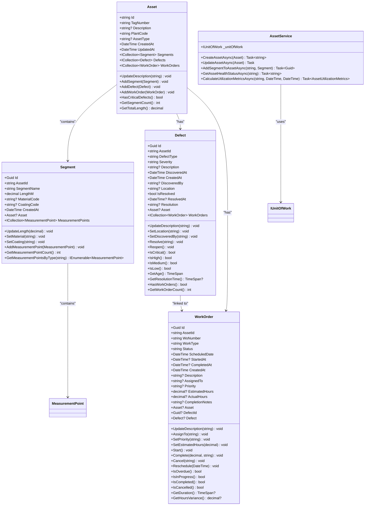
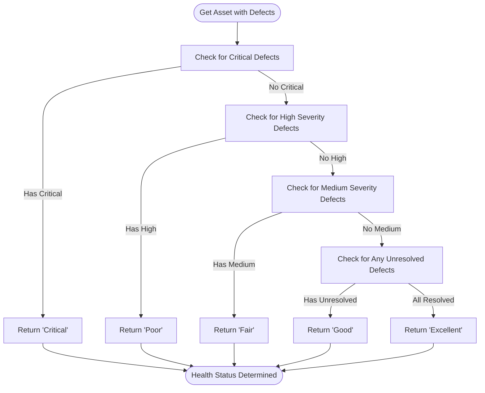
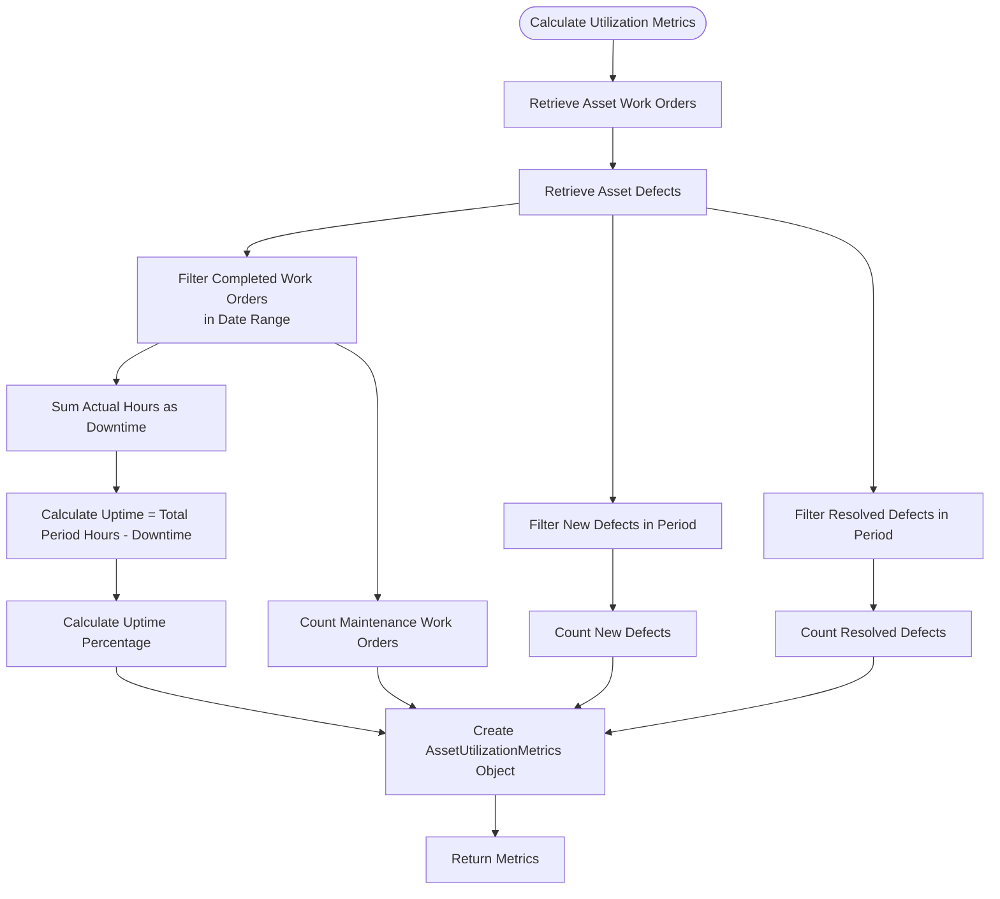
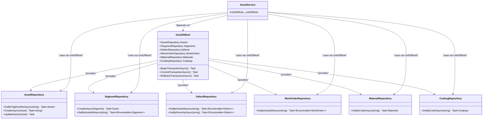

# Asset Management Service

<cite>
**Referenced Files in This Document**   
- [AssetService.cs](file://src/OilErp.Domain/Services/AssetService.cs)
- [Asset.cs](file://src/OilErp.Domain/Entities/Asset.cs)
- [DefectRepository.cs](file://src/OilErp.Data/Repositories/DefectRepository.cs)
- [UnitOfWork.cs](file://src/OilErp.Data/UnitOfWork.cs)
- [AssetRepository.cs](file://src/OilErp.Data/Repositories/AssetRepository.cs)
- [SegmentRepository.cs](file://src/OilErp.Data/Repositories/SegmentRepository.cs)
- [Defect.cs](file://src/OilErp.Domain/Entities/Defect.cs)
- [WorkOrder.cs](file://src/OilErp.Domain/Entities/WorkOrder.cs)
- [Segment.cs](file://src/OilErp.Domain/Entities/Segment.cs)
</cite>

## Table of Contents
1. [Introduction](#introduction)
2. [Core Components](#core-components)
3. [Asset Creation and Validation](#asset-creation-and-validation)
4. [Asset Update Process](#asset-update-process)
5. [Segment Management](#segment-management)
6. [Health Status Evaluation](#health-status-evaluation)
7. [Utilization Metrics Calculation](#utilization-metrics-calculation)
8. [Relationships with Other Components](#relationships-with-other-components)
9. [Common Issues and Solutions](#common-issues-and-solutions)
10. [Conclusion](#conclusion)

## Introduction
The Asset Management Service is a core component of the oil industry pipeline system, responsible for managing physical assets throughout their lifecycle. This service provides comprehensive functionality for asset creation, modification, health assessment, and performance analysis. Built on a domain-driven design pattern, it orchestrates interactions between assets, segments, defects, and work orders while enforcing business rules and validation logic. The service acts as an intermediary between the application layer and data access layer, ensuring data integrity and business rule compliance.

## Core Components

The Asset Management Service is implemented as a domain service that coordinates multiple entities and repositories to manage asset-related operations. The core components include the AssetService class, Asset entity, and supporting repositories that handle data persistence.

**Diagram sources**
- [AssetService.cs](file://src/OilErp.Domain/Services/AssetService.cs#L9-L196)
- [Asset.cs](file://src/OilErp.Domain/Entities/Asset.cs#L5-L71)
- [Segment.cs](file://src/OilErp.Domain/Entities/Segment.cs#L5-L62)
- [Defect.cs](file://src/OilErp.Domain/Entities/Defect.cs#L5-L96)
- [WorkOrder.cs](file://src/OilErp.Domain/Entities/WorkOrder.cs#L5-L132)

**Section sources**
- [AssetService.cs](file://src/OilErp.Domain/Services/AssetService.cs#L9-L196)
- [Asset.cs](file://src/OilErp.Domain/Entities/Asset.cs#L5-L71)

## Asset Creation and Validation

The asset creation process begins with the `CreateAssetAsync` method in the AssetService class, which implements comprehensive validation to ensure data integrity. The primary validation rule enforces unique tag numbers across all assets by querying the database to check for existing assets with the same tag number before creation.

When creating a new asset, the service first validates that the provided asset object is not null and that essential fields like PlantCode are populated. The system then checks for tag number uniqueness by calling `GetByTagNumberAsync` on the Assets repository through the UnitOfWork. If an asset with the same tag number already exists, an InvalidOperationException is thrown with a descriptive message.

The validation process also ensures that the PlantCode field is not null or whitespace, as this is a required field for asset identification within the organizational structure. Upon successful validation, the service sets the CreatedAt and UpdatedAt timestamps to the current UTC time before persisting the asset to the database through the repository's CreateAsync method.

This implementation prevents duplicate assets from being created while maintaining referential integrity and enforcing business rules at the domain service level rather than relying solely on database constraints.

**Section sources**
- [AssetService.cs](file://src/OilErp.Domain/Services/AssetService.cs#L21-L42)

## Asset Update Process

The asset update process in the Asset Management Service handles modifications to existing assets while maintaining data integrity and enforcing business rules. The `UpdateAssetAsync` method performs several critical validation steps before applying changes to an asset.

First, the service verifies that the asset object being updated is not null and retrieves the existing asset from the database using its ID. If the asset doesn't exist, an InvalidOperationException is thrown. The most important validation occurs when the tag number is being changed: the service checks whether the new tag number is already assigned to another asset by calling `GetByTagNumberAsync`.

The uniqueness check specifically ensures that if an asset with the same tag number exists, it must be the same asset being updated (comparing IDs). This prevents duplicate tag numbers while allowing other fields to be modified freely. When a tag number conflict is detected, the service throws an InvalidOperationException with a clear error message indicating which tag number is already in use.

After passing validation, the service updates the UpdatedAt timestamp to the current UTC time before persisting the changes through the repository's UpdateAsync method. This approach ensures that asset identification remains unique across the system while allowing authorized modifications to other asset properties.

**Section sources**
- [AssetService.cs](file://src/OilErp.Domain/Services/AssetService.cs#L44-L72)

## Segment Management

The Asset Management Service provides functionality for adding segments to assets through the `AddSegmentToAssetAsync` method. This process includes comprehensive validation to ensure data integrity and business rule compliance.

When adding a segment to an asset, the service first validates that both the asset ID and segment object are provided. It then retrieves the parent asset from the database to verify its existence. If the asset is not found, an InvalidOperationException is thrown. The segment's AssetId property is automatically set to the parent asset's ID before persistence.

The service implements catalog validation by checking whether the segment's MaterialCode and CoatingCode reference valid entries in their respective catalogs. For each code provided, the service queries the corresponding repository (Materials or Coatings) to verify existence. If a referenced material or coating code doesn't exist, an InvalidOperationException is thrown with details about the invalid code.

This validation approach ensures that segments can only reference materials and coatings that have been properly defined in the system, maintaining data consistency and preventing orphaned references. The CreatedAt timestamp is set to the current UTC time before the segment is persisted to the database through the Segments repository.

**Section sources**
- [AssetService.cs](file://src/OilErp.Domain/Services/AssetService.cs#L74-L108)

## Health Status Evaluation

The health status evaluation system determines an asset's condition based on its defect profile using a hierarchical assessment approach. The `GetAssetHealthStatusAsync` method retrieves the asset with all associated defects and applies a priority-based evaluation algorithm.

The assessment follows a severity hierarchy, starting with the most critical issues. First, the system checks for any critical defects that are not resolved. If present, the asset's health status is immediately set to "Critical" without evaluating other factors. This reflects the business rule that critical defects require immediate attention regardless of other conditions.

If no critical defects are found, the system checks for high severity defects. The presence of unresolved high severity defects results in a "Poor" health status. Similarly, unresolved medium severity defects lead to a "Fair" health status. If only low severity defects are present, the status is "Good".

When all defects have been resolved, the asset achieves the highest health status of "Excellent". This tiered approach provides a clear, actionable assessment that helps prioritize maintenance activities based on risk level.

**Diagram sources**
- [AssetService.cs](file://src/OilErp.Domain/Services/AssetService.cs#L110-L138)
- [Defect.cs](file://src/OilErp.Domain/Entities/Defect.cs#L57-L70)

**Section sources**
- [AssetService.cs](file://src/OilErp.Domain/Services/AssetService.cs#L110-L138)

## Utilization Metrics Calculation

The Asset Management Service calculates comprehensive utilization metrics through the `CalculateUtilizationMetricsAsync` method, providing insights into asset performance and maintenance efficiency. The calculation process analyzes work orders and defects within a specified time period to generate key performance indicators.

The service first retrieves all work orders and defects associated with the specified asset. It then filters work orders to include only those that were completed within the specified date range. The total maintenance hours are calculated by summing the ActualHours from completed work orders, representing the asset's downtime.

Uptime is derived by subtracting downtime from the total period hours, and the uptime percentage is calculated accordingly. The service also counts new defects discovered and defects resolved during the period, providing metrics for defect management effectiveness.

The resulting AssetUtilizationMetrics record includes the asset ID, period description, uptime percentage, downtime hours, maintenance work order count, and defect statistics. This comprehensive view helps maintenance managers assess asset reliability, plan future maintenance activities, and identify trends in asset performance.

**Diagram sources**
- [AssetService.cs](file://src/OilErp.Domain/Services/AssetService.cs#L140-L196)
- [AssetUtilizationMetrics](file://src/OilErp.Domain/Services/AssetService.cs#L201-L211)

**Section sources**
- [AssetService.cs](file://src/OilErp.Domain/Services/AssetService.cs#L140-L196)

## Relationships with Other Components

The Asset Management Service maintains critical relationships with other components through dependency injection and repository patterns. The primary relationship is with the UnitOfWork, which serves as a facade for all data access operations and transaction management.

The service depends on IUnitOfWork interface, which provides access to multiple repositories including Assets, Segments, Defects, WorkOrders, Materials, and Coatings. This design follows the dependency inversion principle, allowing the service to work with abstractions rather than concrete implementations.

When performing operations, the AssetService delegates data access to the appropriate repository through the UnitOfWork. For example, when adding a segment to an asset, the service uses the Segments repository for persistence and the Materials and Coatings repositories for validation. This separation of concerns ensures that business logic remains in the service layer while data access logic is encapsulated in repositories.

The UnitOfWork also provides transaction management capabilities, allowing multiple operations to be grouped into atomic transactions when needed. This ensures data consistency across related entities and supports complex business operations that involve multiple data changes.

**Diagram sources**
- [AssetService.cs](file://src/OilErp.Domain/Services/AssetService.cs#L9-L196)
- [UnitOfWork.cs](file://src/OilErp.Data/UnitOfWork.cs#L9-L127)
- [AssetRepository.cs](file://src/OilErp.Data/Repositories/AssetRepository.cs#L8-L214)
- [SegmentRepository.cs](file://src/OilErp.Data/Repositories/SegmentRepository.cs#L10-L223)
- [DefectRepository.cs](file://src/OilErp.Data/Repositories/DefectRepository.cs#L10-L347)

**Section sources**
- [AssetService.cs](file://src/OilErp.Domain/Services/AssetService.cs#L9-L196)
- [UnitOfWork.cs](file://src/OilErp.Data/UnitOfWork.cs#L9-L127)

## Common Issues and Solutions

The Asset Management Service addresses several common issues through proactive validation and error handling. The most frequent issue is duplicate tag numbers during asset creation or updates. The service prevents this by checking for existing assets with the same tag number before allowing creation or modification. When a duplicate is detected, a descriptive InvalidOperationException is thrown, helping users understand and resolve the conflict.

Another common issue involves invalid segment positioning or references. The service validates that segments reference existing materials and coatings by querying the respective repositories. If a segment references a non-existent material or coating code, the service throws an InvalidOperationException with details about the invalid reference, preventing data integrity issues.

For health status evaluation, a potential issue is incomplete defect data. The service mitigates this by using the GetWithDefectsAsync method to ensure all relevant defects are loaded before assessment. This prevents inaccurate health status calculations due to missing defect information.

The service also handles cases where assets or related entities are not found by validating existence before performing operations. For example, when updating an asset, the service first verifies that the asset exists by retrieving it from the database. This prevents null reference exceptions and provides clear error messages to calling components.

**Section sources**
- [AssetService.cs](file://src/OilErp.Domain/Services/AssetService.cs#L21-L196)
- [DefectRepository.cs](file://src/OilErp.Data/Repositories/DefectRepository.cs#L10-L347)

## Conclusion

The Asset Management Service provides a robust framework for managing physical assets in an oil industry pipeline system. Through comprehensive validation, hierarchical health assessment, and detailed utilization metrics, the service ensures data integrity and supports informed decision-making. The design leverages domain-driven principles with clear separation of concerns between business logic and data access.

Key strengths include the enforcement of unique tag numbers, validation of catalog references, and a tiered health status evaluation system that prioritizes critical issues. The service's integration with the UnitOfWork pattern enables consistent data access and transaction management across multiple repositories.

For developers, the service offers a clear API with well-defined error handling, making it easier to implement client applications. The comprehensive validation and descriptive error messages help prevent data integrity issues and guide users toward correct usage patterns. Future enhancements could include more sophisticated health algorithms and predictive maintenance features based on historical data trends.