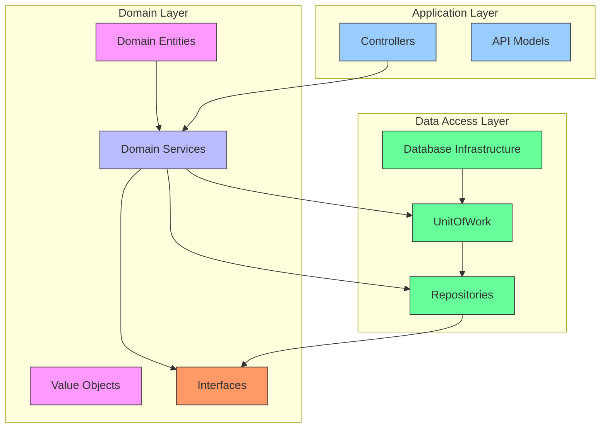
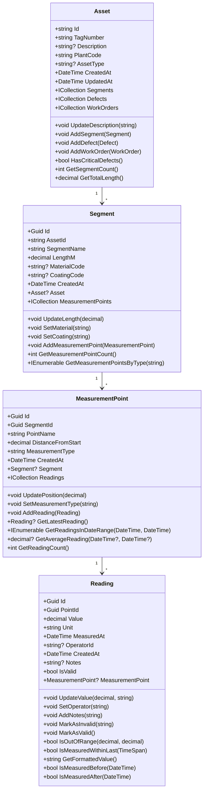
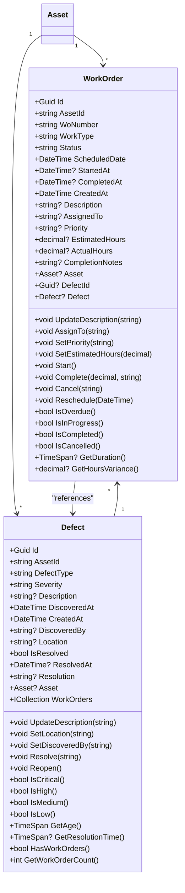
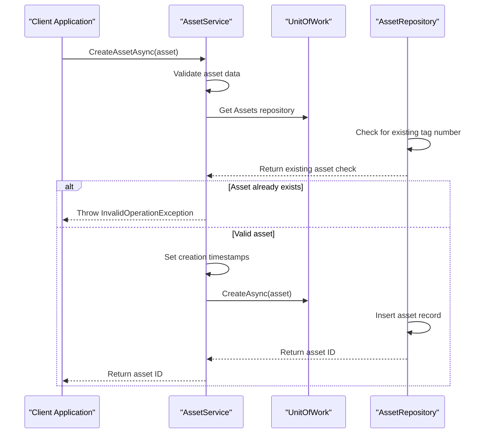
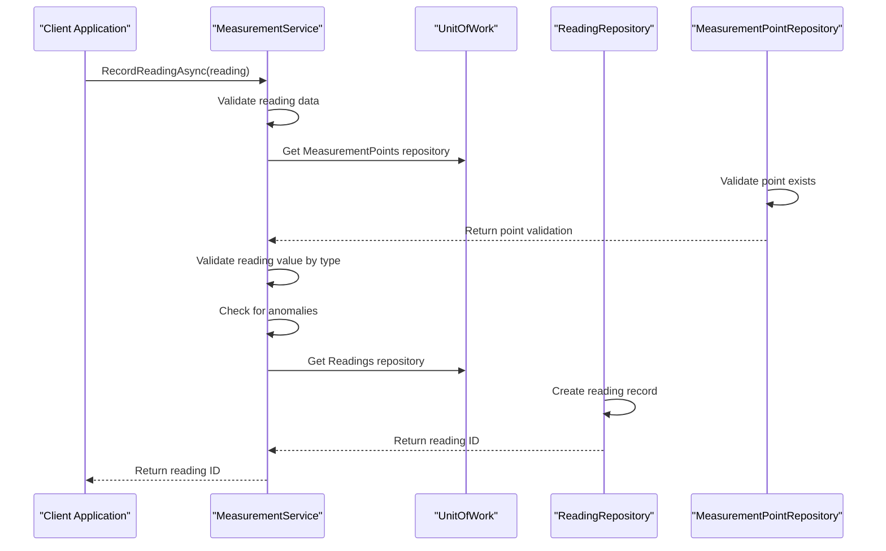
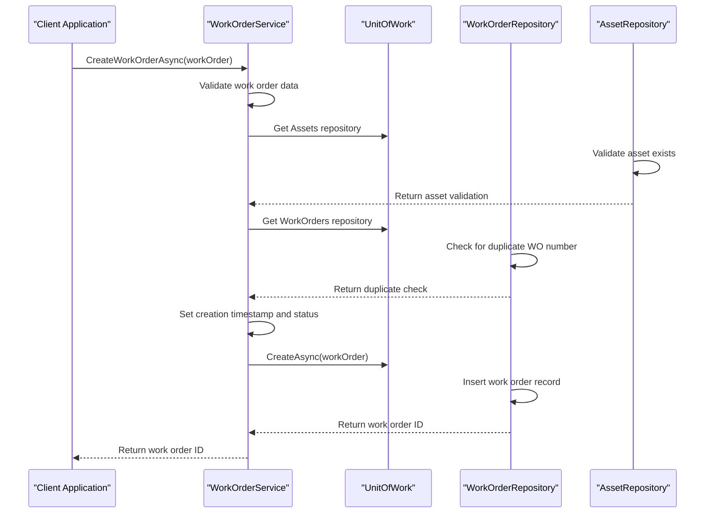
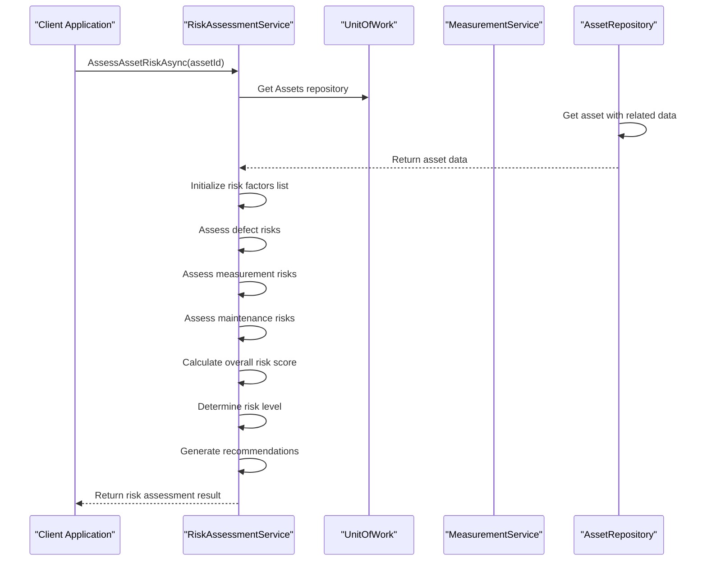

# Business Logic Layer

<cite>
**Referenced Files in This Document**   
- [AssetService.cs](file://src/OilErp.Domain/Services/AssetService.cs)
- [MeasurementService.cs](file://src/OilErp.Domain/Services/MeasurementService.cs)
- [WorkOrderService.cs](file://src/OilErp.Domain/Services/WorkOrderService.cs)
- [RiskAssessmentService.cs](file://src/OilErp.Domain/Services/RiskAssessmentService.cs)
- [IRepositories.cs](file://src/OilErp.Domain/Interfaces/IRepositories.cs)
- [IServices.cs](file://src/OilErp.Domain/Interfaces/IServices.cs)
- [UnitOfWork.cs](file://src/OilErp.Data/UnitOfWork.cs)
- [Asset.cs](file://src/OilErp.Domain/Entities/Asset.cs)
- [MeasurementPoint.cs](file://src/OilErp.Domain/Entities/MeasurementPoint.cs)
- [Reading.cs](file://src/OilErp.Domain/Entities/Reading.cs)
- [WorkOrder.cs](file://src/OilErp.Domain/Entities/WorkOrder.cs)
- [Defect.cs](file://src/OilErp.Domain/Entities/Defect.cs)
- [Segment.cs](file://src/OilErp.Domain/Entities/Segment.cs)
- [RiskAndInspection.cs](file://src/OilErp.Domain/ValueObjects/RiskAndInspection.cs)
- [DomainEnums.cs](file://src/OilErp.Domain/Enums/DomainEnums.cs)
- [Program.cs](file://src/OilErp.App/Program.cs)
</cite>

## Table of Contents
1. [Introduction](#introduction)
2. [Architecture Overview](#architecture-overview)
3. [Core Domain Entities](#core-domain-entities)
4. [Domain Services](#domain-services)
5. [Repository Pattern Implementation](#repository-pattern-implementation)
6. [Dependency Injection and Service Composition](#dependency-injection-and-service-composition)
7. [Component Interactions and Data Flows](#component-interactions-and-data-flows)
8. [Technical Decisions and Trade-offs](#technical-decisions-and-trade-offs)
9. [Infrastructure Requirements and Deployment](#infrastructure-requirements-and-deployment)
10. [Cross-Cutting Concerns](#cross-cutting-concerns)
11. [Technology Stack](#technology-stack)
12. [Conclusion](#conclusion)

## Introduction

The Business Logic Layer of the Oil ERP system implements a robust domain-driven design architecture for managing oil industry assets, measurements, work orders, and risk assessments. This documentation provides a comprehensive overview of the system's business logic layer, focusing on domain entities, services, repository patterns, and dependency injection. The system is designed to handle complex asset management scenarios in oil refineries, with a focus on corrosion monitoring, defect tracking, maintenance scheduling, and risk assessment.

The architecture follows Domain-Driven Design (DDD) principles, with rich domain entities that encapsulate business logic and validation rules. The system employs the Repository Pattern to abstract data access concerns and uses Dependency Injection for clean service composition. This layered approach ensures separation of concerns, testability, and maintainability while providing a clear boundary between business logic and infrastructure concerns.

**Section sources**
- [AssetService.cs](file://src/OilErp.Domain/Services/AssetService.cs#L1-L212)
- [MeasurementService.cs](file://src/OilErp.Domain/Services/MeasurementService.cs#L1-L226)
- [WorkOrderService.cs](file://src/OilErp.Domain/Services/WorkOrderService.cs#L1-L265)
- [RiskAssessmentService.cs](file://src/OilErp.Domain/Services/RiskAssessmentService.cs#L1-L302)

## Architecture Overview

The business logic layer follows a clean architecture pattern with clear separation between domain entities, services, and data access components. The system is organized into distinct layers that adhere to the Dependency Inversion Principle, where high-level modules do not depend on low-level modules but both depend on abstractions.

**Diagram sources **
- [AssetService.cs](file://src/OilErp.Domain/Services/AssetService.cs#L9-L196)
- [UnitOfWork.cs](file://src/OilErp.Data/UnitOfWork.cs#L9-L127)
- [IRepositories.cs](file://src/OilErp.Domain/Interfaces/IRepositories.cs#L1-L218)
- [IServices.cs](file://src/OilErp.Domain/Interfaces/IServices.cs#L1-L77)

**Section sources**
- [AssetService.cs](file://src/OilErp.Domain/Services/AssetService.cs#L1-L212)
- [UnitOfWork.cs](file://src/OilErp.Data/UnitOfWork.cs#L1-L127)
- [IRepositories.cs](file://src/OilErp.Domain/Interfaces/IRepositories.cs#L1-L218)

## Core Domain Entities

The system's domain model is built around rich entities that encapsulate both data and behavior, following Domain-Driven Design principles. These entities represent the core business concepts of the oil industry asset management system.

### Asset Entity

The Asset entity represents a physical asset in the oil industry pipeline system, such as a pipeline, tank, or pump. It contains core properties like tag number, description, plant code, and asset type, along with navigation properties to related entities.

**Diagram sources **
- [Asset.cs](file://src/OilErp.Domain/Entities/Asset.cs#L1-L71)
- [Segment.cs](file://src/OilErp.Domain/Entities/Segment.cs#L1-L62)
- [MeasurementPoint.cs](file://src/OilErp.Domain/Entities/MeasurementPoint.cs#L1-L74)
- [Reading.cs](file://src/OilErp.Domain/Entities/Reading.cs#L1-L75)

**Section sources**
- [Asset.cs](file://src/OilErp.Domain/Entities/Asset.cs#L1-L71)
- [Segment.cs](file://src/OilErp.Domain/Entities/Segment.cs#L1-L62)
- [MeasurementPoint.cs](file://src/OilErp.Domain/Entities/MeasurementPoint.cs#L1-L74)
- [Reading.cs](file://src/OilErp.Domain/Entities/Reading.cs#L1-L75)

### Work Order and Defect Entities

The WorkOrder and Defect entities represent maintenance activities and identified issues on assets, forming the core of the system's maintenance management capabilities.

**Diagram sources **
- [WorkOrder.cs](file://src/OilErp.Domain/Entities/WorkOrder.cs#L1-L132)
- [Defect.cs](file://src/OilErp.Domain/Entities/Defect.cs#L1-L96)
- [Asset.cs](file://src/OilErp.Domain/Entities/Asset.cs#L1-L71)

**Section sources**
- [WorkOrder.cs](file://src/OilErp.Domain/Entities/WorkOrder.cs#L1-L132)
- [Defect.cs](file://src/OilErp.Domain/Entities/Defect.cs#L1-L96)

### Value Objects and Enums

The system uses value objects and enums to represent domain concepts that have no identity and are defined by their attributes.

```mermaid
classDiagram
class RiskThreshold {
+string Name
+decimal LowThreshold
+decimal MediumThreshold
+decimal HighThreshold
+decimal CriticalThreshold
+string Unit
+string Description
+string GetRiskLevel(decimal)
+bool ExceedsThreshold(decimal, string)
}
class InspectionCriteria {
+string InspectionType
+TimeSpan Frequency
+string[] RequiredMeasurements
+string[] QualifiedPersonnel
+string Procedure
+bool IsInspectionDue(DateTime)
+DateTime GetNextInspectionDate(DateTime)
+bool IsPersonnelQualified(string)
}
class ContactInfo {
+string Name
+string Email
+string Phone
+string? Department
+string? Role
+string GetDisplayName()
}
class AssetLifecycleState {
+Planned
+Active
+Maintenance
+Retired
}
class AssetType {
+Pipeline
+Tank
+Pump
+Valve
+Compressor
+Separator
+HeatExchanger
+Instrument
+Other
}
class DefectSeverity {
+Low
+Medium
+High
+Critical
}
class WorkOrderStatus {
+Scheduled
+InProgress
+Completed
+Cancelled
+OnHold
}
class WorkOrderPriority {
+Low
+Medium
+High
+Emergency
}
class WorkType {
+Inspection
+Preventive
+Corrective
+Emergency
+Predictive
+Calibration
+Cleaning
+Replacement
}
class MeasurementType {
+WallThickness
+Pressure
+Temperature
+Flow
+Vibration
+Corrosion
+PitDepth
+CoatingThickness
+Hardness
+Other
}
class MeasurementUnit {
+Millimeters
+Inches
+PSI
+Bar
+Celsius
+Fahrenheit
+LitersPerMinute
+GPM
+Hertz
+Micrometers
+Mils
}
```

**Diagram sources **
- [RiskAndInspection.cs](file://src/OilErp.Domain/ValueObjects/RiskAndInspection.cs#L1-L162)
- [DomainEnums.cs](file://src/OilErp.Domain/Enums/DomainEnums.cs#L1-L111)

**Section sources**
- [RiskAndInspection.cs](file://src/OilErp.Domain/ValueObjects/RiskAndInspection.cs#L1-L162)
- [DomainEnums.cs](file://src/OilErp.Domain/Enums/DomainEnums.cs#L1-L111)

## Domain Services

The domain services layer contains the core business logic of the system, implementing use cases and coordinating operations between entities and repositories.

### Asset Service

The AssetService handles operations related to asset management, including creation, updates, and retrieval of asset information with validation.

**Diagram sources **
- [AssetService.cs](file://src/OilErp.Domain/Services/AssetService.cs#L9-L196)
- [UnitOfWork.cs](file://src/OilErp.Data/UnitOfWork.cs#L9-L127)
- [IRepositories.cs](file://src/OilErp.Domain/Interfaces/IRepositories.cs#L1-L218)

**Section sources**
- [AssetService.cs](file://src/OilErp.Domain/Services/AssetService.cs#L9-L196)

### Measurement Service

The MeasurementService manages measurement operations, including recording readings, validating data, and analyzing trends.

**Diagram sources **
- [MeasurementService.cs](file://src/OilErp.Domain/Services/MeasurementService.cs#L9-L207)
- [UnitOfWork.cs](file://src/OilErp.Data/UnitOfWork.cs#L9-L127)
- [IRepositories.cs](file://src/OilErp.Domain/Interfaces/IRepositories.cs#L1-L218)

**Section sources**
- [MeasurementService.cs](file://src/OilErp.Domain/Services/MeasurementService.cs#L9-L207)

### Work Order Service

The WorkOrderService manages work order lifecycle operations, including creation, scheduling, and status updates.

**Diagram sources **
- [WorkOrderService.cs](file://src/OilErp.Domain/Services/WorkOrderService.cs#L8-L237)
- [UnitOfWork.cs](file://src/OilErp.Data/UnitOfWork.cs#L9-L127)
- [IRepositories.cs](file://src/OilErp.Domain/Interfaces/IRepositories.cs#L1-L218)

**Section sources**
- [WorkOrderService.cs](file://src/OilErp.Domain/Services/WorkOrderService.cs#L8-L237)

### Risk Assessment Service

The RiskAssessmentService evaluates asset risk based on multiple factors including defects, measurements, and maintenance history.

**Diagram sources **
- [RiskAssessmentService.cs](file://src/OilErp.Domain/Services/RiskAssessmentService.cs#L9-L276)
- [UnitOfWork.cs](file://src/OilErp.Data/UnitOfWork.cs#L9-L127)
- [IRepositories.cs](file://src/OilErp.Domain/Interfaces/IRepositories.cs#L1-L218)

**Section sources**
- [RiskAssessmentService.cs](file://src/OilErp.Domain/Services/RiskAssessmentService.cs#L9-L276)

## Repository Pattern Implementation

The system implements the Repository Pattern to provide an abstraction layer between the domain logic and data access concerns. This pattern ensures that the business logic is not coupled to the specific database implementation.

### Repository Interface Hierarchy

The repository interfaces define contracts for data access operations, with a base interface and specific interfaces for each entity type.

```mermaid
classDiagram
class IRepository~TEntity,TKey~ {
+Task~TEntity?~ GetByIdAsync(TKey, CancellationToken)
+Task~IEnumerable~TEntity~~ GetAllAsync(CancellationToken)
+Task~TKey~ CreateAsync(TEntity, CancellationToken)
+Task UpdateAsync(TEntity, CancellationToken)
+Task DeleteAsync(TKey, CancellationToken)
}
class IAssetRepository {
+Task~Asset?~ GetByAssetCodeAsync(string, CancellationToken)
+Task~Asset?~ GetAssetSummaryAsync(string, string?, CancellationToken)
+Task~IEnumerable~Asset~~ GetByPlantCodeAsync(string, CancellationToken)
+Task~string~ UpsertAssetAsync(string, string, string, string, CancellationToken)
+Task~Asset?~ GetWithSegmentsAsync(string, CancellationToken)
+Task~Asset?~ GetWithDefectsAsync(string, CancellationToken)
+Task~Asset?~ GetWithWorkOrdersAsync(string, CancellationToken)
+Task~Asset?~ GetWithAllRelatedDataAsync(string, CancellationToken)
+Task~int~ GetCountByPlantAsync(string, CancellationToken)
+Task~int~ GetTotalCountAsync(CancellationToken)
}
class ISegmentRepository {
+Task~Segment?~ GetByIdAsync(Guid, CancellationToken)
+Task~IEnumerable~Segment~~ GetByAssetIdAsync(string, CancellationToken)
+Task~Guid~ CreateAsync(Segment, CancellationToken)
+Task~decimal~ GetTotalLengthByAssetAsync(string, CancellationToken)
+Task~Segment?~ GetWithMeasurementPointsAsync(Guid, CancellationToken)
}
class IMeasurementPointRepository {
+Task~MeasurementPoint?~ GetByIdAsync(Guid, CancellationToken)
+Task~IEnumerable~MeasurementPoint~~ GetBySegmentIdAsync(Guid, CancellationToken)
+Task~Guid~ CreateAsync(MeasurementPoint, CancellationToken)
+Task~MeasurementPoint?~ GetWithReadingsAsync(Guid, CancellationToken)
+Task~IEnumerable~MeasurementPoint~~ GetByAssetIdAsync(string, CancellationToken)
}
class IReadingRepository {
+Task~Reading?~ GetByIdAsync(Guid, CancellationToken)
+Task~IEnumerable~Reading~~ GetByPointIdAsync(Guid, CancellationToken)
+Task~Guid~ CreateAsync(Reading, CancellationToken)
+Task~IEnumerable~Reading~~ GetByDateRangeAsync(DateTime, DateTime, CancellationToken)
+Task~Reading?~ GetLatestByPointIdAsync(Guid, CancellationToken)
+Task~IEnumerable~Reading~~ GetByAssetIdAsync(string, CancellationToken)
+Task~decimal?~ GetAverageByPointIdAsync(Guid, DateTime?, DateTime?, CancellationToken)
+Task~decimal?~ GetMinValueByPointIdAsync(Guid, DateTime?, DateTime?, CancellationToken)
+Task~decimal?~ GetMaxValueByPointIdAsync(Guid, DateTime?, DateTime?, CancellationToken)
}
class IDefectRepository {
+Task~Defect?~ GetByIdAsync(Guid, CancellationToken)
+Task~IEnumerable~Defect~~ GetByAssetIdAsync(string, CancellationToken)
+Task~Guid~ CreateAsync(Defect, CancellationToken)
+Task~IEnumerable~Defect~~ GetBySeverityAsync(string, CancellationToken)
+Task~IEnumerable~Defect~~ GetUnresolvedAsync(CancellationToken)
+Task~int~ GetCountBySeverityAsync(string, CancellationToken)
+Task~int~ GetUnresolvedCountAsync(CancellationToken)
}
class IWorkOrderRepository {
+Task~WorkOrder?~ GetByIdAsync(Guid, CancellationToken)
+Task~WorkOrder?~ GetByWoNumberAsync(string, CancellationToken)
+Task~IEnumerable~WorkOrder~~ GetByAssetIdAsync(string, CancellationToken)
+Task~Guid~ CreateAsync(WorkOrder, CancellationToken)
+Task~IEnumerable~WorkOrder~~ GetByStatusAsync(string, CancellationToken)
+Task~IEnumerable~WorkOrder~~ GetOverdueAsync(CancellationToken)
+Task~int~ GetCountByStatusAsync(string, CancellationToken)
+Task~int~ GetOverdueCountAsync(CancellationToken)
}
IRepository~TEntity,TKey~ <|-- IAssetRepository
IRepository~TEntity,TKey~ <|-- ISegmentRepository
IRepository~TEntity,TKey~ <|-- IMeasurementPointRepository
IRepository~TEntity,TKey~ <|-- IReadingRepository
IRepository~TEntity,TKey~ <|-- IDefectRepository
IRepository~TEntity,TKey~ <|-- IWorkOrderRepository
```

**Diagram sources **
- [IRepositories.cs](file://src/OilErp.Domain/Interfaces/IRepositories.cs#L1-L218)

**Section sources**
- [IRepositories.cs](file://src/OilErp.Domain/Interfaces/IRepositories.cs#