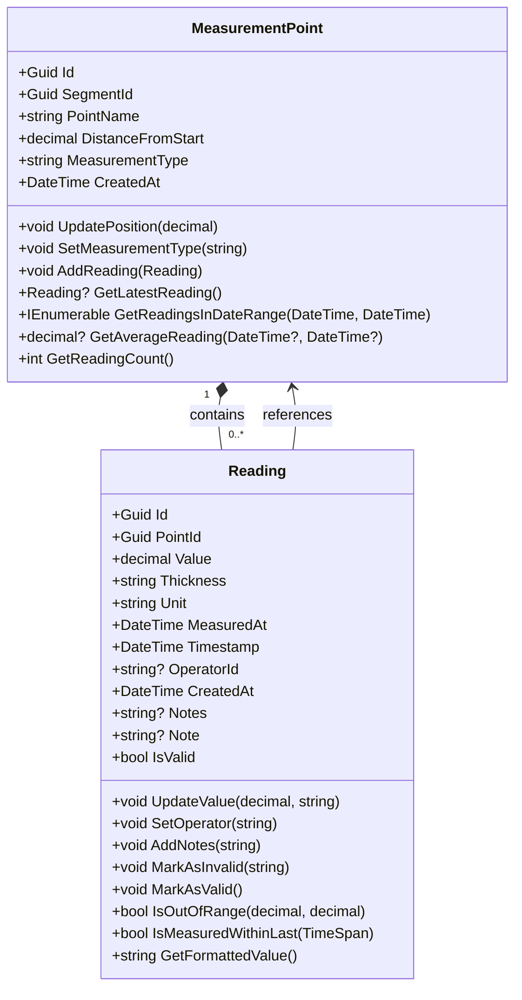
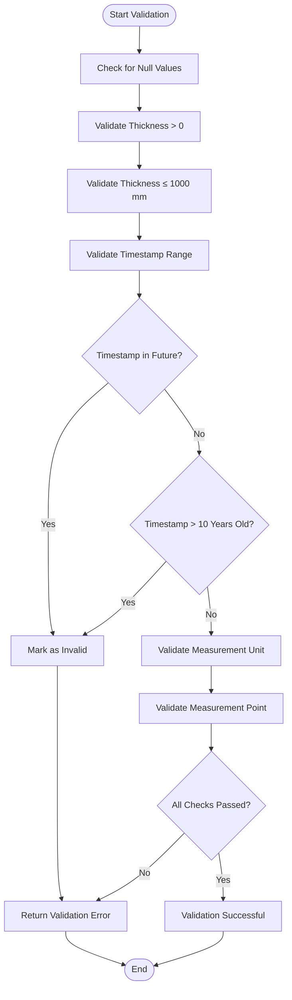
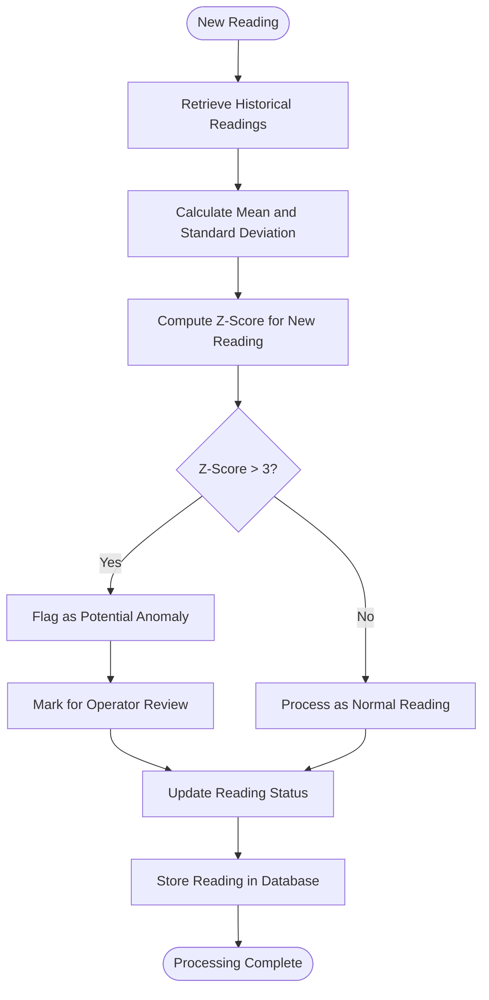
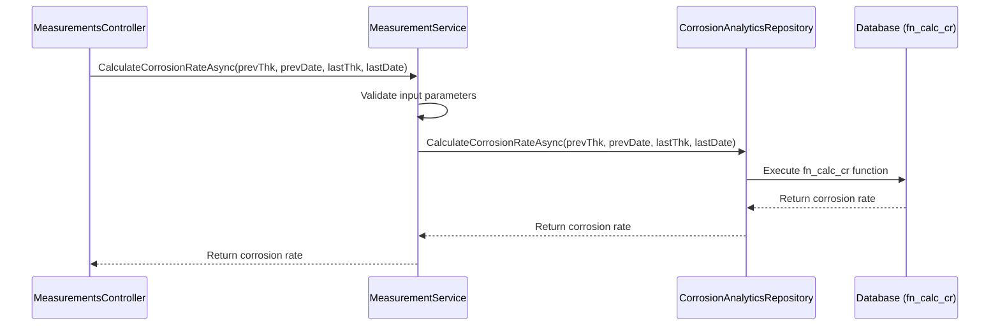
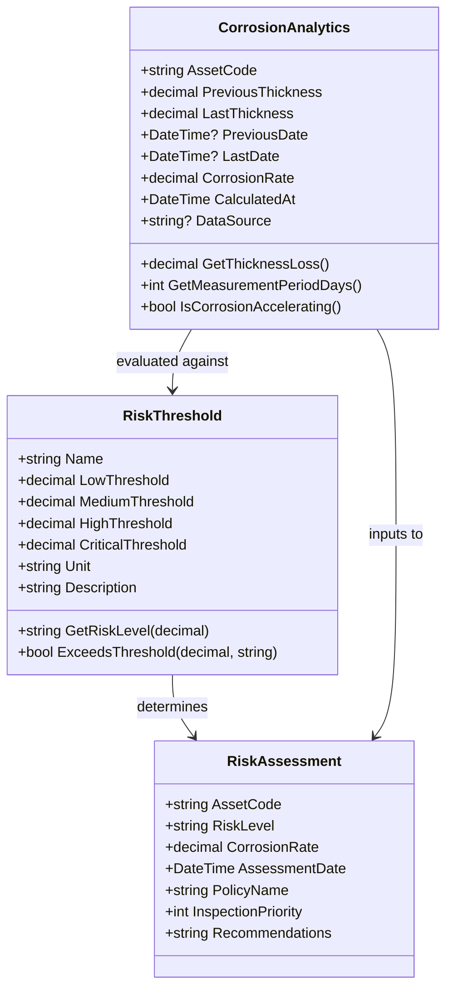
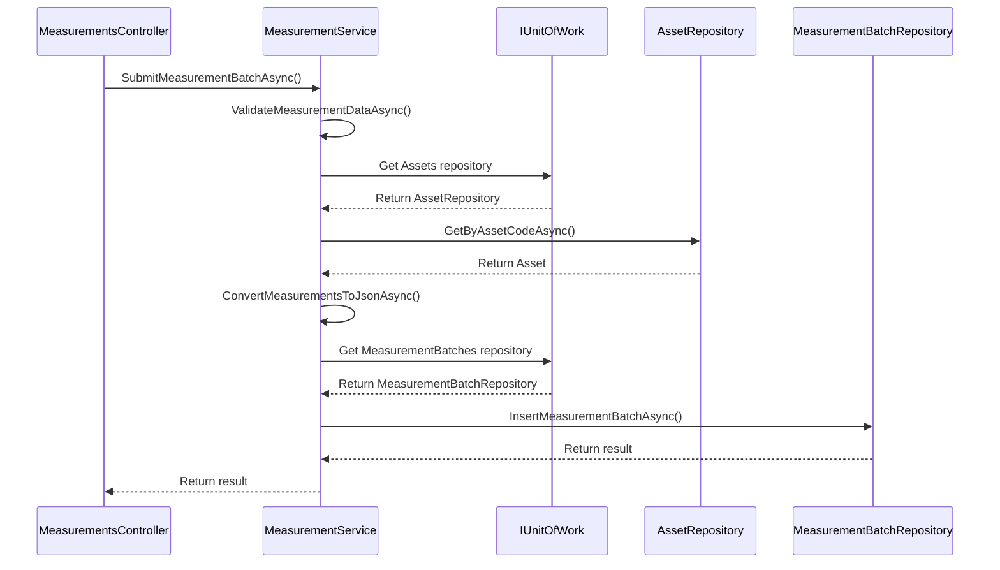

# Measurement Processing Service

<cite>
**Referenced Files in This Document**   
- [MeasurementService.cs](file://src/OilErp.Domain/Services/MeasurementAndRiskServices.cs)
- [Reading.cs](file://src/OilErp.Domain/Entities/Reading.cs)
- [MeasurementPoint.cs](file://src/OilErp.Domain/Entities/MeasurementPoint.cs)
- [Analytics.cs](file://src/OilErp.Domain/Entities/Analytics.cs)
- [RiskAndInspection.cs](file://src/OilErp.Domain/ValueObjects/RiskAndInspection.cs)
- [AssetValidators.cs](file://src/OilErp.App/Validators/AssetValidators.cs)
- [MeasurementAndRiskServices.cs](file://src/OilErp.Domain/Services/MeasurementAndRiskServices.cs)
- [AnalyticsRepositories.cs](file://src/OilErp.Data/Repositories/AnalyticsRepositories.cs)
</cite>

## Table of Contents
1. [Introduction](#introduction)
2. [Core Entities and Relationships](#core-entities-and-relationships)
3. [Reading Validation Process](#reading-validation-process)
4. [Anomaly Detection with Statistical Methods](#anomaly-detection-with-statistical-methods)
5. [Trend Analysis and Corrosion Rate Calculation](#trend-analysis-and-corrosion-rate-calculation)
6. [Threshold Monitoring and Risk Assessment](#threshold-monitoring-and-risk-assessment)
7. [Method Invocation Relationships](#method-invocation-relationships)
8. [Common Issues and Solutions](#common-issues-and-solutions)
9. [Performance Considerations](#performance-considerations)
10. [Conclusion](#conclusion)

## Introduction
The Measurement Processing Service is a critical component in the oil and gas asset management system, responsible for processing wall thickness measurements and other critical readings from pipeline inspection points. This service handles the complete lifecycle of measurement data, from validation and storage to advanced analytics including anomaly detection, trend analysis, and risk assessment. The service follows domain-driven design principles and implements a robust validation framework to ensure data integrity while providing sophisticated statistical analysis capabilities for corrosion monitoring and predictive maintenance.

**Section sources**
- [MeasurementService.cs](file://src/OilErp.Domain/Services/MeasurementAndRiskServices.cs#L1-L214)
- [Reading.cs](file://src/OilErp.Domain/Entities/Reading.cs#L1-L81)

## Core Entities and Relationships
The measurement processing system is built around two primary entities: MeasurementPoint and Reading. A MeasurementPoint represents a specific location on a pipeline segment where wall thickness measurements are taken, while a Reading represents an actual measurement value recorded at that point.

The MeasurementPoint entity maintains a collection of Readings through a one-to-many relationship, allowing historical tracking of wall thickness measurements over time. Each Reading contains the actual thickness value, timestamp, and metadata such as the operator who took the measurement. The Reading entity provides business methods for validation, including checking if values are within expected ranges and verifying timestamps are reasonable.

**Diagram sources**
- [MeasurementPoint.cs](file://src/OilErp.Domain/Entities/MeasurementPoint.cs#L5-L82)
- [Reading.cs](file://src/OilErp.Domain/Entities/Reading.cs#L5-L81)

**Section sources**
- [MeasurementPoint.cs](file://src/OilErp.Domain/Entities/MeasurementPoint.cs#L1-L82)
- [Reading.cs](file://src/OilErp.Domain/Entities/Reading.cs#L1-L81)

## Reading Validation Process
The Measurement Processing Service implements a comprehensive validation process to ensure the integrity of incoming measurement data. When a batch of readings is submitted, the service performs multiple validation checks to identify potentially erroneous or suspicious data points before they are stored in the database.

The validation process begins with basic null and format checks, ensuring all required fields are present and properly formatted. For wall thickness readings specifically, the service verifies that thickness values are positive and within physically reasonable limits (not exceeding 1000 mm). The timestamp is validated to ensure it falls within an acceptable range—measurements cannot be from the future or older than 10 years, preventing data entry errors.

Additional validation occurs at the API level through FluentValidation rules that enforce business constraints such as valid plant codes (ANPZ, KRNPZ) and operator IDs. The validation process is designed to be extensible, allowing additional rules to be added as operational requirements evolve.

**Diagram sources**
- [MeasurementService.cs](file://src/OilErp.Domain/Services/MeasurementAndRiskServices.cs#L68-L102)
- [AssetValidators.cs](file://src/OilErp.App/Validators/AssetValidators.cs#L97-L134)

**Section sources**
- [MeasurementService.cs](file://src/OilErp.Domain/Services/MeasurementAndRiskServices.cs#L68-L102)
- [AssetValidators.cs](file://src/OilErp.App/Validators/AssetValidators.cs#L97-L134)

## Anomaly Detection with Statistical Methods
The Measurement Processing Service employs statistical methods to detect anomalies in measurement data that may indicate measurement errors, equipment issues, or accelerated corrosion. While the current implementation focuses on basic validation rules, the architecture supports more sophisticated anomaly detection techniques that could be implemented.

For wall thickness readings, the service could implement standard deviation analysis to identify outliers in a series of measurements from the same point. By calculating the mean and standard deviation of historical readings, new measurements that fall outside a specified number of standard deviations (e.g., 3σ) could be flagged for review. This approach would help identify sudden, implausible changes in wall thickness that might indicate measurement errors rather than actual corrosion.

The system also supports the concept of measurement validity through the IsValid property on the Reading entity. When anomalies are detected, the MarkAsInvalid method can be used to flag readings while preserving the original data for audit purposes. This approach maintains data integrity while preventing anomalous readings from influencing trend analysis and risk assessments.

**Diagram sources**
- [Reading.cs](file://src/OilErp.Domain/Entities/Reading.cs#L5-L81)
- [MeasurementPoint.cs](file://src/OilErp.Domain/Entities/MeasurementPoint.cs#L5-L82)

**Section sources**
- [Reading.cs](file://src/OilErp.Domain/Entities/Reading.cs#L5-L81)
- [MeasurementPoint.cs](file://src/OilErp.Domain/Entities/MeasurementPoint.cs#L5-L82)

## Trend Analysis and Corrosion Rate Calculation
The Measurement Processing Service provides robust trend analysis capabilities, with a primary focus on calculating corrosion rates from sequential wall thickness measurements. The CalculateCorrosionRateAsync method serves as the main interface for trend analysis, computing the rate of wall thickness loss over time.

The corrosion rate calculation follows the standard formula: (Previous Thickness - Current Thickness) / Time Interval. The service delegates the actual calculation to the database-level function fn_calc_cr, which ensures consistent calculations across the system. This approach also enables batch processing of corrosion rates for multiple assets efficiently.

For each measurement point, the service can retrieve historical readings and calculate trends over specified time periods. The MeasurementPoint entity provides methods like GetAverageReading and GetReadingsInDateRange that facilitate trend analysis. These capabilities support predictive maintenance by identifying assets with accelerating corrosion rates that require immediate attention.

**Diagram sources**
- [MeasurementService.cs](file://src/OilErp.Domain/Services/MeasurementAndRiskServices.cs#L41-L66)
- [AnalyticsRepositories.cs](file://src/OilErp.Data/Repositories/AnalyticsRepositories.cs#L36-L58)

**Section sources**
- [MeasurementService.cs](file://src/OilErp.Domain/Services/MeasurementAndRiskServices.cs#L41-L66)
- [AnalyticsRepositories.cs](file://src/OilErp.Data/Repositories/AnalyticsRepositories.cs#L36-L58)

## Threshold Monitoring and Risk Assessment
The Measurement Processing Service integrates with the risk assessment system to monitor measurements against predefined thresholds and determine asset risk levels. The system uses configurable risk policies with multiple threshold levels (Low, Medium, High, Critical) to classify the severity of wall thickness reduction.

When corrosion rates exceed specified thresholds, the system automatically assigns risk levels that trigger appropriate inspection and maintenance workflows. The RiskThreshold value object encapsulates the threshold configuration and provides methods to determine risk levels based on corrosion rate values. This approach enables flexible risk management that can be tailored to different asset types and operating conditions.

The threshold monitoring system also calculates proximity to the next risk level, providing early warning when corrosion rates are approaching the next threshold. This predictive capability allows maintenance teams to proactively address potential issues before they escalate to higher risk categories.

**Diagram sources**
- [RiskAndInspection.cs](file://src/OilErp.Domain/ValueObjects/RiskAndInspection.cs#L1-L162)
- [Analytics.cs](file://src/OilErp.Domain/Entities/Analytics.cs#L48-L93)

**Section sources**
- [RiskAndInspection.cs](file://src/OilErp.Domain/ValueObjects/RiskAndInspection.cs#L1-L162)
- [Analytics.cs](file://src/OilErp.Domain/Entities/Analytics.cs#L48-L93)

## Method Invocation Relationships
The Measurement Processing Service follows a clean architecture with well-defined invocation relationships between components. The service layer acts as the orchestrator, coordinating calls between the API controllers, domain entities, and data access repositories.

When a measurement batch is submitted, the API controller invokes the SubmitMeasurementBatchAsync method on the MeasurementService. This method first validates the readings using ValidateMeasurementDataAsync, then verifies the asset exists, converts the readings to JSON format, and finally delegates to the MeasurementBatchRepository to persist the data. This separation of concerns ensures that business logic remains in the service layer while data access details are encapsulated in the repositories.

The invocation chain demonstrates the use of the Unit of Work pattern, where the IUnitOfWork interface provides access to multiple repository instances within a single transaction context. This ensures data consistency when multiple operations need to be performed atomically.

**Diagram sources**
- [MeasurementService.cs](file://src/OilErp.Domain/Services/MeasurementAndRiskServices.cs#L1-L214)
- [MeasurementAndRiskServices.cs](file://src/OilErp.Domain/Services/MeasurementAndRiskServices.cs#L1-L214)

**Section sources**
- [MeasurementService.cs](file://src/OilErp.Domain/Services/MeasurementAndRiskServices.cs#L1-L214)

## Common Issues and Solutions
The Measurement Processing Service addresses several common issues encountered in industrial measurement systems. Invalid measurement values, such as negative thickness readings or implausibly high values, are caught by the validation system and rejected before storage. The service also handles timestamp validation to prevent future-dated or excessively old measurements from entering the system.

Unexpected trends, such as sudden increases in wall thickness (which are physically impossible in corrosion scenarios), can be detected through business rule validation. When such anomalies are identified, the system marks readings as invalid while preserving them for audit and troubleshooting purposes.

For performance-related issues when processing large volumes of readings, the service uses asynchronous methods and efficient database operations. The batch processing approach minimizes database round-trips, while the use of stored procedures for complex operations reduces network overhead and improves throughput.

**Section sources**
- [MeasurementService.cs](file://src/OilErp.Domain/Services/MeasurementAndRiskServices.cs#L68-L102)
- [Reading.cs](file://src/OilErp.Domain/Entities/Reading.cs#L5-L81)

## Performance Considerations
The Measurement Processing Service is designed with performance in mind, particularly when handling large volumes of measurement data. The use of asynchronous methods throughout the service layer prevents blocking operations and allows the system to handle multiple requests concurrently.

For trend calculations involving large datasets, the service delegates complex calculations to the database level where they can be optimized and executed efficiently. The fn_calc_cr database function processes corrosion rate calculations, leveraging database indexing and query optimization to handle large volumes of historical data.

The service also implements efficient data retrieval patterns, such as the GetLatestMeasurementsAsync method with a configurable limit, preventing excessive data transfer when only recent readings are needed. The use of JSON serialization for measurement batches reduces the overhead of object mapping and improves serialization performance.

To further optimize performance, the system could implement caching strategies for frequently accessed data, such as recent measurements for critical assets. Background processing could be used for non-essential analytics, ensuring that critical measurement submission operations are not delayed by resource-intensive calculations.

**Section sources**
- [MeasurementService.cs](file://src/OilErp.Domain/Services/MeasurementAndRiskServices.cs#L1-L214)
- [AnalyticsRepositories.cs](file://src/OilErp.Data/Repositories/AnalyticsRepositories.cs#L36-L58)

## Conclusion
The Measurement Processing Service provides a robust foundation for managing industrial measurement data with comprehensive validation, sophisticated trend analysis, and integrated risk assessment capabilities. By following domain-driven design principles and implementing clean architectural patterns, the service ensures data integrity while providing valuable insights for predictive maintenance and risk management.

The service's modular design allows for easy extension of validation rules, anomaly detection algorithms, and analytical capabilities as operational requirements evolve. The integration with database-level functions ensures consistent calculations and efficient processing of large datasets, making the system scalable for enterprise-wide deployment.

Future enhancements could include more advanced statistical methods for anomaly detection, machine learning-based predictive models for remaining useful life estimation, and real-time monitoring capabilities with automated alerting. The current architecture provides a solid foundation for these advanced capabilities while meeting the immediate needs of industrial asset management.