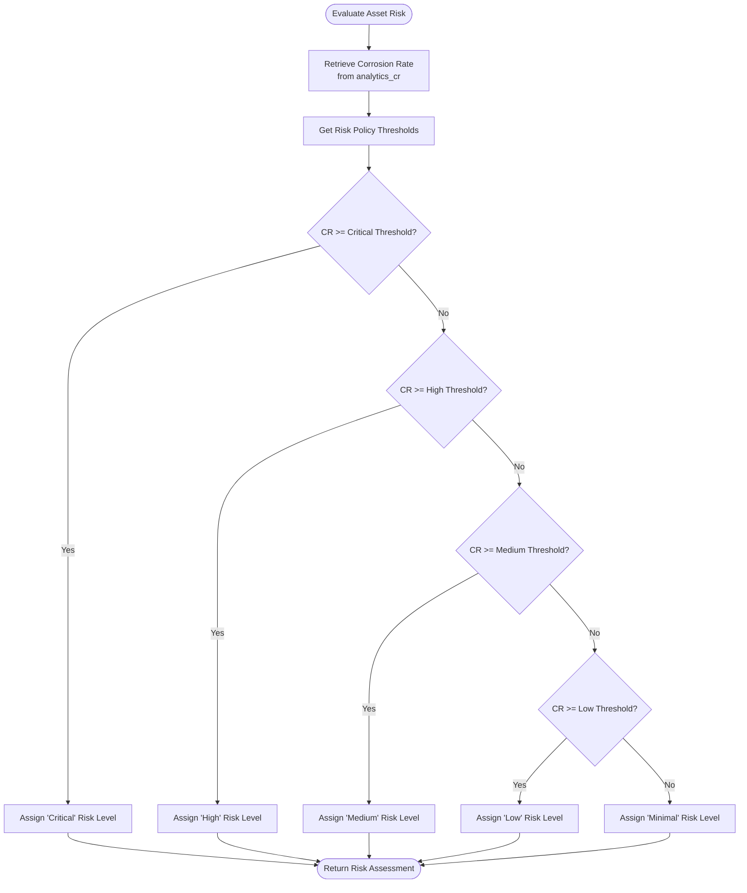
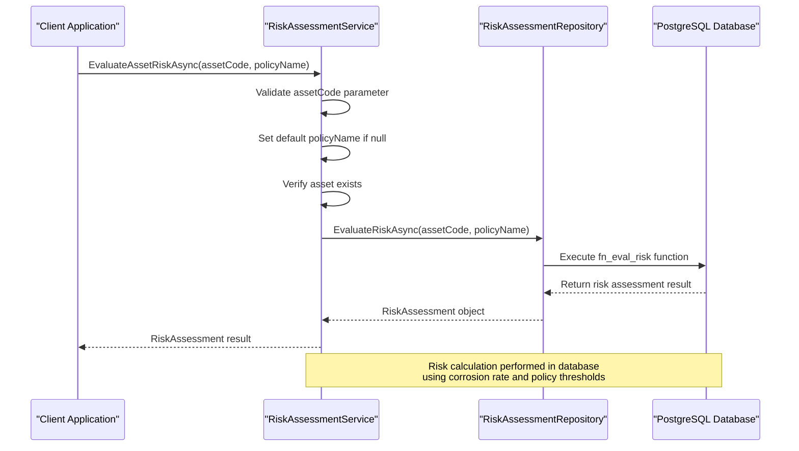
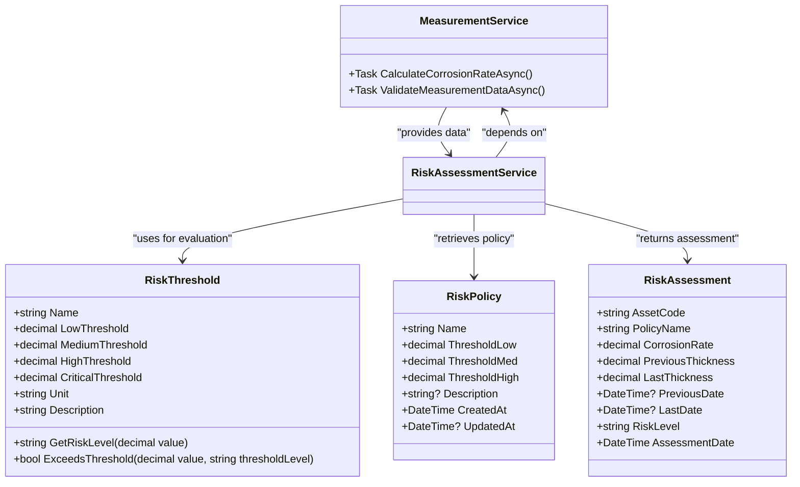
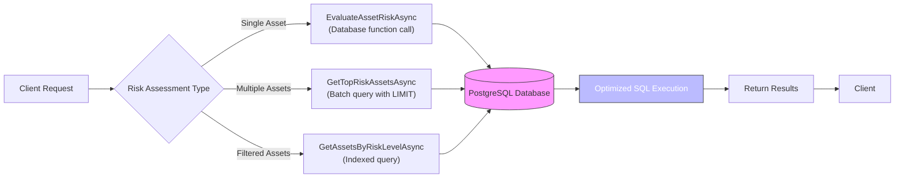

# Risk Assessment Service

<cite>
**Referenced Files in This Document**   
- [MeasurementAndRiskServices.cs](file://src/OilErp.Domain/Services/MeasurementAndRiskServices.cs)
- [RiskAndInspection.cs](file://src/OilErp.Domain/ValueObjects/RiskAndInspection.cs)
- [RiskAssessmentRepository.cs](file://src/OilErp.Data/Repositories/RiskAssessmentRepository.cs)
- [IServices.cs](file://src/OilErp.Domain/Interfaces/IServices.cs)
- [IRepositories.cs](file://src/OilErp.Domain/Interfaces/IRepositories.cs)
- [02_functions_core.sql](file://sql/central/02_functions_core.sql)
</cite>

## Table of Contents
1. [Introduction](#introduction)
2. [Core Components](#core-components)
3. [Risk Scoring Algorithm Implementation](#risk-scoring-algorithm-implementation)
4. [Method Invocation Relationships](#method-invocation-relationships)
5. [Risk Thresholds and Domain Entities](#risk-thresholds-and-domain-entities)
6. [Common Issues and Solutions](#common-issues-and-solutions)
7. [Performance Considerations and Optimization](#performance-considerations-and-optimization)
8. [Conclusion](#conclusion)

## Introduction
The Risk Assessment Service is a critical component in the OilErp system responsible for evaluating asset risk levels based on corrosion rate analytics and configurable risk policies. This service integrates measurement data, defect history, and maintenance records to calculate comprehensive risk assessments for industrial assets. The service operates through a combination of domain logic in C# and database-level functions that perform the actual risk evaluation. This document provides a detailed analysis of the risk assessment methodology, implementation details, and integration points within the system.

## Core Components

The Risk Assessment Service consists of several interconnected components that work together to evaluate asset risk. The primary class `RiskAssessmentService` implements the `IRiskAssessmentService` interface and coordinates risk evaluation through the unit of work pattern. The service relies on repository implementations to access data and execute database functions that perform the core risk calculations. Key components include the risk assessment engine, risk policy management, and integration with measurement data through the `MeasurementService`. The service follows a clean architecture pattern where business logic is separated from data access concerns, allowing for maintainable and testable code.

**Section sources**
- [MeasurementAndRiskServices.cs](file://src/OilErp.Domain/Services/MeasurementAndRiskServices.cs#L127-L130)
- [IServices.cs](file://src/OilErp.Domain/Interfaces/IServices.cs#L45-L77)

## Risk Scoring Algorithm Implementation

The risk scoring algorithm combines corrosion rate measurements with configurable thresholds to determine asset risk levels. The algorithm is implemented primarily in the database function `fn_eval_risk`, which is invoked through the `EvaluateAssetRiskAsync` method. The risk score is calculated based on the corrosion rate (CR) value obtained from the `analytics_cr` table, which represents the rate of material loss over time. This value is compared against three threshold levels: low, medium, and high, which are defined in the `risk_policies` table.

The algorithm follows a hierarchical evaluation process:
1. Retrieve the asset's corrosion rate from the analytics_cr table
2. Obtain the threshold values from the specified risk policy (defaulting to "default" if not specified)
3. Compare the corrosion rate against the thresholds in descending order of severity
4. Assign a risk level based on the first threshold that is exceeded

The risk levels are determined as follows:
- **Critical/High**: Corrosion rate ≥ High threshold
- **High/Medium**: Corrosion rate ≥ Medium threshold
- **Medium/Low**: Corrosion rate ≥ Low threshold
- **Low/Minimal**: Corrosion rate < Low threshold
- **UNKNOWN**: When corrosion rate data is null

This approach ensures that assets with the most severe corrosion rates receive the highest risk ratings, enabling prioritized maintenance and inspection scheduling.

**Diagram sources**
- [02_functions_core.sql](file://sql/central/02_functions_core.sql#L183-L219)
- [MeasurementAndRiskServices.cs](file://src/OilErp.Domain/Services/MeasurementAndRiskServices.cs#L132-L148)

**Section sources**
- [02_functions_core.sql](file://sql/central/02_functions_core.sql#L183-L219)
- [MeasurementAndRiskServices.cs](file://src/OilErp.Domain/Services/MeasurementAndRiskServices.cs#L132-L148)
- [RiskAssessmentRepository.cs](file://src/OilErp.Data/Repositories/RiskAssessmentRepository.cs#L93-L115)

## Method Invocation Relationships

The `EvaluateAssetRiskAsync` method serves as the primary entry point for risk assessment and orchestrates a series of method calls to complete the evaluation process. When invoked, it first validates the input parameters and verifies the existence of the specified asset. It then delegates the actual risk calculation to the repository layer through the `EvaluateRiskAsync` method on the `IRiskAssessmentRepository` interface.

The invocation chain is as follows:
1. `RiskAssessmentService.EvaluateAssetRiskAsync` (domain service)
2. `RiskAssessmentRepository.EvaluateRiskAsync` (repository implementation)
3. Database function `fn_eval_risk` (SQL function)

This layered approach separates concerns and allows for proper dependency inversion. The domain service handles business logic and validation, the repository manages data access concerns, and the database function performs the actual risk calculation. The `RecalculateRiskAsync` method provides a convenience wrapper that simply calls `EvaluateAssetRiskAsync` with the same parameters, ensuring consistency in risk calculation methodology.

**Diagram sources**
- [MeasurementAndRiskServices.cs](file://src/OilErp.Domain/Services/MeasurementAndRiskServices.cs#L132-L148)
- [RiskAssessmentRepository.cs](file://src/OilErp.Data/Repositories/RiskAssessmentRepository.cs#L93-L115)

**Section sources**
- [MeasurementAndRiskServices.cs](file://src/OilErp.Domain/Services/MeasurementAndRiskServices.cs#L132-L148)
- [RiskAssessmentRepository.cs](file://src/OilErp.Data/Repositories/RiskAssessmentRepository.cs#L93-L115)
- [IRepositories.cs](file://src/OilErp.Domain/Interfaces/IRepositories.cs#L177-L181)

## Risk Thresholds and Domain Entities

The risk assessment system utilizes several key domain entities to define and manage risk evaluation criteria. The `RiskThreshold` value object, defined in the `RiskAndInspection.cs` file, represents a configuration of threshold values for different risk levels. This record includes properties for low, medium, high, and critical thresholds, along with metadata such as name, unit, and description.

The `RiskPolicy` entity, managed through the `IRiskPolicyRepository` interface, represents a complete risk assessment policy that can be applied to assets. Each policy contains threshold values and can be created, updated, or retrieved through the `CreateOrUpdateRiskPolicyAsync` method. The system enforces business rules such as threshold ordering (low < medium < high < critical) and non-negative values to ensure data integrity.

The `RiskAssessment` entity contains the results of a risk evaluation, including the asset code, corrosion rate, previous and last thickness measurements, dates, and the calculated risk level. This entity serves as the output of the risk assessment process and is used by other system components for reporting and decision-making.

**Diagram sources**
- [RiskAndInspection.cs](file://src/OilErp.Domain/ValueObjects/RiskAndInspection.cs#L5-L67)
- [MeasurementAndRiskServices.cs](file://src/OilErp.Domain/Services/MeasurementAndRiskServices.cs#L176-L200)

**Section sources**
- [RiskAndInspection.cs](file://src/OilErp.Domain/ValueObjects/RiskAndInspection.cs#L5-L67)
- [MeasurementAndRiskServices.cs](file://src/OilErp.Domain/Services/MeasurementAndRiskServices.cs#L176-L200)
- [IRepositories.cs](file://src/OilErp.Domain/Interfaces/IRepositories.cs#L177-L197)

## Common Issues and Solutions

Several common issues can affect risk assessment accuracy, and the system includes mechanisms to address these challenges:

**Incomplete Data**: When corrosion rate data is null or missing, the system returns an "UNKNOWN" risk level. This occurs when insufficient measurement data exists to calculate a corrosion rate. The solution is to ensure regular measurement submissions for all assets.

**Missing Risk Policies**: If a specified policy does not exist, the system defaults to the "default" policy. The default policy is automatically created during database initialization with thresholds of 0.1 (low), 0.3 (medium), and 0.6 (high). Administrators can create custom policies using the `CreateOrUpdateRiskPolicyAsync` method.

**Data Validation**: The system validates threshold values to ensure they are in ascending order and non-negative. This prevents configuration errors that could lead to incorrect risk assessments.

**Performance Issues with Large Datasets**: When retrieving multiple risk assessments, the system provides optimized methods like `GetTopRiskAssetsAsync` and `GetHighRiskAssetsAsync` that leverage database indexing and limiting to improve performance.

**Solution Implementation**:
- Implement data validation at both application and database levels
- Use default policies as fallback mechanisms
- Provide administrative interfaces for policy management
- Ensure regular data ingestion from measurement systems
- Monitor for assets with missing or stale data

**Section sources**
- [MeasurementAndRiskServices.cs](file://src/OilErp.Domain/Services/MeasurementAndRiskServices.cs#L132-L148)
- [02_functions_core.sql](file://sql/central/02_functions_core.sql#L183-L219)
- [RiskAndInspection.cs](file://src/OilErp.Domain/ValueObjects/RiskAndInspection.cs#L5-L67)

## Performance Considerations and Optimization

The risk assessment system employs several strategies to ensure optimal performance, especially when evaluating risk across multiple assets:

**Database-Level Optimization**: The core risk calculation is performed in the database using SQL functions, which allows for efficient set-based operations and leverages database indexing on the `analytics_cr` table. This reduces data transfer between application and database layers.

**Caching Strategy**: While not explicitly implemented in the current code, the architecture supports caching of risk assessments, particularly for frequently accessed assets. The `RecalculateRiskAsync` method provides a mechanism to refresh cached values when needed.

**Batch Operations**: The system provides methods like `GetTopRiskAssetsAsync` and `GetHighRiskAssetsAsync` that retrieve multiple risk assessments in a single operation, reducing the number of database round-trips.

**Indexing**: The database schema should include appropriate indexes on key columns such as `asset_code` in the `analytics_cr` table and `name` in the `risk_policies` table to ensure fast lookups.

**Asynchronous Processing**: All risk assessment methods are implemented asynchronously, allowing the application to handle multiple requests concurrently without blocking threads.

**Optimization Recommendations**:
1. Implement application-level caching for risk assessments with a configurable TTL
2. Add database indexes on frequently queried columns
3. Use pagination for methods that return large result sets
4. Consider materialized views for frequently accessed risk data
5. Implement background refresh of risk assessments for critical assets

**Diagram sources**
- [MeasurementAndRiskServices.cs](file://src/OilErp.Domain/Services/MeasurementAndRiskServices.cs#L148-L174)
- [RiskAssessmentRepository.cs](file://src/OilErp.Data/Repositories/RiskAssessmentRepository.cs#L68-L94)

**Section sources**
- [MeasurementAndRiskServices.cs](file://src/OilErp.Domain/Services/MeasurementAndRiskServices.cs#L148-L174)
- [RiskAssessmentRepository.cs](file://src/OilErp.Data/Repositories/RiskAssessmentRepository.cs#L68-L94)
- [02_functions_core.sql](file://sql/central/02_functions_core.sql#L183-L219)

## Conclusion

The Risk Assessment Service provides a robust framework for evaluating asset risk based on corrosion rate measurements and configurable policies. By combining application-level business logic with database-level calculations, the system achieves both flexibility and performance. The service's architecture follows clean design principles with clear separation of concerns, making it maintainable and extensible. Key strengths include configurable risk thresholds, comprehensive data validation, and efficient handling of both single and batch risk assessments. For optimal results, organizations should ensure regular data collection, maintain up-to-date risk policies, and monitor system performance as asset counts grow. The service provides a solid foundation for predictive maintenance and risk-based inspection programs in industrial settings.