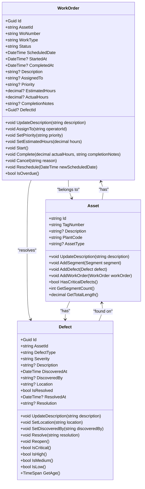
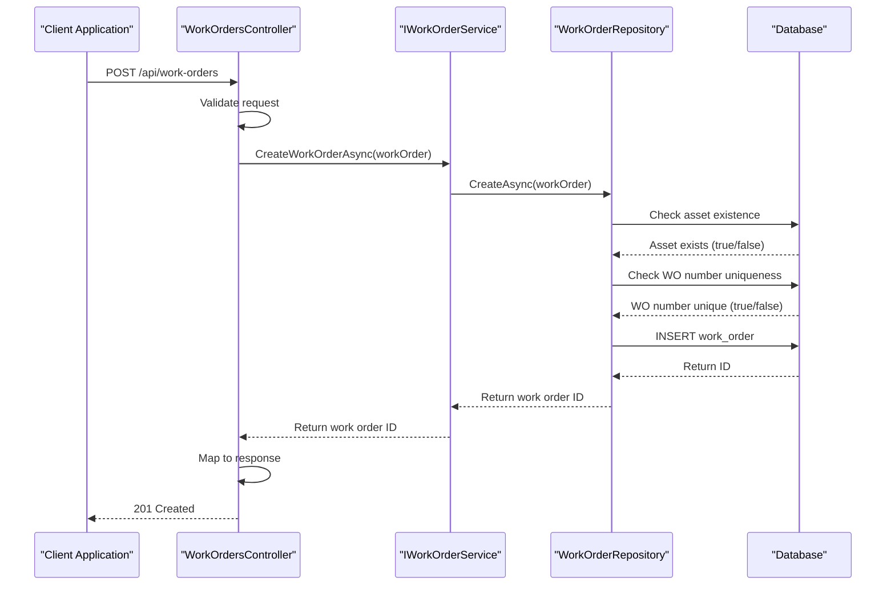
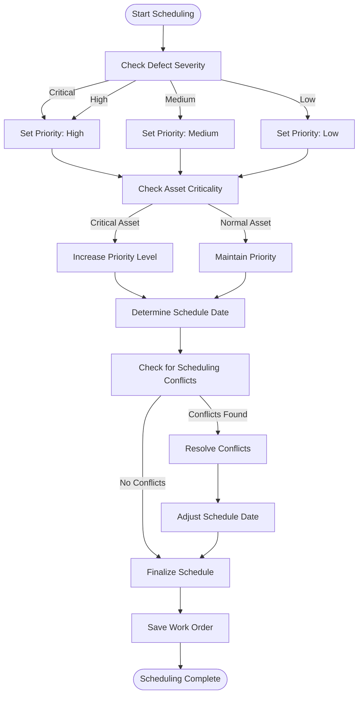
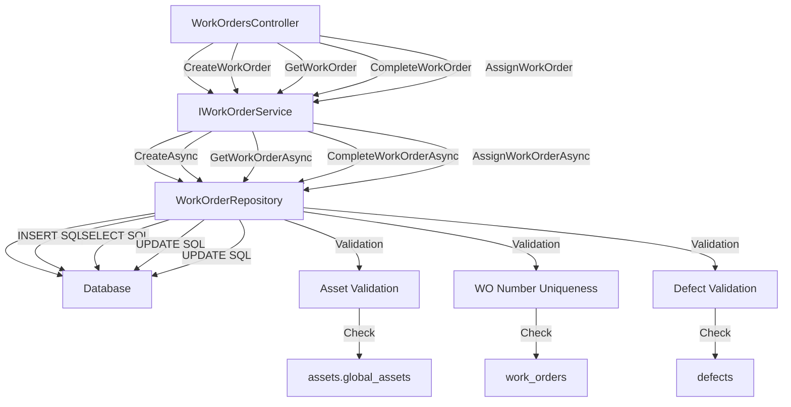

# Work Order Management Service

<cite>
**Referenced Files in This Document**   
- [WorkOrder.cs](file://src/OilErp.Domain/Entities/WorkOrder.cs)
- [Defect.cs](file://src/OilErp.Domain/Entities/Defect.cs)
- [Asset.cs](file://src/OilErp.Domain/Entities/Asset.cs)
- [WorkOrderRepository.cs](file://src/OilErp.Data/Repositories/WorkOrderRepository.cs)
- [WorkOrdersController.cs](file://src/OilErp.App/Controllers/WorkOrdersController.cs)
- [IServices.cs](file://src/OilErp.Domain/Interfaces/IServices.cs)
- [IRepositories.cs](file://src/OilErp.Domain/Interfaces/IRepositories.cs)
</cite>

## Table of Contents
1. [Introduction](#introduction)
2. [Core Entities and Relationships](#core-entities-and-relationships)
3. [Work Order Creation](#work-order-creation)
4. [Defect-to-Work-Order Conversion](#defect-to-work-order-conversion)
5. [Preventive Maintenance Scheduling](#preventive-maintenance-scheduling)
6. [Workload Recommendations](#workload-recommendations)
7. [Method Invocation Relationships](#method-invocation-relationships)
8. [Common Issues and Solutions](#common-issues-and-solutions)
9. [Performance Considerations](#performance-considerations)
10. [Conclusion](#conclusion)

## Introduction

The Work Order Management Service is a critical component of the oil industry ERP system, responsible for managing maintenance and repair activities across physical assets. This service handles the complete lifecycle of work orders, from creation and scheduling to completion and reporting. It integrates closely with Asset and Defect management systems to ensure timely resolution of issues and preventive maintenance scheduling. The service provides robust APIs for creating work orders, tracking their status, and managing assignments, with built-in validation and business logic to maintain data integrity.

**Section sources**
- [WorkOrdersController.cs](file://src/OilErp.App/Controllers/WorkOrdersController.cs#L1-L50)

## Core Entities and Relationships

The Work Order Management Service revolves around three core entities: WorkOrder, Defect, and Asset. These entities are interconnected through well-defined relationships that enable comprehensive maintenance management.

**Diagram sources**
- [WorkOrder.cs](file://src/OilErp.Domain/Entities/WorkOrder.cs#L5-L133)
- [Defect.cs](file://src/OilErp.Domain/Entities/Defect.cs#L5-L96)
- [Asset.cs](file://src/OilErp.Domain/Entities/Asset.cs#L5-L71)

**Section sources**
- [WorkOrder.cs](file://src/OilErp.Domain/Entities/WorkOrder.cs#L5-L133)
- [Defect.cs](file://src/OilErp.Domain/Entities/Defect.cs#L5-L96)
- [Asset.cs](file://src/OilErp.Domain/Entities/Asset.cs#L5-L71)

## Work Order Creation

Work order creation is a fundamental operation in the system, initiated through the `CreateWorkOrderAsync` method in the `IWorkOrderService` interface. The process begins with validation of the associated asset's existence, ensuring that work orders are only created for valid assets. Each work order is assigned a unique work order number (WoNumber) that must be globally unique across the system. The repository implementation enforces this constraint by checking for existing work order numbers before insertion.

The creation process follows a strict validation sequence:
1. Verify the asset exists in the global assets table
2. Ensure the work order number is unique
3. Validate that any referenced defect exists
4. Set creation timestamps and generate a new GUID if not provided

Work orders are created with an initial status of "Open" and include essential information such as asset ID, work type, priority, scheduled date, and estimated hours. The system automatically sets the `CreatedAt` and `UpdatedAt` timestamps to the current UTC time.

**Diagram sources**
- [WorkOrdersController.cs](file://src/OilErp.App/Controllers/WorkOrdersController.cs#L50-L115)
- [WorkOrderRepository.cs](file://src/OilErp.Data/Repositories/WorkOrderRepository.cs#L50-L150)

**Section sources**
- [WorkOrdersController.cs](file://src/OilErp.App/Controllers/WorkOrdersController.cs#L50-L115)
- [WorkOrderRepository.cs](file://src/OilErp.Data/Repositories/WorkOrderRepository.cs#L50-L150)

## Defect-to-Work-Order Conversion

The system supports automatic conversion of defects to work orders, creating a direct link between identified issues and required maintenance actions. When a defect is discovered, it is recorded with its severity level (Critical, High, Medium, or Low), which directly influences the priority of the generated work order. The conversion process maintains a bidirectional relationship between defects and work orders through the `DefectId` property in the WorkOrder entity and the `WorkOrders` collection in the Defect entity.

Critical defects automatically trigger high-priority work orders, while lower severity defects may be scheduled as part of routine maintenance. The system ensures data consistency by validating that the defect exists before creating a work order and maintaining referential integrity through database constraints. When a work order is completed, the associated defect can be automatically marked as resolved, creating a closed-loop maintenance process.

The conversion logic is implemented in the service layer, which determines the appropriate work type and priority based on the defect type and severity. For example, a "Corrosion" defect with "Critical" severity would generate an emergency repair work order with immediate scheduling priority, while a "Coating Damage" defect with "Low" severity might generate a preventive maintenance work order scheduled for the next maintenance window.

**Section sources**
- [WorkOrder.cs](file://src/OilErp.Domain/Entities/WorkOrder.cs#L25-L27)
- [Defect.cs](file://src/OilErp.Domain/Entities/Defect.cs#L21-L21)
- [WorkOrderRepository.cs](file://src/OilErp.Data/Repositories/WorkOrderRepository.cs#L100-L120)

## Preventive Maintenance Scheduling

Preventive maintenance scheduling is a key feature of the Work Order Management Service, enabling proactive maintenance planning based on asset condition and risk assessment. The scheduling system uses multiple factors to determine optimal timing for maintenance activities, including defect severity, asset criticality, and historical performance data.

Work orders are assigned priorities based on a hierarchical system:
- Critical: Immediate attention required (within 24 hours)
- High: High priority (within 7 days)
- Medium: Standard priority (within 30 days)
- Low: Routine maintenance (within 90 days)

The scheduling algorithm considers several factors when determining work order priority:
1. Defect severity (Critical, High, Medium, Low)
2. Asset criticality in the production process
3. Historical failure rates of similar assets
4. Current workload of maintenance teams
5. Availability of required parts and equipment

The system prevents scheduling conflicts by checking for overlapping work orders on the same asset and ensuring that maintenance personnel are not over-allocated. When creating a new work order, the system validates that the scheduled date does not conflict with existing high-priority work orders on the same asset.

**Diagram sources**
- [WorkOrder.cs](file://src/OilErp.Domain/Entities/WorkOrder.cs#L15-L20)
- [WorkOrderRepository.cs](file://src/OilErp.Data/Repositories/WorkOrderRepository.cs#L100-L120)

**Section sources**
- [WorkOrder.cs](file://src/OilErp.Domain/Entities/WorkOrder.cs#L15-L20)
- [WorkOrderRepository.cs](file://src/OilErp.Data/Repositories/WorkOrderRepository.cs#L100-L120)

## Workload Recommendations

The Work Order Management Service provides intelligent workload recommendations to optimize maintenance team utilization and prevent over-allocation. The system analyzes current work orders, their priorities, estimated hours, and scheduled dates to provide balanced workload distribution across maintenance personnel.

Workload recommendations are generated based on several key metrics:
- Total estimated hours per technician
- Current work order priorities
- Scheduled completion dates
- Technician skill sets and certifications
- Travel time between work locations

The service exposes methods like `GetWorkOrdersByAssignedToAsync` and `GetWorkOrdersByStatusAsync` to facilitate workload analysis and rebalancing. Managers can use these methods to identify technicians who are underutilized or overburdened and redistribute work orders accordingly.

For bulk scheduling operations, the system implements optimization techniques to minimize database round-trips and improve performance. When scheduling multiple work orders, the service processes them in batches and uses efficient database queries to validate constraints and update records.

**Section sources**
- [IServices.cs](file://src/OilErp.Domain/Interfaces/IServices.cs#L52-L64)
- [IRepositories.cs](file://src/OilErp.Domain/Interfaces/IRepositories.cs#L129-L151)

## Method Invocation Relationships

The Work Order Management Service follows a clean architectural pattern with well-defined invocation relationships between controllers, services, and repositories. The invocation flow starts from the API controller, moves through the service layer for business logic processing, and ends at the repository layer for data persistence.

**Diagram sources**
- [WorkOrdersController.cs](file://src/OilErp.App/Controllers/WorkOrdersController.cs#L1-L50)
- [IServices.cs](file://src/OilErp.Domain/Interfaces/IServices.cs#L52-L64)
- [WorkOrderRepository.cs](file://src/OilErp.Data/Repositories/WorkOrderRepository.cs#L1-L50)

**Section sources**
- [WorkOrdersController.cs](file://src/OilErp.App/Controllers/WorkOrdersController.cs#L1-L50)
- [IServices.cs](file://src/OilErp.Domain/Interfaces/IServices.cs#L52-L64)
- [WorkOrderRepository.cs](file://src/OilErp.Data/Repositories/WorkOrderRepository.cs#L1-L50)

## Common Issues and Solutions

Several common issues can arise in work order management, and the system provides specific solutions for each:

**Scheduling Conflicts**: When multiple high-priority work orders are scheduled for the same asset, the system detects potential conflicts and suggests alternative dates. The repository's `GetScheduledForDateAsync` method helps identify existing work orders on specific dates, allowing for conflict resolution before finalizing schedules.

**Priority Misalignment**: Sometimes, work order priorities may not align with defect severity. The system addresses this by implementing automatic priority assignment based on defect severity during defect-to-work-order conversion. The `IsCritical()`, `IsHigh()`, `IsMedium()`, and `IsLow()` methods in the Defect entity ensure consistent severity assessment.

**Work Order Number Duplication**: To prevent duplicate work order numbers, the repository implements a uniqueness check before creation. The `CreateAsync` method in `WorkOrderRepository` queries the database to verify that no existing work order has the same number.

**Incomplete Work Order Data**: The system validates essential fields during creation and updates. Required fields like `AssetId`, `WoNumber`, `WorkType`, and `Status` are marked with the `required` keyword in the WorkOrder entity, ensuring they cannot be null.

**Unauthorized Deletions**: The system prevents deletion of work orders that are in progress or completed. The `DeleteAsync` method checks the work order status and only allows deletion of draft or cancelled work orders.

**Section sources**
- [WorkOrderRepository.cs](file://src/OilErp.Data/Repositories/WorkOrderRepository.cs#L150-L200)
- [WorkOrder.cs](file://src/OilErp.Domain/Entities/WorkOrder.cs#L80-L100)

## Performance Considerations

The Work Order Management Service is optimized for performance, especially during bulk operations and high-volume scenarios. Several performance considerations have been implemented:

**Bulk Scheduling**: For bulk scheduling operations, the system minimizes database round-trips by processing work orders in batches. The repository methods are designed to handle multiple operations efficiently, reducing the overhead of individual database calls.

**Indexing Strategy**: The database schema includes strategic indexes on frequently queried fields such as `asset_id`, `status`, `scheduled_date`, `priority`, and `wo_number`. These indexes significantly improve query performance for common operations like retrieving work orders by asset, status, or date.

**Caching Recommendations**: While not implemented in the current code, caching frequently accessed work order data (such as active work orders for a specific plant) would improve performance. Implementing a distributed cache for work order data could reduce database load and improve response times.

**Query Optimization**: The repository methods use parameterized queries to prevent SQL injection and improve query plan reuse. Complex queries are optimized to retrieve only necessary fields rather than using SELECT *.

**Workload Distribution**: To optimize workload distribution, the system should implement pagination for large result sets and use asynchronous methods throughout the call stack to prevent thread blocking.

**Section sources**
- [WorkOrderRepository.cs](file://src/OilErp.Data/Repositories/WorkOrderRepository.cs#L200-L250)
- [WorkOrdersController.cs](file://src/OilErp.App/Controllers/WorkOrdersController.cs#L300-L350)

## Conclusion

The Work Order Management Service provides a comprehensive solution for managing maintenance activities in the oil industry ERP system. By integrating closely with Asset and Defect management, the service ensures that maintenance work is properly prioritized and scheduled based on actual asset conditions. The system's robust validation, clear entity relationships, and well-defined service interfaces make it reliable and maintainable.

Key strengths of the implementation include:
- Strong validation of work order data integrity
- Clear separation of concerns between controller, service, and repository layers
- Comprehensive business methods on entities for common operations
- Efficient database queries with proper indexing
- Well-documented API endpoints with appropriate error handling

For future improvements, consider implementing advanced features such as automated scheduling algorithms, machine learning-based priority prediction, and mobile integration for field technicians. These enhancements would further improve the efficiency and effectiveness of maintenance operations.

[No sources needed since this section summarizes without analyzing specific files]