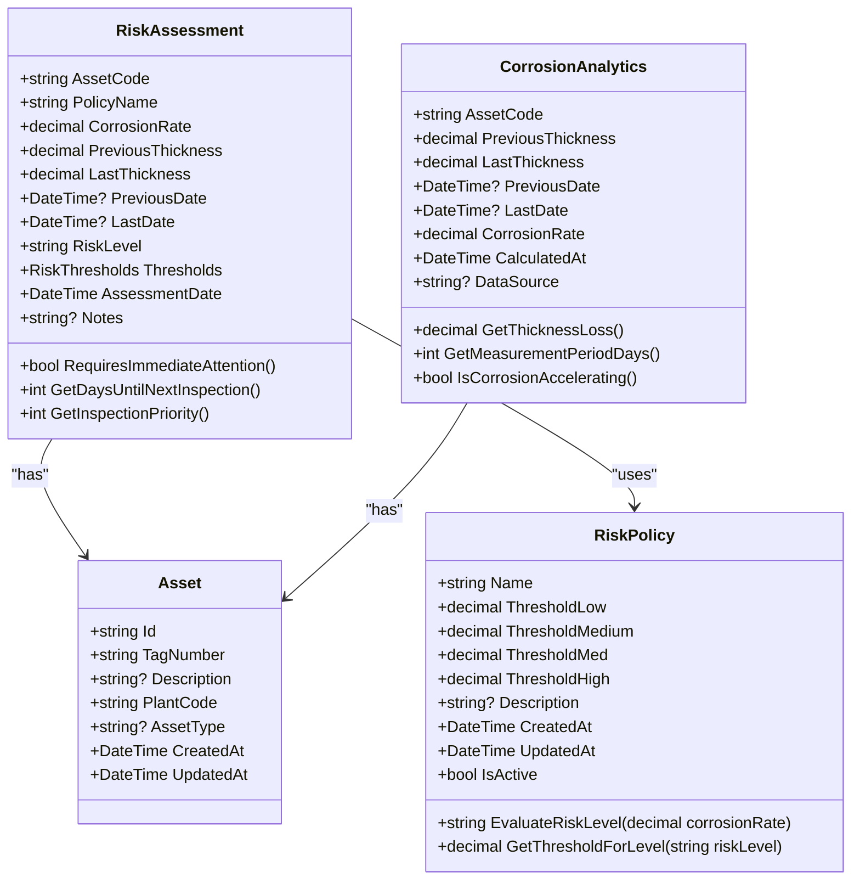
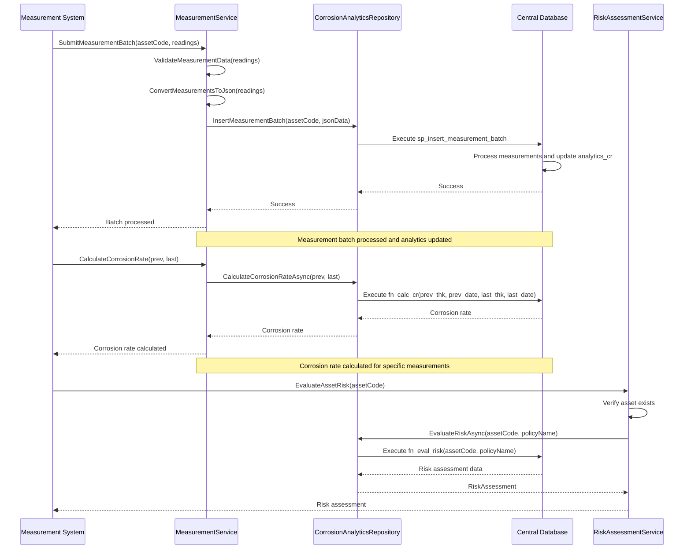
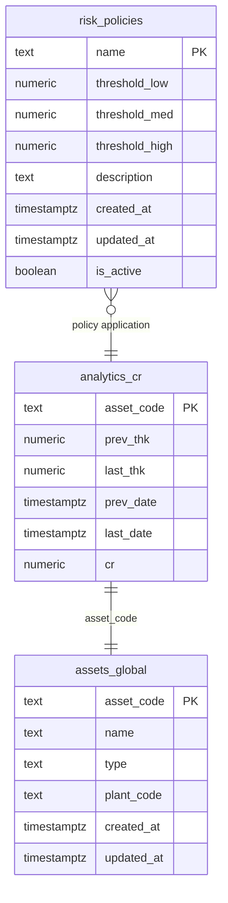
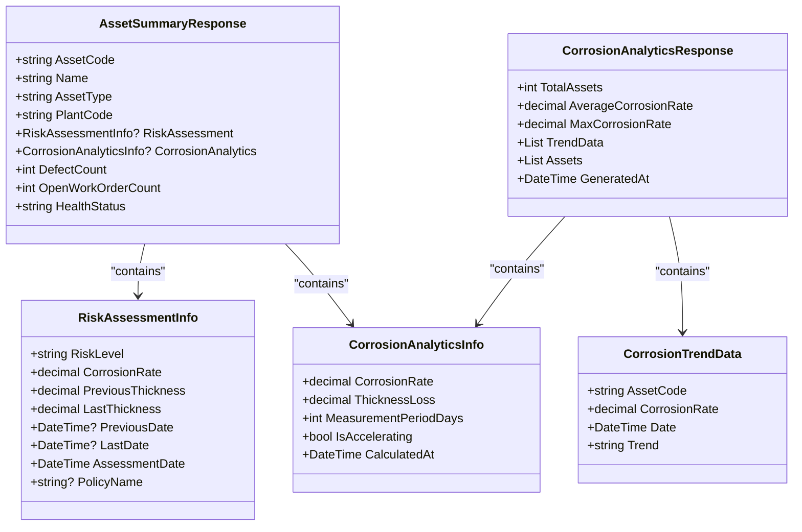

# Analytics Model

<cite>
**Referenced Files in This Document**   
- [Analytics.cs](file://src/OilErp.Domain/Entities/Analytics.cs)
- [Asset.cs](file://src/OilErp.Domain/Entities/Asset.cs)
- [AnalyticsRepositories.cs](file://src/OilErp.Data/Repositories/AnalyticsRepositories.cs)
- [MeasurementAndRiskServices.cs](file://src/OilErp.Domain/Services/MeasurementAndRiskServices.cs)
- [ApiModels.cs](file://src/OilErp.App/Models/ApiModels.cs)
- [01_tables.sql](file://sql/anpz/01_tables.sql)
- [02_functions_core.sql](file://sql/central/02_functions_core.sql)
</cite>

## Table of Contents
1. [Introduction](#introduction)
2. [Core Analytics Entities](#core-analytics-entities)
3. [Risk Assessment Model](#risk-assessment-model)
4. [Corrosion Analytics Model](#corrosion-analytics-model)
5. [Risk Policy Configuration](#risk-policy-configuration)
6. [Data Relationships and Navigation](#data-relationships-and-navigation)
7. [Business Rules for Risk Level Determination](#business-rules-for-risk-level-determination)
8. [Analytics Data Generation Workflow](#analytics-data-generation-workflow)
9. [Database Schema for Analytics](#database-schema-for-analytics)
10. [Performance Considerations](#performance-considerations)
11. [Integration with Reporting Dashboards](#integration-with-reporting-dashboards)
12. [Data Retention Policies](#data-retention-policies)

## Introduction
The Analytics Model in the Oil ERP system provides a comprehensive framework for assessing and monitoring the integrity of pipeline assets through corrosion analytics and risk assessment. This documentation details the data models, business rules, and integration points for analytics entities that support predictive maintenance and risk management decisions. The system leverages measurement data to calculate corrosion rates, determine risk levels, and generate actionable insights for asset management. The analytics framework is built around two primary entities: RiskAssessment and CorrosionAnalytics, which work in conjunction with Asset entities to provide a complete picture of asset health.

## Core Analytics Entities

The analytics system is built around three core entities that work together to provide comprehensive asset health monitoring: RiskAssessment, CorrosionAnalytics, and RiskPolicy. These entities are implemented in the domain layer and persist to the central database through repository patterns. The RiskAssessment entity evaluates the current risk level of an asset based on corrosion rate and policy thresholds, while CorrosionAnalytics calculates and stores corrosion rate metrics derived from thickness measurements. The RiskPolicy entity defines the threshold values that determine risk level classifications. These entities are interconnected through navigation properties and business logic that enable comprehensive risk analysis and reporting.

**Section sources**
- [Analytics.cs](file://src/OilErp.Domain/Entities/Analytics.cs#L7-L204)

## Risk Assessment Model

The RiskAssessment entity represents the risk evaluation of an asset based on its corrosion characteristics and organizational risk policies. It contains key fields that capture the assessment context and results, including the asset code, associated policy name, measured corrosion rate, thickness measurements, calculated risk level, and assessment date. The entity also includes business methods that provide additional insights into the asset's condition and required actions.

### Field Definitions

| Field | Type | Description |
|-------|------|-------------|
| AssetCode | string | Unique identifier of the asset being assessed |
| PolicyName | string | Name of the risk policy used for assessment |
| CorrosionRate | decimal | Calculated corrosion rate in mm/year |
| PreviousThickness | decimal | Previous wall thickness measurement in mm |
| LastThickness | decimal | Latest wall thickness measurement in mm |
| PreviousDate | DateTime? | Date of previous thickness measurement |
| LastDate | DateTime? | Date of latest thickness measurement |
| RiskLevel | string | Risk classification (Low, Medium, High, Critical) |
| Thresholds | RiskThresholds | Container for policy threshold values |
| AssessmentDate | DateTime | Date when risk assessment was performed |
| Notes | string? | Additional comments or observations |

### Business Methods

The RiskAssessment entity includes several business methods that provide actionable insights:

- **RequiresImmediateAttention()**: Determines if the asset requires urgent intervention based on risk level (returns true for High or Critical levels)
- **GetDaysUntilNextInspection()**: Returns the recommended inspection interval in days based on risk level (365 for Low, 180 for Medium, 90 for High, 30 for Critical)
- **GetInspectionPriority()**: Calculates a priority score (1-10) based on risk level and corrosion rate, with higher scores indicating greater urgency

These methods enable automated workflows for inspection scheduling and maintenance prioritization.

**Section sources**
- [Analytics.cs](file://src/OilErp.Domain/Entities/Analytics.cs#L7-L68)

## Corrosion Analytics Model

The CorrosionAnalytics entity captures the calculated corrosion metrics for an asset, providing the foundation for risk assessment. It stores both the raw measurement data and derived analytics that describe the corrosion behavior over time. This entity serves as the primary source of corrosion rate calculations used in risk determination.

### Field Definitions

| Field | Type | Description |
|-------|------|-------------|
| AssetCode | string | Unique identifier of the asset |
| PreviousThickness | decimal | Previous wall thickness measurement in mm |
| LastThickness | decimal | Latest wall thickness measurement in mm |
| PreviousDate | DateTime? | Date of previous measurement |
| LastDate | DateTime? | Date of latest measurement |
| CorrosionRate | decimal | Calculated corrosion rate in mm/year |
| CalculatedAt | DateTime | Timestamp when analytics were computed |
| DataSource | string? | Source system or database for the analytics |

### Business Methods

The CorrosionAnalytics entity includes methods that provide additional corrosion insights:

- **GetThicknessLoss()**: Calculates the total thickness loss between measurements (PreviousThickness - LastThickness)
- **GetMeasurementPeriodDays()**: Returns the number of days between measurement dates, or 0 if dates are missing
- **IsCorrosionAccelerating()**: Determines if corrosion is accelerating based on a threshold (returns true if corrosion rate > 0.3 mm/year)

These methods support trend analysis and early warning detection for rapidly deteriorating assets.

**Section sources**
- [Analytics.cs](file://src/OilErp.Domain/Entities/Analytics.cs#L73-L113)

## Risk Policy Configuration

The RiskPolicy entity defines the organizational standards for risk classification based on corrosion rate thresholds. These policies establish the criteria for determining risk levels and ensure consistent assessment across all assets. The policy configuration enables organizations to tailor risk assessment to their specific operational requirements and safety standards.

### Field Definitions

| Field | Type | Description |
|-------|------|-------------|
| Name | string | Unique name of the risk policy |
| ThresholdLow | decimal | Minimum corrosion rate for Medium risk level |
| ThresholdMedium | decimal | Minimum corrosion rate for High risk level |
| ThresholdHigh | decimal | Minimum corrosion rate for Critical risk level |
| Description | string? | Purpose and scope of the policy |
| CreatedAt | DateTime | Date when policy was created |
| UpdatedAt | DateTime | Date when policy was last modified |
| IsActive | bool | Whether the policy is currently active |

### Business Methods

The RiskPolicy entity includes methods that support risk evaluation:

- **EvaluateRiskLevel(decimal corrosionRate)**: Determines the risk level based on the provided corrosion rate and policy thresholds
- **GetThresholdForLevel(string riskLevel)**: Returns the threshold value for a specific risk level

These methods ensure consistent risk classification across the system and support policy-driven risk management.

**Section sources**
- [Analytics.cs](file://src/OilErp.Domain/Entities/Analytics.cs#L162-L204)

## Data Relationships and Navigation

The analytics entities are connected to the Asset entity through navigation properties, enabling rich data access and relationship traversal. These relationships support comprehensive asset health views and enable efficient data retrieval for reporting and analysis.

**Diagram sources**
- [Analytics.cs](file://src/OilErp.Domain/Entities/Analytics.cs#L7-L204)
- [Asset.cs](file://src/OilErp.Domain/Entities/Asset.cs#L7-L71)

## Business Rules for Risk Level Determination

The risk level determination process follows a hierarchical evaluation based on policy thresholds and historical data trends. The system uses a combination of static thresholds and dynamic factors to provide a comprehensive risk assessment.

### Risk Level Classification

The risk level is determined using the following hierarchy:
1. If corrosion rate ≥ ThresholdHigh: Critical
2. If corrosion rate ≥ ThresholdMedium: High
3. If corrosion rate ≥ ThresholdLow: Medium
4. Otherwise: Low

This classification is implemented in the RiskPolicy.EvaluateRiskLevel() method and is used consistently across the system.

### Dynamic Risk Adjustment

In addition to the base risk level, the system applies dynamic adjustments based on historical trends:
- Corrosion rates > 0.5 mm/year increase inspection priority by 2 points
- Corrosion rates > 1.0 mm/year increase inspection priority by an additional 3 points
- Accelerating corrosion (rate > 0.3 mm/year) triggers enhanced monitoring

These rules ensure that assets with rapidly deteriorating conditions receive appropriate attention regardless of their current risk level.

**Section sources**
- [Analytics.cs](file://src/OilErp.Domain/Entities/Analytics.cs#L184-L204)
- [02_functions_core.sql](file://sql/central/02_functions_core.sql#L183-L219)

## Analytics Data Generation Workflow

The analytics data generation process follows a structured workflow from measurement collection to risk assessment. This workflow ensures data integrity and provides a clear audit trail for all analytics calculations.

**Diagram sources**
- [MeasurementAndRiskServices.cs](file://src/OilErp.Domain/Services/MeasurementAndRiskServices.cs#L12-L102)
- [AnalyticsRepositories.cs](file://src/OilErp.Data/Repositories/AnalyticsRepositories.cs#L10-L131)
- [02_functions_core.sql](file://sql/central/02_functions_core.sql#L183-L219)

## Database Schema for Analytics

The analytics data is stored in the central database with specific tables designed for time-series analysis and trend monitoring. The schema supports efficient querying and reporting on large datasets.

The analytics_cr table stores corrosion rate calculations with the following key features:
- Primary key on asset_code for efficient asset-based queries
- Indexed fields for time-series analysis (prev_date, last_date)
- Computed corrosion rate (cr) for immediate risk assessment
- Previous and current measurements for trend analysis

The risk_policies table defines organizational risk standards with active/inactive status for policy management.

**Diagram sources**
- [01_tables.sql](file://sql/anpz/01_tables.sql#L1-L37)
- [02_functions_core.sql](file://sql/central/02_functions_core.sql#L183-L219)

## Performance Considerations

The analytics system is designed to handle large datasets efficiently, with specific considerations for query performance and indexing strategies.

### Query Optimization

The system employs several performance optimization techniques:
- **Indexed Access**: The analytics_cr table has indexes on asset_code and date fields to support fast lookups
- **Batch Processing**: Measurement batches are processed in bulk to minimize database round-trips
- **Caching Strategy**: Frequently accessed risk policies are cached to reduce database queries
- **Pagination**: Large result sets are paginated to prevent memory issues

### Indexing Strategies

The database schema includes strategic indexes for time-series trend analysis:
- Composite index on (asset_code, last_date) for asset-specific trend queries
- Index on corrosion rate (cr) for risk-level filtering
- Index on assessment date for time-based reporting

These indexes support efficient queries for:
- Top N assets by corrosion rate
- Assets requiring immediate attention
- Historical trend analysis over specific time periods
- Risk distribution across the asset portfolio

**Section sources**
- [01_tables.sql](file://sql/anpz/01_tables.sql#L1-L37)
- [AnalyticsRepositories.cs](file://src/OilErp.Data/Repositories/AnalyticsRepositories.cs#L10-L131)

## Integration with Reporting Dashboards

The analytics data is exposed through API endpoints that support integration with reporting dashboards and visualization tools. The system provides both detailed asset information and aggregated analytics for executive reporting.

### API Response Models

The system uses specialized response models to deliver analytics data to dashboards:

**Diagram sources**
- [ApiModels.cs](file://src/OilErp.App/Models/ApiModels.cs#L57-L85)
- [ApiModels.cs](file://src/OilErp.App/Models/ApiModels.cs#L200-L243)

## Data Retention Policies

The system implements data retention policies to manage storage requirements while preserving historical analytics for trend analysis. These policies balance the need for long-term trend data with operational storage constraints.

### Retention Strategy

The data retention strategy includes:
- **Analytics Data**: Corrosion analytics are retained for 10 years to support long-term trend analysis
- **Measurement Data**: Raw measurements are retained for 7 years
- **Risk Assessments**: Historical risk assessments are retained for 10 years
- **Processed Events**: System events are retained for 2 years

### Archiving Process

The archiving process follows these steps:
1. Data older than retention period is identified
2. Data is compressed and moved to archive storage
3. Archive indexes are updated for retrieval
4. Original records are removed from operational tables

This approach ensures that historical data remains available for compliance and analysis while optimizing operational database performance.

**Section sources**
- [Analytics.cs](file://src/OilErp.Domain/Entities/Analytics.cs#L7-L204)
- [01_tables.sql](file://sql/anpz/01_tables.sql#L1-L37)