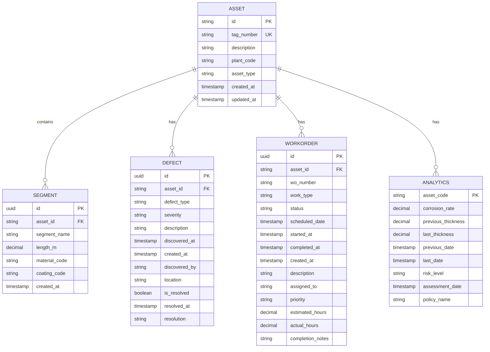

# Asset Model

<cite>
**Referenced Files in This Document**   
- [Asset.cs](file://src/OilErp.Domain/Entities/Asset.cs)
- [AssetRepository.cs](file://src/OilErp.Data/Repositories/AssetRepository.cs)
- [AssetService.cs](file://src/OilErp.Domain/Services/AssetService.cs)
- [AssetValidators.cs](file://src/OilErp.App/Validators/AssetValidators.cs)
- [01_tables.sql](file://sql/central/01_tables.sql)
</cite>

## Table of Contents
1. [Introduction](#introduction)
2. [Field Definitions](#field-definitions)
3. [Business Rules](#business-rules)
4. [Data Validation](#data-validation)
5. [Encapsulated Behaviors](#encapsulated-behaviors)
6. [Database Schema](#database-schema)
7. [Usage Patterns](#usage-patterns)
8. [Performance Considerations](#performance-considerations)
9. [Access Control](#access-control)

## Introduction
The Asset entity represents a physical asset in the oil industry pipeline system within the Oil ERP application. It serves as the central domain object for tracking and managing pipeline assets across multiple plants (ANPZ, KRNPZ). The model incorporates comprehensive business logic for asset management, including relationships with segments, defects, work orders, and analytics data. This documentation provides a detailed overview of the Asset model's structure, behavior, and integration points within the system.

**Section sources**
- [Asset.cs](file://src/OilErp.Domain/Entities/Asset.cs#L5-L71)

## Field Definitions
The Asset entity contains the following fields with their respective data types and constraints:

| Field Name | Data Type | Required | Description |
|------------|---------|--------|-------------|
| Id | string | Yes | Primary key identifier for the asset, serving as the unique asset code |
| TagNumber | string | Yes | Unique tag number for the asset, must be globally unique across the system |
| Description | string | No | Optional descriptive text providing additional information about the asset |
| PlantCode | string | Yes | Code identifying the plant where the asset is located (ANPZ or KRNPZ) |
| AssetType | string | No | Classification of the asset type (Pipeline, Tank, Pump, Vessel, Equipment) |
| CreatedAt | DateTime | Yes | Timestamp when the asset was created, defaults to current UTC time |
| UpdatedAt | DateTime | Yes | Timestamp when the asset was last updated, defaults to current UTC time |

The Id field serves as the primary key and represents the unique asset code used throughout the system. The TagNumber field has a unique constraint to prevent duplicate asset tags across the organization. Both Id and TagNumber are required fields that must be provided when creating a new asset.

**Section sources**
- [Asset.cs](file://src/OilErp.Domain/Entities/Asset.cs#L5-L14)

## Business Rules
The Asset model enforces several business rules for asset creation, description updates, and relationship management:

### Asset Creation
When creating a new asset, the system validates that:
- The TagNumber is unique across all assets in the system
- The PlantCode is valid (either ANPZ or KRNPZ)
- Required fields (Id, TagNumber, PlantCode) are not null or empty

The creation process is handled by the AssetService, which checks for existing assets with the same TagNumber before allowing creation. If a duplicate TagNumber is detected, an InvalidOperationException is thrown with an appropriate error message.

### Description Updates
Asset descriptions can be updated through the UpdateDescription method, which:
- Accepts a new description string as input
- Updates the Description property of the asset
- Automatically updates the UpdatedAt timestamp to the current UTC time

This ensures that any modification to the asset is properly timestamped for audit purposes.

### Relationship Management
The Asset entity maintains relationships with Segments, Defects, and WorkOrders through navigation properties. When adding related entities, the system enforces referential integrity:

#### Segment Management
When adding a Segment to an Asset:
- The segment parameter is validated for null using ArgumentNullException.ThrowIfNull
- The system verifies that the segment's AssetId matches the current asset's Id
- If the validation fails, an InvalidOperationException is thrown
- If valid, the segment is added to the Segments collection

#### Defect Management
When adding a Defect to an Asset:
- The defect parameter is validated for null
- The system verifies that the defect's AssetId matches the current asset's Id
- If valid, the defect is added to the Defects collection

#### Work Order Management
When adding a WorkOrder to an Asset:
- The work order parameter is validated for null
- The system verifies that the work order's AssetId matches the current asset's Id
- If valid, the work order is added to the WorkOrders collection

These relationship management rules ensure data consistency and prevent orphaned records in the system.

**Section sources**
- [Asset.cs](file://src/OilErp.Domain/Entities/Asset.cs#L16-L55)
- [AssetService.cs](file://src/OilErp.Domain/Services/AssetService.cs#L21-L50)

## Data Validation
The system implements comprehensive data validation at multiple levels to ensure data integrity:

### Domain-Level Validation
The Asset entity itself enforces basic validation through required properties and business methods. The UpdateDescription method ensures that description updates are properly timestamped.

### Service-Level Validation
The AssetService class implements additional validation rules:
- Validates that the asset parameter is not null
- Checks for existing assets with the same TagNumber during creation
- Verifies that the PlantCode is not null or whitespace
- When updating an asset, checks if the TagNumber has changed and validates uniqueness

### API-Level Validation
The AssetRequestValidator in the application layer enforces the following rules:
- AssetCode: Required, 1-50 characters, uppercase letters, numbers, underscores, and hyphens only
- Name: Required, 1-200 characters
- AssetType: Required, must be one of: Pipeline, Tank, Pump, Vessel, Equipment
- PlantCode: Required, must be ANPZ or KRNPZ
- Description: Maximum 500 characters
- Location: Maximum 100 characters
- Status: If provided, must be one of: Active, Inactive, Maintenance, Decommissioned

These validation rules are implemented using FluentValidation and are applied to all incoming API requests to ensure data quality at the system boundary.

**Section sources**
- [AssetService.cs](file://src/OilErp.Domain/Services/AssetService.cs#L21-L50)
- [AssetValidators.cs](file://src/OilErp.App/Validators/AssetValidators.cs#L8-L60)

## Encapsulated Behaviors
The Asset entity includes several encapsulated behaviors that provide business functionality:

### HasCriticalDefects()
This method determines whether the asset has any critical defects by checking the Severity property of related defects:
```csharp
public bool HasCriticalDefects()
{
    return Defects.Any(d => d.Severity == "Critical");
}
```
The method returns true if any defect associated with the asset has a Severity value of "Critical", otherwise returns false. This behavior is used to quickly identify high-risk assets that require immediate attention.

### GetTotalLength()
This method calculates the total length of all segments associated with the asset:
```csharp
public decimal GetTotalLength()
{
    return Segments.Sum(s => s.LengthM);
}
```
The method sums the LengthM property of all segments in the Segments collection and returns the total as a decimal value. This provides a convenient way to determine the overall length of a pipeline asset or other segmented assets.

### GetSegmentCount()
This method returns the number of segments associated with the asset:
```csharp
public int GetSegmentCount()
{
    return Segments.Count;
}
```
The method simply returns the count of segments in the Segments collection, providing a quick way to determine how many segments comprise the asset.

These encapsulated behaviors follow the rich domain model pattern, keeping business logic close to the data it operates on and providing a clean API for consumers of the Asset entity.

**Section sources**
- [Asset.cs](file://src/OilErp.Domain/Entities/Asset.cs#L57-L71)

## Database Schema
The Asset entity is mapped to the database schema defined in the central database. The following diagram illustrates the relationships between the Asset entity and related entities:



**Diagram sources**
- [01_tables.sql](file://sql/central/01_tables.sql#L3-L10)
- [Asset.cs](file://src/OilErp.Domain/Entities/Asset.cs#L5-L71)

The database schema shows that the Asset table has a primary key on the id field and a unique constraint on the tag_number field. The Asset entity has one-to-many relationships with Segment, Defect, WorkOrder, and Analytics entities, represented by foreign key constraints from the related tables to the Asset table.

## Usage Patterns
The Asset model is used throughout the application in various services and repositories. The following sections describe common usage patterns:

### Service Layer Usage
The AssetService class provides the primary interface for business operations on assets:

#### Asset Creation
```csharp
public async Task<string> CreateAssetAsync(Asset asset, CancellationToken cancellationToken = default)
{
    // Validation and creation logic
}
```
The CreateAssetAsync method handles the complete asset creation workflow, including validation and persistence.

#### Asset Updates
```csharp
public async Task UpdateAssetAsync(Asset asset, CancellationToken cancellationToken = default)
{
    // Update logic with validation
}
```
The UpdateAssetAsync method manages asset updates, including validation of TagNumber uniqueness when changing the tag.

#### Segment Addition
```csharp
public async Task<Guid> AddSegmentToAssetAsync(string assetId, Segment segment, CancellationToken cancellationToken = default)
{
    // Add segment with validation
}
```
The AddSegmentToAssetAsync method adds a new segment to an existing asset, with validation of material and coating codes.

### Repository Layer Usage
The AssetRepository class implements data access operations using Dapper:

#### Retrieval Operations
- GetByIdAsync: Retrieves an asset by its Id
- GetByAssetCodeAsync: Retrieves an asset by asset code (same as Id)
- GetAssetSummaryAsync: Retrieves asset summary using a database function
- GetAllAsync: Retrieves all assets
- GetByPlantCodeAsync: Retrieves assets filtered by plant code

#### Modification Operations
- CreateAsync: Inserts a new asset into the database
- UpdateAsync: Updates an existing asset
- DeleteAsync: Deletes an asset by Id
- UpsertAssetAsync: Calls a database function to upsert an asset

### API Controller Usage
The AssetsController exposes REST endpoints for asset management:
- GET /api/assets/{assetCode}: Retrieve asset details
- GET /api/assets/{assetCode}/summary: Retrieve asset summary with risk assessment
- POST /api/assets: Create or update an asset
- GET /api/assets/plant/{plantCode}: Retrieve assets by plant code

These usage patterns demonstrate how the Asset model is integrated across the application layers, from database persistence to API exposure.

**Section sources**
- [AssetService.cs](file://src/OilErp.Domain/Services/AssetService.cs#L9-L196)
- [AssetRepository.cs](file://src/OilErp.Data/Repositories/AssetRepository.cs#L8-L214)
- [AssetsController.cs](file://src/OilErp.App/Controllers/AssetsController.cs#L1-L322)

## Performance Considerations
The Asset model implementation includes several performance considerations for handling large asset hierarchies:

### Query Optimization
The AssetRepository uses optimized SQL queries with appropriate indexing:
- The assets_global table has an index on created_at for time-based queries
- The asset_code field is unique and indexed for fast lookups
- Queries use specific field selection rather than SELECT * to reduce data transfer

### Lazy Loading vs. Eager Loading
The current implementation uses basic retrieval methods that only load the core asset data. For scenarios requiring related data, the repository provides specific methods:
- GetWithSegmentsAsync: Loads asset with associated segments
- GetWithDefectsAsync: Loads asset with associated defects
- GetWithWorkOrdersAsync: Loads asset with associated work orders
- GetWithAllRelatedDataAsync: Loads asset with all related data

This approach allows consumers to choose the appropriate loading strategy based on their needs, avoiding unnecessary data retrieval.

### Batch Operations
For operations involving multiple assets, the service layer should implement batch processing capabilities:
- Bulk creation of assets
- Bulk updates of asset properties
- Batch retrieval of assets by plant or type

### Caching Strategy
A caching layer should be considered for frequently accessed asset data:
- Cache asset summaries to reduce database load
- Implement time-based cache invalidation
- Use distributed caching for multi-server deployments

### Pagination
For operations that return multiple assets, pagination should be implemented:
- Limit result sets to prevent memory issues
- Provide offset and limit parameters
- Include total count in responses for UI pagination

These performance considerations help ensure that the Asset model can scale effectively as the number of assets grows within the system.

**Section sources**
- [AssetRepository.cs](file://src/OilErp.Data/Repositories/AssetRepository.cs#L8-L214)

## Access Control
The Asset model incorporates access control mechanisms to protect sensitive asset data:

### Plant-Based Access
Access to assets is restricted by plant code:
- Users can only access assets within their authorized plants
- The PlantCode field determines which users can view or modify an asset
- Cross-plant access requires explicit permissions

### Role-Based Permissions
Different user roles have varying levels of access:
- Viewers: Can read asset data but not modify
- Operators: Can update asset descriptions and add segments
- Administrators: Can create, update, and delete assets
- Auditors: Can view asset history but not modify

### Sensitive Data Protection
Certain asset information may be considered sensitive:
- Financial data related to assets
- Security-related information
- Environmental impact assessments
- Regulatory compliance status

These data elements should be protected with additional access controls and audit logging.

### Audit Logging
All modifications to assets should be logged:
- Track who made changes
- Record what fields were modified
- Capture before and after values
- Store timestamps for all operations

The CreatedAt and UpdatedAt fields provide basic audit trail information, but a comprehensive audit logging system should capture more detailed information about changes to asset data.

**Section sources**
- [Asset.cs](file://src/OilErp.Domain/Entities/Asset.cs#L5-L71)
- [AssetService.cs](file://src/OilErp.Domain/Services/AssetService.cs#L9-L196)