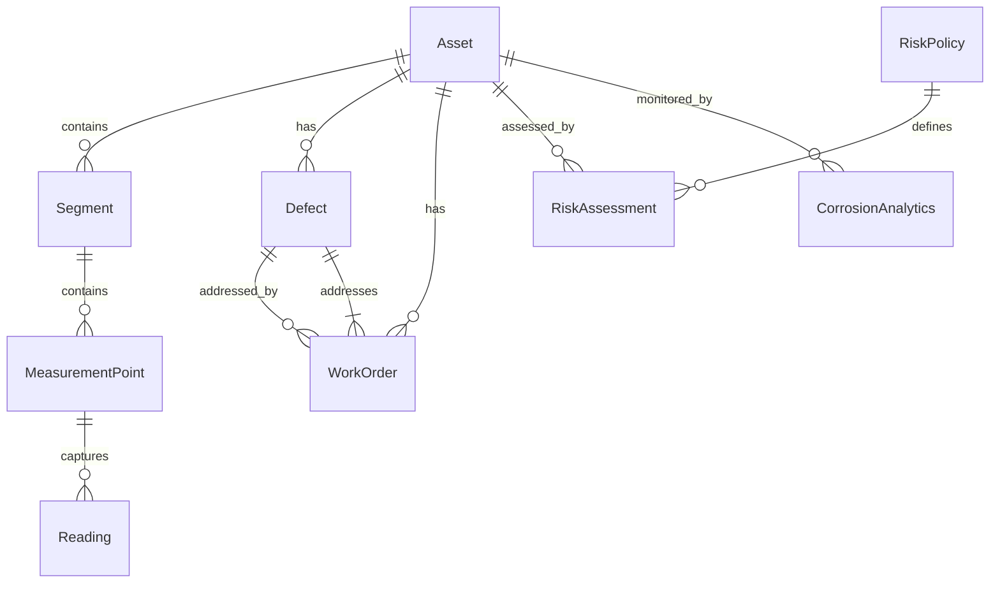

# Data Models & ORM Mapping

<cite>
**Referenced Files in This Document**   
- [Asset.cs](file://src/OilErp.Domain/Entities/Asset.cs)
- [Reading.cs](file://src/OilErp.Domain/Entities/Reading.cs)
- [MeasurementPoint.cs](file://src/OilErp.Domain/Entities/MeasurementPoint.cs)
- [Segment.cs](file://src/OilErp.Domain/Entities/Segment.cs)
- [Defect.cs](file://src/OilErp.Domain/Entities/Defect.cs)
- [WorkOrder.cs](file://src/OilErp.Domain/Entities/WorkOrder.cs)
- [Analytics.cs](file://src/OilErp.Domain/Entities/Analytics.cs)
- [DomainEnums.cs](file://src/OilErp.Domain/Enums/DomainEnums.cs)
- [01_tables.sql](file://sql/central/01_tables.sql)
- [AssetRepository.cs](file://src/OilErp.Data/Repositories/AssetRepository.cs)
- [ReadingRepository.cs](file://src/OilErp.Data/Repositories/ReadingRepository.cs)
- [MeasurementPointRepository.cs](file://src/OilErp.Data/Repositories/MeasurementPointRepository.cs)
- [SegmentRepository.cs](file://src/OilErp.Data/Repositories/SegmentRepository.cs)
- [DefectRepository.cs](file://src/OilErp.Data/Repositories/DefectRepository.cs)
- [WorkOrderRepository.cs](file://src/OilErp.Data/Repositories/WorkOrderRepository.cs)
- [AnalyticsRepositories.cs](file://src/OilErp.Data/Repositories/AnalyticsRepositories.cs)
</cite>

## Table of Contents
1. [Introduction](#introduction)
2. [Core Entity Models](#core-entity-models)
3. [Entity Relationships](#entity-relationships)
4. [Database Schema](#database-schema)
5. [Field Definitions and Data Types](#field-definitions-and-data-types)
6. [Primary and Foreign Keys](#primary-and-foreign-keys)
7. [Indexes and Constraints](#indexes-and-constraints)
8. [Data Validation and Business Rules](#data-validation-and-business-rules)
9. [Data Access Patterns](#data-access-patterns)
10. [Caching Strategies](#caching-strategies)
11. [Performance Considerations](#performance-considerations)
12. [Data Lifecycle and Retention](#data-lifecycle-and-retention)
13. [Data Security and Access Control](#data-security-and-access-control)
14. [Practical Usage Examples](#practical-usage-examples)
15. [Conclusion](#conclusion)

## Introduction

The Oil ERP system manages critical infrastructure data for oil industry assets, including measurements, defects, work orders, and analytics. This document provides comprehensive documentation of the core data models and their ORM mappings, detailing the structure, relationships, and business logic implemented in the system. The models are designed to support asset management, risk assessment, maintenance scheduling, and corrosion analytics for pipeline systems.

The system follows a domain-driven design approach with entities representing physical assets, measurement points, readings, defects, work orders, and analytics data. Each entity contains both data properties and business methods that enforce domain rules and validation. The repository pattern is used for data access, providing a clean separation between domain logic and database operations.

**Section sources**
- [Asset.cs](file://src/OilErp.Domain/Entities/Asset.cs#L5-L71)
- [Reading.cs](file://src/OilErp.Domain/Entities/Reading.cs#L5-L75)
- [MeasurementPoint.cs](file://src/OilErp.Domain/Entities/MeasurementPoint.cs#L5-L74)
- [Segment.cs](file://src/OilErp.Domain/Entities/Segment.cs#L5-L62)
- [Defect.cs](file://src/OilErp.Domain/Entities/Defect.cs#L5-L96)
- [WorkOrder.cs](file://src/OilErp.Domain/Entities/WorkOrder.cs#L5-L132)
- [Analytics.cs](file://src/OilErp.Domain/Entities/Analytics.cs#L7-L202)

## Core Entity Models

The Oil ERP system consists of seven core entities that model the physical and operational aspects of oil industry assets. Each entity is implemented as a C# class with properties representing data fields and methods implementing business logic and validation rules.

### Asset Entity

The Asset entity represents a physical asset in the oil industry pipeline system. It serves as the root entity in the hierarchy, containing identification information, plant association, and relationships to segments, defects, and work orders. The entity includes business methods for updating descriptions and adding related entities, with validation to ensure referential integrity.

### Reading Entity

The Reading entity represents an actual measurement reading taken at a measurement point. It captures the measured value, unit of measurement, timestamp, and metadata about the measurement. The entity includes methods for updating values, adding notes, and validating measurement integrity. It also provides utility methods for checking measurement validity and formatting values.

### MeasurementPoint Entity

The MeasurementPoint entity represents a specific location on a segment where measurements are taken. It includes information about the point's name, position relative to the segment start, and measurement type. The entity contains methods for managing readings, retrieving the latest reading, and calculating averages over time periods.

### Segment Entity

The Segment entity represents a portion of an asset with specific material and coating properties. It defines the length of the segment and links to the parent asset. The entity includes methods for managing measurement points and ensuring they are positioned within valid boundaries of the segment.

### Defect Entity

The Defect entity represents a flaw or issue identified on an asset. It captures the defect type, severity, discovery information, and resolution status. The entity includes methods for resolving defects, reopening them, and assessing their criticality based on severity levels.

### WorkOrder Entity

The WorkOrder entity represents maintenance or repair activities scheduled for an asset. It tracks the work order status, scheduling information, assigned personnel, and completion details. The entity includes workflow methods for starting, completing, and canceling work orders, with validation to ensure proper state transitions.

### Analytics Entity

The Analytics entity encompasses several related classes for risk assessment and corrosion analytics. It includes RiskAssessment for evaluating asset risk levels, CorrosionAnalytics for tracking corrosion rates, SystemEvent for distributed system events, and RiskPolicy for defining risk thresholds. These entities provide methods for calculating risk levels, determining inspection priorities, and evaluating corrosion trends.

**Section sources**
- [Asset.cs](file://src/OilErp.Domain/Entities/Asset.cs#L5-L71)
- [Reading.cs](file://src/OilErp.Domain/Entities/Reading.cs#L5-L75)
- [MeasurementPoint.cs](file://src/OilErp.Domain/Entities/MeasurementPoint.cs#L5-L74)
- [Segment.cs](file://src/OilErp.Domain/Entities/Segment.cs#L5-L62)
- [Defect.cs](file://src/OilErp.Domain/Entities/Defect.cs#L5-L96)
- [WorkOrder.cs](file://src/OilErp.Domain/Entities/WorkOrder.cs#L5-L132)
- [Analytics.cs](file://src/OilErp.Domain/Entities/Analytics.cs#L7-L202)

## Entity Relationships

The core entities in the Oil ERP system are interconnected through a hierarchical relationship structure that reflects the physical and operational organization of oil industry assets. These relationships are implemented using navigation properties in the entity classes and foreign key constraints in the database schema.



**Diagram sources**
- [Asset.cs](file://src/OilErp.Domain/Entities/Asset.cs#L5-L71)
- [Segment.cs](file://src/OilErp.Domain/Entities/Segment.cs#L5-L62)
- [MeasurementPoint.cs](file://src/OilErp.Domain/Entities/MeasurementPoint.cs#L5-L74)
- [Reading.cs](file://src/OilErp.Domain/Entities/Reading.cs#L5-L75)
- [Defect.cs](file://src/OilErp.Domain/Entities/Defect.cs#L5-L96)
- [WorkOrder.cs](file://src/OilErp.Domain/Entities/WorkOrder.cs#L5-L132)
- [Analytics.cs](file://src/OilErp.Domain/Entities/Analytics.cs#L7-L202)

### Asset Relationships

The Asset entity serves as the root of the entity hierarchy, establishing relationships with multiple child entities:
- **Segments**: An asset contains multiple segments, each representing a portion of the asset with specific material and coating properties
- **Defects**: An asset can have multiple defects identified on it, with each defect linked to the asset
- **WorkOrders**: Maintenance activities for an asset are tracked through work orders associated with the asset
- **RiskAssessment**: Risk assessments are performed at the asset level, evaluating the overall risk based on defects and measurements
- **CorrosionAnalytics**: Corrosion monitoring data is collected and analyzed at the asset level

### Segment Relationships

Segments represent subdivisions of an asset and establish the following relationships:
- **Parent Asset**: Each segment belongs to exactly one asset, creating a one-to-many relationship
- **MeasurementPoints**: A segment contains multiple measurement points where readings are taken
- **Material and Coating**: While not explicitly modeled as separate entities in the current implementation, segments reference material and coating codes that would link to catalog entities

### MeasurementPoint Relationships

Measurement points serve as the interface between physical locations and measurement data:
- **Parent Segment**: Each measurement point belongs to exactly one segment, positioned at a specific distance from the segment start
- **Readings**: A measurement point captures multiple readings over time, creating a time-series data relationship
- **Measurement Type**: The point is configured for a specific type of measurement (e.g., wall thickness, pressure, temperature)

### Reading Relationships

Readings represent the actual measurement data collected:
- **MeasurementPoint**: Each reading is associated with exactly one measurement point
- **Temporal Sequence**: Readings are ordered by their measurement timestamp, creating a chronological sequence
- **Operator**: The reading may be associated with the operator who took the measurement

### Defect Relationships

Defects represent identified issues on assets:
- **Parent Asset**: Each defect is associated with exactly one asset
- **WorkOrders**: A defect may be addressed by one or more work orders, creating a relationship between defects and maintenance activities
- **Resolution**: The defect tracks whether it has been resolved and includes resolution details

### WorkOrder Relationships

Work orders represent maintenance activities:
- **Parent Asset**: Each work order is associated with exactly one asset
- **Defect**: A work order may be created to address a specific defect, creating an optional relationship
- **Workflow**: The work order tracks its status through various stages (Scheduled, In Progress, Completed, Cancelled)

### Analytics Relationships

The analytics entities provide risk assessment and monitoring capabilities:
- **RiskPolicy**: Defines the thresholds and rules for risk assessment
- **RiskAssessment**: Evaluates the risk level of an asset based on defects, measurements, and maintenance history
- **CorrosionAnalytics**: Tracks corrosion rates and remaining life predictions for assets
- **SystemEvent**: Represents events in the distributed system for monitoring and processing

**Section sources**
- [Asset.cs](file://src/OilErp.Domain/Entities/Asset.cs#L5-L71)
- [Segment.cs](file://src/OilErp.Domain/Entities/Segment.cs#L5-L62)
- [MeasurementPoint.cs](file://src/OilErp.Domain/Entities/MeasurementPoint.cs#L5-L74)
- [Reading.cs](file://src/OilErp.Domain/Entities/Reading.cs#L5-L75)
- [Defect.cs](file://src/OilErp.Domain/Entities/Defect.cs#L5-L96)
- [WorkOrder.cs](file://src/OilErp.Domain/Entities/WorkOrder.cs#L5-L132)
- [Analytics.cs](file://src/OilErp.Domain/Entities/Analytics.cs#L7-L202)

## Database Schema

The database schema for the Oil ERP system is implemented across multiple SQL scripts that define tables, constraints, and indexes. The central database contains the primary tables for assets, risk policies, analytics, and events, while local databases at different plants contain tables for local assets, measurement points, and measurements.

```mermaid
erDiagram
assets_global ||--o{ analytics_cr : "analyzes"
assets_global ||--o{ risk_policies : "governed_by"
assets_global ||--o{ events_inbox : "generates"
class assets_global {
+id: BIGINT
+asset_code: TEXT
+name: TEXT
+type: TEXT
+plant_code: TEXT
+created_at: TIMESTAMPTZ
}
class analytics_cr {
+id: BIGINT
+asset_code: TEXT
+prev_thk: NUMERIC
+prev_date: TIMESTAMPTZ
+last_thk: NUMERIC
+last_date: TIMESTAMPTZ
+cr: NUMERIC
+updated_at: TIMESTAMPTZ
}
class risk_policies {
+id: BIGINT
+name: TEXT
+threshold_low: NUMERIC
+threshold_med: NUMERIC
+threshold_high: NUMERIC
}
class events_inbox {
+id: BIGINT
+event_type: TEXT
+source_plant: TEXT
+payload_json: JSONB
+created_at: TIMESTAMPTZ
+processed_at: TIMESTAMPTZ
}
```

**Diagram sources**
- [01_tables.sql](file://sql/central/01_tables.sql#L1-L51)

### Central Database Schema

The central database schema is defined in the `sql/central/01_tables.sql` file and includes the following tables:

#### assets_global
The `assets_global` table stores information about assets across all plants. It includes the asset code, name, type, plant code, and creation timestamp. The table has a primary key on the `id` column and a unique constraint on the `asset_code` field to ensure global uniqueness.

#### risk_policies
The `risk_policies` table defines risk assessment policies with threshold values for low, medium, and high risk levels. These policies are used to evaluate the risk level of assets based on corrosion rates and other factors.

#### analytics_cr
The `analytics_cr` table stores corrosion rate analytics data for assets. It includes fields for previous and last thickness measurements, dates, and calculated corrosion rates. The table has a foreign key relationship with `assets_global` through the `asset_code` field, ensuring referential integrity.

#### events_inbox
The `events_inbox` table serves as a message queue for system events from various plants. It stores event type, source plant, payload data in JSON format, and processing status. The table includes an index on the `processed_at` field where it is null, optimizing queries for unprocessed events.

### Local Database Schema

The local database schema is defined in the `sql/anpz/01_tables.sql` and `sql/krnpz/01_tables.sql` files, which are identical in structure. These schemas are deployed at individual plants and include:

#### assets_local
The `assets_local` table stores information about assets at a specific plant, including location and status. This table is used for local asset management before synchronization with the central system.

#### measurement_points
The `measurement_points` table defines the measurement points for assets, with a foreign key relationship to `assets_local`. Each measurement point has a label and is constrained to be unique within an asset.

#### measurements
The `measurements` table stores actual measurement readings with timestamps, thickness values, and optional notes. The table has a foreign key relationship to `measurement_points` and includes a composite index on `point_id` and `ts` for efficient time-based queries.

#### local_events
The `local_events` table stores events generated within the local plant system, similar to the central `events_inbox` but for local processing.

**Section sources**
- [01_tables.sql](file://sql/central/01_tables.sql#L1-L51)
- [01_tables.sql](file://sql/anpz/01_tables.sql#L1-L37)
- [01_tables.sql](file://sql/krnpz/01_tables.sql#L1-L37)

## Field Definitions and Data Types

This section details the field definitions and data types for each core entity in the Oil ERP system. The entities are implemented as C# classes with properties that map to database columns through the ORM.

### Asset Entity Fields

| Field | Data Type | Description | Constraints |
|-------|-----------|-------------|-------------|
| Id | string | Unique identifier for the asset | Required, maps to asset_code in database |
| TagNumber | string | Asset tag number for identification | Required |
| Description | string | Detailed description of the asset | Optional |
| PlantCode | string | Code identifying the plant where the asset is located | Required |
| AssetType | string | Type of asset (e.g., Pipeline, Tank, Pump) | Optional |
| CreatedAt | DateTime | Timestamp when the asset was created | Required, defaults to UTC now |
| UpdatedAt | DateTime | Timestamp when the asset was last updated | Required, defaults to UTC now |

### Reading Entity Fields

| Field | Data Type | Description | Constraints |
|-------|-----------|-------------|-------------|
| Id | Guid | Unique identifier for the reading | Required, defaults to new Guid |
| PointId | Guid | Identifier of the measurement point | Required |
| Value | decimal | Measured value | Required |
| Unit | string | Unit of measurement (e.g., mm, psi) | Required |
| MeasuredAt | DateTime | Timestamp when the measurement was taken | Required |
| OperatorId | string | Identifier of the operator who took the measurement | Optional |
| CreatedAt | DateTime | Timestamp when the reading was created | Required, defaults to UTC now |
| Notes | string | Additional notes about the reading | Optional |
| IsValid | bool | Flag indicating if the reading is valid | Required, defaults to true |

### MeasurementPoint Entity Fields

| Field | Data Type | Description | Constraints |
|-------|-----------|-------------|-------------|
| Id | Guid | Unique identifier for the measurement point | Required, defaults to new Guid |
| SegmentId | Guid | Identifier of the parent segment | Required |
| PointName | string | Name or label for the measurement point | Required |
| DistanceFromStart | decimal | Distance from the start of the segment in meters | Required |
| MeasurementType | string | Type of measurement (e.g., WallThickness, Pressure) | Required |
| CreatedAt | DateTime | Timestamp when the measurement point was created | Required, defaults to UTC now |

### Segment Entity Fields

| Field | Data Type | Description | Constraints |
|-------|-----------|-------------|-------------|
| Id | Guid | Unique identifier for the segment | Required, defaults to new Guid |
| AssetId | string | Identifier of the parent asset | Required |
| SegmentName | string | Name of the segment | Required |
| LengthM | decimal | Length of the segment in meters | Required |
| MaterialCode | string | Code identifying the material of the segment | Optional |
| CoatingCode | string | Code identifying the coating of the segment | Optional |
| CreatedAt | DateTime | Timestamp when the segment was created | Required, defaults to UTC now |

### Defect Entity Fields

| Field | Data Type | Description | Constraints |
|-------|-----------|-------------|-------------|
| Id | Guid | Unique identifier for the defect | Required, defaults to new Guid |
| AssetId | string | Identifier of the asset with the defect | Required |
| DefectType | string | Type of defect (e.g., Corrosion, Crack) | Required |
| Severity | string | Severity level of the defect | Required |
| Description | string | Detailed description of the defect | Optional |
| DiscoveredAt | DateTime | Timestamp when the defect was discovered | Required |
| CreatedAt | DateTime | Timestamp when the defect record was created | Required, defaults to UTC now |
| DiscoveredBy | string | Identifier of the person who discovered the defect | Optional |
| Location | string | Location of the defect on the asset | Optional |
| IsResolved | bool | Flag indicating if the defect has been resolved | Required, defaults to false |
| ResolvedAt | DateTime | Timestamp when the defect was resolved | Optional |
| Resolution | string | Description of how the defect was resolved | Optional |

### WorkOrder Entity Fields

| Field | Data Type | Description | Constraints |
|-------|-----------|-------------|-------------|
| Id | Guid | Unique identifier for the work order | Required, defaults to new Guid |
| AssetId | string | Identifier of the asset for maintenance | Required |
| WoNumber | string | Work order number for identification | Required |
| WorkType | string | Type of work (e.g., Inspection, Preventive) | Required |
| Status | string | Current status of the work order | Required |
| ScheduledDate | DateTime | Date when the work is scheduled | Required |
| StartedAt | DateTime | Timestamp when work started | Optional |
| CompletedAt | DateTime | Timestamp when work was completed | Optional |
| CreatedAt | DateTime | Timestamp when the work order was created | Required, defaults to UTC now |
| Description | string | Description of the work to be performed | Optional |
| AssignedTo | string | Identifier of the person assigned to the work | Optional |
| Priority | string | Priority level of the work order | Optional |
| EstimatedHours | decimal | Estimated hours to complete the work | Optional |
| ActualHours | decimal | Actual hours taken to complete the work | Optional |
| CompletionNotes | string | Notes about work completion | Optional |
| DefectId | Guid | Identifier of the defect being addressed | Optional |

### Analytics Entity Fields

The Analytics entity contains several related classes with the following fields:

#### RiskAssessment
| Field | Data Type | Description | Constraints |
|-------|-----------|-------------|-------------|
| AssetCode | string | Code of the asset being assessed | Required |
| PolicyName | string | Name of the risk policy used | Required |
| CorrosionRate | decimal | Calculated corrosion rate | Required |
| PreviousThickness | decimal | Previous wall thickness measurement | Required |
| LastThickness | decimal | Latest wall thickness measurement | Required |
| PreviousDate | DateTime | Date of previous measurement | Optional |
| LastDate | DateTime | Date of latest measurement | Optional |
| RiskLevel | string | Assessed risk level (Low, Medium, High, Critical) | Required |
| Thresholds | RiskThresholds | Threshold values for risk levels | Required, defaults to new instance |
| AssessmentDate | DateTime | Date of risk assessment | Required, defaults to UTC now |
| Notes | string | Additional notes about the assessment | Optional |

#### CorrosionAnalytics
| Field | Data Type | Description | Constraints |
|-------|-----------|-------------|-------------|
| AssetCode | string | Code of the asset being monitored | Required |
| PreviousThickness | decimal | Previous wall thickness measurement | Required |
| LastThickness | decimal | Latest wall thickness measurement | Required |
| PreviousDate | DateTime | Date of previous measurement | Optional |
| LastDate | DateTime | Date of latest measurement | Optional |
| CorrosionRate | decimal | Calculated corrosion rate | Required |
| CalculatedAt | DateTime | Timestamp when analytics were calculated | Required, defaults to UTC now |
| DataSource | string | Source of the data | Optional |

#### RiskPolicy
| Field | Data Type | Description | Constraints |
|-------|-----------|-------------|-------------|
| Name | string | Name of the risk policy | Required, unique |
| ThresholdLow | decimal | Threshold for low risk level | Required |
| ThresholdMedium | decimal | Threshold for medium risk level | Required |
| ThresholdHigh | decimal | Threshold for high risk level | Required |
| Description | string | Description of the policy | Optional |
| CreatedAt | DateTime | Timestamp when policy was created | Required, defaults to UTC now |
| UpdatedAt | DateTime | Timestamp when policy was last updated | Required, defaults to UTC now |
| IsActive | bool | Flag indicating if policy is active | Required, defaults to true |

**Section sources**
- [Asset.cs](file://src/OilErp.Domain/Entities/Asset.cs#L5-L71)
- [Reading.cs](file://src/OilErp.Domain/Entities/Reading.cs#L5-L75)
- [MeasurementPoint.cs](file://src/OilErp.Domain/Entities/MeasurementPoint.cs#L5-L74)
- [Segment.cs](file://src/OilErp.Domain/Entities/Segment.cs#L5-L62)
- [Defect.cs](file://src/OilErp.Domain/Entities/Defect.cs#L5-L96)
- [WorkOrder.cs](file://src/OilErp.Domain/Entities/WorkOrder.cs#L5-L132)
- [Analytics.cs](file://src/OilErp.Domain/Entities/Analytics.cs#L7-L202)

## Primary and Foreign Keys

The entity relationships in the Oil ERP system are enforced through primary