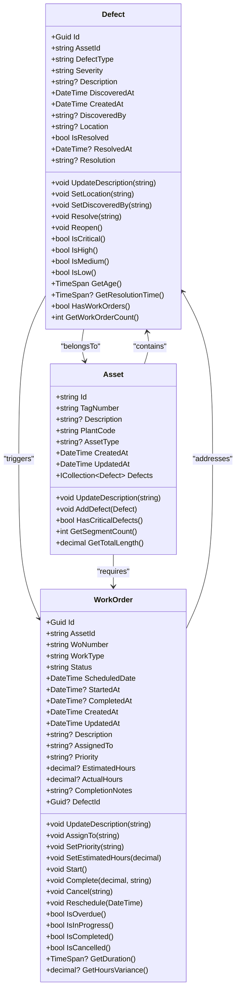
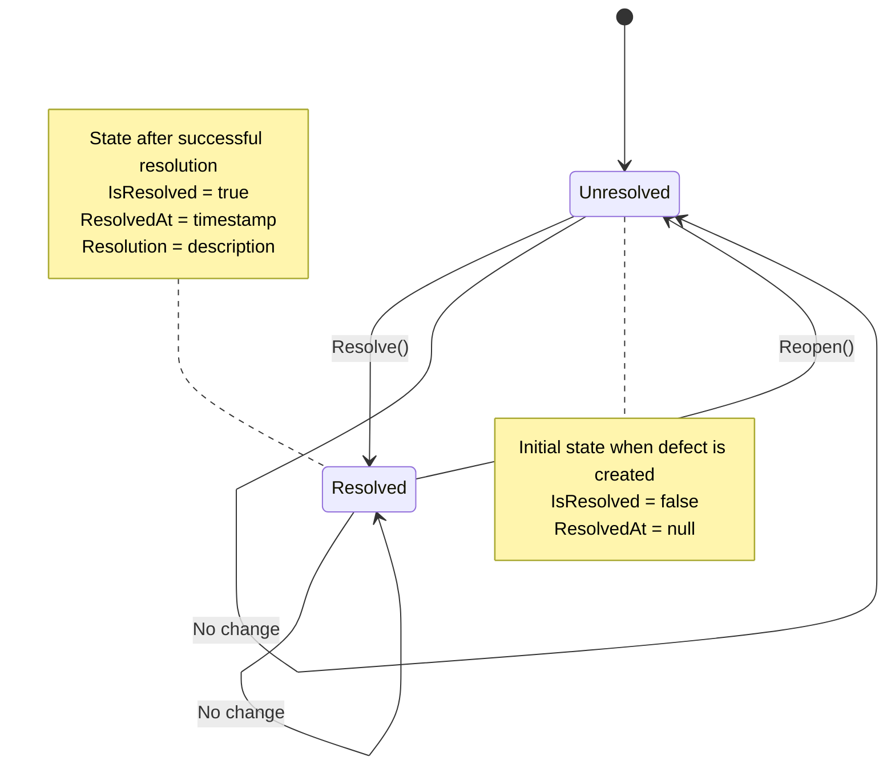
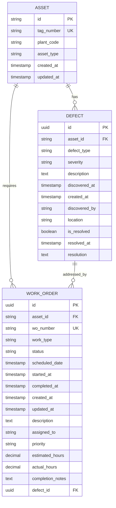

# Defect Model

<cite>
**Referenced Files in This Document**  
- [Defect.cs](file://src/OilErp.Domain/Entities/Defect.cs)
- [Asset.cs](file://src/OilErp.Domain/Entities/Asset.cs)
- [WorkOrder.cs](file://src/OilErp.Domain/Entities/WorkOrder.cs)
- [DefectRepository.cs](file://src/OilErp.Data/Repositories/DefectRepository.cs)
- [DomainEnums.cs](file://src/OilErp.Domain/Enums/DomainEnums.cs)
- [AnalyticsAndCommonModels.cs](file://src/OilErp.App/Models/AnalyticsAndCommonModels.cs)
</cite>

## Table of Contents
1. [Introduction](#introduction)
2. [Core Data Structure](#core-data-structure)
3. [Field Definitions](#field-definitions)
4. [Primary and Foreign Keys](#primary-and-foreign-keys)
5. [Data Validation and Constraints](#data-validation-and-constraints)
6. [Business Methods](#business-methods)
7. [State Transitions and Lifecycle](#state-transitions-and-lifecycle)
8. [Entity Relationships](#entity-relationships)
9. [Practical Usage Examples](#practical-usage-examples)
10. [Performance Considerations](#performance-considerations)
11. [Integration Points](#integration-points)
12. [Conclusion](#conclusion)

## Introduction

The Defect entity in the Oil ERP system represents a critical component for tracking and managing quality issues, safety concerns, and maintenance requirements across physical assets in oil industry operations. This comprehensive documentation details the data model, business logic, and integration points for the Defect entity, which serves as a central component in the asset integrity management system. The model captures essential information about defects discovered during inspections, their severity, resolution status, and relationship to maintenance activities through work orders. This documentation provides a complete reference for developers, system architects, and business analysts working with the defect management functionality.

**Section sources**
- [Defect.cs](file://src/OilErp.Domain/Entities/Defect.cs#L5-L96)

## Core Data Structure

The Defect entity is implemented as a C# class with properties that capture all essential information about a defect discovered on an asset. The model follows domain-driven design principles and includes both data properties and business methods that encapsulate the behavior associated with defect management. The structure is designed to support comprehensive tracking of defects from discovery through resolution, including temporal aspects, severity classification, and relationships to other entities in the system.

**Diagram sources**
- [Defect.cs](file://src/OilErp.Domain/Entities/Defect.cs#L5-L96)
- [Asset.cs](file://src/OilErp.Domain/Entities/Asset.cs#L5-L71)
- [WorkOrder.cs](file://src/OilErp.Domain/Entities/WorkOrder.cs#L5-L133)

**Section sources**
- [Defect.cs](file://src/OilErp.Domain/Entities/Defect.cs#L5-L96)

## Field Definitions

The Defect entity contains a comprehensive set of fields that capture all relevant information about a defect. Each field serves a specific purpose in the defect management lifecycle and contributes to the overall integrity of the data model.

| Field Name | Type | Required | Description | Default Value |
|------------|------|----------|-------------|---------------|
| Id | Guid | Yes | Unique identifier for the defect | Generated on creation |
| AssetId | string | Yes | Identifier of the asset where the defect was discovered | None |
| DefectType | string | Yes | Classification of the defect (e.g., corrosion, crack, leak) | None |
| Severity | string | Yes | Criticality level of the defect | None |
| Description | string | Yes | Detailed description of the defect | None |
| DiscoveredAt | DateTime | Yes | Timestamp when the defect was discovered | None |
| CreatedAt | DateTime | Yes | Timestamp when the defect record was created | Current UTC time |
| DiscoveredBy | string | No | Identifier of the person who discovered the defect | None |
| Location | string | No | Specific location on the asset where the defect was found | None |
| IsResolved | bool | Yes | Flag indicating whether the defect has been resolved | False |
| ResolvedAt | DateTime | No | Timestamp when the defect was resolved | None |
| Resolution | string | No | Description of how the defect was resolved | None |

**Section sources**
- [Defect.cs](file://src/OilErp.Domain/Entities/Defect.cs#L5-L96)
- [AnalyticsAndCommonModels.cs](file://src/OilErp.App/Models/AnalyticsAndCommonModels.cs#L130-L165)

## Primary and Foreign Keys

The Defect entity implements a robust key structure that ensures data integrity and enables efficient querying across related entities.

### Primary Key
The Defect entity uses a **Id** field of type Guid as its primary key. This universally unique identifier ensures that each defect record can be uniquely identified across the system, even in distributed environments. The Id is automatically generated when a new defect is created, ensuring that every defect has a unique identifier from the moment of creation.

### Foreign Keys
The Defect entity maintains relationships with other entities through foreign key references:

- **AssetId**: This string field serves as a foreign key that references the Id field of the Asset entity. It establishes the relationship between a defect and the specific asset on which it was discovered. This relationship is critical for asset integrity management, allowing users to view all defects associated with a particular asset.

- **DefectId**: In the WorkOrder entity, there is a nullable Guid field called DefectId that serves as a foreign key back to the Defect entity. This creates a bidirectional relationship where a work order can be created specifically to address a particular defect, enabling traceability from defect discovery to resolution.

The foreign key relationships are enforced at both the application and database levels, ensuring referential integrity throughout the system.

**Section sources**
- [Defect.cs](file://src/OilErp.Domain/Entities/Defect.cs#L5-L96)
- [WorkOrder.cs](file://src/OilErp.Domain/Entities/WorkOrder.cs#L5-L133)
- [DefectRepository.cs](file://src/OilErp.Data/Repositories/DefectRepository.cs#L64-L98)

## Data Validation and Constraints

The Defect entity implements comprehensive data validation rules to ensure data quality and business rule compliance. These validations are enforced at multiple levels within the application architecture.

### Severity Validation
The Severity field must conform to one of the predefined values that represent the criticality of the defect. The valid severity levels are:
- Critical
- High
- Medium
- Low

This constraint ensures consistency in how defects are classified across the system and enables reliable reporting and analytics based on severity levels. The validation is enforced both at the application level through business logic and at the database level through constraints.

### Required Fields
Several fields are marked as required to ensure that essential information is always captured when a defect is recorded:
- AssetId: Every defect must be associated with a valid asset
- DefectType: The type of defect must be specified
- Severity: The severity level must be provided
- Description: A detailed description is required
- DiscoveredAt: The discovery timestamp must be recorded

### Business Constraints
Additional business rules are enforced to maintain data integrity:
- The DiscoveredAt timestamp cannot be in the future
- The ResolvedAt timestamp, when present, must be after or equal to the DiscoveredAt timestamp
- The Resolution field cannot be empty when IsResolved is true
- A defect cannot be resolved without providing a resolution description

These constraints are implemented through validation attributes in the API models and through business logic in the domain entities.

**Section sources**
- [Defect.cs](file://src/OilErp.Domain/Entities/Defect.cs#L5-L96)
- [DomainEnums.cs](file://src/OilErp.Domain/Enums/DomainEnums.cs#L25-L28)
- [AnalyticsAndCommonModels.cs](file://src/OilErp.App/Models/AnalyticsAndCommonModels.cs#L130-L165)

## Business Methods

The Defect entity includes several business methods that encapsulate the core functionality related to defect management. These methods provide a clean API for interacting with defect records while ensuring that business rules are consistently enforced.

### Resolve Method
The `Resolve(string resolution)` method marks a defect as resolved and records the resolution details. This method:
- Validates that the resolution description is not null or whitespace
- Sets the IsResolved flag to true
- Records the current timestamp in the ResolvedAt field
- Stores the resolution description

This method ensures that a defect cannot be marked as resolved without providing an explanation of how it was addressed.

### Reopen Method
The `Reopen()` method allows a previously resolved defect to be reopened if the issue persists or reoccurs. This method:
- Sets the IsResolved flag back to false
- Clears the ResolvedAt timestamp
- Removes the resolution description

This functionality supports scenarios where a repair was ineffective or a new inspection reveals that the defect still exists.

### IsCritical Method
The `IsCritical()` method evaluates whether the defect has a severity level of "Critical". This boolean method:
- Performs a case-insensitive comparison with the Severity field
- Returns true if the severity is "Critical", false otherwise
- Provides a convenient way to filter or identify the most urgent defects

This method is used extensively in risk assessment calculations and prioritization algorithms.

### Additional Business Methods
The Defect entity also includes several other useful business methods:
- `GetAge()`: Calculates how long the defect has existed by comparing the current time with the DiscoveredAt timestamp
- `GetResolutionTime()`: Calculates the duration between defect discovery and resolution (if resolved)
- `HasWorkOrders()`: Checks if any work orders have been created to address this defect
- `GetWorkOrderCount()`: Returns the number of work orders associated with this defect

These methods provide valuable insights into defect metrics and support various reporting and analytics requirements.

**Section sources**
- [Defect.cs](file://src/OilErp.Domain/Entities/Defect.cs#L41-L96)

## State Transitions and Lifecycle

The Defect entity follows a well-defined lifecycle that tracks the status of a defect from discovery to resolution and potential reopening. This state management is crucial for maintaining accurate records and supporting workflow automation.

### Lifecycle States
A defect can exist in one of two primary states:
- **Unresolved**: The defect has been discovered but not yet addressed
- **Resolved**: The defect has been fixed and verified

The transition between these states is controlled by the Resolve and Reopen methods, ensuring that state changes follow business rules.

### State Transition Diagram

**Diagram sources**
- [Defect.cs](file://src/OilErp.Domain/Entities/Defect.cs#L41-L55)

### Lifecycle Management
The lifecycle is managed through several mechanisms:
- **Creation**: When a new defect is created, it starts in the Unresolved state with IsResolved set to false
- **Resolution**: When the Resolve method is called, additional validation ensures that a resolution description is provided before transitioning to the Resolved state
- **Reopening**: If a defect needs to be reopened, the Reopen method clears the resolution information and returns the defect to the Unresolved state
- **Persistence**: The state is persisted in the database, allowing the system to maintain the defect's status across sessions and system restarts

This lifecycle management ensures that the system maintains an accurate history of defect status changes and supports audit requirements.

**Section sources**
- [Defect.cs](file://src/OilErp.Domain/Entities/Defect.cs#L41-L55)

## Entity Relationships

The Defect entity is integrated into the broader data model through well-defined relationships with other key entities in the Oil ERP system. These relationships enable comprehensive asset management and support end-to-end traceability from defect discovery to resolution.

### Relationship with Asset
The Defect entity has a many-to-one relationship with the Asset entity:
- Each defect belongs to exactly one asset (via the AssetId foreign key)
- Each asset can have multiple defects (via the Defects navigation property in the Asset class)

This relationship allows users to:
- View all defects associated with a specific asset
- Calculate risk scores based on the number and severity of defects on an asset
- Generate maintenance plans based on defect patterns

### Relationship with WorkOrder
The Defect entity has a one-to-many relationship with the WorkOrder entity:
- Each defect can be addressed by zero or more work orders
- Each work order can be created to address zero or one specific defect

This bidirectional relationship enables:
- Traceability from defect to resolution activities
- Verification that all defects have appropriate corrective actions
- Reporting on the effectiveness of maintenance activities

### Data Model Diagram

**Diagram sources**
- [Defect.cs](file://src/OilErp.Domain/Entities/Defect.cs#L5-L96)
- [Asset.cs](file://src/OilErp.Domain/Entities/Asset.cs#L5-L71)
- [WorkOrder.cs](file://src/OilErp.Domain/Entities/WorkOrder.cs#L5-L133)

**Section sources**
- [Defect.cs](file://src/OilErp.Domain/Entities/Defect.cs#L5-L96)
- [Asset.cs](file://src/OilErp.Domain/Entities/Asset.cs#L5-L71)
- [WorkOrder.cs](file://src/OilErp.Domain/Entities/WorkOrder.cs#L5-L133)

## Practical Usage Examples

The Defect entity is used in various practical scenarios throughout the Oil ERP system, supporting critical business processes related to asset integrity management.

### Defect Discovery During Inspections
When field technicians perform inspections, they use mobile applications to record defects directly into the system. For example:
1. An inspector discovers corrosion on a pipeline segment
2. They create a new defect record with:
   - AssetId: "PIPE-001"
   - DefectType: "External Corrosion"
   - Severity: "High"
   - Description: "Visible rust and pitting on external surface"
   - DiscoveredAt: Current timestamp
   - DiscoveredBy: Inspector's employee ID
3. The system automatically generates a unique Id and sets CreatedAt to the current time

### Linking to Maintenance Activities
Once a defect is recorded, it can be linked to maintenance activities:
1. A maintenance planner reviews the new defect
2. They create a work order specifically to address this defect
3. The work order references the defect's Id in its DefectId field
4. The work order is assigned to a maintenance crew with instructions to repair the corrosion
5. When the work is completed, the crew marks the defect as resolved with details of the repair

### Risk Scoring and Analytics
The Defect entity supports advanced analytics for risk assessment:
- The system aggregates all unresolved defects by asset and severity
- It calculates risk scores based on the number and severity of defects
- Assets with critical or high-severity defects are prioritized for inspection and maintenance
- Trend analysis identifies patterns in defect types across different asset classes or locations

These practical examples demonstrate how the Defect entity serves as a cornerstone for proactive maintenance and risk management in the oil industry.

**Section sources**
- [Defect.cs](file://src/OilErp.Domain/Entities/Defect.cs#L5-L96)
- [WorkOrder.cs](file://src/OilErp.Domain/Entities/WorkOrder.cs#L5-L133)
- [DefectRepository.cs](file://src/OilErp.Data/Repositories/DefectRepository.cs#L267-L296)

## Performance Considerations

The Defect entity is designed with performance in mind, supporting efficient querying and reporting capabilities for large datasets.

### Querying Active Defects
The system provides optimized queries for retrieving active (unresolved) defects:
- Indexes on the IsResolved and Severity fields enable fast filtering
- The GetUnresolvedAsync method in DefectRepository returns defects sorted by severity and discovery time
- Critical and high-severity defects are prioritized in the results for immediate attention

### Aggregating Defect Statistics
For risk scoring and reporting, the system uses efficient aggregation queries:
- The GetDefectCountsBySeverityAsync method returns counts of unresolved defects by severity level
- The GetDefectTrendsAsync method provides time-series data for trend analysis
- These aggregations are optimized to minimize database load while providing timely insights

### Indexing Strategy
The database implementation includes strategic indexes to support common query patterns:
- Primary key index on Id for fast lookups
- Foreign key index on AssetId for asset-specific queries
- Index on IsResolved for filtering active defects
- Composite index on Severity and DiscoveredAt for prioritized sorting

These performance optimizations ensure that the system can handle large volumes of defect data while maintaining responsive user interfaces and timely reporting.

**Section sources**
- [DefectRepository.cs](file://src/OilErp.Data/Repositories/DefectRepository.cs#L211-L236)
- [DefectRepository.cs](file://src/OilErp.Data/Repositories/DefectRepository.cs#L295-L321)

## Integration Points

The Defect entity integrates with multiple components of the Oil ERP system, serving as a bridge between inspection data, maintenance activities, and business analytics.

### Work Order Management Integration
The most critical integration is with the work order management system:
- Defects can trigger the creation of corrective work orders
- Work orders reference defects to establish traceability
- Resolving a defect often requires completion of associated work orders
- The system prevents deletion of defects that have associated work orders

### Analytics and Reporting Integration
The Defect entity feeds into various analytics and reporting systems:
- Risk assessment calculations use defect severity and count
- Maintenance planning considers the backlog of unresolved defects
- Performance metrics track defect resolution times and recurrence rates
- Executive dashboards display defect trends and key performance indicators

### API Integration
The Defect entity is exposed through REST APIs for integration with external systems:
- Mobile inspection applications create new defects
- Third-party analytics platforms retrieve defect data
- Enterprise resource planning systems synchronize defect information
- Notification systems trigger alerts based on defect severity

These integration points ensure that defect information flows seamlessly across the organization, supporting coordinated responses to asset integrity issues.

**Section sources**
- [DefectRepository.cs](file://src/OilErp.Data/Repositories/DefectRepository.cs#L143-L173)
- [WorkOrder.cs](file://src/OilErp.Domain/Entities/WorkOrder.cs#L5-L133)
- [AnalyticsAndCommonModels.cs](file://src/OilErp.App/Models/AnalyticsAndCommonModels.cs#L130-L165)

## Conclusion

The Defect entity in the Oil ERP system provides a comprehensive and robust model for managing asset integrity issues. Its well-designed data structure, comprehensive business logic, and strategic relationships with other entities make it a cornerstone of the maintenance and risk management processes. The entity supports the complete lifecycle of defect management from discovery through resolution, with features that ensure data quality, enforce business rules, and enable efficient querying. Through its integrations with work order management and analytics systems, the Defect entity helps organizations proactively address potential failures, optimize maintenance activities, and ensure the safety and reliability of their assets. The performance optimizations and extensible design ensure that the model can scale to meet the needs of large industrial operations while maintaining responsiveness and reliability.