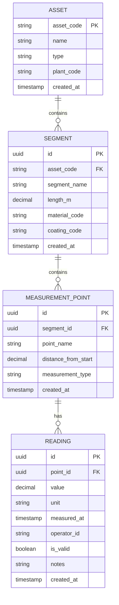

# Measurement Point Model

<cite>
**Referenced Files in This Document**   
- [MeasurementPoint.cs](file://src/OilErp.Domain/Entities/MeasurementPoint.cs)
- [Segment.cs](file://src/OilErp.Domain/Entities/Segment.cs)
- [Reading.cs](file://src/OilErp.Domain/Entities/Reading.cs)
- [MeasurementPointRepository.cs](file://src/OilErp.Data/Repositories/MeasurementPointRepository.cs)
- [AssetValidators.cs](file://src/OilErp.App/Validators/AssetValidators.cs)
- [01_tables.sql](file://sql/anpz/01_tables.sql)
</cite>

## Table of Contents
1. [Introduction](#introduction)
2. [Field Definitions](#field-definitions)
3. [Constraints and Validation Rules](#constraints-and-validation-rules)
4. [Business Methods](#business-methods)
5. [Data Model Relationships](#data-model-relationships)
6. [Practical Configuration and Usage](#practical-configuration-and-usage)
7. [Performance Considerations](#performance-considerations)
8. [Use Cases in Risk Assessment and Corrosion Analytics](#use-cases-in-risk-assessment-and-corrosion-analytics)
9. [Conclusion](#conclusion)

## Introduction
The MeasurementPoint entity is a core component of the Oil ERP system, representing specific locations on pipeline segments where critical measurements such as wall thickness are collected. This model enables precise tracking of asset integrity over time by associating readings with exact physical positions. The entity supports multiple measurement types and integrates with segments and assets to provide contextual data for corrosion monitoring, risk assessment, and maintenance planning. Its design emphasizes data integrity through validation rules, encapsulated business logic, and relational constraints.

**Section sources**
- [MeasurementPoint.cs](file://src/OilErp.Domain/Entities/MeasurementPoint.cs#L5-L82)

## Field Definitions
The MeasurementPoint entity contains the following key fields:

- **Id**: Unique identifier (GUID) for the measurement point, automatically generated upon creation.
- **SegmentId**: Required foreign key (GUID) linking the measurement point to its parent Segment entity.
- **PointName**: Required string field that defines the human-readable name of the point; also accessible via the `Label` alias for compatibility.
- **DistanceFromStart**: Decimal value indicating the position of the point along the segment in meters from the starting end.
- **MeasurementType**: Required string specifying the type of measurement (e.g., "ultrasonic_thickness", "corrosion_rate").
- **CreatedAt**: Timestamp (UTC) recording when the measurement point was created.

Navigation properties include a reference to the parent Segment and a collection of associated Reading entities.

**Section sources**
- [MeasurementPoint.cs](file://src/OilErp.Domain/Entities/MeasurementPoint.cs#L5-L24)

## Constraints and Validation Rules
The system enforces several constraints to ensure data accuracy and consistency:

- **Primary Key Constraint**: `Id` serves as the primary key, ensuring uniqueness across all measurement points.
- **Foreign Key Constraint**: `SegmentId` must reference a valid Segment; attempts to create a point with a non-existent segment ID will fail.
- **Position Constraint**: `DistanceFromStart` must not exceed the length of the associated segment. This is validated both in the domain layer (`Segment.AddMeasurementPoint`) and repository layer (`MeasurementPointRepository.CreateAsync`).
- **Negative Distance Prevention**: The `UpdatePosition` method throws an exception if a negative distance is provided.
- **Non-null and Format Validation**: `PointName` and `MeasurementType` are required fields and cannot be null or whitespace.
- **Batch Validation Limits**: Up to 1,000 measurement points can be submitted in a single batch, with individual labels limited to 50 characters and notes to 100 characters.

These rules are enforced through domain logic, repository checks, and API-level validation using FluentValidation.

**Section sources**
- [Segment.cs](file://src/OilErp.Domain/Entities/Segment.cs#L40-L51)
- [MeasurementPointRepository.cs](file://src/OilErp.Data/Repositories/MeasurementPointRepository.cs#L58-L93)
- [AssetValidators.cs](file://src/OilErp.App/Validators/AssetValidators.cs#L62-L134)

## Business Methods
The MeasurementPoint class provides several encapsulated methods to manage its state and interact with readings:

- **AddReading(Reading)**: Adds a new reading to the point's collection after validating that the reading belongs to this point.
- **GetLatestReading()**: Returns the most recent reading based on the `MeasuredAt` timestamp.
- **GetReadingsInDateRange(DateTime, DateTime)**: Retrieves all readings within a specified date range, ordered by recency.
- **GetAverageReading(DateTime?, DateTime?)**: Calculates the average value of readings within an optional date range; returns null if no readings exist.
- **GetAverageReading()**: Overloaded method returning a decimal (defaulting to 0m) for test compatibility.
- **GetReadingCount()**: Returns the total number of readings associated with the point.
- **UpdatePosition(decimal)**: Safely updates the `DistanceFromStart` value, ensuring it is non-negative.
- **SetMeasurementType(string)**: Updates the measurement type after validating that the input is not null or whitespace.

These methods encapsulate business logic, preventing invalid state transitions and promoting consistent data handling.

**Section sources**
- [MeasurementPoint.cs](file://src/OilErp.Domain/Entities/MeasurementPoint.cs#L35-L76)

## Data Model Relationships
The MeasurementPoint entity is part of a hierarchical data model that connects assets, segments, and readings.

**Diagram sources**
- [MeasurementPoint.cs](file://src/OilErp.Domain/Entities/MeasurementPoint.cs#L5-L82)
- [Segment.cs](file://src/OilErp.Domain/Entities/Segment.cs#L5-L62)
- [Reading.cs](file://src/OilErp.Domain/Entities/Reading.cs#L5-L81)

## Practical Configuration and Usage
Measurement points are configured during asset segmentation setup. A typical workflow involves:

1. Creating a Segment with a defined `LengthM`.
2. Instantiating a MeasurementPoint with a valid `SegmentId`, `PointName`, `DistanceFromStart`, and `MeasurementType`.
3. Adding the point to the segment using `Segment.AddMeasurementPoint()`, which validates positioning.
4. Submitting measurement batches via API, where each reading references the point by `PointId`.

For example, a point named "MP-001" might be placed at 15.5m on a 100m segment for ultrasonic thickness monitoring. Field technicians collect readings that are uploaded in batches, each containing timestamp, thickness value, operator ID, and optional notes.

The system supports alias properties like `Label` (for `PointName`) and `Thickness` (for `Value`) to ensure backward compatibility with legacy systems and diverse client conventions.

**Section sources**
- [MeasurementPoint.cs](file://src/OilErp.Domain/Entities/MeasurementPoint.cs#L15-L17)
- [Reading.cs](file://src/OilErp.Domain/Entities/Reading.cs#L7-L10)

## Performance Considerations
Efficient handling of measurement data is critical due to the time-series nature of readings. Key performance strategies include:

- **Indexing**: Database indexes on `point_id` and `measured_at` in the readings table enable fast retrieval of time-ordered data.
- **Aggregation Optimization**: The `GetAverageReading` method uses `AsQueryable()` to defer execution and optimize filtering before averaging.
- **Batch Repository Queries**: The `MeasurementPointRepository.GetWithReadingsAsync` method performs a single JOIN query with dictionary-based grouping to avoid N+1 issues when loading readings.
- **Caching Potential**: Frequently accessed points (e.g., high-risk locations) could benefit from application-level caching of recent readings.
- **Read-Optimized Queries**: Methods like `GetBySegmentIdAsync` and `GetByAssetIdAsync` use indexed fields and appropriate ordering for dashboard and reporting use cases.

These optimizations ensure responsive performance even with large volumes of historical measurement data.

**Section sources**
- [MeasurementPointRepository.cs](file://src/OilErp.Data/Repositories/MeasurementPointRepository.cs#L185-L202)
- [Reading.cs](file://src/OilErp.Domain/Entities/Reading.cs#L59-L65)

## Use Cases in Risk Assessment and Corrosion Analytics
Measurement points play a vital role in predictive maintenance and risk modeling:

- **Corrosion Rate Calculation**: By comparing current and historical thickness readings at the same point, the system calculates corrosion rates used in remaining life estimation.
- **Trend Analysis**: The `GetReadingsInDateRange` method enables visualization of degradation trends over time.
- **Anomaly Detection**: The `IsOutOfRange` method on Reading entities helps flag abnormal values for review.
- **Risk Scoring**: Points with rapidly declining measurements contribute to higher risk scores in analytics models.
- **Inspection Planning**: High-risk points identified through trend analysis are prioritized for future inspections.

These capabilities feed into the broader analytics engine, supporting compliance reporting, maintenance scheduling, and capital planning decisions.

**Section sources**
- [Reading.cs](file://src/OilErp.Domain/Entities/Reading.cs#L59-L65)
- [MeasurementPoint.cs](file://src/OilErp.Domain/Entities/MeasurementPoint.cs#L52-L57)

## Conclusion
The MeasurementPoint entity is a foundational element of the Oil ERP system’s integrity management framework. It combines robust data modeling with rich business logic to support accurate, reliable, and actionable measurement collection. Through strict validation, clear relationships, and performance-aware design, it enables effective monitoring of asset health and supports advanced analytics for risk and corrosion management.