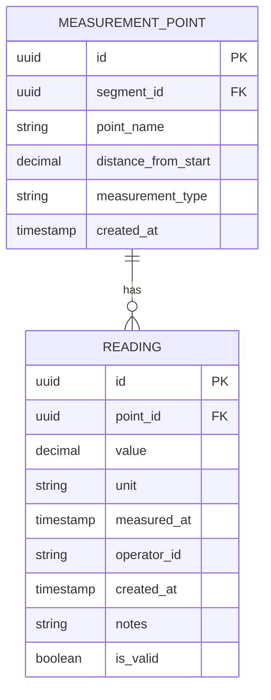

# Reading Model

<cite>
**Referenced Files in This Document**   
- [Reading.cs](file://src/OilErp.Domain/Entities/Reading.cs)
- [MeasurementPoint.cs](file://src/OilErp.Domain/Entities/MeasurementPoint.cs)
- [ReadingRepository.cs](file://src/OilErp.Data/Repositories/ReadingRepository.cs)
- [MeasurementService.cs](file://src/OilErp.Domain/Services/MeasurementService.cs)
- [01_tables.sql](file://sql/anpz/01_tables.sql)
- [04_function_sp_insert_measurement_batch.sql](file://sql/anpz/04_function_sp_insert_measurement_batch.sql)
- [MeasurementsController.cs](file://src/OilErp.App/Controllers/MeasurementsController.cs)
</cite>

## Table of Contents
1. [Introduction](#introduction)
2. [Field Definitions](#field-definitions)
3. [Primary and Foreign Keys](#primary-and-foreign-keys)
4. [Indexing Strategy](#indexing-strategy)
5. [Business Methods](#business-methods)
6. [Data Validation Rules](#data-validation-rules)
7. [State Management](#state-management)
8. [Schema Diagram](#schema-diagram)
9. [Batch Processing Workflow](#batch-processing-workflow)
10. [Corrosion Trend Analysis](#corrosion-trend-analysis)
11. [Performance Optimization](#performance-optimization)
12. [Data Retention and Archival](#data-retention-and-archival)

## Introduction
The Reading entity in the Oil ERP system represents actual measurement data collected from physical assets in oil and gas facilities. This model captures time-series data for critical parameters such as wall thickness, pressure, temperature, and pit depth, which are essential for monitoring asset integrity and preventing failures. The Reading model is central to the system's corrosion monitoring and risk assessment capabilities, providing the foundation for predictive maintenance and safety compliance. This documentation details the structure, behavior, and operational characteristics of the Reading entity, including its relationships with other entities, business logic, and performance considerations.

## Field Definitions
The Reading entity contains comprehensive fields for capturing measurement data with contextual information:

- **Id**: Unique identifier for the reading, automatically generated as a GUID upon creation [Reading.cs](file://src/OilErp.Domain/Entities/Reading.cs#L5)
- **PointId**: Required foreign key reference to the MeasurementPoint where the reading was taken [Reading.cs](file://src/OilErp.Domain/Entities/Reading.cs#L6)
- **Value**: Decimal value representing the measured quantity, with validation rules based on measurement type [Reading.cs](file://src/OilErp.Domain/Entities/Reading.cs#L7)
- **Unit**: Required string specifying the unit of measurement (e.g., "mm", "psi", "°C") [Reading.cs](file://src/OilErp.Domain/Entities/Reading.cs#L9)
- **MeasuredAt**: DateTime indicating when the measurement was taken, representing the actual time of data collection [Reading.cs](file://src/OilErp.Domain/Entities/Reading.cs#L10)
- **OperatorId**: Optional string identifying the personnel who performed the measurement [Reading.cs](file://src/OilErp.Domain/Entities/Reading.cs#L12)
- **CreatedAt**: DateTime timestamp when the reading record was created in the system, automatically set to UTC time [Reading.cs](file://src/OilErp.Domain/Entities/Reading.cs#L13)
- **Notes**: Optional string for additional comments or observations about the reading [Reading.cs](file://src/OilErp.Domain/Entities/Reading.cs#L14)
- **IsValid**: Boolean flag indicating whether the reading is considered valid for analysis, defaulting to true [Reading.cs](file://src/OilErp.Domain/Entities/Reading.cs#L17)

The model also includes alias properties for compatibility with different naming conventions: Thickness (alias for Value), Timestamp (alias for MeasuredAt), and Note (alias for Notes).

**Section sources**
- [Reading.cs](file://src/OilErp.Domain/Entities/Reading.cs#L5-L18)

## Primary and Foreign Keys
The Reading entity implements a robust key structure to ensure data integrity and efficient relationships:

- **Primary Key (Id)**: The Id field serves as the primary key, implemented as a GUID to ensure global uniqueness across distributed systems. This approach prevents key collisions when merging data from different plants or facilities. The GUID is automatically generated upon entity creation, ensuring that each reading has a unique identifier regardless of when or where it was created [Reading.cs](file://src/OilErp.Domain/Entities/Reading.cs#L5)

- **Foreign Key (PointId)**: The PointId field establishes a relationship with the MeasurementPoint entity, creating a parent-child relationship where multiple readings can be associated with a single measurement point. This foreign key constraint ensures referential integrity by validating that each reading references an existing measurement point. The relationship is enforced at both the application level (through validation in the ReadingRepository) and the database level (through foreign key constraints in the readings table) [Reading.cs](file://src/OilErp.Domain/Entities/Reading.cs#L6)

The foreign key relationship enables hierarchical data organization, where readings are logically grouped by their measurement points, which are in turn associated with specific asset segments. This structure supports efficient querying patterns for retrieving all readings from a particular point or analyzing measurement trends over time.

**Section sources**
- [Reading.cs](file://src/OilErp.Domain/Entities/Reading.cs#L5-L6)
- [01_tables.sql](file://sql/anpz/01_tables.sql#L24-L25)

## Indexing Strategy
The Reading model employs a comprehensive indexing strategy to optimize time-series data retrieval and support high-frequency measurement ingestion:

- **Primary Index**: The Id field is indexed as the primary key, providing O(1) lookup performance for individual reading retrieval by identifier [01_tables.sql](file://sql/anpz/01_tables.sql#L23)

- **Composite Index on PointId and MeasuredAt**: A composite index on the PointId and MeasuredAt columns enables efficient retrieval of readings for a specific measurement point within a time range. This index is critical for performance when analyzing measurement trends or retrieving historical data for a particular point [01_tables.sql](file://sql/anpz/01_tables.sql#L26)

- **Index on MeasuredAt**: A dedicated index on the MeasuredAt column supports efficient time-based queries across all readings, such as retrieving all measurements taken within a specific date range regardless of measurement point [ReadingRepository.cs](file://src/OilErp.Data/Repositories/ReadingRepository.cs#L120-L128)

- **Index on IsValid**: An index on the IsValid column allows for efficient filtering of valid versus invalid readings, which is essential for analytics and reporting that should exclude questionable data [ReadingRepository.cs](file://src/OilErp.Data/Repositories/ReadingRepository.cs#L250-L258)

The indexing strategy is designed to support the most common query patterns in the Oil ERP system, including time-series analysis, trend detection, and batch processing of recent measurements. The composite index on PointId and MeasuredAt follows the leftmost prefix principle, allowing it to be used for queries that filter on PointId alone or on both PointId and MeasuredAt.

**Section sources**
- [01_tables.sql](file://sql/anpz/01_tables.sql#L26)
- [ReadingRepository.cs](file://src/OilErp.Data/Repositories/ReadingRepository.cs#L120-L128)

## Business Methods
The Reading entity implements several business methods that encapsulate domain logic and ensure consistent behavior across the application:

- **UpdateValue(decimal value, string unit)**: Updates the reading's value and unit, with validation to ensure the unit is not null or whitespace. This method maintains data integrity by preventing invalid unit specifications [Reading.cs](file://src/OilErp.Domain/Entities/Reading.cs#L27-L33)

- **SetOperator(string operatorId)**: Assigns an operator to the reading, with validation to ensure the operator ID is not null or whitespace. This method supports audit trails by properly attributing measurements to specific personnel [Reading.cs](file://src/OilErp.Domain/Entities/Reading.cs#L35-L39)

- **AddNotes(string notes)**: Adds or updates notes for the reading, providing a standardized way to attach contextual information to measurement data [Reading.cs](file://src/OilErp.Domain/Entities/Reading.cs#L41-L44)

- **MarkAsInvalid(string reason)**: Invalidates the reading and automatically adds a note explaining the reason for invalidation. This method ensures that invalid readings are properly documented and can be excluded from analysis while preserving the audit trail [Reading.cs](file://src/OilErp.Domain/Entities/Reading.cs#L46-L50)

- **MarkAsValid()**: Revalidates a previously invalidated reading, allowing for correction of erroneous invalidations [Reading.cs](file://src/OilErp.Domain/Entities/Reading.cs#L52-L55)

- **IsOutOfRange(decimal minValue, decimal maxValue)**: Determines if the reading's value falls outside specified tolerance limits, supporting quality control and anomaly detection [Reading.cs](file://src/OilErp.Domain/Entities/Reading.cs#L57-L60)

- **GetFormattedValue()**: Returns the reading value formatted with its unit (e.g., "8.50 mm"), providing a consistent presentation format for user interfaces and reports [Reading.cs](file://src/OilErp.Domain/Entities/Reading.cs#L67-L70)

These business methods encapsulate the domain logic related to reading manipulation, ensuring consistent behavior across different parts of the application and reducing the risk of business rule violations.

**Section sources**
- [Reading.cs](file://src/OilErp.Domain/Entities/Reading.cs#L27-L70)

## Data Validation Rules
The Reading model enforces several validation rules to ensure data quality and integrity:

- **Value Validation**: The Value field must be positive for most measurement types. For wall thickness measurements, values must be greater than zero, with an upper limit of 50mm considered reasonable. Pressure measurements cannot be negative, and temperature measurements cannot fall below absolute zero (-273.15°C) [MeasurementService.cs](file://src/OilErp.Domain/Services/MeasurementService.cs#L80-L95)

- **Unit Validation**: The Unit field is required and must not be null or whitespace. The unit specification must be appropriate for the measurement type (e.g., "mm" for thickness, "psi" for pressure) [Reading.cs](file://src/OilErp.Domain/Entities/Reading.cs#L27-L33)

- **Timestamp Validation**: The MeasuredAt field must represent a valid point in time, with restrictions preventing future dates (beyond one day from current time) and excessively old dates (more than 10 years in the past) [MeasurementService.cs](file://src/OilErp.Domain/Services/MeasurementService.cs#L110-L113)

- **Measurement Point Validation**: Before creating a reading, the system validates that the referenced PointId corresponds to an existing measurement point in the database. This prevents orphaned readings that cannot be properly contextualized [ReadingRepository.cs](file://src/OilErp.Data/Repositories/ReadingRepository.cs#L55-L60)

- **Anomaly Detection**: The system performs statistical anomaly detection by comparing new readings to recent historical data from the same measurement point. Readings that deviate by more than two standard deviations from the recent average are flagged with a warning note [MeasurementService.cs](file://src/OilErp.Domain/Services/MeasurementService.cs#L105-L115)

These validation rules are enforced at multiple levels: within the Reading entity itself, in the ReadingRepository, and through the MeasurementService, creating a defense-in-depth approach to data quality.

**Section sources**
- [MeasurementService.cs](file://src/OilErp.Domain/Services/MeasurementService.cs#L80-L115)
- [ReadingRepository.cs](file://src/OilErp.Data/Repositories/ReadingRepository.cs#L55-L60)

## State Management
The Reading model implements a simple but effective state management system through the IsValid property and associated methods:

- **Validity State**: The IsValid boolean property represents whether a reading is considered reliable for analysis and decision-making. By default, readings are created with IsValid set to true, assuming they are valid unless proven otherwise [Reading.cs](file://src/OilErp.Domain/Entities/Reading.cs#L17)

- **State Transitions**: The model provides methods to transition between valid and invalid states:
  - **MarkAsInvalid(string reason)**: Transitions a reading from valid to invalid state, automatically recording the reason in the notes field [Reading.cs](file://src/OilErp.Domain/Entities/Reading.cs#L46-L50)
  - **MarkAsValid()**: Transitions a reading from invalid to valid state, allowing for correction of erroneous invalidations [Reading.cs](file://src/OilErp.Domain/Entities/Reading.cs#L52-L55)

- **State Persistence**: The validity state is persisted in the database and considered in all analytical operations. Methods like GetAverageByPointIdAsync and GetMeasurementTrendAsync automatically exclude invalid readings from calculations, ensuring that analytics are based only on reliable data [ReadingRepository.cs](file://src/OilErp.Data/Repositories/ReadingRepository.cs#L250-L258)

- **Audit Trail**: When a reading is marked as invalid, the system automatically adds a note with the reason, creating an audit trail that explains why the reading was invalidated. This preserves the context for future review and analysis.

This state management approach allows the system to handle questionable data gracefully, maintaining the integrity of the measurement history while ensuring that analytics and risk assessments are based on trustworthy data.

**Section sources**
- [Reading.cs](file://src/OilErp.Domain/Entities/Reading.cs#L17)
- [ReadingRepository.cs](file://src/OilErp.Data/Repositories/ReadingRepository.cs#L250-L258)

## Schema Diagram

**Diagram sources**
- [Reading.cs](file://src/OilErp.Domain/Entities/Reading.cs)
- [MeasurementPoint.cs](file://src/OilErp.Domain/Entities/MeasurementPoint.cs)

## Batch Processing Workflow
The system supports efficient batch processing of measurement readings through a coordinated workflow between application components and database procedures:

1. **API Request**: The MeasurementsController receives a batch measurement request containing multiple readings for a specific asset [MeasurementsController.cs](file://src/OilErp.App/Controllers/MeasurementsController.cs#L59-L63)

2. **Validation**: The MeasurementService validates the batch, ensuring the asset exists and all readings meet data quality requirements [MeasurementService.cs](file://src/OilErp.Domain/Services/MeasurementService.cs#L65-L75)

3. **JSON Conversion**: Readings are converted to a JSON format compatible with the database stored procedure, preserving all relevant data including measurement point labels, thickness values, timestamps, and notes [MeasurementService.cs](file://src/OilErp.Domain/Services/MeasurementService.cs#L102-L114)

4. **Database Processing**: The system calls the sp_insert_measurement_batch stored procedure, which handles the entire batch in a single database transaction [MeasurementService.cs](file://src/OilErp.Domain/Services/MeasurementService.cs#L78-L80)

5. **Atomic Operations**: The stored procedure performs several atomic operations:
   - Ensures the asset exists in the local database
   - Creates any new measurement points referenced in the batch
   - Inserts all readings into the measurements table
   - Calculates summary statistics (first and last thickness measurements)
   - Publishes a MEASUREMENT_BATCH_ADDED event to the central event system [04_function_sp_insert_measurement_batch.sql](file://sql/anpz/04_function_sp_insert_measurement_batch.sql#L40-L83)

This batch processing workflow enables high-throughput ingestion of measurement data while maintaining data consistency and providing integration with downstream analytics systems through event publishing.

**Section sources**
- [MeasurementsController.cs](file://src/OilErp.App/Controllers/MeasurementsController.cs#L59-L63)
- [MeasurementService.cs](file://src/OilErp.Domain/Services/MeasurementService.cs#L65-L80)
- [04_function_sp_insert_measurement_batch.sql](file://sql/anpz/04_function_sp_insert_measurement_batch.sql#L40-L83)

## Corrosion Trend Analysis
The system provides comprehensive corrosion trend analysis capabilities based on reading data:

- **Trend Calculation**: The MeasurementService calculates corrosion trends by analyzing readings from a specific measurement point over a defined time period. The trend analysis includes:
  - Reading count within the specified period
  - Average, minimum, and maximum values
  - First and last values for rate calculation
  - Trend direction (Increasing, Decreasing, or Stable)
  - Change rate (value change per day) [MeasurementService.cs](file://src/OilErp.Domain/Services/MeasurementService.cs#L130-L149)

- **Corrosion Rate Calculation**: The system calculates corrosion rates using the formula: (previous thickness - latest thickness) / days between measurements. This calculation is performed both at the application level and through the database function fn_calc_cr [MeasurementService.cs](file://src/OilErp.Domain/Services/MeasurementService.cs#L155-L160)

- **Risk Assessment**: Corrosion trends are used in risk assessment calculations, where the corrosion rate is compared against predefined thresholds to determine risk levels (Low, Medium, High, Critical) [central/02_functions_core.sql](file://sql/central/02_functions_core.sql#L183-L219)

- **Historical Analysis**: The system can analyze long-term corrosion trends by retrieving and processing historical reading data, enabling predictive maintenance planning and remaining life estimation.

This trend analysis capability transforms raw measurement data into actionable insights for asset integrity management, helping operators identify developing corrosion issues before they become critical.

**Section sources**
- [MeasurementService.cs](file://src/OilErp.Domain/Services/MeasurementService.cs#L130-L160)
- [central/02_functions_core.sql](file://sql/central/02_functions_core.sql#L183-L219)

## Performance Optimization
The Reading model incorporates several performance optimizations to handle high-frequency measurement ingestion and efficient querying:

- **Bulk Insert Operations**: The ReadingRepository implements a BulkCreateAsync method that uses Dapper's ExecuteAsync with a collection parameter, enabling efficient insertion of multiple readings in a single database round-trip [ReadingRepository.cs](file://src/OilErp.Data/Repositories/ReadingRepository.cs#L291-L313)

- **Connection Reuse**: The repository pattern and unit of work implementation allow for connection reuse across multiple operations within a single transaction, reducing connection overhead [ReadingRepository.cs](file://src/OilErp.Data/Repositories/ReadingRepository.cs#L291-L313)

- **Batch Processing**: The system leverages database-level batch processing through the sp_insert_measurement_batch stored procedure, which handles entire measurement batches in a single transaction, minimizing round-trips and maximizing throughput [04_function_sp_insert_measurement_batch.sql](file://sql/anpz/04_function_sp_insert_measurement_batch.sql)

- **Caching Strategy**: While not explicitly implemented in the Reading entity, the system architecture supports caching of frequently accessed readings and measurement points to reduce database load for read-heavy operations.

- **Query Optimization**: Repository methods are optimized with appropriate indexing and query patterns, such as using LIMIT clauses for GetAllAsync to prevent excessive data retrieval [ReadingRepository.cs](file://src/OilErp.Data/Repositories/ReadingRepository.cs#L80-L85)

These performance optimizations ensure that the system can handle the high volume of measurement data typical in oil and gas operations while maintaining responsive user interfaces and timely analytics.

**Section sources**
- [ReadingRepository.cs](file://src/OilErp.Data/Repositories/ReadingRepository.cs#L291-L313)
- [04_function_sp_insert_measurement_batch.sql](file://sql/anpz/04_function_sp_insert_measurement_batch.sql)

## Data Retention and Archival
The system implements data retention and archival strategies to manage the lifecycle of reading data:

- **Event-Based Retention**: Measurement batch events are retained for 30 days by default, after which they are automatically cleaned up by the fn_events_cleanup function. This ensures that the event queue does not grow indefinitely while providing sufficient time for processing and auditing [central/02_functions_core.sql](file://sql/central/02_functions_core.sql#L245-L265)

- **Historical Data Preservation**: While specific archival policies for reading records are not detailed in the provided code, the system design suggests that raw reading data is preserved long-term to support historical analysis and regulatory compliance.

- **Analytics Aggregation**: The system uses the fn_ingest_events function to process measurement batch events and update the analytics_cr table, which contains summarized corrosion analytics. This aggregation reduces the need to process raw readings for common analytical queries [central/02_functions_core.sql](file://sql/central/02_functions_core.sql#L135-L182)

- **Data Lifecycle Management**: The combination of event processing, analytics aggregation, and potential future archival mechanisms creates a tiered data management approach where recent data is readily available for operational use, while historical data is preserved for long-term analysis.

These data retention and archival strategies balance the need for immediate access to recent measurements with the requirements for long-term data preservation and system performance.

**Section sources**
- [central/02_functions_core.sql](file://sql/central/02_functions_core.sql#L245-L265)
- [central/02_functions_core.sql](file://sql/central/02_functions_core.sql#L135-L182)