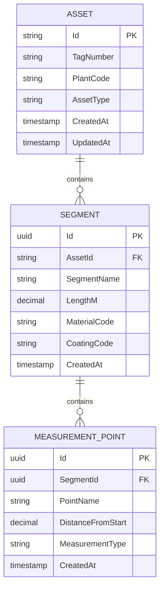

# Segment Model

<cite>
**Referenced Files in This Document**   
- [Segment.cs](file://src/OilErp.Domain/Entities/Segment.cs)
- [Asset.cs](file://src/OilErp.Domain/Entities/Asset.cs)
- [MeasurementPoint.cs](file://src/OilErp.Domain/Entities/MeasurementPoint.cs)
- [SegmentRepository.cs](file://src/OilErp.Data/Repositories/SegmentRepository.cs)
- [01_tables.sql](file://sql/central/01_tables.sql)
</cite>

## Table of Contents
1. [Introduction](#introduction)
2. [Field Definitions](#field-definitions)
3. [Primary and Foreign Key Constraints](#primary-and-foreign-key-constraints)
4. [Data Validation Rules](#data-validation-rules)
5. [Business Methods](#business-methods)
6. [Data Relationships and Schema Diagram](#data-relationships-and-schema-diagram)
7. [Practical Usage Examples](#practical-usage-examples)
8. [Performance Considerations](#performance-considerations)
9. [Use Cases in Corrosion and Risk Analysis](#use-cases-in-corrosion-and-risk-analysis)
10. [Conclusion](#conclusion)

## Introduction
The Segment entity in the Oil ERP system represents a distinct portion of a physical asset, such as a pipeline section or equipment component, characterized by uniform material and coating properties. Segments serve as structural containers for measurement points, enabling granular monitoring of asset health and integrity. This model supports critical operations in asset lifecycle management, including inspection planning, corrosion monitoring, and risk assessment. The design emphasizes data integrity through encapsulated business logic and validation rules.

**Section sources**
- [Segment.cs](file://src/OilErp.Domain/Entities/Segment.cs#L5-L62)

## Field Definitions
The Segment entity contains the following fields, each serving a specific role in asset modeling:

- **Id**: Unique identifier (GUID) for the segment, automatically generated upon creation. Serves as the primary key.
- **AssetId**: Required string identifier linking the segment to its parent Asset. Enforces referential integrity.
- **SegmentName**: Required human-readable name for the segment, used for identification and reporting.
- **LengthM**: Decimal value representing the segment length in meters. Must be positive to ensure physical validity.
- **MaterialCode**: Optional string code identifying the material composition (e.g., "API5L-X65").
- **CoatingCode**: Optional string code specifying the protective coating type (e.g., "FBE", "3LPE").
- **CreatedAt**: Timestamp of segment creation, automatically set to UTC time upon instantiation.

These fields collectively define the physical and operational characteristics of a pipeline or equipment segment, enabling precise tracking and analysis.

**Section sources**
- [Segment.cs](file://src/OilErp.Domain/Entities/Segment.cs#L5-L15)

## Primary and Foreign Key Constraints
The Segment entity enforces data integrity through well-defined key constraints:

- **Primary Key**: The `Id` field (GUID) serves as the primary key, ensuring each segment is uniquely identifiable across the system.
- **Foreign Key**: The `AssetId` field establishes a foreign key relationship with the Asset entity, enforcing that every segment belongs to a valid asset. This relationship is validated both at the application level (via business methods) and database level (via schema constraints).

The foreign key relationship enables hierarchical asset traversal, allowing aggregation of data from multiple segments belonging to the same asset. This structure supports comprehensive asset-level reporting and analysis.

**Section sources**
- [Segment.cs](file://src/OilErp.Domain/Entities/Segment.cs#L6-L7)
- [Asset.cs](file://src/OilErp.Domain/Entities/Asset.cs#L5-L6)

## Data Validation Rules
The Segment model implements strict validation rules to maintain data integrity:

- **Length Validation**: The `UpdateLength()` method enforces that `LengthM` must be greater than zero. Attempts to set a non-positive value result in an `ArgumentException`.
- **Material and Coating Validation**: The `SetMaterial()` and `SetCoating()` methods validate that input strings are neither null nor whitespace, ensuring data quality.
- **Measurement Point Positioning**: When adding a measurement point via `AddMeasurementPoint()`, the system verifies that the point's `DistanceFromStart` does not exceed the segment's `LengthM`, preventing physically impossible configurations.
- **Entity Association**: The method also validates that the measurement point's `SegmentId` matches the segment's `Id`, ensuring referential consistency.

These validation rules are enforced at the domain level, providing a robust defense against invalid data states.

**Section sources**
- [Segment.cs](file://src/OilErp.Domain/Entities/Segment.cs#L20-L26)
- [Segment.cs](file://src/OilErp.Domain/Entities/Segment.cs#L40-L51)

## Business Methods
The Segment class provides several business methods that encapsulate domain logic:

- **UpdateLength(decimal lengthM)**: Updates the segment length after validating that the value is positive.
- **SetMaterial(string materialCode)**: Assigns a material code after ensuring the input is valid.
- **SetCoating(string coatingCode)**: Assigns a coating code with null/whitespace validation.
- **AddMeasurementPoint(MeasurementPoint measurementPoint)**: Adds a measurement point to the segment after validating ownership and position constraints.
- **GetMeasurementPointCount()**: Returns the number of measurement points associated with the segment.
- **GetMeasurementPointsByType(string measurementType)**: Filters and returns measurement points by their type (e.g., wall thickness, corrosion rate).

These methods ensure that all modifications to the segment maintain business rule compliance.

**Section sources**
- [Segment.cs](file://src/OilErp.Domain/Entities/Segment.cs#L20-L62)

## Data Relationships and Schema Diagram
The Segment entity participates in a hierarchical data model with the Asset and MeasurementPoint entities. Each Asset contains multiple Segments, and each Segment contains multiple MeasurementPoints, forming a parent-child relationship chain.

**Diagram sources**
- [Segment.cs](file://src/OilErp.Domain/Entities/Segment.cs#L5-L62)
- [Asset.cs](file://src/OilErp.Domain/Entities/Asset.cs#L5-L71)
- [MeasurementPoint.cs](file://src/OilErp.Domain/Entities/MeasurementPoint.cs#L5-L82)

## Practical Usage Examples
Segments are used to model pipeline sections and equipment components in the Oil ERP system. For example:

- A 10-kilometer pipeline can be divided into multiple segments, each with different material grades or coating types.
- A storage tank can be segmented into bottom, shell, and roof sections, each monitored separately.
- Measurement points are placed along a segment at specific distances from the start, enabling precise location of readings.
- When a new inspection reveals a change in wall thickness, a new reading is added to the appropriate measurement point within the relevant segment.

This segmentation approach allows engineers to track degradation patterns, plan maintenance activities, and assess risk at a granular level.

**Section sources**
- [Segment.cs](file://src/OilErp.Domain/Entities/Segment.cs#L40-L51)
- [MeasurementPoint.cs](file://src/OilErp.Domain/Entities/MeasurementPoint.cs#L5-L82)

## Performance Considerations
The hierarchical structure of Asset → Segment → MeasurementPoint → Reading requires careful performance optimization:

- **Hierarchical Traversal**: The `GetTotalLengthByAssetAsync()` repository method efficiently calculates the total length of all segments for an asset using a database-level SUM operation, avoiding client-side aggregation.
- **Eager Loading**: The `GetWithMeasurementPointsAsync()` method uses Dapper's multi-mapping feature to load a segment and its measurement points in a single query, reducing database round trips.
- **Indexing Strategy**: Database indexes on `asset_id`, `material_code`, and `coating_code` fields enable fast filtering and retrieval of segments.
- **Aggregation Queries**: Repository methods like `GetByMaterialCodeAsync()` and `GetByCoatingCodeAsync()` perform filtering at the database level, minimizing data transfer.

These optimizations ensure responsive performance even with large asset inventories and extensive measurement data.

**Section sources**
- [SegmentRepository.cs](file://src/OilErp.Data/Repositories/SegmentRepository.cs#L124-L223)

## Use Cases in Corrosion and Risk Analysis
Segments play a crucial role in corrosion rate calculation and risk assessment:

- **Corrosion Rate Calculation**: By comparing wall thickness readings from measurement points over time, the system calculates corrosion rates for each segment. This data is used to predict remaining service life and plan inspections.
- **Risk Assessment**: Segments with high corrosion rates or critical defects contribute to higher risk scores. The `RiskAssessmentService` aggregates data from multiple segments to determine overall asset risk levels.
- **Material-Based Analysis**: Segments can be grouped by `MaterialCode` to analyze corrosion patterns across different material types, informing material selection for future projects.
- **Coating Performance**: Segments with different `CoatingCode` values can be compared to evaluate coating effectiveness in various environmental conditions.

This granular approach enables proactive maintenance planning and regulatory compliance.

**Section sources**
- [Segment.cs](file://src/OilErp.Domain/Entities/Segment.cs#L58-L61)
- [SegmentRepository.cs](file://src/OilErp.Data/Repositories/SegmentRepository.cs#L151-L183)

## Conclusion
The Segment model is a foundational component of the Oil ERP system, providing a structured way to represent and manage asset subdivisions. Its design emphasizes data integrity through robust validation, encapsulated business logic, and well-defined relationships. The model supports critical operations in asset integrity management, from basic data entry to advanced analytics for corrosion and risk assessment. By enabling granular monitoring and analysis, the Segment entity helps ensure the safe and efficient operation of oil and gas infrastructure.