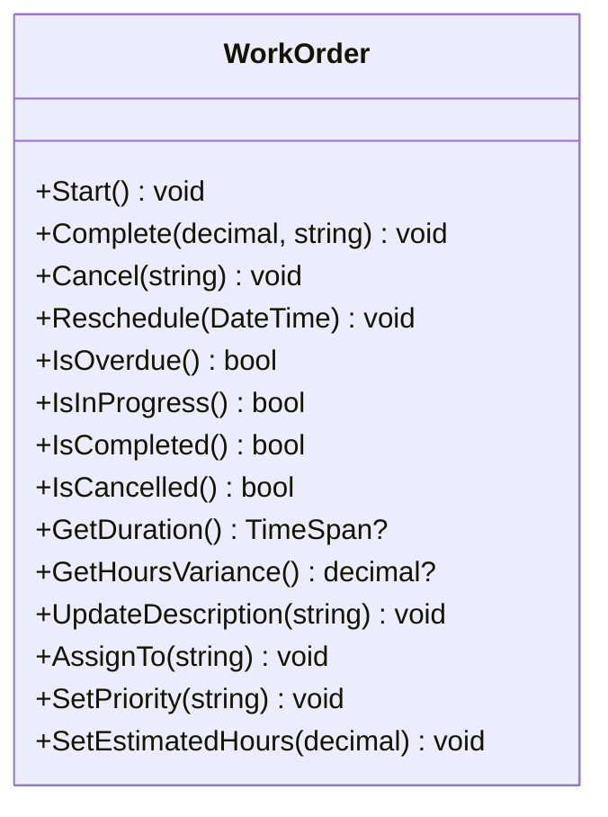
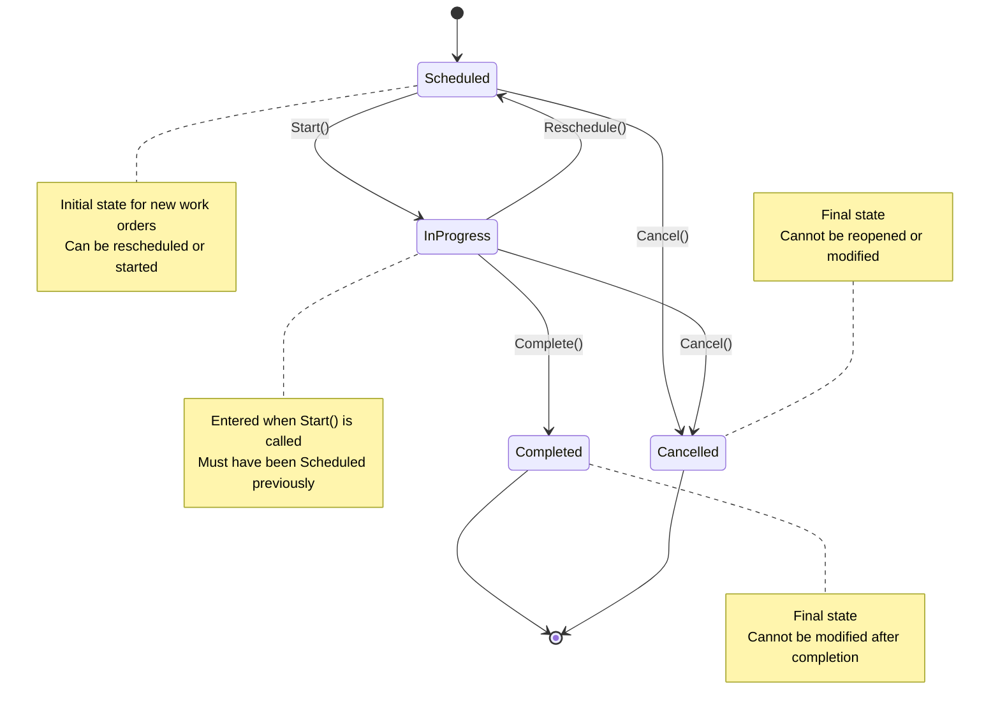

# Work Order Model

<cite>
**Referenced Files in This Document**   
- [WorkOrder.cs](file://src/OilErp.Domain/Entities/WorkOrder.cs)
- [Asset.cs](file://src/OilErp.Domain/Entities/Asset.cs)
- [Defect.cs](file://src/OilErp.Domain/Entities/Defect.cs)
- [DomainEnums.cs](file://src/OilErp.Domain/Enums/DomainEnums.cs)
- [WorkOrderRepository.cs](file://src/OilErp.Data/Repositories/WorkOrderRepository.cs)
- [AssetAndWorkOrderServices.cs](file://src/OilErp.Domain/Services/AssetAndWorkOrderServices.cs)
</cite>

## Table of Contents
1. [Introduction](#introduction)
2. [Core Fields and Data Types](#core-fields-and-data-types)
3. [Primary and Foreign Keys](#primary-and-foreign-keys)
4. [Business Methods](#business-methods)
5. [State Machine and Status Transitions](#state-machine-and-status-transitions)
6. [Data Validation Rules](#data-validation-rules)
7. [Schema Diagram](#schema-diagram)
8. [Practical Examples](#practical-examples)
9. [Performance Considerations](#performance-considerations)
10. [Integration Points](#integration-points)
11. [Conclusion](#conclusion)

## Introduction
The WorkOrder entity in the Oil ERP system represents maintenance and repair activities performed on physical assets within oil industry infrastructure. This model supports both preventive and corrective maintenance workflows, tracking work from scheduling through completion. The entity captures essential operational data including scheduling, execution metrics, and completion details, while enforcing business rules through validation and state management. It integrates closely with Asset and Defect entities to provide a comprehensive maintenance management system.

**Section sources**
- [WorkOrder.cs](file://src/OilErp.Domain/Entities/WorkOrder.cs#L5-L133)

## Core Fields and Data Types
The WorkOrder entity contains comprehensive fields for tracking maintenance activities:

- **Id**: Unique identifier (Guid) automatically generated upon creation
- **AssetId**: Required string reference to the asset being serviced
- **WoNumber**: Required string work order number (must be unique)
- **WorkType**: Required string indicating type of work (e.g., Preventive, Corrective)
- **Status**: Required string representing current state in workflow
- **ScheduledDate**: DateTime when work is planned to occur
- **StartedAt**: Nullable DateTime when work actually began
- **CompletedAt**: Nullable DateTime when work was finished
- **CreatedAt**: DateTime of record creation (defaults to UTC)
- **UpdatedAt**: DateTime of last modification (defaults to UTC)
- **Description**: Optional string detailing the work to be performed
- **AssignedTo**: Optional string identifying responsible personnel
- **Priority**: Optional string indicating urgency level
- **EstimatedHours**: Optional decimal for planned duration
- **ActualHours**: Optional decimal for actual time spent
- **CompletionNotes**: Optional string with details of work completion

**Section sources**
- [WorkOrder.cs](file://src/OilErp.Domain/Entities/WorkOrder.cs#L5-L40)

## Primary and Foreign Keys
The WorkOrder entity implements a robust key structure for data integrity and relationships:

- **Primary Key**: Id (Guid) serves as the unique identifier for each work order, automatically generated upon creation
- **Foreign Keys**: 
  - AssetId (string) references the Asset entity, ensuring all work orders are associated with valid assets
  - DefectId (Guid?) optionally references the Defect entity, allowing work orders to be linked to specific identified defects

The repository enforces referential integrity by validating that referenced assets and defects exist in the database before creating or updating work orders. The WoNumber field is also enforced as unique across the system to prevent duplication.

**Section sources**
- [WorkOrder.cs](file://src/OilErp.Domain/Entities/WorkOrder.cs#L5-L25)
- [WorkOrderRepository.cs](file://src/OilErp.Data/Repositories/WorkOrderRepository.cs#L51-L133)

## Business Methods
The WorkOrder entity provides several business methods to manage the work order lifecycle:



**Diagram sources**
- [WorkOrder.cs](file://src/OilErp.Domain/Entities/WorkOrder.cs#L41-L133)

**Section sources**
- [WorkOrder.cs](file://src/OilErp.Domain/Entities/WorkOrder.cs#L41-L133)

## State Machine and Status Transitions
The WorkOrder entity implements a state machine to manage the workflow lifecycle with strict transition rules:



**Diagram sources**
- [WorkOrder.cs](file://src/OilErp.Domain/Entities/WorkOrder.cs#L55-L76)
- [WorkOrder.cs](file://src/OilErp.Domain/Entities/WorkOrder.cs#L78-L85)
- [WorkOrder.cs](file://src/OilErp.Domain/Entities/WorkOrder.cs#L87-L96)

**Section sources**
- [WorkOrder.cs](file://src/OilErp.Domain/Entities/WorkOrder.cs#L55-L96)

## Data Validation Rules
The system enforces comprehensive validation rules to ensure data integrity:

- **Work Order Number**: Must be unique across the system; duplicates are prevented at repository level
- **Asset Reference**: Must reference an existing asset; validation occurs during creation and update
- **Defect Reference**: If provided, must reference an existing defect
- **Status Transitions**: 
  - Can only start work orders that are in "Scheduled" status
  - Can only complete work orders that are "In Progress"
  - Cannot cancel completed work orders
  - Cannot reschedule completed work orders
- **Time Values**: 
  - Estimated hours must be positive
  - Actual hours must be positive when completing work
- **Required Fields**: AssetId, WoNumber, WorkType, and Status are required
- **Priority**: Must be a valid value (Low, Medium, High, Emergency)

**Section sources**
- [WorkOrderRepository.cs](file://src/OilErp.Data/Repositories/WorkOrderRepository.cs#L51-L133)
- [WorkOrder.cs](file://src/OilErp.Domain/Entities/WorkOrder.cs#L41-L85)

## Schema Diagram
The WorkOrder entity is integrated within the broader maintenance management schema:

```mermaid
erDiagram
WORK_ORDER {
Guid id PK
string asset_id FK
string wo_number UK
string work_type
string status
DateTime scheduled_date
DateTime? started_at
DateTime? completed_at
DateTime created_at
DateTime updated_at
string? description
string? assigned_to
string? priority
decimal? estimated_hours
decimal? actual_hours
string? completion_notes
Guid? defect_id FK
}
ASSET {
string id PK
string tag_number
string? description
string plant_code
string? asset_type
DateTime created_at
DateTime updated_at
}
DEFECT {
Guid id PK
string asset_id FK
string defect_type
string severity
string? description
DateTime discovered_at
DateTime created_at
string? discovered_by
string? location
bool is_resolved
DateTime? resolved_at
string? resolution
}
WORK_ORDER ||--|| ASSET : "AssetId → Id"
WORK_ORDER }o--|| DEFECT : "DefectId → Id"
DEFECT ||--|| ASSET : "AssetId → Id"
```

**Diagram sources**
- [WorkOrder.cs](file://src/OilErp.Domain/Entities/WorkOrder.cs#L5-L25)
- [Asset.cs](file://src/OilErp.Domain/Entities/Asset.cs#L5-L15)
- [Defect.cs](file://src/OilErp.Domain/Entities/Defect.cs#L5-L15)

**Section sources**
- [WorkOrder.cs](file://src/OilErp.Domain/Entities/WorkOrder.cs#L5-L25)
- [Asset.cs](file://src/OilErp.Domain/Entities/Asset.cs#L5-L15)
- [Defect.cs](file://src/OilErp.Domain/Entities/Defect.cs#L5-L15)

## Practical Examples
### Preventive Maintenance Work Order
A preventive maintenance work order is created for routine inspection of a pipeline segment. The work order is scheduled in advance with estimated hours and assigned to a maintenance team. When the work begins, the Start() method is called, changing the status to "In Progress". Upon completion, the Complete() method records actual hours and completion notes.

### Corrective Action Work Order
A corrective action work order is created in response to a critical defect identified during inspection. The work order is linked to the defect record and given high priority. Technicians are assigned immediately, and the work is expedited. The completion process documents the resolution and updates the associated defect status.

**Section sources**
- [WorkOrder.cs](file://src/OilErp.Domain/Entities/WorkOrder.cs#L41-L133)
- [Defect.cs](file://src/OilErp.Domain/Entities/Defect.cs#L5-L96)

## Performance Considerations
The system includes several performance optimizations for work order management:

- **Indexing**: Key fields (Status, ScheduledDate, AssetId, WoNumber) are indexed to support efficient querying
- **Overdue Detection**: The GetOverdueAsync method efficiently identifies work orders past their scheduled date using optimized database queries
- **Scheduling Queries**: The GetScheduledForDateAsync method allows for efficient daily scheduling views
- **Aggregation**: Count methods (GetCountByStatusAsync, GetOverdueCountAsync) provide quick metrics without loading full entity data
- **Batch Operations**: Repository methods support batch retrieval of work orders by various criteria to minimize database round-trips

**Section sources**
- [WorkOrderRepository.cs](file://src/OilErp.Data/Repositories/WorkOrderRepository.cs#L274-L427)

## Integration Points
The WorkOrder entity integrates with several system components:

- **Defect Resolution**: Work orders can be linked to defects, creating a traceable workflow from defect identification to resolution
- **Analytics**: Completion metrics (actual vs. estimated hours, duration) are available for maintenance performance analysis
- **Asset Management**: Work order history is available for each asset, supporting reliability analysis and maintenance planning
- **Scheduling System**: The ScheduledDate field integrates with calendar and scheduling interfaces
- **Reporting**: Status and completion data feed into operational reports and KPIs

The system also provides service layer methods for common operations:
- GetWorkOrdersByAssetAsync: Retrieve all work orders for a specific asset
- GetOverdueWorkOrdersAsync: Identify overdue maintenance activities
- GetWorkOrdersByStatusAsync: Filter work orders by current status
- CompleteWorkOrderAsync: Service-level method to complete work orders with proper transaction handling

**Section sources**
- [AssetAndWorkOrderServices.cs](file://src/OilErp.Domain/Services/AssetAndWorkOrderServices.cs#L180-L358)
- [WorkOrderRepository.cs](file://src/OilErp.Data/Repositories/WorkOrderRepository.cs#L274-L427)

## Conclusion
The WorkOrder model provides a comprehensive foundation for maintenance management in the Oil ERP system. It captures essential operational data while enforcing business rules through validation and state management. The entity supports both preventive and corrective maintenance workflows with robust tracking of scheduling, execution, and completion. Integration with Asset and Defect entities creates a cohesive maintenance ecosystem, while performance optimizations ensure scalability. The model's design supports operational efficiency, regulatory compliance, and data-driven decision making in oil industry maintenance operations.