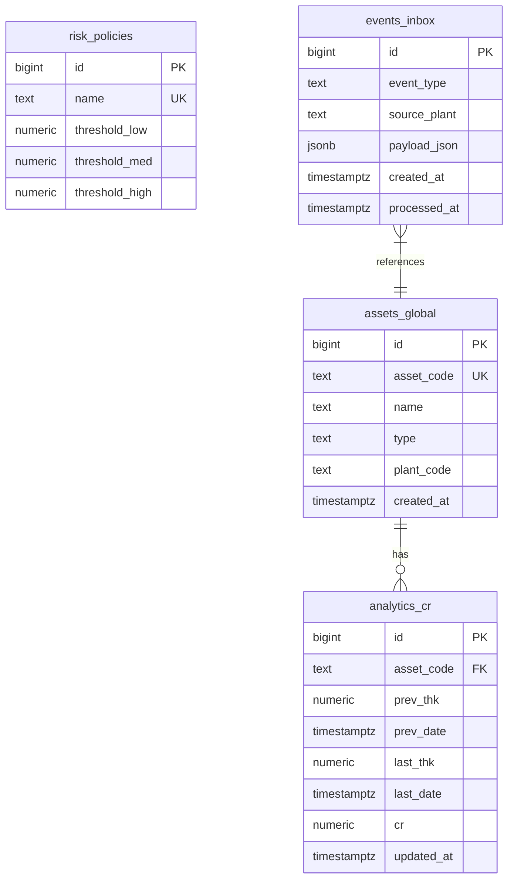

# Central Database Schema

<cite>
**Referenced Files in This Document**   
- [01_tables.sql](file://sql/central/01_tables.sql)
- [02_functions_core.sql](file://sql/central/02_functions_core.sql)
- [03_procedures.sql](file://sql/central/03_procedures.sql)
- [04_function_sp_ingest_events_legacy.sql](file://sql/central/04_function_sp_ingest_events_legacy.sql)
</cite>

## Table of Contents
1. [Introduction](#introduction)
2. [Core Entity Definitions](#core-entity-definitions)
3. [Data Relationships and Constraints](#data-relationships-and-constraints)
4. [Core Functions and Business Logic](#core-functions-and-business-logic)
5. [Stored Procedures and Legacy Components](#stored-procedures-and-legacy-components)
6. [Data Processing Workflow](#data-processing-workflow)
7. [Data Security and Retention Policies](#data-security-and-retention-policies)
8. [Schema Diagram](#schema-diagram)
9. [Conclusion](#conclusion)

## Introduction

The central database schema serves as the core data integration and analytics hub for the Oil ERP system, aggregating measurement data from multiple plants (ANPZ, KRN PZ) to enable centralized risk assessment, corrosion rate calculation, and asset health monitoring. The schema is designed around event-driven data ingestion, where measurement events are first queued in an inbox table before being processed into analytical models.

The architecture follows a modular approach with clear separation between data storage (tables), business logic (functions), and procedural interfaces. This design enables both real-time analytics and batch processing of measurement data, supporting critical decision-making for maintenance planning and risk mitigation in oil processing facilities.

**Section sources**
- [01_tables.sql](file://sql/central/01_tables.sql#L1-L52)
- [02_functions_core.sql](file://sql/central/02_functions_core.sql#L1-L266)

## Core Entity Definitions

The central database schema comprises four primary entities that form the foundation of the analytics and risk assessment system.

### events_inbox
The `events_inbox` table serves as a message queue for incoming measurement data from various plants. It stores raw JSON payloads containing thickness measurement data that require processing.

**Column Definitions:**
- `id`: Unique identifier (BIGINT, Primary Key)
- `event_type`: Categorization of the event (TEXT)
- `source_plant`: Originating plant code (TEXT)
- `payload_json`: JSONB document containing measurement data including asset_code, prev_thk, prev_date, last_thk, and last_date
- `created_at`: Timestamp of event creation (TIMESTAMPTZ, defaults to current time)
- `processed_at`: Timestamp indicating when the event was processed (TIMESTAMPTZ, nullable)

This table implements a durable message queue pattern, ensuring that measurement data is not lost during ingestion and can be reprocessed if necessary.

**Section sources**
- [01_tables.sql](file://sql/central/01_tables.sql#L30-L38)

### assets_global
The `assets_global` table maintains a centralized registry of all assets across multiple plants, serving as the master data source for asset information.

**Column Definitions:**
- `id`: Unique identifier (BIGINT, Primary Key)
- `asset_code`: Unique asset identifier (TEXT, NOT NULL, UNIQUE)
- `name`: Asset name (TEXT)
- `type`: Asset classification (TEXT)
- `plant_code`: Originating plant identifier (TEXT)
- `created_at`: Timestamp of record creation (TIMESTAMPTZ, defaults to current time)

This table supports asset upsert operations, allowing for seamless integration of assets from different plants while maintaining data consistency.

**Section sources**
- [01_tables.sql](file://sql/central/01_tables.sql#L2-L9)

### risk_policies
The `risk_policies` table defines risk assessment thresholds used to categorize corrosion rates into risk levels (LOW, MEDIUM, HIGH).

**Column Definitions:**
- `id`: Unique identifier (BIGINT, Primary Key)
- `name`: Policy name (TEXT, NOT NULL, UNIQUE)
- `threshold_low`: Lower bound for low-risk category (NUMERIC)
- `threshold_med`: Lower bound for medium-risk category (NUMERIC)
- `threshold_high`: Lower bound for high-risk category (NUMERIC)

These policies enable configurable risk assessment criteria that can be adjusted based on operational requirements and safety standards.

**Section sources**
- [01_tables.sql](file://sql/central/01_tables.sql#L11-L16)

### analytics_cr
The `analytics_cr` table stores calculated corrosion rate analytics for each asset, serving as the primary source for risk assessment and reporting.

**Column Definitions:**
- `id`: Unique identifier (BIGINT, Primary Key)
- `asset_code`: Foreign key to assets_global (TEXT, NOT NULL)
- `prev_thk`: Previous wall thickness measurement (NUMERIC)
- `prev_date`: Timestamp of previous measurement (TIMESTAMPTZ)
- `last_thk`: Latest wall thickness measurement (NUMERIC)
- `last_date`: Timestamp of latest measurement (TIMESTAMPTZ)
- `cr`: Calculated corrosion rate (NUMERIC)
- `updated_at`: Timestamp of last update (TIMESTAMPTZ, defaults to current time)

The table includes a foreign key constraint linking to `assets_global` and a unique index on `asset_code` to ensure one record per asset.

**Section sources**
- [01_tables.sql](file://sql/central/01_tables.sql#L18-L28)

## Data Relationships and Constraints

The central database schema implements several constraints and indexes to ensure data integrity and optimize query performance.

### Primary Keys
All tables utilize BIGINT primary keys with generated identity values, ensuring unique identification of records across the system.

### Foreign Key Constraints
The `analytics_cr` table maintains referential integrity with the `assets_global` table through a foreign key constraint:
- `fk_analytics_cr_asset`: Links `analytics_cr.asset_code` to `assets_global.asset_code` with CASCADE update behavior

This constraint ensures that corrosion analytics are always associated with valid assets and automatically reflects asset updates.

### Unique Constraints
- `assets_global.asset_code`: Ensures each asset has a unique identifier across the enterprise
- `risk_policies.name`: Ensures each risk policy has a unique name
- `analytics_cr.asset_code`: Ensures only one corrosion record exists per asset

### Indexes
The schema includes several indexes to optimize common query patterns:

#### events_inbox Indexes
- `ix_events_inbox_created_at`: B-tree index on `created_at` for time-based queries
- `ix_events_inbox_processed_null`: Partial index on `processed_at` WHERE `processed_at IS NULL`, optimizing the retrieval of unprocessed events

#### analytics_cr Indexes
- `ux_analytics_cr_asset_code`: Unique index on `asset_code` enforcing the one-record-per-asset constraint
- `ix_analytics_cr_updated_at`: B-tree index on `updated_at` for tracking recently updated records

#### assets_global Indexes
- `ix_assets_global_created_at`: B-tree index on `created_at` for historical queries

These indexing strategies support efficient data retrieval for both real-time monitoring and historical analysis.

**Section sources**
- [01_tables.sql](file://sql/central/01_tables.sql#L2-L52)

## Core Functions and Business Logic

The central database schema implements critical business logic through a suite of PostgreSQL functions that enforce data validation and calculation rules at the database level.

### fn_calc_cr
This immutable SQL function calculates the corrosion rate between two thickness measurements.

**Parameters:**
- `prev_thk`: Previous wall thickness (numeric)
- `prev_date`: Timestamp of previous measurement (timestamptz)
- `last_thk`: Latest wall thickness (numeric)
- `last_date`: Timestamp of latest measurement (timestamptz)

**Return Value:** Corrosion rate in thickness units per day (numeric)

The function implements defensive programming by:
- Handling NULL inputs gracefully
- Using GREATEST(1, days) to prevent division by zero
- Returning NULL when insufficient data is available

**Section sources**
- [02_functions_core.sql](file://sql/central/02_functions_core.sql#L2-L12)

### fn_asset_upsert
This PL/pgSQL function implements an upsert operation for assets, creating new records or updating existing ones.

**Parameters:**
- `p_asset_code`: Asset identifier (text, required)
- `p_name`: Asset name (text, optional)
- `p_type`: Asset type (text, optional)
- `p_plant_code`: Plant identifier (text, optional)

**Return Value:** Asset ID (bigint)

The function uses PostgreSQL's ON CONFLICT DO UPDATE syntax to handle duplicates, preserving existing values when new ones are NULL (using COALESCE). This ensures data completeness while preventing overwrites of valid information.

**Section sources**
- [02_functions_core.sql](file://sql/central/02_functions_core.sql#L14-L35)

### fn_policy_upsert
This function manages risk policies with upsert semantics similar to fn_asset_upsert.

**Parameters:**
- `p_name`: Policy name (text)
- `p_low`: Low-risk threshold (numeric)
- `p_med`: Medium-risk threshold (numeric)
- `p_high`: High-risk threshold (numeric)

**Return Value:** Policy ID (bigint)

The function ensures policy consistency by updating all threshold values when a policy with the same name exists.

**Section sources**
- [02_functions_core.sql](file://sql/central/02_functions_core.sql#L37-L58)

### fn_events_enqueue
This function adds new events to the processing queue.

**Parameters:**
- `p_event_type`: Event category (text)
- `p_source_plant`: Originating plant (text)
- `p_payload`: Event data as JSONB

**Return Value:** Event ID (bigint)

The function handles NULL payloads by substituting an empty JSON object, ensuring data integrity.

**Section sources**
- [02_functions_core.sql](file://sql/central/02_functions_core.sql#L60-L74)

### fn_ingest_events
This core PL/pgSQL function processes batches of unprocessed events from the inbox.

**Parameters:**
- `p_limit`: Maximum number of events to process (int, default 1000)

**Return Value:** Number of processed events (integer)

The function implements a robust transactional workflow:
1. Selects unprocessed events with FOR UPDATE SKIP LOCKED for concurrency safety
2. Parses JSON payloads with data type validation
3. Upserts asset records for new assets
4. Calculates and upserts corrosion analytics using fn_calc_cr
5. Marks processed events with current timestamp

The function uses a CTE (Common Table Expression) pipeline for efficient batch processing and includes defensive checks with GREATEST(1, p_limit) to prevent invalid limits.

**Section sources**
- [02_functions_core.sql](file://sql/central/02_functions_core.sql#L76-L148)

### fn_eval_risk
This SQL function evaluates the risk level of an asset based on its corrosion rate and a specified policy.

**Parameters:**
- `p_asset_code`: Target asset (text)
- `p_policy_name`: Risk policy to apply (text, default 'default')

**Return Value:** TABLE with risk assessment details

The function returns a comprehensive risk assessment including the calculated risk level (HIGH, MEDIUM, LOW, OK, UNKNOWN) and all threshold values for transparency.

**Section sources**
- [02_functions_core.sql](file://sql/central/02_functions_core.sql#L184-L218)

### fn_asset_summary_json
This function generates a comprehensive JSON summary of an asset's status.

**Parameters:**
- `p_asset_code`: Target asset (text)
- `p_policy_name`: Risk policy (text, default 'default')

**Return Value:** JSONB document containing asset, analytics, and risk information

The function composes a nested JSON structure that provides a complete view of an asset's health, suitable for API responses or reporting.

**Section sources**
- [02_functions_core.sql](file://sql/central/02_functions_core.sql#L220-L248)

## Stored Procedures and Legacy Components

The schema provides procedural interfaces to core functions, along with legacy components for backward compatibility.

### Public Stored Procedures
The following procedures wrap core functions to provide callable interfaces:

- `sp_ingest_events(p_limit)`: Wrapper for fn_ingest_events, processes event batches
- `sp_events_enqueue(p_event_type, p_source_plant, p_payload)`: Wrapper for fn_events_enqueue
- `sp_events_requeue(p_ids)`: Wrapper for fn_events_requeue, allows reprocessing of events
- `sp_events_cleanup(p_older_than)`: Wrapper for fn_events_cleanup, removes old processed events
- `sp_policy_upsert(p_name, p_low, p_med, p_high)`: Wrapper for fn_policy_upsert
- `sp_asset_upsert(p_asset_code, p_name, p_type, p_plant_code)`: Wrapper for fn_asset_upsert

These procedures use the PERFORM statement to call functions without returning their results, providing a clean procedural interface.

**Section sources**
- [03_procedures.sql](file://sql/central/03_procedures.sql#L1-L43)

### sp_ingest_events_legacy
This legacy function provides backward compatibility for systems expecting the older interface.

**Characteristics:**
- Named `sp_ingest_events()` but returns void (not a procedure)
- Processes all unprocessed events without batching limits
- Contains duplicated logic from fn_ingest_events
- Uses inline corrosion rate calculation instead of fn_calc_cr

The function exists for compatibility but should be deprecated in favor of the newer fn_ingest_events with explicit batching.

**Section sources**
- [04_function_sp_ingest_events_legacy.sql](file://sql/central/04_function_sp_ingest_events_legacy.sql#L1-L69)

## Data Processing Workflow

The central database implements an event-driven data processing workflow that ensures reliable ingestion and transformation of measurement data.

### Ingestion Process
1. External systems call `fn_events_enqueue` or `sp_events_enqueue` to submit measurement data
2. Events are stored in `events_inbox` with `processed_at` set to NULL
3. Batch processing jobs call `fn_ingest_events` to process unprocessed events
4. The function parses JSON payloads, validates data types, and extracts measurement values
5. Asset records are created or updated as needed
6. Corrosion rates are calculated and stored in `analytics_cr`
7. Successfully processed events have `processed_at` set to current timestamp

### Error Handling and Recovery
The system includes several resilience features:
- **Partial Processing**: The batch function processes available events even if some fail
- **Reprocessing**: The `fn_events_requeue` function allows failed events to be reprocessed
- **Concurrency Control**: FOR UPDATE SKIP LOCKED prevents multiple workers from processing the same events
- **Data Validation**: JSONB type checking and NULL handling prevent invalid data from corrupting analytics

### Data Validation Rules
The schema enforces several data quality rules:
- Asset codes must be non-empty strings
- Numeric values are validated for proper type (number or string)
- Timestamps are converted from ISO 8601 format
- Corrosion rate calculation requires valid previous and current measurements
- Empty or whitespace-only strings are treated as NULL

These rules ensure that only valid, parseable data affects the analytical models.

**Section sources**
- [02_functions_core.sql](file://sql/central/02_functions_core.sql#L76-L148)
- [04_function_sp_ingest_events_legacy.sql](file://sql/central/04_function_sp_ingest_events_legacy.sql#L1-L69)

## Data Security and Retention Policies

The central database schema implements several policies to ensure data security and manage storage requirements.

### Access Control
While specific role-based access control is not defined in the provided SQL files, the schema design supports secure access patterns:
- Functions and procedures provide controlled interfaces to data
- Direct table access can be restricted while allowing function execution
- JSONB payload storage limits exposure of raw data structure

Recommended security practices include:
- Granting EXECUTE on functions to application roles
- Restricting direct table modification privileges
- Implementing row-level security for multi-tenant scenarios
- Using connection pooling with limited privileges

### Data Retention
The schema includes built-in data retention management:
- The `fn_events_cleanup` function removes processed events older than a specified interval (default 30 days)
- This prevents unbounded growth of the events_inbox table
- The cleanup interval is configurable via parameter
- Only processed events are removed, preserving unprocessed events indefinitely

This policy balances the need for auditability with storage efficiency, keeping raw event data available for troubleshooting while preventing excessive storage consumption.

### Data Privacy
The schema design considers data privacy through:
- Abstracted data model that doesn't expose sensitive operational details
- JSONB storage of raw payloads, which can be encrypted at rest
- Separation of raw events from analytical data
- Timestamp-based processing that doesn't require personal identifiers

**Section sources**
- [02_functions_core.sql](file://sql/central/02_functions_core.sql#L172-L182)
- [03_procedures.sql](file://sql/central/03_procedures.sql#L21-L27)

## Schema Diagram

**Diagram sources**
- [01_tables.sql](file://sql/central/01_tables.sql#L2-L52)

## Conclusion

The central database schema for the Oil ERP system provides a robust foundation for enterprise-wide asset monitoring and risk assessment. By implementing an event-driven architecture with durable message queuing, the system ensures reliable data ingestion from multiple plants while maintaining data integrity.

The schema's strength lies in its separation of concerns: raw events are preserved in the inbox table, while analytical models are updated transactionally. This design enables both real-time monitoring and historical analysis, supporting critical maintenance decisions in oil processing facilities.

Key architectural decisions include:
- Using JSONB for flexible payload storage while enforcing validation in processing functions
- Implementing batch processing with concurrency control for scalability
- Providing both modern and legacy interfaces for backward compatibility
- Embedding business logic in database functions for consistency and performance

For future improvements, consideration should be given to:
- Deprecating the legacy sp_ingest_events function
- Implementing more granular error tracking for failed events
- Adding data retention policies for analytical tables
- Enhancing security with row-level policies and encryption

The current schema effectively balances flexibility, reliability, and performance, serving as a central nervous system for the Oil ERP's risk management capabilities.

**Section sources**
- [01_tables.sql](file://sql/central/01_tables.sql#L1-L52)
- [02_functions_core.sql](file://sql/central/02_functions_core.sql#L1-L266)
- [03_procedures.sql](file://sql/central/03_procedures.sql#L1-L43)
- [04_function_sp_ingest_events_legacy.sql](file://sql/central/04_function_sp_ingest_events_legacy.sql#L1-L69)