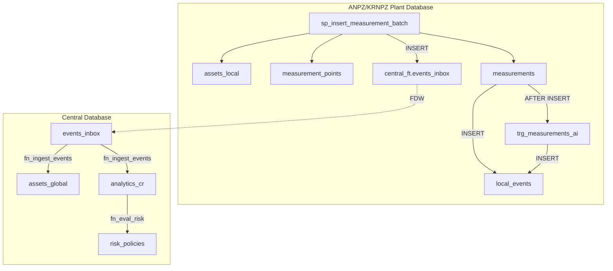

# Database Schema Design

<cite>
**Referenced Files in This Document**   
- [01_tables.sql](file://sql/central/01_tables.sql)
- [02_functions_core.sql](file://sql/central/02_functions_core.sql)
- [03_procedures.sql](file://sql/central/03_procedures.sql)
- [04_function_sp_ingest_events_legacy.sql](file://sql/central/04_function_sp_ingest_events_legacy.sql)
- [anpz/01_tables.sql](file://sql/anpz/01_tables.sql)
- [anpz/02_fdw.sql](file://sql/anpz/02_fdw.sql)
- [anpz/03_trigger_measurements_ai.sql](file://sql/anpz/03_trigger_measurements_ai.sql)
- [anpz/04_function_sp_insert_measurement_batch.sql](file://sql/anpz/04_function_sp_insert_measurement_batch.sql)
- [anpz/05_procedure_wrapper.sql](file://sql/anpz/05_procedure_wrapper.sql)
- [krnpz/01_tables.sql](file://sql/krnpz/01_tables.sql)
- [krnpz/02_fdw.sql](file://sql/krnpz/02_fdw.sql)
- [krnpz/03_trigger_measurements_ai.sql](file://sql/krnpz/03_trigger_measurements_ai.sql)
- [krnpz/04_function_sp_insert_measurement_batch.sql](file://sql/krnpz/04_function_sp_insert_measurement_batch.sql)
- [krnpz/05_procedure_wrapper.sql](file://sql/krnpz/05_procedure_wrapper.sql)
- [README.md](file://sql/README.md)
</cite>

## Table of Contents
1. [Introduction](#introduction)
2. [Central Database Schema](#central-database-schema)
3. [Plant Database Schema (ANPZ/KRNPZ)](#plant-database-schema-anpzkrnpz)
4. [Foreign Data Wrapper (FDW) Configuration](#foreign-data-wrapper-fdw-configuration)
5. [Stored Procedures and Functions](#stored-procedures-and-functions)
6. [Triggers and Event Processing](#triggers-and-event-processing)
7. [Data Validation and Business Rules](#data-validation-and-business-rules)
8. [Database Security and Access Control](#database-security-and-access-control)
9. [Schema Diagrams](#schema-diagrams)
10. [Conclusion](#conclusion)

## Introduction

The Oil ERP system employs a distributed database architecture consisting of one central database and multiple plant-specific databases (ANPZ and KRNPZ). This design enables decentralized data collection at plant level while maintaining centralized analytics, risk assessment, and asset management. The central database serves as the authoritative source for global asset information, corrosion rate analytics, and risk policies, while plant databases handle local measurement data and operational events.

Communication between plant and central databases is achieved through PostgreSQL's Foreign Data Wrapper (FDW) extension, allowing plant databases to publish measurement events to the central `events_inbox` table. The system uses idempotent DDL scripts for reliable deployment and supports batch processing of measurement data with automatic corrosion rate calculation and risk evaluation.

**Section sources**
- [README.md](file://sql/README.md#L1-L33)

## Central Database Schema

The central database contains four core tables that support global asset tracking, risk policy management, corrosion rate analytics, and event processing. These tables are designed to support high-volume ingestion of measurement data from multiple plants and provide a foundation for enterprise-wide analytics.

### Table: assets_global
Stores master data for all assets across the enterprise. Each asset is uniquely identified by `asset_code`.

**Columns:**
- `id`: BIGINT, primary key, auto-generated
- `asset_code`: TEXT, unique identifier, NOT NULL
- `name`: TEXT, descriptive name
- `type`: TEXT, asset classification
- `plant_code`: TEXT, originating plant identifier
- `created_at`: TIMESTAMPTZ, creation timestamp with default

**Constraints:**
- PRIMARY KEY: `id`
- UNIQUE: `asset_code`
- INDEX: `ix_assets_global_created_at` on `created_at`

### Table: risk_policies
Defines corrosion risk thresholds used for risk level classification.

**Columns:**
- `id`: BIGINT, primary key, auto-generated
- `name`: TEXT, policy name, unique, NOT NULL
- `threshold_low`: NUMERIC, low risk threshold
- `threshold_med`: NUMERIC, medium risk threshold
- `threshold_high`: NUMERIC, high risk threshold

**Constraints:**
- PRIMARY KEY: `id`
- UNIQUE: `name`

### Table: analytics_cr
Maintains current corrosion rate calculations for each asset based on historical thickness measurements.

**Columns:**
- `id`: BIGINT, primary key, auto-generated
- `asset_code`: TEXT, references `assets_global.asset_code`, NOT NULL
- `prev_thk`: NUMERIC, previous thickness measurement
- `prev_date`: TIMESTAMPTZ, timestamp of previous measurement
- `last_thk`: NUMERIC, latest thickness measurement
- `last_date`: TIMESTAMPTZ, timestamp of latest measurement
- `cr`: NUMERIC, calculated corrosion rate (mm/day)
- `updated_at`: TIMESTAMPTZ, last update timestamp with default

**Constraints:**
- PRIMARY KEY: `id`
- FOREIGN KEY: `asset_code` → `assets_global(asset_code)` with CASCADE UPDATE
- UNIQUE INDEX: `ux_analytics_cr_asset_code` on `asset_code`
- INDEX: `ix_analytics_cr_updated_at` on `updated_at`

### Table: events_inbox
Serves as a message queue for incoming measurement events from plant databases.

**Columns:**
- `id`: BIGINT, primary key, auto-generated
- `event_type`: TEXT, type of event
- `source_plant`: TEXT, identifier of originating plant
- `payload_json`: JSONB, structured event data, NOT NULL
- `created_at`: TIMESTAMPTZ, creation timestamp with default
- `processed_at`: TIMESTAMPTZ, processing completion timestamp (nullable)

**Constraints:**
- PRIMARY KEY: `id`
- INDEX: `ix_events_inbox_created_at` on `created_at`
- INDEX: `ix_events_inbox_processed_null` on `processed_at` WHERE `processed_at IS NULL` (optimized for unprocessed events)

**Section sources**
- [01_tables.sql](file://sql/central/01_tables.sql#L1-L51)

## Plant Database Schema (ANPZ/KRNPZ)

Each plant database (ANPZ and KRNPZ) contains a consistent schema for local data management. The schemas are identical in structure, with only the default `p_source_plant` value differing between them (ANPZ vs KRNPZ). This ensures uniform data collection practices across plants while allowing for plant-specific deployment.

### Table: assets_local
Stores local asset metadata specific to the plant.

**Columns:**
- `id`: BIGINT, primary key, auto-generated
- `asset_code`: TEXT, references global asset code, NOT NULL
- `location`: TEXT, physical location within plant
- `status`: TEXT, operational status
- `created_at`: TIMESTAMPTZ, creation timestamp with default

**Constraints:**
- PRIMARY KEY: `id`
- INDEX: `ix_assets_local_code` on `asset_code`
- INDEX: `ix_assets_local_created_at` on `created_at`

### Table: measurement_points
Defines specific locations on assets where thickness measurements are taken.

**Columns:**
- `id`: BIGINT, primary key, auto-generated
- `asset_id`: BIGINT, references `assets_local(id)`, NOT NULL
- `label`: TEXT, human-readable identifier for the measurement point, NOT NULL

**Constraints:**
- PRIMARY KEY: `id`
- FOREIGN KEY: `asset_id` → `assets_local(id)` with CASCADE DELETE
- UNIQUE CONSTRAINT: `uq_points_asset_label` on (`asset_id`, `label`)

### Table: measurements
Stores individual thickness measurement records.

**Columns:**
- `id`: BIGINT, primary key, auto-generated
- `point_id`: BIGINT, references `measurement_points(id)`, NOT NULL
- `ts`: TIMESTAMPTZ, timestamp of measurement, NOT NULL
- `thickness`: NUMERIC(10,3), measured thickness in mm, NOT NULL
- `note`: TEXT, optional measurement notes

**Constraints:**
- PRIMARY KEY: `id`
- FOREIGN KEY: `point_id` → `measurement_points(id)` with CASCADE DELETE
- CHECK CONSTRAINT: `thickness > 0`
- INDEX: `ix_measurements_point_ts` on (`point_id`, `ts`)

### Table: local_events
Local event log for auditing and debugging purposes.

**Columns:**
- `id`: BIGINT, primary key, auto-generated
- `event_type`: TEXT, type of event
- `payload_json`: JSONB, structured event data
- `created_at`: TIMESTAMPTZ, creation timestamp with default

**Constraints:**
- PRIMARY KEY: `id`
- INDEX: `ix_local_events_created_at` on `created_at`

**Section sources**
- [anpz/01_tables.sql](file://sql/anpz/01_tables.sql#L1-L37)
- [krnpz/01_tables.sql](file://sql/krnpz/01_tables.sql#L1-L37)

## Foreign Data Wrapper (FDW) Configuration

The system uses PostgreSQL's `postgres_fdw` extension to enable cross-database communication between plant databases and the central database. This configuration allows plant databases to insert records directly into the central `events_inbox` table without requiring application-level integration.

### FDW Setup (02_fdw.sql)

The FDW configuration consists of:
- Extension creation: `CREATE EXTENSION IF NOT EXISTS postgres_fdw`
- Foreign server definition: `central_srv` pointing to the central database
- User mapping: Dynamic creation of user mappings based on the current session user
- Foreign table: `central_ft.events_inbox` that maps to the central database's `events_inbox` table

The configuration uses a DO block to conditionally create user mappings only if they don't already exist, enhancing security by avoiding hardcoded credentials. The script includes commented-out code for explicit credential specification when required by security policies.

The foreign table `central_ft.events_inbox` is defined with the same structure as the central database's `events_inbox` table, enabling transparent INSERT operations from plant databases into the central message queue.

**Section sources**
- [anpz/02_fdw.sql](file://sql/anpz/02_fdw.sql#L1-L37)
- [krnpz/02_fdw.sql](file://sql/krnpz/02_fdw.sql#L1-L37)

## Stored Procedures and Functions

The database implements a comprehensive set of functions and procedures to encapsulate business logic and ensure data consistency across the distributed system.

### Central Database Functions

#### fn_calc_cr
Calculates corrosion rate (CR) in mm/day based on two thickness measurements and their timestamps. Returns NULL if any required parameter is missing.

#### fn_asset_upsert
Idempotent function that inserts a new asset or updates existing asset information. Uses `ON CONFLICT` to handle duplicates and COALESCE to preserve existing values when new ones are not provided.

#### fn_policy_upsert
Manages risk policies by inserting new policies or updating existing ones based on policy name.

#### fn_events_enqueue
Adds new events to the `events_inbox` queue with proper null handling for payload data.

#### fn_ingest_events
Core data processing function that:
1. Reads unprocessed events from `events_inbox`
2. Parses JSON payload to extract measurement data
3. Upserts asset records into `assets_global`
4. Updates corrosion rate analytics in `analytics_cr`
5. Marks processed events with `processed_at` timestamp

This function uses `FOR UPDATE SKIP LOCKED` to support concurrent execution and prevent race conditions.

#### fn_events_requeue and fn_events_cleanup
Utility functions for message queue management, allowing reprocessing of failed events and cleanup of historical data.

#### fn_eval_risk
Evaluates risk level (HIGH, MEDIUM, LOW, OK, UNKNOWN) based on corrosion rate and configured thresholds.

#### fn_asset_summary_json
Generates comprehensive JSON summary of an asset including metadata, analytics, and risk assessment.

#### fn_top_assets_by_cr
Returns the top N assets with highest corrosion rates for prioritization of maintenance activities.

### Plant Database Functions

#### sp_insert_measurement_batch
Primary interface for submitting measurement data from plant operations. This function:
1. Validates input parameters
2. Ensures asset exists in `assets_local`
3. Creates measurement points if they don't exist
4. Inserts measurement records
5. Calculates first and last measurements for corrosion rate calculation
6. Publishes summary event to central `events_inbox` via FDW

The function returns the number of inserted measurements and uses transactional semantics to ensure data consistency.

### Procedure Wrappers

All core functions have corresponding procedure wrappers (e.g., `sp_ingest_events`, `sp_asset_upsert`) that provide a consistent interface for applications and tools that prefer procedure calls over function calls. These wrappers simply invoke the underlying functions using PERFORM.

**Section sources**
- [02_functions_core.sql](file://sql/central/02_functions_core.sql#L1-L265)
- [03_procedures.sql](file://sql/central/03_procedures.sql#L1-L42)
- [anpz/04_function_sp_insert_measurement_batch.sql](file://sql/anpz/04_function_sp_insert_measurement_batch.sql#L1-L84)
- [krnpz/04_function_sp_insert_measurement_batch.sql](file://sql/krnpz/04_function_sp_insert_measurement_batch.sql#L1-L84)
- [anpz/05_procedure_wrapper.sql](file://sql/anpz/05_procedure_wrapper.sql#L1-L10)
- [krnpz/05_procedure_wrapper.sql](file://sql/krnpz/05_procedure_wrapper.sql#L1-L10)

## Triggers and Event Processing

The plant databases implement trigger-based event processing to automatically generate audit events when new measurements are recorded.

### trg_measurements_ai Trigger

This AFTER INSERT trigger fires on the `measurements` table and executes the `trg_measurements_ai_fn` function. For each inserted measurement, it creates a corresponding entry in the `local_events` table with:
- `event_type`: 'MEAS_INSERT'
- `payload_json`: JSONB object containing `point_id`, `ts`, and `thickness`

This provides a complete audit trail of all measurement activities at the plant level, which can be used for operational monitoring, debugging, and compliance reporting.

The trigger uses `DROP TRIGGER IF EXISTS` followed by `CREATE TRIGGER` to ensure idempotent deployment, allowing the script to be safely re-executed during updates or migrations.

**Section sources**
- [anpz/03_trigger_measurements_ai.sql](file://sql/anpz/03_trigger_measurements_ai.sql#L1-L14)
- [krnpz/03_trigger_measurements_ai.sql](file://sql/krnpz/03_trigger_measurements_ai.sql#L1-L14)

## Data Validation and Business Rules

The database schema enforces multiple layers of data validation and business rules to ensure data quality and consistency.

### Data Type Constraints
- `thickness` in `measurements` table uses NUMERIC(10,3) to ensure precision in millimeter measurements
- Timestamps use TIMESTAMPTZ to handle time zones consistently
- Text fields use appropriate types without arbitrary length limits

### Check Constraints
- `measurements.thickness > 0`: Ensures physically meaningful thickness values
- `events_inbox.payload_json NOT NULL`: Guarantees message integrity

### Unique Constraints
- `assets_global.asset_code` is UNIQUE to prevent duplicate asset registration
- `measurement_points` has a composite unique constraint on (`asset_id`, `label`) to prevent duplicate measurement points

### Foreign Key Constraints
- Referential integrity between `measurement_points` and `assets_local`
- Referential integrity between `measurements` and `measurement_points`
- Referential integrity between `analytics_cr` and `assets_global`

### Business Rule Enforcement
- Corrosion rate calculation is centralized in `fn_calc_cr` to ensure consistent methodology
- Risk assessment uses standardized thresholds defined in `risk_policies`
- Batch measurement processing calculates corrosion rates based on first and last measurements, not averages
- Event processing uses `processed_at` flag to prevent duplicate processing of messages

**Section sources**
- [01_tables.sql](file://sql/central/01_tables.sql#L1-L51)
- [anpz/01_tables.sql](file://sql/anpz/01_tables.sql#L1-L37)

## Database Security and Access Control

The system implements multiple security measures at the database level to protect sensitive operational data.

### Authentication and Authorization
- FDW configuration uses session user-based authentication by default
- Option to configure explicit credentials for enhanced security in production environments
- All DDL scripts are idempotent, reducing risk of deployment errors

### Data Privacy
- Measurement data is stored with sufficient precision for engineering purposes but without unnecessary detail
- JSONB fields allow structured data storage while maintaining flexibility
- Event payloads contain only necessary information for corrosion rate calculation

### Access Patterns
- Plant databases have write access to central `events_inbox` via FDW
- Central database processes events and updates analytics without requiring direct access to plant data
- Read-only access to analytics and risk assessment data is provided through functions like `fn_asset_summary_json`

### Deployment Security
- Scripts use `IF NOT EXISTS` and `OR REPLACE` clauses to prevent errors during re-execution
- User mapping creation is conditional to avoid credential exposure
- Commented credential example reminds administrators to configure proper authentication

**Section sources**
- [anpz/02_fdw.sql](file://sql/anpz/02_fdw.sql#L1-L37)
- [README.md](file://sql/README.md#L25-L33)

## Schema Diagrams

```mermaid
erDiagram
assets_global {
bigint id PK
text asset_code UK
text name
text type
text plant_code
timestamptz created_at
}
risk_policies {
bigint id PK
text name UK
numeric threshold_low
numeric threshold_med
numeric threshold_high
}
analytics_cr {
bigint id PK
text asset_code FK
numeric prev_thk
timestamptz prev_date
numeric last_thk
numeric last_date
numeric cr
timestamptz updated_at
}
events_inbox {
bigint id PK
text event_type
text source_plant
jsonb payload_json NN
timestamptz created_at
timestamptz processed_at
}
assets_local {
bigint id PK
text asset_code
text location
text status
timestamptz created_at
}
measurement_points {
bigint id PK
bigint asset_id FK
text label
}
measurements {
bigint id PK
bigint point_id FK
timestamptz ts NN
numeric thickness NN
text note
}
local_events {
bigint id PK
text event_type
jsonb payload_json
timestamptz created_at
}
assets_global ||--o{ analytics_cr : "1:N"
assets_global ||--o{ events_inbox : "1:N"
assets_local ||--o{ measurement_points : "1:N"
measurement_points ||--o{ measurements : "1:N"
assets_local ||--o{ local_events : "1:N"
```

**Diagram sources**
- [01_tables.sql](file://sql/central/01_tables.sql#L1-L51)
- [anpz/01_tables.sql](file://sql/anpz/01_tables.sql#L1-L37)



**Diagram sources**
- [anpz/02_fdw.sql](file://sql/anpz/02_fdw.sql#L1-L37)
- [02_functions_core.sql](file://sql/central/02_functions_core.sql#L1-L265)
- [anpz/04_function_sp_insert_measurement_batch.sql](file://sql/anpz/04_function_sp_insert_measurement_batch.sql#L1-L84)

## Conclusion

The Oil ERP system's database architecture effectively balances decentralized data collection with centralized analytics and risk management. The distributed design allows plant operations to function independently while ensuring that critical asset integrity data is consolidated for enterprise-wide monitoring and decision-making.

Key strengths of the schema design include:
- Idempotent DDL scripts that support reliable deployment and updates
- Comprehensive business logic encapsulated in database functions
- Robust event processing pipeline using a message queue pattern
- Consistent data validation and constraint enforcement
- Secure cross-database communication via FDW

The architecture demonstrates a thoughtful approach to industrial data management, prioritizing data integrity, auditability, and scalability. By centralizing corrosion rate calculations and risk assessment while decentralizing data collection, the system ensures consistent analytics methodology across all plants while accommodating local operational requirements.

**Section sources**
- [README.md](file://sql/README.md#L1-L33)
- All referenced SQL files