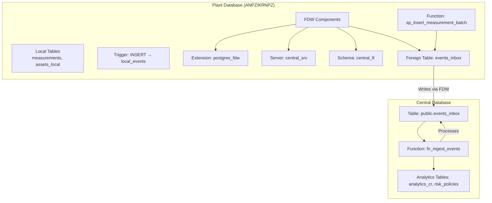
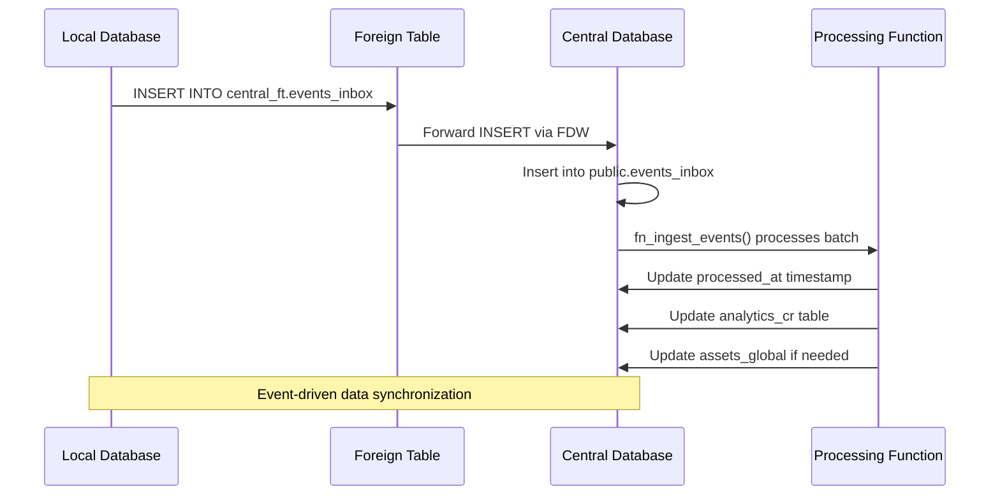

# Foreign Data Wrapper (FDW) Setup

<cite>
**Referenced Files in This Document**  
- [sql/anpz/02_fdw.sql](file://sql/anpz/02_fdw.sql)
- [sql/krnpz/02_fdw.sql](file://sql/krnpz/02_fdw.sql)
- [sql/central/01_tables.sql](file://sql/central/01_tables.sql)
- [sql/central/02_functions_core.sql](file://sql/central/02_functions_core.sql)
- [sql/README.md](file://sql/README.md)
</cite>

## Table of Contents
1. [Introduction](#introduction)
2. [FDW Architecture Overview](#fdw-architecture-overview)
3. [Core Components](#core-components)
4. [Configuration Details](#configuration-details)
5. [Security Considerations](#security-considerations)
6. [Event-Driven Workflow](#event-driven-workflow)
7. [Troubleshooting Guide](#troubleshooting-guide)
8. [Conclusion](#conclusion)

## Introduction

This document details the Foreign Data Wrapper (FDW) configuration that enables secure cross-database communication between plant-specific databases (ANPZ and KRNPZ) and a central database in the ERP system. The setup leverages PostgreSQL's `postgres_fdw` extension to create a seamless integration layer, allowing local databases to publish events to a centralized event inbox. This architecture supports an event-driven design pattern critical for maintaining data consistency and enabling centralized analytics across distributed plant systems.

The FDW implementation is idempotent and designed for repeated execution, ensuring safe deployment and updates. It is configured in both ANPZ and KRNPZ environments with identical structure, differing only in their default plant identifiers.

**Section sources**  
- [sql/anpz/02_fdw.sql](file://sql/anpz/02_fdw.sql#L0-L36)
- [sql/krnpz/02_fdw.sql](file://sql/krnpz/02_fdw.sql#L0-L36)
- [sql/README.md](file://sql/README.md#L15-L20)

## FDW Architecture Overview



**Diagram sources**  
- [sql/anpz/02_fdw.sql](file://sql/anpz/02_fdw.sql#L0-L36)
- [sql/central/01_tables.sql](file://sql/central/01_tables.sql#L35-L51)
- [sql/central/02_functions_core.sql](file://sql/central/02_functions_core.sql#L130-L200)

## Core Components

The FDW setup consists of several key components that work together to enable secure and reliable cross-database communication.

### postgres_fdw Extension

The `postgres_fdw` extension is the foundation of the foreign data wrapper system. It allows PostgreSQL to access data stored in external PostgreSQL servers as if they were local tables. The extension is conditionally created using `CREATE EXTENSION IF NOT EXISTS`, ensuring idempotency.

### Foreign Server (central_srv)

The foreign server `central_srv` defines the connection endpoint to the central database. It specifies the host, database name, and port required to establish connectivity. This abstraction allows applications to reference a logical server name rather than embedding connection details throughout the codebase.

### User Mapping and Authentication

User mapping establishes how local database users authenticate to the remote central database. The configuration uses session-based user mapping, where the current session user is mapped to a user with the same name on the remote server. This approach enhances security by avoiding hardcoded credentials.

### Foreign Table (events_inbox)

The foreign table `central_ft.events_inbox` provides a local interface to the remote `public.events_inbox` table in the central database. It defines the exact schema expected by the central system, ensuring data compatibility and integrity during event publication.

**Section sources**  
- [sql/anpz/02_fdw.sql](file://sql/anpz/02_fdw.sql#L1-L36)
- [sql/central/01_tables.sql](file://sql/central/01_tables.sql#L35-L51)

## Configuration Details

### Server Definition

The foreign server is defined with the following connection options:

```sql
CREATE SERVER central_srv
  FOREIGN DATA WRAPPER postgres_fdw
  OPTIONS (host 'localhost', dbname 'central', port '5432');
```

These parameters can be adjusted based on deployment environment:
- **host**: Address of the central database server
- **dbname**: Name of the central database
- **port**: PostgreSQL port (typically 5432)

### Schema Organization

The `central_ft` schema serves as a dedicated namespace for all foreign tables related to the central database. This organizational pattern:
- Isolates remote objects from local tables
- Provides clear ownership and authorization
- Facilitates permission management
- Enhances readability and maintainability

The schema is created with `AUTHORIZATION CURRENT_USER`, ensuring the executing user has appropriate privileges.

### Foreign Table Mapping

The foreign table `events_inbox` is precisely mapped to its remote counterpart:

```sql
CREATE FOREIGN TABLE central_ft.events_inbox (
  id           BIGINT,
  event_type   TEXT,
  source_plant TEXT,
  payload_json JSONB,
  created_at   TIMESTAMPTZ,
  processed_at TIMESTAMPTZ
)
SERVER central_srv
OPTIONS (schema_name 'public', table_name 'events_inbox');
```

Before creation, any existing foreign table is dropped with `DROP FOREIGN TABLE IF EXISTS` to ensure a clean state.

**Section sources**  
- [sql/anpz/02_fdw.sql](file://sql/anpz/02_fdw.sql#L10-L36)

## Security Considerations

### Dynamic User Mapping

The FDW configuration employs a secure, dynamic user mapping strategy:

```sql
DO $$
BEGIN
  IF NOT EXISTS (
    SELECT 1 FROM pg_user_mappings m
    JOIN pg_foreign_server s ON s.oid = m.srvid
    WHERE s.srvname = 'central_srv'
      AND m.umuser = (SELECT oid FROM pg_roles WHERE rolname = SESSION_USER)
  ) THEN
    EXECUTE format('CREATE USER MAPPING FOR %I SERVER central_srv OPTIONS (user %L)',
                   SESSION_USER, SESSION_USER);
  END IF;
END$$;
```

This approach:
- Uses the current session user for authentication
- Prevents hardcoded passwords in configuration files
- Automatically creates mappings only when needed
- Follows the principle of least privilege

### Secure Credential Management

As noted in the documentation, explicit credentials are commented out:

```sql
-- CREATE USER MAPPING IF NOT EXISTS FOR CURRENT_USER SERVER central_srv
--   OPTIONS (user 'erp_owner', password 'CHANGE_ME');
```

This practice:
- Prevents accidental exposure of sensitive credentials
- Encourages use of external authentication mechanisms
- Requires manual intervention to enable password-based authentication
- Supports environment-specific credential injection

For production deployments, consider using:
- PostgreSQL peer authentication
- Certificate-based authentication
- External credential managers
- Environment variables with restricted access

**Section sources**  
- [sql/anpz/02_fdw.sql](file://sql/anpz/02_fdw.sql#L10-L25)
- [sql/README.md](file://sql/README.md#L30-L33)

## Event-Driven Workflow



**Diagram sources**  
- [sql/anpz/02_fdw.sql](file://sql/anpz/02_fdw.sql#L30-L36)
- [sql/central/02_functions_core.sql](file://sql/central/02_functions_core.sql#L130-L200)

The FDW setup enables a robust event-driven architecture:

1. **Event Generation**: Local databases generate events through business operations (e.g., measurement insertions)
2. **Event Publication**: Events are inserted into `central_ft.events_inbox` using standard SQL INSERT statements
3. **Transparent Forwarding**: The FDW layer automatically forwards these inserts to the remote `public.events_inbox` table
4. **Central Processing**: The central database processes events through scheduled execution of `fn_ingest_events()`
5. **Analytics Update**: Processed events update centralized analytics tables like `analytics_cr`

This pattern decouples plant operations from central analytics, allowing:
- Independent scaling of plant and central systems
- Resilient communication (events persist even if central system is temporarily unavailable)
- Auditability through the `processed_at` timestamp
- Replay capability for failed processing

## Troubleshooting Guide

### Connectivity Failures

**Symptoms**: 
- "could not connect to server" errors
- Timeout during INSERT operations

**Solutions**:
1. Verify network connectivity between plant and central servers
2. Check that the central PostgreSQL instance is running and accessible
3. Validate host, port, and dbname in the server definition
4. Ensure firewall rules allow traffic on the PostgreSQL port
5. Test connectivity using `psql` or similar client tools

### Permission Errors

**Symptoms**:
- "permission denied for foreign table"
- "user mapping not found"

**Solutions**:
1. Verify the user mapping exists for the current session user
2. Check that the remote user has INSERT privileges on `public.events_inbox`
3. Ensure the local user has USAGE privilege on the foreign server
4. Confirm the user has INSERT privilege on the foreign table
5. Validate that the session user exists on both local and remote systems

### Schema Synchronization Issues

**Symptoms**:
- "column does not exist" errors
- Data type mismatch exceptions

**Solutions**:
1. Compare the foreign table definition with the remote table schema
2. Ensure all columns and data types match exactly
3. Verify that any schema changes in the central database are reflected in the foreign table
4. Re-create the foreign table after central schema changes
5. Use `DROP FOREIGN TABLE IF EXISTS` followed by `CREATE FOREIGN TABLE` for updates

### Performance Problems

**Symptoms**:
- Slow INSERT operations into foreign table
- High latency in event processing

**Solutions**:
1. Monitor network latency between systems
2. Consider batching multiple events into a single transaction
3. Ensure proper indexing on the remote `events_inbox` table
4. Verify that the `processed_at` index exists for efficient processing
5. Monitor resource usage on both local and central database servers

**Section sources**  
- [sql/anpz/02_fdw.sql](file://sql/anpz/02_fdw.sql#L0-L36)
- [sql/central/01_tables.sql](file://sql/central/01_tables.sql#L35-L51)
- [sql/central/02_functions_core.sql](file://sql/central/02_functions_core.sql#L130-L200)

## Conclusion

The Foreign Data Wrapper configuration provides a secure, reliable mechanism for cross-database communication between plant databases and the central ERP system. By leveraging PostgreSQL's native FDW capabilities, the architecture enables an event-driven design that supports distributed operations while maintaining centralized analytics and control.

Key advantages of this implementation include:
- **Security**: Dynamic user mapping avoids hardcoded credentials
- **Reliability**: Idempotent scripts ensure consistent deployment
- **Scalability**: Decoupled architecture allows independent scaling
- **Maintainability**: Clear separation of concerns through dedicated schema
- **Resilience**: Event queue pattern provides fault tolerance

The setup serves as a foundation for enterprise integration, enabling real-time data synchronization, centralized monitoring, and coordinated business processes across multiple plant locations.