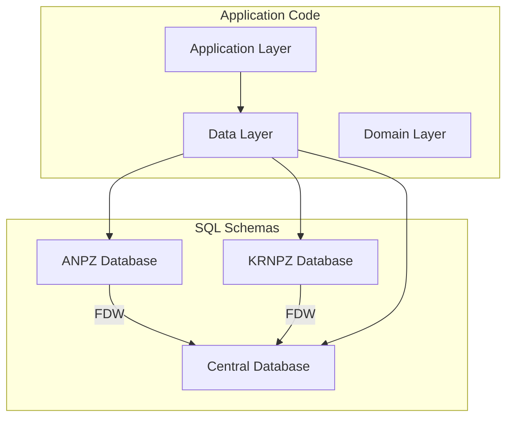
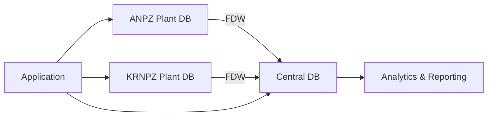
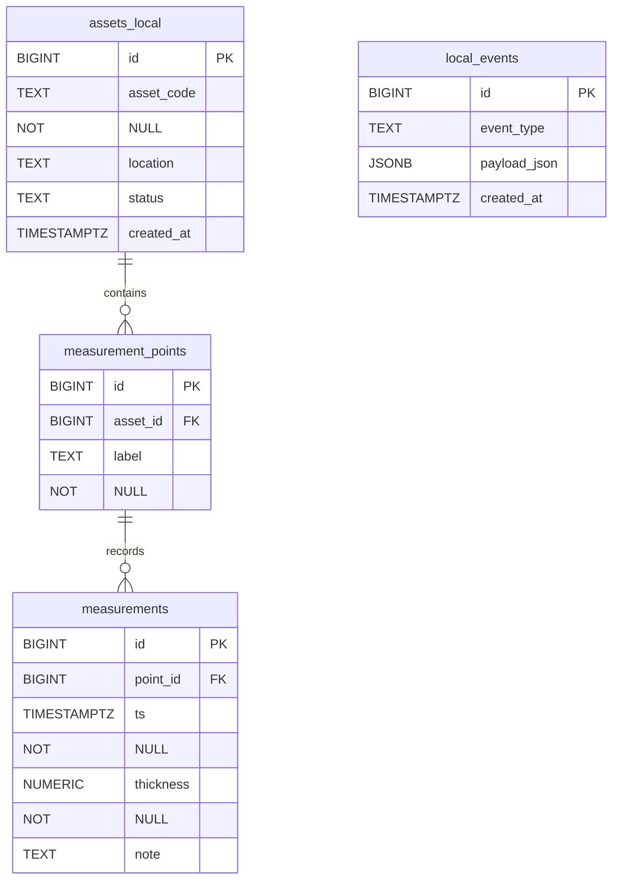
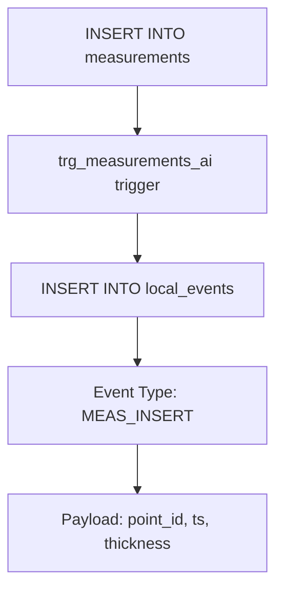
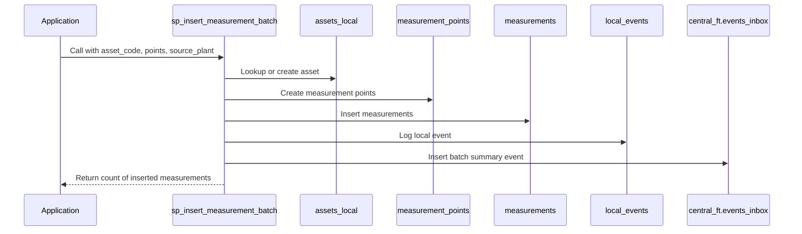
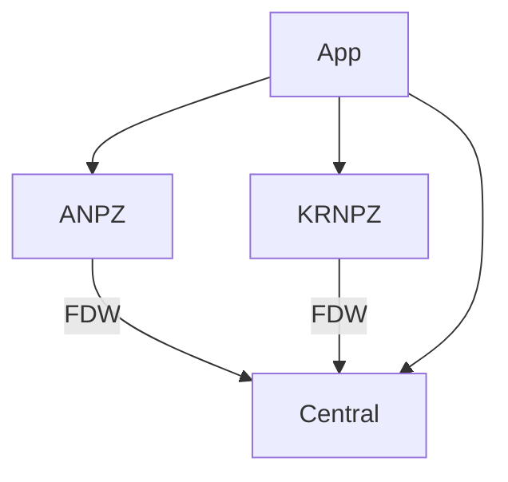

# Plant Databases Schema (ANPZ & KRNPZ)

<cite>
**Referenced Files in This Document**   
- [01_tables.sql](file://sql/anpz/01_tables.sql)
- [01_tables.sql](file://sql/krnpz/01_tables.sql)
- [03_trigger_measurements_ai.sql](file://sql/anpz/03_trigger_measurements_ai.sql)
- [04_function_sp_insert_measurement_batch.sql](file://sql/anpz/04_function_sp_insert_measurement_batch.sql)
- [05_procedure_wrapper.sql](file://sql/anpz/05_procedure_wrapper.sql)
- [02_fdw.sql](file://sql/anpz/02_fdw.sql)
- [01_tables.sql](file://sql/central/01_tables.sql)
- [DatabaseInfrastructure.cs](file://src/OilErp.Data/Infrastructure/DatabaseInfrastructure.cs)
- [AssetValidators.cs](file://src/OilErp.App/Validators/AssetValidators.cs)
</cite>

## Table of Contents
1. [Introduction](#introduction)
2. [Project Structure](#project-structure)
3. [Core Components](#core-components)
4. [Architecture Overview](#architecture-overview)
5. [Detailed Component Analysis](#detailed-component-analysis)
6. [Dependency Analysis](#dependency-analysis)
7. [Performance Considerations](#performance-considerations)
8. [Troubleshooting Guide](#troubleshooting-guide)
9. [Conclusion](#conclusion)

## Introduction
The Oil ERP system utilizes two identical plant databases, ANPZ and KRNPZ, to manage local asset, measurement, and work order data. These databases operate independently at the plant level while maintaining synchronization with a central database through Foreign Data Wrapper (FDW) and event-driven mechanisms. This document details the schema structure, data models, triggers, stored procedures, and integration mechanisms for the plant databases, focusing on data integrity, local validation, and cross-database communication.

## Project Structure
The project is organized into SQL schema definitions for each database (ANPZ, KRNPZ, central) and application code in C# for data access and business logic. The SQL scripts define tables, triggers, functions, and FDW configurations, while the C# code handles connection management, validation, and service orchestration.

**Diagram sources**
- [01_tables.sql](file://sql/anpz/01_tables.sql)
- [02_fdw.sql](file://sql/anpz/02_fdw.sql)
- [DatabaseInfrastructure.cs](file://src/OilErp.Data/Infrastructure/DatabaseInfrastructure.cs)

**Section sources**
- [01_tables.sql](file://sql/anpz/01_tables.sql)
- [01_tables.sql](file://sql/krnpz/01_tables.sql)
- [01_tables.sql](file://sql/central/01_tables.sql)
- [DatabaseInfrastructure.cs](file://src/OilErp.Data/Infrastructure/DatabaseInfrastructure.cs)

## Core Components
The core components of the plant databases include the `assets_local`, `measurement_points`, `measurements`, and `local_events` tables, along with the `sp_insert_measurement_batch` function and `trg_measurements_ai` trigger. These components work together to store asset data, record thickness measurements, generate local events, and propagate batch measurement data to the central system.

**Section sources**
- [01_tables.sql](file://sql/anpz/01_tables.sql)
- [04_function_sp_insert_measurement_batch.sql](file://sql/anpz/04_function_sp_insert_measurement_batch.sql)
- [03_trigger_measurements_ai.sql](file://sql/anpz/03_trigger_measurements_ai.sql)

## Architecture Overview
The plant databases (ANPZ and KRNPZ) maintain identical schemas and operate as local data stores for their respective plants. They use PostgreSQL's Foreign Data Wrapper to connect to the central database and insert events into the `events_inbox` table. The central database aggregates data from all plants for analytics and reporting. The application layer uses connection factories to route requests to the appropriate database.

**Diagram sources**
- [02_fdw.sql](file://sql/anpz/02_fdw.sql)
- [01_tables.sql](file://sql/central/01_tables.sql)
- [DatabaseInfrastructure.cs](file://src/OilErp.Data/Infrastructure/DatabaseInfrastructure.cs)

## Detailed Component Analysis

### Data Model Analysis
The plant databases use a normalized schema to represent assets, measurement points, and measurements. The `assets_local` table stores asset metadata, `measurement_points` defines inspection locations on assets, and `measurements` records thickness readings over time. The `local_events` table captures data change events for auditing and synchronization.

**Diagram sources**
- [01_tables.sql](file://sql/anpz/01_tables.sql)
- [01_tables.sql](file://sql/krnpz/01_tables.sql)

**Section sources**
- [01_tables.sql](file://sql/anpz/01_tables.sql)
- [01_tables.sql](file://sql/krnpz/01_tables.sql)

### Trigger Logic Analysis
The `trg_measurements_ai` trigger fires after each insertion into the `measurements` table. It logs the new measurement data into the `local_events` table with event type 'MEAS_INSERT', capturing the point ID, timestamp, and thickness for audit and synchronization purposes.

**Diagram sources**
- [03_trigger_measurements_ai.sql](file://sql/anpz/03_trigger_measurements_ai.sql)

**Section sources**
- [03_trigger_measurements_ai.sql](file://sql/anpz/03_trigger_measurements_ai.sql)

### Stored Procedure Analysis
The `sp_insert_measurement_batch` function processes a batch of measurement data for a specific asset. It validates input parameters, ensures the asset exists, creates measurement points as needed, inserts measurements, and sends a summary event to the central database via the FDW-linked `events_inbox` table. The wrapper procedure `sp_insert_measurement_batch_prc` provides a procedural interface to this function.

**Diagram sources**
- [04_function_sp_insert_measurement_batch.sql](file://sql/anpz/04_function_sp_insert_measurement_batch.sql)
- [05_procedure_wrapper.sql](file://sql/anpz/05_procedure_wrapper.sql)

**Section sources**
- [04_function_sp_insert_measurement_batch.sql](file://sql/anpz/04_function_sp_insert_measurement_batch.sql)
- [05_procedure_wrapper.sql](file://sql/anpz/05_procedure_wrapper.sql)

## Dependency Analysis
The plant databases depend on the central database for event ingestion and analytics. The FDW configuration establishes a server connection and user mapping, allowing the plant databases to write to the central `events_inbox` table. The application layer depends on both plant and central databases through the `DatabaseConnectionFactory`.

**Diagram sources**
- [02_fdw.sql](file://sql/anpz/02_fdw.sql)
- [DatabaseInfrastructure.cs](file://src/OilErp.Data/Infrastructure/DatabaseInfrastructure.cs)

**Section sources**
- [02_fdw.sql](file://sql/anpz/02_fdw.sql)
- [DatabaseInfrastructure.cs](file://src/OilErp.Data/Infrastructure/DatabaseInfrastructure.cs)

## Performance Considerations
The schema includes indexes on frequently queried columns such as `asset_code`, `created_at`, and `(point_id, ts)` to optimize query performance. The batch insertion process minimizes round trips by using CTEs and bulk operations. The FDW connection should be monitored for latency, and the `events_inbox` table in the central database has a partial index on unprocessed events to optimize polling.

## Troubleshooting Guide
Common issues include FDW connection failures, which can be resolved by verifying server options and user mappings. Data validation errors in `sp_insert_measurement_batch` typically stem from null or malformed JSON input. Trigger failures may occur if the `local_events` table is inaccessible. Application-level issues often relate to incorrect connection strings in configuration.

**Section sources**
- [02_fdw.sql](file://sql/anpz/02_fdw.sql)
- [04_function_sp_insert_measurement_batch.sql](file://sql/anpz/04_function_sp_insert_measurement_batch.sql)
- [AssetValidators.cs](file://src/OilErp.App/Validators/AssetValidators.cs)

## Conclusion
The ANPZ and KRNPZ plant databases provide a robust local data management solution with strong data integrity, event-driven synchronization, and centralized analytics. The identical schema structure ensures consistency across plants, while the FDW integration enables seamless data flow to the central system. The combination of database-level triggers and application-level validation ensures data quality and system reliability.