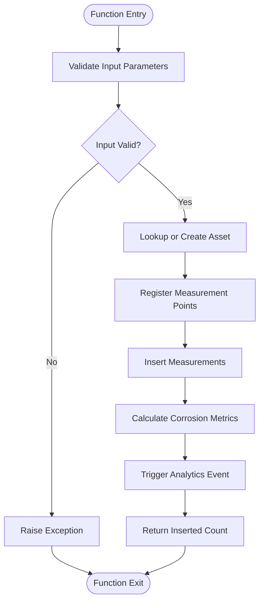
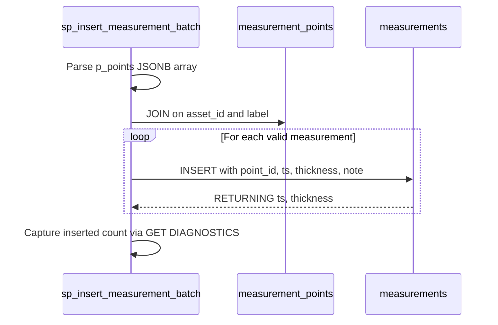
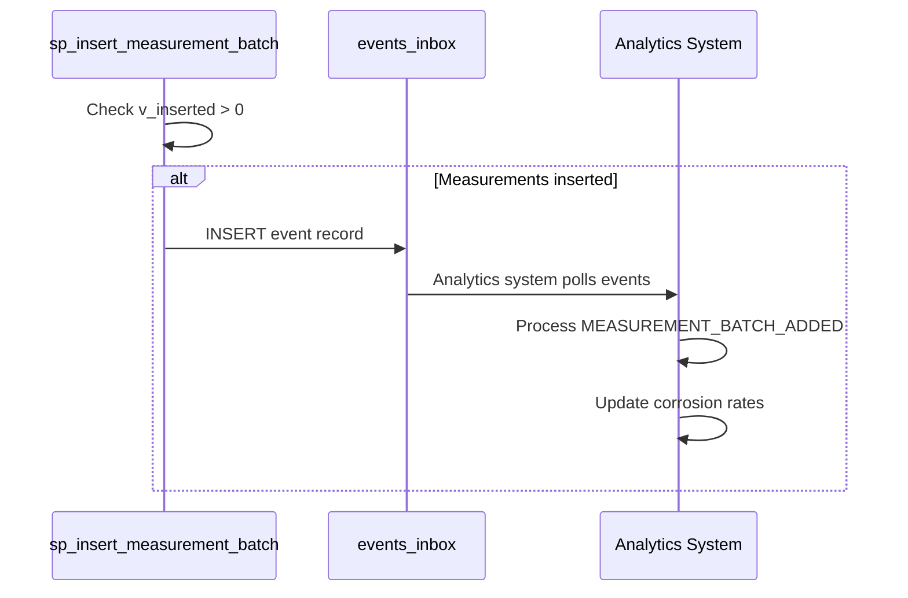
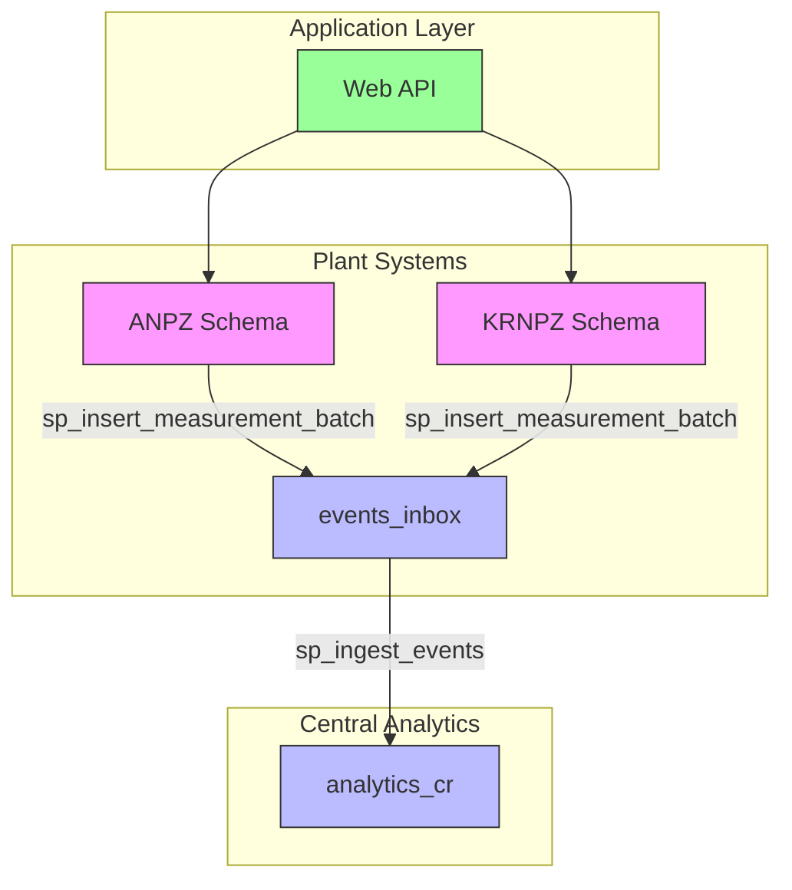

# Stored Procedures for Batch Processing

<cite>
**Referenced Files in This Document**   
- [sql/anpz/04_function_sp_insert_measurement_batch.sql](file://sql/anpz/04_function_sp_insert_measurement_batch.sql)
- [sql/krnpz/04_function_sp_insert_measurement_batch.sql](file://sql/krnpz/04_function_sp_insert_measurement_batch.sql)
- [sql/central/04_function_sp_ingest_events_legacy.sql](file://sql/central/04_function_sp_ingest_events_legacy.sql)
- [sql/central/01_tables.sql](file://sql/central/01_tables.sql)
- [src/OilErp.App/Controllers/MeasurementsController.cs](file://src/OilErp.App/Controllers/MeasurementsController.cs)
- [src/OilErp.Domain/ValueObjects/ValueObjects.cs](file://src/OilErp.Domain/ValueObjects/ValueObjects.cs)
- [src/OilErp.App/Models/ApiModels.cs](file://src/OilErp.App/Models/ApiModels.cs)
</cite>

## Table of Contents
1. [Introduction](#introduction)
2. [Function Overview](#function-overview)
3. [Input Parameters](#input-parameters)
4. [Core Logic and Workflow](#core-logic-and-workflow)
5. [Asset and Measurement Point Management](#asset-and-measurement-point-management)
6. [Bulk Measurement Insertion](#bulk-measurement-insertion)
7. [Corrosion Rate Calculation](#corrosion-rate-calculation)
8. [Event Integration](#event-integration)
9. [Return Value and Error Handling](#return-value-and-error-handling)
10. [Usage Examples](#usage-examples)
11. [Performance Considerations](#performance-considerations)
12. [Transaction Isolation](#transaction-isolation)
13. [Architecture Overview](#architecture-overview)

## Introduction

The `sp_insert_measurement_batch` function is a critical component in the industrial measurement system, designed to handle bulk ingestion of thickness measurement data from plant inspection systems. This stored procedure enables efficient processing of multiple measurement points for a specific asset in a single transaction, ensuring data consistency and performance optimization. The function serves as the primary interface between plant-level data collection systems and the central analytics platform, facilitating real-time monitoring of asset health and corrosion rates across multiple industrial facilities.

**Section sources**
- [sql/anpz/04_function_sp_insert_measurement_batch.sql](file://sql/anpz/04_function_sp_insert_measurement_batch.sql)
- [sql/krnpz/04_function_sp_insert_measurement_batch.sql](file://sql/krnpz/04_function_sp_insert_measurement_batch.sql)

## Function Overview

The `sp_insert_measurement_batch` function is implemented as a PostgreSQL PL/pgSQL function that processes a batch of measurement data for a specific asset. It accepts three parameters: the asset identifier, an array of measurement points in JSONB format, and the source plant code. The function performs comprehensive validation, ensures asset existence, registers measurement points, inserts measurement data, calculates corrosion metrics, and triggers downstream analytics processes through event integration.

The function is deployed in multiple plant schemas (ANPZ and KRNPZ) with identical logic but plant-specific default values for the source plant parameter. This design enables centralized management of measurement data while maintaining plant-level autonomy in data collection. The function returns an integer representing the number of successfully inserted measurement rows, providing immediate feedback on the operation's success.

**Section sources**
- [sql/anpz/04_function_sp_insert_measurement_batch.sql](file://sql/anpz/04_function_sp_insert_measurement_batch.sql#L1-L10)
- [sql/krnpz/04_function_sp_insert_measurement_batch.sql](file://sql/krnpz/04_function_sp_insert_measurement_batch.sql#L1-L10)

## Input Parameters

The function accepts three input parameters that define the measurement batch context and data:

- **p_asset_code (TEXT)**: The unique identifier for the asset being measured. This parameter is mandatory and must contain a non-empty string value. The function validates this parameter and raises an exception if it is null or consists only of whitespace characters.

- **p_points (JSONB)**: A JSONB array containing measurement point data. Each element in the array represents a single measurement with properties including label, timestamp, thickness value, and optional notes. The function validates that this parameter is a valid JSONB array and raises an exception if the input is null or not an array.

- **p_source_plant (TEXT)**: The code identifying the plant facility from which the measurements originate. This parameter is used to route events and analytics to the appropriate processing context. If not provided, the function defaults to the plant-specific code (ANPZ or KRNPZ) based on the schema in which it is deployed.

**Section sources**
- [sql/anpz/04_function_sp_insert_measurement_batch.sql](file://sql/anpz/04_function_sp_insert_measurement_batch.sql#L1-L20)
- [sql/krnpz/04_function_sp_insert_measurement_batch.sql](file://sql/krnpz/04_function_sp_insert_measurement_batch.sql#L1-L20)

## Core Logic and Workflow

The function implements a comprehensive workflow for processing measurement batches, structured into several distinct phases executed within a single database transaction. This transactional approach ensures atomicity, consistency, isolation, and durability (ACID) properties for the entire batch operation.

The workflow begins with input validation, followed by asset lookup or creation, measurement point registration, bulk measurement insertion, corrosion metric calculation, and event triggering. Each phase builds upon the previous one, with the function maintaining state through local variables that capture key metrics from the processing pipeline.

The function's logic is designed to handle both new and existing assets transparently, automatically creating asset records when they don't exist while preserving existing data for known assets. This eliminates the need for separate asset registration steps and simplifies the integration process for plant operators.



**Diagram sources**
- [sql/anpz/04_function_sp_insert_measurement_batch.sql](file://sql/anpz/04_function_sp_insert_measurement_batch.sql#L21-L85)
- [sql/krnpz/04_function_sp_insert_measurement_batch.sql](file://sql/krnpz/04_function_sp_insert_measurement_batch.sql#L21-L85)

**Section sources**
- [sql/anpz/04_function_sp_insert_measurement_batch.sql](file://sql/anpz/04_function_sp_insert_measurement_batch.sql#L21-L85)
- [sql/krnpz/04_function_sp_insert_measurement_batch.sql](file://sql/krnpz/04_function_sp_insert_measurement_batch.sql#L21-L85)

## Asset and Measurement Point Management

The function implements robust asset and measurement point management through a series of database operations that ensure data integrity and consistency. When processing a measurement batch, the function first checks for the existence of the specified asset in the `assets_local` table. If the asset does not exist, it is automatically created with the provided asset code and default values for location and status fields.

The asset lookup and creation process uses a Common Table Expression (CTE) with a SELECT statement to find existing assets and an INSERT statement with RETURNING clause to create new ones. The COALESCE function then determines the final asset ID, prioritizing the existing asset ID if found, otherwise using the newly inserted asset ID.

For measurement points, the function extracts unique labels from the input JSONB array and registers them in the `measurement_points` table. This registration uses the ON CONFLICT clause with DO NOTHING semantics, ensuring that duplicate measurement points are not created while allowing new points to be added. The function only processes measurement points with non-null and non-empty labels, filtering out invalid entries during the extraction phase.

**Section sources**
- [sql/anpz/04_function_sp_insert_measurement_batch.sql](file://sql/anpz/04_function_sp_insert_measurement_batch.sql#L25-L38)
- [sql/krnpz/04_function_sp_insert_measurement_batch.sql](file://sql/krnpz/04_function_sp_insert_measurement_batch.sql#L25-L38)

## Bulk Measurement Insertion

The bulk measurement insertion process is implemented using a CTE (Common Table Expression) that efficiently processes multiple measurement records in a single operation. The function uses the `jsonb_array_elements` function to iterate through the input JSONB array, extracting individual measurement objects for processing.

Each measurement is validated for required fields (timestamp and thickness) before insertion, with NULLIF functions used to handle empty string values appropriately. The function joins the extracted measurement data with the `measurement_points` table using the asset ID and label to resolve the point_id foreign key, ensuring that measurements are associated with the correct measurement points.

The insertion operation uses the RETURNING clause to capture the timestamp and thickness values of successfully inserted measurements, which are then used in subsequent corrosion rate calculations. The GET DIAGNOSTICS statement captures the number of inserted rows, providing the basis for the function's return value and determining whether downstream event processing should occur.



**Diagram sources**
- [sql/anpz/04_function_sp_insert_measurement_batch.sql](file://sql/anpz/04_function_sp_insert_measurement_batch.sql#L40-L55)
- [sql/krnpz/04_function_sp_insert_measurement_batch.sql](file://sql/krnpz/04_function_sp_insert_measurement_batch.sql#L40-L55)

**Section sources**
- [sql/anpz/04_function_sp_insert_measurement_batch.sql](file://sql/anpz/04_function_sp_insert_measurement_batch.sql#L40-L55)
- [sql/krnpz/04_function_sp_insert_measurement_batch.sql](file://sql/krnpz/04_function_sp_insert_measurement_batch.sql#L40-L55)

## Corrosion Rate Calculation

The function calculates key corrosion metrics by analyzing the temporal sequence of inserted measurements. Using the data returned from the bulk insertion CTE, the function determines the first and last thickness measurements along with their corresponding timestamps. These values are essential for calculating corrosion rates in downstream analytics processes.

The calculation uses aggregate functions (MIN and MAX) to identify the earliest and latest timestamps from the inserted measurements. For the corresponding thickness values, the function employs subqueries with ORDER BY clauses to retrieve the thickness at the first (ascending timestamp order) and last (descending timestamp order) measurement points.

These calculated values (v_prev_date, v_prev_thk, v_last_date, v_last_thk) are stored in local variables and subsequently included in the event payload sent to the central analytics system. This approach ensures that corrosion rate calculations are based on actual measurement data rather than potentially outdated values from previous analyses.

**Section sources**
- [sql/anpz/04_function_sp_insert_measurement_batch.sql](file://sql/anpz/04_function_sp_insert_measurement_batch.sql#L57-L65)
- [sql/krnpz/04_function_sp_insert_measurement_batch.sql](file://sql/krnpz/04_function_sp_insert_measurement_batch.sql#L57-L65)

## Event Integration

A critical integration point in the function is the triggering of analytics events through the `central_ft.events_inbox` table. When at least one measurement is successfully inserted (v_inserted > 0), the function inserts a record into this table, notifying the central analytics system of new measurement data availability.

The event record includes the event type 'MEASUREMENT_BATCH_ADDED', the source plant code (using the provided value or defaulting to the plant-specific code), and a JSONB payload containing the asset code and corrosion metrics (previous and last thickness values with their timestamps). This payload structure enables the analytics system to efficiently process the event and update corrosion rate calculations for the affected asset.

The event integration uses the `jsonb_build_object` function to construct the payload, ensuring proper JSONB formatting and type handling. The insertion into `events_inbox` occurs within the same transaction as the measurement insertions, guaranteeing that event generation is atomic with the data ingestion process.



**Diagram sources**
- [sql/anpz/04_function_sp_insert_measurement_batch.sql](file://sql/anpz/04_function_sp_insert_measurement_batch.sql#L67-L83)
- [sql/krnpz/04_function_sp_insert_measurement_batch.sql](file://sql/krnpz/04_function_sp_insert_measurement_batch.sql#L67-L83)

**Section sources**
- [sql/anpz/04_function_sp_insert_measurement_batch.sql](file://sql/anpz/04_function_sp_insert_measurement_batch.sql#L67-L83)
- [sql/krnpz/04_function_sp_insert_measurement_batch.sql](file://sql/krnpz/04_function_sp_insert_measurement_batch.sql#L67-L83)

## Return Value and Error Handling

The function returns an integer value representing the number of measurement rows successfully inserted into the database. This return value provides immediate feedback on the operation's success and can be used by calling applications to determine whether the batch was processed completely, partially, or not at all.

For error handling, the function implements defensive programming practices through explicit validation of input parameters. If the `p_asset_code` parameter is null or consists only of whitespace, the function raises an exception with the message 'asset_code is required'. Similarly, if the `p_points` parameter is null or not a JSONB array, the function raises an exception with the message 'p_points must be JSONB array'.

These exceptions are raised using the RAISE EXCEPTION statement, which terminates the function execution and propagates the error to the calling context. This approach ensures that invalid input data does not result in partial or inconsistent database updates, maintaining data integrity across the system.

**Section sources**
- [sql/anpz/04_function_sp_insert_measurement_batch.sql](file://sql/anpz/04_function_sp_insert_measurement_batch.sql#L11-L20)
- [sql/krnpz/04_function_sp_insert_measurement_batch.sql](file://sql/krnpz/04_function_sp_insert_measurement_batch.sql#L11-L20)

## Usage Examples

The `sp_insert_measurement_batch` function can be called from various contexts, including direct SQL execution, application code, and wrapper procedures. Below are examples demonstrating different usage patterns:

**Direct SQL Call:**
```sql
SELECT sp_insert_measurement_batch(
  'TOWER-001',
  '[{"label": "MP-001", "ts": "2023-01-15T10:30:00Z", "thickness": 8.5, "note": "Routine inspection"}, 
    {"label": "MP-002", "ts": "2023-01-15T10:35:00Z", "thickness": 9.2}]',
  'ANPZ'
);
```

**Application Integration:**
The function is integrated into the .NET application through the MeasurementsController, which validates incoming HTTP requests, maps them to domain models, and calls the appropriate service layer methods that ultimately invoke this stored procedure.

**Wrapper Procedure:**
The function is also accessible through a wrapper procedure `sp_insert_measurement_batch_prc` that calls the function but does not return a value, providing an alternative interface for contexts that prefer procedure semantics over function semantics.

**Section sources**
- [sql/anpz/04_function_sp_insert_measurement_batch.sql](file://sql/anpz/04_function_sp_insert_measurement_batch.sql)
- [src/OilErp.App/Controllers/MeasurementsController.cs](file://src/OilErp.App/Controllers/MeasurementsController.cs#L30-L94)
- [sql/anpz/05_procedure_wrapper.sql](file://sql/anpz/05_procedure_wrapper.sql)

## Performance Considerations

The function is designed with performance optimization in mind, particularly for handling large measurement batches. The use of CTEs and bulk operations minimizes the number of database round-trips, while the transactional nature of the function ensures that all operations are executed efficiently within a single transaction context.

For large batches, the function's performance is primarily influenced by the JSONB parsing overhead, the JOIN operation between measurement points and measurements, and the index maintenance on the target tables. The ON CONFLICT clauses for measurement point registration and the unique constraints on asset codes ensure data integrity without requiring separate existence checks.

To optimize performance for very large batches, consider the following recommendations:
- Ensure appropriate indexes exist on the `measurement_points` table (asset_id, label) and `measurements` table (point_id, ts)
- Monitor the performance of JSONB array processing for extremely large payloads
- Consider batch size limits in calling applications to prevent excessive memory usage
- Regularly analyze and vacuum the relevant tables to maintain optimal query performance

**Section sources**
- [sql/anpz/04_function_sp_insert_measurement_batch.sql](file://sql/anpz/04_function_sp_insert_measurement_batch.sql)
- [sql/central/01_tables.sql](file://sql/central/01_tables.sql)

## Transaction Isolation

The function operates within a single database transaction, ensuring that all operations are atomic and isolated from concurrent modifications. This transactional behavior guarantees that either all measurements in the batch are processed successfully, or none are, preventing partial updates that could lead to data inconsistency.

The transaction isolation level follows the default PostgreSQL behavior for the database, typically READ COMMITTED. This means that the function will not see uncommitted changes from other transactions and will only read data that has been committed before the transaction started.

The use of CTEs with data-modifying statements (INSERT RETURNING) ensures that subsequent operations within the function can reference the results of previous operations within the same transaction, even before the transaction is committed. This enables the corrosion metric calculations to use the actual inserted measurement data rather than potentially stale values.

**Section sources**
- [sql/anpz/04_function_sp_insert_measurement_batch.sql](file://sql/anpz/04_function_sp_insert_measurement_batch.sql)
- [sql/krnpz/04_function_sp_insert_measurement_batch.sql](file://sql/krnpz/04_function_sp_insert_measurement_batch.sql)

## Architecture Overview

The `sp_insert_measurement_batch` function is a key component in a distributed industrial monitoring architecture, bridging plant-level data collection systems with central analytics platforms. The function resides in plant-specific schemas (ANPZ, KRNPZ) and serves as the primary ingestion point for measurement data, which is then processed and analyzed centrally.

The architecture follows an event-driven design pattern, where the successful insertion of measurement data triggers an event in the `central_ft.events_inbox` table. This event is processed by a legacy function `sp_ingest_events` that updates the `analytics_cr` table with corrosion rate calculations, enabling real-time monitoring of asset health across the enterprise.

The separation of concerns between data ingestion (handled by `sp_insert_measurement_batch`) and analytics processing (handled by `sp_ingest_events`) allows for independent scaling and maintenance of these components. This design also supports the integration of multiple plant systems while maintaining a unified analytics framework.



**Diagram sources**
- [sql/anpz/04_function_sp_insert_measurement_batch.sql](file://sql/anpz/04_function_sp_insert_measurement_batch.sql)
- [sql/krnpz/04_function_sp_insert_measurement_batch.sql](file://sql/krnpz/04_function_sp_insert_measurement_batch.sql)
- [sql/central/04_function_sp_ingest_events_legacy.sql](file://sql/central/04_function_sp_ingest_events_legacy.sql)
- [sql/central/01_tables.sql](file://sql/central/01_tables.sql)

**Section sources**
- [sql/anpz/04_function_sp_insert_measurement_batch.sql](file://sql/anpz/04_function_sp_insert_measurement_batch.sql)
- [sql/krnpz/04_function_sp_insert_measurement_batch.sql](file://sql/krnpz/04_function_sp_insert_measurement_batch.sql)
- [sql/central/04_function_sp_ingest_events_legacy.sql](file://sql/central/04_function_sp_ingest_events_legacy.sql)
- [sql/central/01_tables.sql](file://sql/central/01_tables.sql)