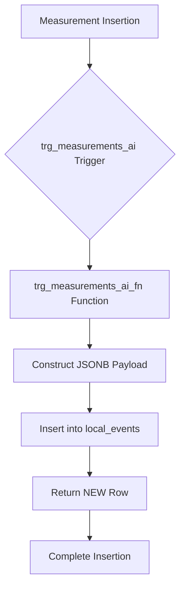
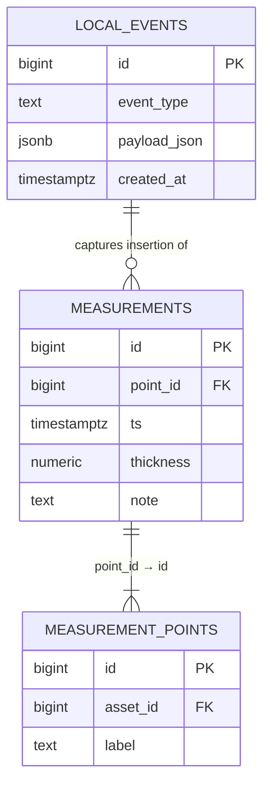
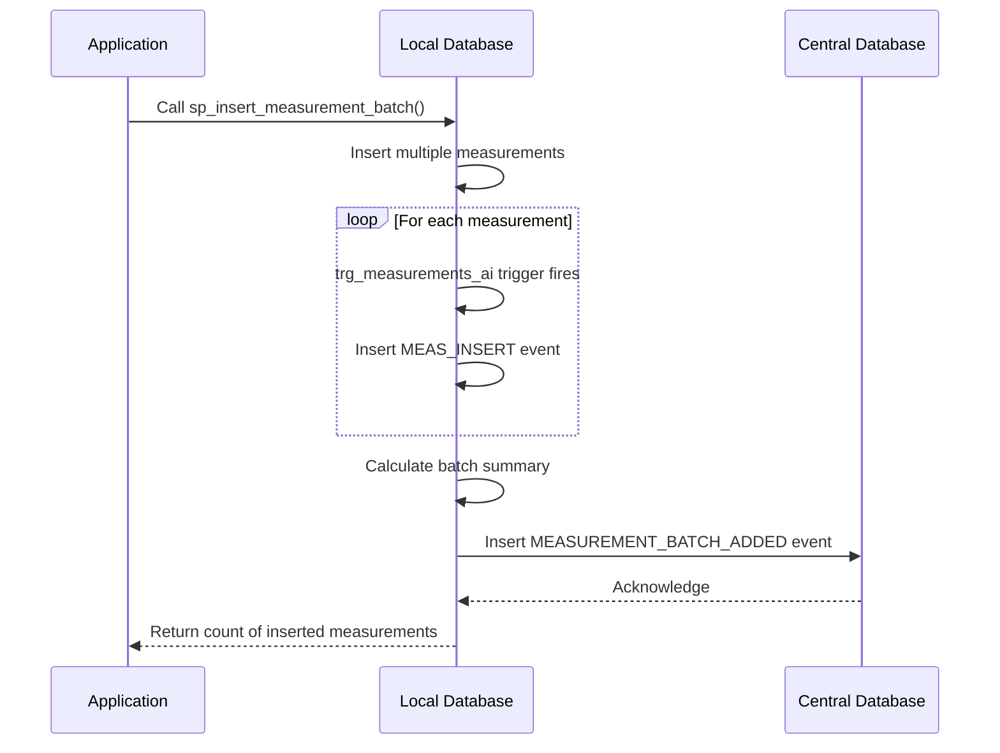
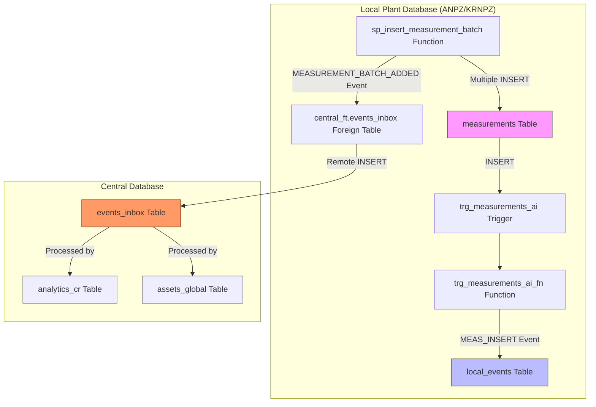

# Triggers and Event Capture

<cite>
**Referenced Files in This Document**   
- [sql/anpz/03_trigger_measurements_ai.sql](file://sql/anpz/03_trigger_measurements_ai.sql)
- [sql/krnpz/03_trigger_measurements_ai.sql](file://sql/krnpz/03_trigger_measurements_ai.sql)
- [sql/anpz/04_function_sp_insert_measurement_batch.sql](file://sql/anpz/04_function_sp_insert_measurement_batch.sql)
- [sql/krnpz/04_function_sp_insert_measurement_batch.sql](file://sql/krnpz/04_function_sp_insert_measurement_batch.sql)
- [sql/anpz/01_tables.sql](file://sql/anpz/01_tables.sql)
- [sql/central/01_tables.sql](file://sql/central/01_tables.sql)
</cite>

## Table of Contents
1. [Introduction](#introduction)
2. [Trigger and Function Overview](#trigger-and-function-overview)
3. [Trigger Execution Context](#trigger-execution-context)
4. [Event Payload Construction](#event-payload-construction)
5. [Local Event Logging Purpose](#local-event-logging-purpose)
6. [Querying Measurement History](#querying-measurement-history)
7. [Performance Considerations](#performance-considerations)
8. [Event Log Growth Management](#event-log-growth-management)
9. [Integration with Central Eventing](#integration-with-central-eventing)
10. [Architecture Diagram](#architecture-diagram)

## Introduction

This document provides a comprehensive analysis of the trg_measurements_ai trigger and its associated function trg_measurements_ai_fn, which are responsible for automatically capturing measurement insertions in plant databases. The system is implemented across multiple plant instances (ANPZ and KRNPZ) with identical logic, ensuring consistent event capture behavior across the organization. The trigger mechanism plays a critical role in the system's audit, debugging, and analytics capabilities by creating a detailed record of all measurement insertions.

**Section sources**
- [sql/anpz/03_trigger_measurements_ai.sql](file://sql/anpz/03_trigger_measurements_ai.sql)
- [sql/krnpz/03_trigger_measurements_ai.sql](file://sql/krnpz/03_trigger_measurements_ai.sql)

## Trigger and Function Overview

The trg_measurements_ai trigger and trg_measurements_ai_fn function work together to capture measurement insertions. The trigger is defined on the public.measurements table and executes the trigger function after each row insertion. This implementation is consistent across both plant databases (ANPZ and KRNPZ), with identical code in their respective SQL files.

The trigger function trg_measurements_ai_fn is implemented as a PL/pgSQL function that returns a trigger type. It is designed to be lightweight and efficient, focusing solely on event logging without interfering with the primary data insertion operation. The function captures essential measurement data and stores it in the local_events table for subsequent processing and analysis.



**Diagram sources**
- [sql/anpz/03_trigger_measurements_ai.sql](file://sql/anpz/03_trigger_measurements_ai.sql#L1-L15)
- [sql/krnpz/03_trigger_measurements_ai.sql](file://sql/krnpz/03_trigger_measurements_ai.sql#L1-L15)

**Section sources**
- [sql/anpz/03_trigger_measurements_ai.sql](file://sql/anpz/03_trigger_measurements_ai.sql#L1-L15)
- [sql/krnpz/03_trigger_measurements_ai.sql](file://sql/krnpz/03_trigger_measurements_ai.sql#L1-L15)

## Trigger Execution Context

The trg_measurements_ai trigger operates with specific timing and execution characteristics that are crucial to its functionality. It is defined with AFTER INSERT timing, which means it executes after the new row has been successfully inserted into the measurements table but before the transaction is committed. This timing ensures that the trigger can access the complete row data through the NEW special variable.

The trigger is configured for row-level execution (FOR EACH ROW), meaning it fires once for each individual row that is inserted into the measurements table. This is in contrast to statement-level triggers that would fire only once per INSERT statement regardless of how many rows are affected. The row-level execution context allows the trigger to capture detailed information about each specific measurement insertion.

The trigger function returns the NEW row, which is a requirement for AFTER triggers in PostgreSQL. This return value does not modify the inserted data but satisfies the trigger function interface requirements. The function operates within the same transaction as the original INSERT statement, ensuring atomicity - if the trigger fails, the entire transaction (including the original insertion) will be rolled back.

**Section sources**
- [sql/anpz/03_trigger_measurements_ai.sql](file://sql/anpz/03_trigger_measurements_ai.sql#L11-L15)
- [sql/krnpz/03_trigger_measurements_ai.sql](file://sql/krnpz/03_trigger_measurements_ai.sql#L11-L15)

## Event Payload Construction

The trg_measurements_ai_fn function constructs a JSONB payload containing key measurement data when a new measurement is inserted. The payload includes three essential fields: point_id, ts (timestamp), and thickness. These values are extracted from the NEW special variable, which contains the data of the newly inserted row in the measurements table.

The JSONB payload is created using PostgreSQL's jsonb_build_object function, which efficiently constructs a JSON object from key-value pairs. The event_type is set to 'MEAS_INSERT' to clearly identify the nature of the event. This structured approach to event data allows for flexible querying and processing of the event logs.

The use of JSONB format provides several advantages: it allows for schema flexibility, enables efficient indexing and querying of nested data, and supports partial updates to the JSON structure. The payload is stored in the payload_json column of the local_events table, which is specifically designed to accommodate various types of event data with different structures.



**Diagram sources**
- [sql/anpz/01_tables.sql](file://sql/anpz/01_tables.sql#L20-L36)
- [sql/anpz/03_trigger_measurements_ai.sql](file://sql/anpz/03_trigger_measurements_ai.sql#L3-L8)

**Section sources**
- [sql/anpz/03_trigger_measurements_ai.sql](file://sql/anpz/03_trigger_measurements_ai.sql#L3-L8)
- [sql/krnpz/03_trigger_measurements_ai.sql](file://sql/krnpz/03_trigger_measurements_ai.sql#L3-L8)

## Local Event Logging Purpose

The local_events table serves multiple critical purposes in the system architecture. Primarily, it provides a comprehensive audit trail of all measurement insertions, allowing system administrators and auditors to track when and what measurements were added to the system. This audit capability is essential for regulatory compliance and operational transparency.

Secondly, the event log is invaluable for debugging and troubleshooting. When issues arise with measurement data, developers and support personnel can examine the local_events table to understand the sequence of data insertions and identify potential problems. The timestamped record of events helps reconstruct the state of the system at any point in time.

Additionally, the event log supports local analytics capabilities. By analyzing the pattern and frequency of measurement insertions, plant managers can gain insights into inspection workflows, technician productivity, and data collection patterns. The JSONB format allows for flexible querying of the event data to support various analytical use cases.

The local eventing system also serves as a buffer and decoupling mechanism between data insertion and downstream processing. By capturing events locally, the system ensures that measurement data is recorded even if the central eventing system is temporarily unavailable.

**Section sources**
- [sql/anpz/01_tables.sql](file://sql/anpz/01_tables.sql#L32-L36)
- [sql/anpz/03_trigger_measurements_ai.sql](file://sql/anpz/03_trigger_measurements_ai.sql#L6-L8)

## Querying Measurement History

The local_events table can be queried to trace measurement history and analyze data insertion patterns. The JSONB payload allows for flexible querying using PostgreSQL's JSON operators. For example, to find all measurement insertions for a specific point_id:

```sql
SELECT * FROM local_events 
WHERE event_type = 'MEAS_INSERT' 
AND (payload_json->>'point_id')::bigint = 12345
ORDER BY created_at DESC;
```

To analyze the volume of measurements inserted over time:

```sql
SELECT 
    DATE_TRUNC('day', created_at) as day,
    COUNT(*) as measurements_inserted
FROM local_events 
WHERE event_type = 'MEAS_INSERT'
GROUP BY day
ORDER BY day DESC;
```

To find the most recently inserted measurements:

```sql
SELECT 
    created_at,
    (payload_json->>'point_id') as point_id,
    (payload_json->>'ts') as measurement_timestamp,
    (payload_json->>'thickness') as thickness
FROM local_events 
WHERE event_type = 'MEAS_INSERT'
ORDER BY created_at DESC
LIMIT 100;
```

These queries demonstrate the flexibility of the JSONB storage format and the value of having a detailed event log for operational analysis and troubleshooting.

**Section sources**
- [sql/anpz/01_tables.sql](file://sql/anpz/01_tables.sql#L32-L36)
- [sql/anpz/03_trigger_measurements_ai.sql](file://sql/anpz/03_trigger_measurements_ai.sql#L6-L8)

## Performance Considerations

While the trg_measurements_ai trigger provides valuable event logging capabilities, it can impact performance during bulk insert operations. Each INSERT statement that affects multiple rows will cause the trigger to fire once for each row, resulting in a corresponding number of INSERT operations into the local_events table.

For high-volume data ingestion scenarios, this can create significant overhead and potentially become a bottleneck. Strategies to mitigate performance impact include:

1. **Batching**: When possible, consolidate multiple measurement insertions into fewer transactions to reduce the overhead of trigger execution and transaction management.

2. **Index Optimization**: Ensure appropriate indexes exist on the local_events table to support efficient querying without slowing down INSERT operations. The current implementation includes an index on created_at, which is appropriate for time-based queries.

3. **Asynchronous Processing**: Consider implementing a queuing mechanism where events are written to a fast in-memory structure and processed asynchronously, though this would require architectural changes.

4. **Conditional Triggering**: In some cases, it might be appropriate to temporarily disable the trigger during bulk data loads and re-enable it afterward, though this would compromise the audit trail for that period.

The current implementation prioritizes data integrity and completeness of the audit trail over raw performance, which is appropriate for the system's requirements.

**Section sources**
- [sql/anpz/03_trigger_measurements_ai.sql](file://sql/anpz/03_trigger_measurements_ai.sql#L6-L8)
- [sql/anpz/01_tables.sql](file://sql/anpz/01_tables.sql#L32-L36)

## Event Log Growth Management

The local_events table will grow continuously as new measurements are inserted, requiring strategies for managing storage and maintaining query performance. Potential approaches include:

1. **Archiving**: Periodically move older event records to archive tables or storage, keeping the primary local_events table at a manageable size for optimal performance.

2. **Partitioning**: Implement table partitioning by time (e.g., monthly partitions) to improve query performance and simplify data management operations.

3. **Purging**: Establish a data retention policy and implement automated purging of events older than a specified period, balancing the need for historical data with storage constraints.

4. **Monitoring**: Implement monitoring and alerting for table growth to proactively address storage capacity issues.

The current schema includes a created_at timestamp with an index, which facilitates time-based queries and management operations. The system design assumes that event logs will be periodically processed and potentially transferred to long-term storage or analytics systems.

**Section sources**
- [sql/anpz/01_tables.sql](file://sql/anpz/01_tables.sql#L32-L36)
- [sql/anpz/03_trigger_measurements_ai.sql](file://sql/anpz/03_trigger_measurements_ai.sql#L6-L8)

## Integration with Central Eventing

The local eventing system complements the central eventing architecture through the batch insertion process implemented in the sp_insert_measurement_batch function. When measurements are inserted in batches, this function not only inserts the individual measurements (which triggers the trg_measurements_ai trigger for each row) but also sends a summary event to the central system.

The sp_insert_measurement_batch function inserts a 'MEASUREMENT_BATCH_ADDED' event into the central_ft.events_inbox table, which is a foreign table referencing the central database. This event contains aggregated information about the batch, including the first and last thickness measurements and their timestamps, providing context about the batch insertion at the central level.

This dual eventing approach creates a comprehensive monitoring system: the local_events table captures granular, row-level detail of each measurement insertion, while the central events inbox receives higher-level batch summary events. This architecture enables both detailed local analysis and consolidated central monitoring and reporting.



**Diagram sources**
- [sql/anpz/04_function_sp_insert_measurement_batch.sql](file://sql/anpz/04_function_sp_insert_measurement_batch.sql#L65-L75)
- [sql/anpz/03_trigger_measurements_ai.sql](file://sql/anpz/03_trigger_measurements_ai.sql#L6-L8)
- [sql/central/01_tables.sql](file://sql/central/01_tables.sql#L45-L51)

**Section sources**
- [sql/anpz/04_function_sp_insert_measurement_batch.sql](file://sql/anpz/04_function_sp_insert_measurement_batch.sql#L65-L75)
- [sql/central/01_tables.sql](file://sql/central/01_tables.sql#L45-L51)

## Architecture Diagram

The following diagram illustrates the complete architecture of the trigger and event capture system, showing the relationship between the local database components and the central eventing system.



**Diagram sources**
- [sql/anpz/03_trigger_measurements_ai.sql](file://sql/anpz/03_trigger_measurements_ai.sql)
- [sql/anpz/04_function_sp_insert_measurement_batch.sql](file://sql/anpz/04_function_sp_insert_measurement_batch.sql)
- [sql/anpz/01_tables.sql](file://sql/anpz/01_tables.sql)
- [sql/central/01_tables.sql](file://sql/central/01_tables.sql)
- [sql/anpz/02_fdw.sql](file://sql/anpz/02_fdw.sql)