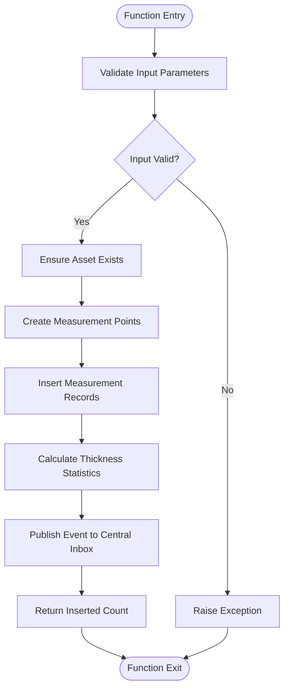
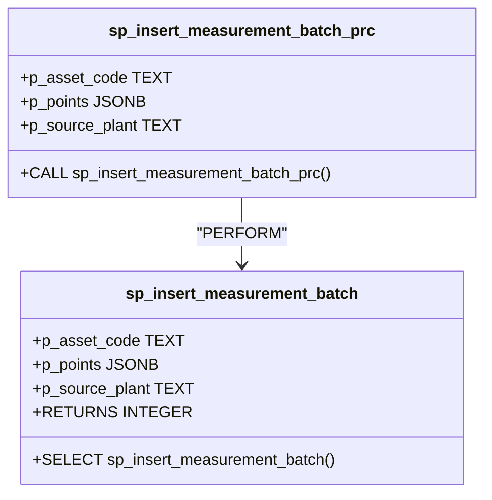
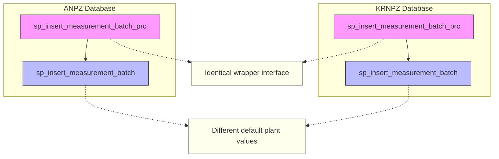
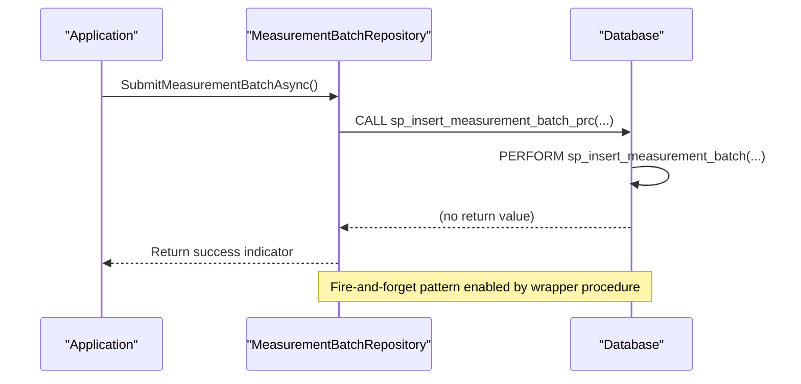

# Wrapper Procedures

<cite>
**Referenced Files in This Document**   
- [05_procedure_wrapper.sql](file://sql/anpz/05_procedure_wrapper.sql)
- [05_procedure_wrapper.sql](file://sql/krnpz/05_procedure_wrapper.sql)
- [04_function_sp_insert_measurement_batch.sql](file://sql/anpz/04_function_sp_insert_measurement_batch.sql)
- [04_function_sp_insert_measurement_batch.sql](file://sql/krnpz/04_function_sp_insert_measurement_batch.sql)
- [EventAndBatchRepositories.cs](file://src/OilErp.Data/Repositories/EventAndBatchRepositories.cs)
- [MeasurementAndRiskServices.cs](file://src/OilErp.Domain/Services/MeasurementAndRiskServices.cs)
</cite>

## Table of Contents
1. [Introduction](#introduction)
2. [Core Function Implementation](#core-function-implementation)
3. [Wrapper Procedure Design](#wrapper-procedure-design)
4. [Cross-Plant Consistency](#cross-plant-consistency)
5. [Usage Patterns](#usage-patterns)
6. [Client Driver Compatibility](#client-driver-compatibility)
7. [Implementation Analysis](#implementation-analysis)
8. [Recommendations](#recommendations)

## Introduction

This document details the design and implementation of the `sp_insert_measurement_batch_prc` wrapper procedure, which provides a procedural interface to the `sp_insert_measurement_batch` function in the ERP system. The wrapper serves as a compatibility layer that enables client applications to use the `CALL` statement syntax instead of `SELECT` when invoking the measurement batch insertion functionality. This pattern is implemented consistently across both ANPZ and KRNPZ plant databases, ensuring uniform API behavior regardless of the target plant.

**Section sources**
- [05_procedure_wrapper.sql](file://sql/anpz/05_procedure_wrapper.sql#L0-L10)
- [05_procedure_wrapper.sql](file://sql/krnpz/05_procedure_wrapper.sql#L0-L10)

## Core Function Implementation

The `sp_insert_measurement_batch` function serves as the primary implementation for batch insertion of measurement data. It accepts three parameters: asset code, measurement points in JSONB format, and source plant identifier. The function performs comprehensive validation, ensures asset existence, creates measurement points as needed, inserts measurement records, and publishes events to the central inbox for downstream processing.

The function returns an integer value representing the number of inserted records, which can be used by clients that require confirmation of successful insertion. This return value makes the function suitable for scenarios where the application needs to verify the outcome of the operation.



**Diagram sources**
- [04_function_sp_insert_measurement_batch.sql](file://sql/anpz/04_function_sp_insert_measurement_batch.sql#L0-L84)
- [04_function_sp_insert_measurement_batch.sql](file://sql/krnpz/04_function_sp_insert_measurement_batch.sql#L0-L84)

**Section sources**
- [04_function_sp_insert_measurement_batch.sql](file://sql/anpz/04_function_sp_insert_measurement_batch.sql#L0-L84)
- [04_function_sp_insert_measurement_batch.sql](file://sql/krnpz/04_function_sp_insert_measurement_batch.sql#L0-L84)

## Wrapper Procedure Design

The `sp_insert_measurement_batch_prc` procedure serves as a thin wrapper around the core `sp_insert_measurement_batch` function. It exposes identical parameters to maintain interface consistency and uses the `PERFORM` statement to invoke the underlying function while discarding its return value. This design pattern transforms the function call into a procedure call that can be invoked using the `CALL` statement syntax.

The wrapper's implementation is minimal by design, containing only the essential `BEGIN`/`END` block that encapsulates the `PERFORM` statement. This approach ensures that all business logic remains centralized in the core function while providing an alternative invocation method for client applications with specific requirements.



**Diagram sources**
- [05_procedure_wrapper.sql](file://sql/anpz/05_procedure_wrapper.sql#L0-L10)
- [05_procedure_wrapper.sql](file://sql/krnpz/05_procedure_wrapper.sql#L0-L10)

**Section sources**
- [05_procedure_wrapper.sql](file://sql/anpz/05_procedure_wrapper.sql#L0-L10)
- [05_procedure_wrapper.sql](file://sql/krnpz/05_procedure_wrapper.sql#L0-L10)

## Cross-Plant Consistency

The wrapper procedure implementation is identical across both ANPZ and KRNPZ plant databases, reflecting a deliberate design choice to ensure consistent API behavior across different plant instances. While the underlying `sp_insert_measurement_batch` function differs slightly in its default source plant value (ANPZ vs. KRNPZ), the wrapper procedure interface remains exactly the same.

This consistency enables client applications to interact with either plant database using the same code path, reducing complexity in application logic and minimizing the risk of plant-specific bugs. The uniform interface also simplifies testing and maintenance, as changes to the wrapper pattern can be applied identically across all plant instances.



**Diagram sources**
- [05_procedure_wrapper.sql](file://sql/anpz/05_procedure_wrapper.sql#L0-L10)
- [05_procedure_wrapper.sql](file://sql/krnpz/05_procedure_wrapper.sql#L0-L10)
- [04_function_sp_insert_measurement_batch.sql](file://sql/anpz/04_function_sp_insert_measurement_batch.sql#L0-L84)
- [04_function_sp_insert_measurement_batch.sql](file://sql/krnpz/04_function_sp_insert_measurement_batch.sql#L0-L84)

**Section sources**
- [05_procedure_wrapper.sql](file://sql/anpz/05_procedure_wrapper.sql#L0-L10)
- [05_procedure_wrapper.sql](file://sql/krnpz/05_procedure_wrapper.sql#L0-L10)

## Usage Patterns

The system supports two distinct usage patterns for inserting measurement batches, each suited to different client requirements:

### Direct Function Invocation
When the client application requires the return value to confirm successful insertion, the direct function call using `SELECT` should be used:

```sql
SELECT sp_insert_measurement_batch('ASSET-001', '[{"label":"MP-001","ts":"2025-01-01T10:00:00Z","thickness":8.5}]', 'ANPZ');
```

### Procedure Call
When the client only needs to ensure the operation is executed without requiring confirmation of the result count, the wrapper procedure can be called using `CALL`:

```sql
CALL sp_insert_measurement_batch_prc('ASSET-001', '[{"label":"MP-001","ts":"2025-01-01T10:00:00Z","thickness":8.5}]', 'ANPZ');
```

The choice between these patterns depends on the specific requirements of the client application and the capabilities of the database driver being used.

**Section sources**
- [05_procedure_wrapper.sql](file://sql/anpz/05_procedure_wrapper.sql#L0-L10)
- [04_function_sp_insert_measurement_batch.sql](file://sql/anpz/04_function_sp_insert_measurement_batch.sql#L0-L84)

## Client Driver Compatibility

The wrapper procedure exists primarily to accommodate client drivers and frameworks that prefer or require the `CALL` statement syntax for invoking database routines. Some database drivers, particularly in the .NET ecosystem, have better support for procedure calls using `CALL` than for function calls using `SELECT`. This is evident in the application code where the `MeasurementBatchRepository` uses `CALL` syntax to invoke the wrapper procedure:

```csharp
var sql = @"CALL sp_insert_measurement_batch(@asset_code, @points_json, @source_plant)";
await connection.ExecuteAsync(sql, new { asset_code = assetCode, points_json = pointsJson, source_plant = sourcePlant });
```

By providing a procedure wrapper, the database interface remains accessible to a wider range of client technologies without requiring changes to the core business logic. This approach follows the principle of separation of concerns, where the persistence layer adapts to client requirements while maintaining a clean, testable core function implementation.



**Diagram sources**
- [EventAndBatchRepositories.cs](file://src/OilErp.Data/Repositories/EventAndBatchRepositories.cs#L179-L206)
- [05_procedure_wrapper.sql](file://sql/anpz/05_procedure_wrapper.sql#L0-L10)

**Section sources**
- [EventAndBatchRepositories.cs](file://src/OilErp.Data/Repositories/EventAndBatchRepositories.cs#L179-L206)
- [MeasurementAndRiskServices.cs](file://src/OilErp.Domain/Services/MeasurementAndRiskServices.cs#L41-L66)

## Implementation Analysis

The implementation demonstrates a clean separation between the business logic layer (the core function) and the interface layer (the wrapper procedure). This architectural pattern provides several benefits:

1. **Maintainability**: Business logic is centralized in a single location, reducing the risk of inconsistencies when updates are needed.

2. **Extensibility**: Additional wrapper procedures with different interfaces could be added without modifying the core function.

3. **Testability**: The core function can be tested independently of the invocation method.

4. **Compatibility**: The system supports multiple client patterns without compromising on functionality.

The use of `PERFORM` in the wrapper procedure is the idiomatic way to call a function and discard its result in PL/pgSQL, making the implementation both efficient and clear in its intent. The wrapper adds minimal overhead while providing significant flexibility for client applications.

**Section sources**
- [05_procedure_wrapper.sql](file://sql/anpz/05_procedure_wrapper.sql#L0-L10)
- [04_function_sp_insert_measurement_batch.sql](file://sql/anpz/04_function_sp_insert_measurement_batch.sql#L0-L84)

## Recommendations

Based on the analysis, the following recommendations are provided for using the measurement batch insertion functionality:

### Use the Wrapper Procedure When:
- The client application uses a database driver that works better with `CALL` syntax
- The return value is not needed for business logic
- Implementing fire-and-forget patterns where confirmation of insertion count is not required
- Working with frameworks that expect procedure calls rather than function calls

### Use the Direct Function Call When:
- The application needs to verify the number of records inserted
- Implementing transactional logic that depends on the operation's success
- Performing bulk operations where monitoring insertion counts is important
- Working with database clients that handle `SELECT` function calls efficiently

The consistent implementation across plant databases means that these recommendations apply uniformly regardless of whether the target is ANPZ or KRNPZ, simplifying application development and maintenance.

**Section sources**
- [05_procedure_wrapper.sql](file://sql/anpz/05_procedure_wrapper.sql#L0-L10)
- [04_function_sp_insert_measurement_batch.sql](file://sql/anpz/04_function_sp_insert_measurement_batch.sql#L0-L84)