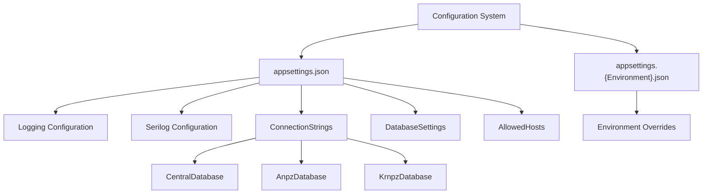
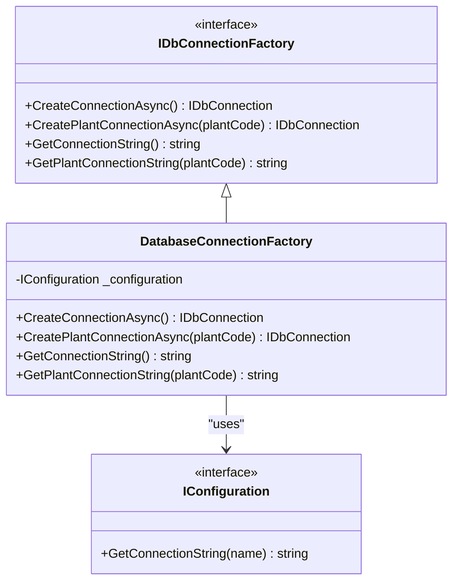
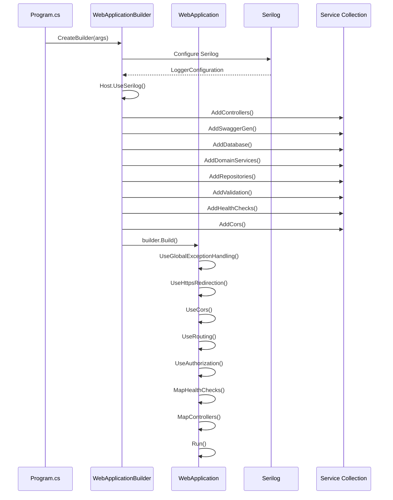
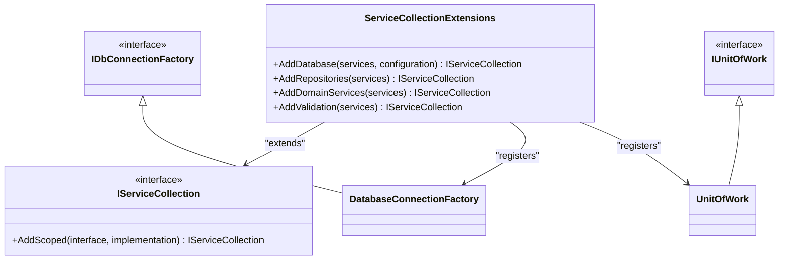
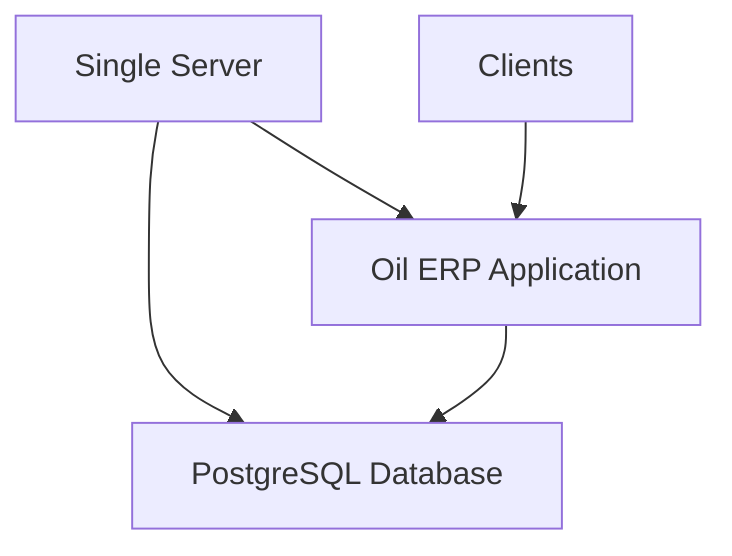
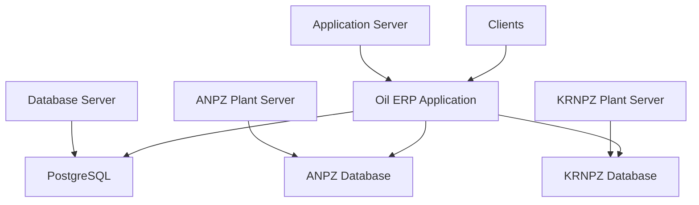

# Deployment Configuration

<cite>
**Referenced Files in This Document**  
- [appsettings.json](file://src/OilErp.App/appsettings.json)
- [appsettings.Development.json](file://src/OilErp.App/appsettings.Development.json)
- [Program.cs](file://src/OilErp.App/Program.cs)
- [ServiceCollectionExtensions.cs](file://src/OilErp.App/Extensions/ServiceCollectionExtensions.cs)
- [DatabaseInfrastructure.cs](file://src/OilErp.Data/Infrastructure/DatabaseInfrastructure.cs)
- [UnitOfWork.cs](file://src/OilErp.Data/UnitOfWork.cs)
</cite>

## Table of Contents
1. [Configuration File Structure](#configuration-file-structure)
2. [Environment-Specific Configuration](#environment-specific-configuration)
3. [Database Connection Management](#database-connection-management)
4. [Application Startup Process](#application-startup-process)
5. [Dependency Injection Setup](#dependency-injection-setup)
6. [Production Environment Setup](#production-environment-setup)
7. [Staging Environment Setup](#staging-environment-setup)
8. [Development Environment Setup](#development-environment-setup)
9. [Secure Secret Management](#secure-secret-management)
10. [Deployment Scenarios](#deployment-scenarios)
11. [Common Issues and Solutions](#common-issues-and-solutions)

## Configuration File Structure

The Oil ERP system uses a hierarchical configuration system with JSON files that provide settings for different environments. The primary configuration file is `appsettings.json`, which contains the base configuration shared across all environments.

The configuration structure includes several key sections:

- **Logging**: Configures logging levels for different components
- **Serilog**: Specific configuration for the Serilog logging framework
- **ConnectionStrings**: Database connection strings for central and plant databases
- **DatabaseSettings**: Global database settings such as command timeout and connection pooling
- **AllowedHosts**: Security setting for host filtering

The connection strings are specifically configured for three database instances:
- **CentralDatabase**: The central database for the ERP system
- **AnpzDatabase**: Database for the ANPZ plant
- **KrnpzDatabase**: Database for the KRNPZ plant

Each connection string follows the Npgsql format for PostgreSQL connections, specifying host, database name, username, and password.



**Diagram sources**
- [appsettings.json](file://src/OilErp.App/appsettings.json)
- [appsettings.Development.json](file://src/OilErp.App/appsettings.Development.json)

**Section sources**
- [appsettings.json](file://src/OilErp.App/appsettings.json#L1-L28)

## Environment-Specific Configuration

The Oil ERP system implements environment-specific configuration through a cascading configuration model. The system uses different configuration files based on the current environment, with later files overriding settings from earlier ones.

The configuration hierarchy follows this order:
1. `appsettings.json` - Base configuration
2. `appsettings.{Environment}.json` - Environment-specific overrides
3. Environment variables
4. Command line arguments

For development environments, the system uses `appsettings.Development.json`, which provides debug-level logging and development database connections. This file specifically increases the logging verbosity and uses development database instances with appropriate credentials.

The environment-specific configuration allows for different settings in various deployment scenarios:
- Development environments use local databases with debug logging
- Staging environments can use test databases with detailed logging
- Production environments use production databases with optimized logging

When the application runs, it automatically detects the environment and loads the appropriate configuration file. The environment is typically set through the `ASPNETCORE_ENVIRONMENT` environment variable, which can be set to "Development", "Staging", or "Production".

**Section sources**
- [appsettings.json](file://src/OilErp.App/appsettings.json#L1-L28)
- [appsettings.Development.json](file://src/OilErp.App/appsettings.Development.json#L1-L13)

## Database Connection Management

The Oil ERP system manages database connections through a specialized `DatabaseConnectionFactory` class that implements the `IDbConnectionFactory` interface. This factory pattern provides a centralized way to create connections to both the central database and plant-specific databases.

The connection management system supports three distinct databases:
- Central database for system-wide data
- ANPZ plant database for ANPZ-specific operations
- KRNPZ plant database for KRNPZ-specific operations

The `DatabaseConnectionFactory` class uses the configuration system to retrieve connection strings by name. It provides several methods for connection management:
- `CreateConnectionAsync`: Creates a connection to the central database
- `CreatePlantConnectionAsync`: Creates a connection to a specific plant database
- `GetConnectionString`: Retrieves the central database connection string
- `GetPlantConnectionString`: Retrieves the connection string for a specific plant

The factory validates plant codes (ANPZ, KRNPZ) and throws descriptive exceptions when invalid plant codes are provided or when connection strings are missing. This ensures that database operations fail fast with clear error messages when configuration is incorrect.



**Diagram sources**
- [DatabaseInfrastructure.cs](file://src/OilErp.Data/Infrastructure/DatabaseInfrastructure.cs#L10-L83)
- [IDataServices.cs](file://src/OilErp.Domain/Interfaces/IDataServices.cs#L98-L104)

**Section sources**
- [DatabaseInfrastructure.cs](file://src/OilErp.Data/Infrastructure/DatabaseInfrastructure.cs#L10-L83)
- [appsettings.json](file://src/OilErp.App/appsettings.json#L10-L18)

## Application Startup Process

The application startup process is defined in the `Program.cs` file, which follows the modern minimal API pattern introduced in ASP.NET Core. The startup process is structured to be clear and maintainable, with distinct phases for configuration, service registration, and pipeline setup.

The startup process begins with creating a `WebApplicationBuilder` instance, which provides access to configuration, services, and hosting settings. The first critical step is configuring Serilog as the logging provider, which is set up to write logs to both the console and rolling files in a logs directory.

After logging configuration, the application registers various services through extension methods. These include:
- MVC controllers
- Swagger/OpenAPI documentation
- Custom business services
- Repository implementations
- Validation services
- Health checks
- CORS policy

Once all services are registered, the builder creates the `WebApplication` instance, which is used to configure the HTTP request pipeline. The pipeline configuration is conditional based on the environment, with Swagger enabled only in development.

The application also configures global exception handling through custom middleware, ensuring that unhandled exceptions are properly logged and appropriate responses are returned to clients.



**Diagram sources**
- [Program.cs](file://src/OilErp.App/Program.cs#L1-L103)

**Section sources**
- [Program.cs](file://src/OilErp.App/Program.cs#L1-L103)

## Dependency Injection Setup

The dependency injection (DI) container is configured through extension methods in the `ServiceCollectionExtensions` class. This approach provides a clean separation of concerns and makes the startup code more readable and maintainable.

The DI setup follows the dependency inversion principle, registering interfaces with their concrete implementations. All services are registered as scoped dependencies, which means they are created once per request and shared within that request scope.

The extension methods organize services by category:
- **AddDatabase**: Registers database connection and unit of work services
- **AddRepositories**: Registers all repository implementations
- **AddDomainServices**: Registers business logic services
- **AddValidation**: Registers FluentValidation services

The `AddDatabase` method registers two key services:
- `IDbConnectionFactory` implemented by `DatabaseConnectionFactory`
- `IUnitOfWork` implemented by `UnitOfWork`

The unit of work pattern is implemented to manage transactions across multiple repository operations. The `UnitOfWork` class provides access to all repositories and manages the database transaction lifecycle.

Repository registration follows a consistent pattern, with each repository interface registered to its concrete implementation. This allows controllers and services to depend on abstractions rather than concrete types, making the code more testable and maintainable.



**Diagram sources**
- [ServiceCollectionExtensions.cs](file://src/OilErp.App/Extensions/ServiceCollectionExtensions.cs#L12-L70)
- [UnitOfWork.cs](file://src/OilErp.Data/UnitOfWork.cs#L9-L127)

**Section sources**
- [ServiceCollectionExtensions.cs](file://src/OilErp.App/Extensions/ServiceCollectionExtensions.cs#L12-L70)
- [UnitOfWork.cs](file://src/OilErp.Data/UnitOfWork.cs#L9-L127)

## Production Environment Setup

Setting up the production environment for the Oil ERP system requires careful configuration to ensure security, performance, and reliability. The production configuration should be optimized for performance and security, with appropriate logging levels and database connections.

To configure the production environment:

1. **Set the environment variable**:
   ```bash
   export ASPNETCORE_ENVIRONMENT=Production
   ```

2. **Configure production database connections** in `appsettings.Production.json`:
   ```json
   {
     "ConnectionStrings": {
       "CentralDatabase": "Host=prod-db.example.com;Database=oil_erp_central_prod;Username=oil_erp_user;Password=secure_password;",
       "AnpzDatabase": "Host=anpz-db.example.com;Database=oil_erp_anpz_prod;Username=oil_erp_user;Password=secure_password;",
       "KrnpzDatabase": "Host=krnpz-db.example.com;Database=oil_erp_krnpz_prod;Username=oil_erp_user;Password=secure_password;"
     },
     "Logging": {
       "LogLevel": {
         "Default": "Warning",
         "Microsoft.AspNetCore": "Error"
       }
     }
   }
   ```

3. **Optimize database settings**:
   ```json
   "DatabaseSettings": {
     "CommandTimeout": 60,
     "ConnectionPooling": true,
     "MaxPoolSize": 200
   }
   ```

4. **Deploy with proper security**:
   - Use HTTPS with valid certificates
   - Configure firewall rules to restrict database access
   - Implement proper authentication and authorization
   - Set up monitoring and alerting

5. **Configure reverse proxy** (e.g., Nginx):
   ```nginx
   server {
       listen 80;
       server_name oilerp.example.com;
       return 301 https://$server_name$request_uri;
   }
   
   server {
       listen 443 ssl;
       server_name oilerp.example.com;
       
       ssl_certificate /path/to/cert.pem;
       ssl_certificate_key /path/to/key.pem;
       
       location / {
           proxy_pass http://localhost:5000;
           proxy_http_version 1.1;
           proxy_set_header Upgrade $http_upgrade;
           proxy_set_header Connection keep-alive;
           proxy_set_header Host $host;
           proxy_cache_bypass $http_upgrade;
       }
   }
   ```

**Section sources**
- [appsettings.json](file://src/OilErp.App/appsettings.json#L1-L28)
- [Program.cs](file://src/OilErp.App/Program.cs#L1-L103)

## Staging Environment Setup

The staging environment serves as a pre-production environment for testing changes before they are deployed to production. It should closely mirror the production environment but with additional logging and monitoring capabilities.

To configure the staging environment:

1. **Set the environment variable**:
   ```bash
   export ASPNETCORE_ENVIRONMENT=Staging
   ```

2. **Create `appsettings.Staging.json`**:
   ```json
   {
     "ConnectionStrings": {
       "CentralDatabase": "Host=staging-db.example.com;Database=oil_erp_central_staging;Username=oil_erp_user;Password=staging_password;",
       "AnpzDatabase": "Host=anpz-staging-db.example.com;Database=oil_erp_anpz_staging;Username=oil_erp_user;Password=staging_password;",
       "KrnpzDatabase": "Host=krnpz-staging-db.example.com;Database=oil_erp_krnpz_staging;Username=oil_erp_user;Password=staging_password;"
     },
     "Logging": {
       "LogLevel": {
         "Default": "Information",
         "Microsoft.AspNetCore": "Warning"
       }
     },
     "Serilog": {
       "MinimumLevel": {
         "Default": "Information",
         "Override": {
           "Microsoft": "Warning",
           "System": "Warning"
         }
       }
     }
   }
   ```

3. **Enable additional monitoring**:
   - Configure application performance monitoring (APM)
   - Set up detailed logging to identify potential issues
   - Enable health checks and metrics collection

4. **Configure deployment pipeline**:
   - Automate deployments from the staging branch
   - Run integration tests against the staging environment
   - Perform user acceptance testing (UAT)

5. **Database considerations**:
   - Use separate database instances from production
   - Regularly refresh from production data (with sensitive data anonymized)
   - Monitor performance to identify potential bottlenecks

The staging environment should be used for final validation of features, performance testing, and user acceptance testing before promoting changes to production.

**Section sources**
- [appsettings.json](file://src/OilErp.App/appsettings.json#L1-L28)
- [Program.cs](file://src/OilErp.App/Program.cs#L1-L103)

## Development Environment Setup

The development environment is configured for maximum productivity and debugging capability. The `appsettings.Development.json` file provides settings optimized for local development.

To set up the development environment:

1. **Set the environment variable**:
   ```bash
   export ASPNETCORE_ENVIRONMENT=Development
   ```

2. **Ensure `appsettings.Development.json` exists** with development database connections:
   ```json
   {
     "Logging": {
       "LogLevel": {
         "Default": "Debug",
         "Microsoft.AspNetCore": "Information"
       }
     },
     "ConnectionStrings": {
       "CentralDatabase": "Host=localhost;Database=oil_erp_central_dev;Username=postgres;Password=postgres;",
       "AnpzDatabase": "Host=localhost;Database=oil_erp_anpz_dev;Username=postgres;Password=postgres;",
       "KrnpzDatabase": "Host=localhost;Database=oil_erp_krnpz_dev;Username=postgres;Password=postgres;"
     }
   }
   ```

3. **Run database migrations**:
   ```bash
   # Create development databases
   createdb oil_erp_central_dev
   createdb oil_erp_anpz_dev
   createdb oil_erp_krnpz_dev
   
   # Run schema scripts
   psql -d oil_erp_central_dev -f sql/central/01_tables.sql
   psql -d oil_erp_anpz_dev -f sql/anpz/01_tables.sql
   psql -d oil_erp_krnpz_dev -f sql/krnpz/01_tables.sql
   ```

4. **Start the application**:
   ```bash
   dotnet run --project src/OilErp.App/OilErp.App.csproj
   ```

5. **Access development features**:
   - Swagger UI available at the root URL
   - Detailed error pages for debugging
   - Debug-level logging to console and files
   - All origins allowed for CORS (for frontend development)

The development environment enables features that assist with debugging and rapid development, including detailed error messages, Swagger documentation, and permissive CORS settings.

**Section sources**
- [appsettings.Development.json](file://src/OilErp.App/appsettings.Development.json#L1-L13)
- [Program.cs](file://src/OilErp.App/Program.cs#L45-L52)

## Secure Secret Management

Secure management of secrets is critical for the Oil ERP system, especially in production environments. The system should never store sensitive information like database passwords in configuration files that are committed to version control.

Recommended approaches for secret management:

1. **Use environment variables** for production secrets:
   ```bash
   export ConnectionStrings__CentralDatabase="Host=prod-db.example.com;Database=oil_erp_central_prod;Username=oil_erp_user;Password=very_secure_password;"
   export ConnectionStrings__AnpzDatabase="Host=anpz-db.example.com;Database=oil_erp_anpz_prod;Username=oil_erp_user;Password=very_secure_password;"
   export ConnectionStrings__KrnpzDatabase="Host=krnpz-db.example.com;Database=oil_erp_krnpz_prod;Username=oil_erp_user;Password=very_secure_password;"
   ```

2. **Use Azure Key Vault** (if deployed to Azure):
   ```csharp
   // In Program.cs
   builder.Configuration.AddAzureKeyVault(
       new Uri("https://your-vault.vault.azure.net/"),
       new DefaultAzureCredential());
   ```

3. **Use AWS Secrets Manager** (if deployed to AWS):
   ```csharp
   // Add package: Amazon.Extensions.Configuration.SystemsManager
   builder.Configuration.AddSystemsManager("/oilerp/prod/", new AWSOptions());
   ```

4. **Use Docker secrets** in containerized environments:
   ```dockerfile
   # Mount secrets as files
   docker run -d \
     --mount type=secret,source=oilerp-central-db-conn,target=/run/secrets/central-db-conn \
     --mount type=secret,source=oilerp-anpz-db-conn,target=/run/secrets/anpz-db-conn \
     --mount type=secret,source=oilerp-krnpz-db-conn,target=/run/secrets/krnpz-db-conn \
     oilerp-app
   ```

5. **Implement secret rotation**:
   - Rotate database passwords regularly
   - Use short-lived credentials when possible
   - Implement monitoring for unauthorized access attempts

6. **Development environment best practices**:
   - Use the Secret Manager tool for development:
     ```bash
     dotnet user-secrets init
     dotnet user-secrets set "ConnectionStrings:CentralDatabase" "Host=localhost;Database=oil_erp_central_dev;Username=postgres;Password=dev_password;"
     ```
   - Never commit secrets to version control
   - Use placeholder values in configuration files

The configuration system automatically handles the double underscore (`__`) notation in environment variables, mapping them to hierarchical configuration keys.

**Section sources**
- [appsettings.json](file://src/OilErp.App/appsettings.json#L10-L18)
- [Program.cs](file://src/OilErp.App/Program.cs#L1-L103)

## Deployment Scenarios

The Oil ERP system supports multiple deployment scenarios to accommodate different infrastructure requirements and organizational needs.

### Scenario 1: Single Server Deployment

For small installations or proof-of-concept deployments, all components can run on a single server:



**Configuration**:
- All databases (central, ANPZ, KRNPZ) on the same PostgreSQL instance
- Application and database on the same physical or virtual machine
- Suitable for development and small-scale production

### Scenario 2: Multi-Server Deployment

For larger installations, components can be distributed across multiple servers:



**Configuration**:
- Application server runs the Oil ERP web application
- Central database on a dedicated database server
- Plant-specific databases on their respective plant servers
- Requires proper network configuration and firewall rules

### Scenario 3: Containerized Deployment

Using Docker and container orchestration:

```bash
# Build the application
docker build -t oilerp-app .

# Run with Docker Compose
docker-compose up -d
```

**docker-compose.yml**:
```yaml
version: '3.8'
services:
  app:
    image: oilerp-app
    ports:
      - "8080:80"
    environment:
      - ASPNETCORE_ENVIRONMENT=Production
      - ConnectionStrings__CentralDatabase=Host=db;Database=oil_erp_central_prod;Username=oil_erp_user;Password=${DB_PASSWORD}
    depends_on:
      - db
    networks:
      - oilerp-network
  
  db:
    image: postgres:13
    environment:
      - POSTGRES_DB=oil_erp_central_prod
      - POSTGRES_USER=oil_erp_user
      - POSTGRES_PASSWORD=${DB_PASSWORD}
    volumes:
      - db-data:/var/lib/postgresql/data
    networks:
      - oilerp-network
  
  anpz-db:
    image: postgres:13
    environment:
      - POSTGRES_DB=oil_erp_anpz_prod
      - POSTGRES_USER=oil_erp_user
      - POSTGRES_PASSWORD=${DB_PASSWORD}
    volumes:
      - anpz-data:/var/lib/postgresql/data
    networks:
      - oilerp-network
  
  krnpz-db:
    image: postgres:13
    environment:
      - POSTGRES_DB=oil_erp_krnpz_prod
      - POSTGRES_USER=oil_erp_user
      - POSTGRES_PASSWORD=${DB_PASSWORD}
    volumes:
      - krnpz-data:/var/lib/postgresql/data
    networks:
      - oilerp-network

volumes:
  db-data:
  anpz-data:
  krnpz-data:

networks:
  oilerp-network:
```

### Scenario 4: Cloud Deployment

Deploying to cloud platforms like AWS, Azure, or GCP:

- Use managed database services (RDS, Cloud SQL, etc.)
- Deploy application to container orchestration (EKS, AKS, GKE)
- Use cloud storage for logs and backups
- Implement auto-scaling based on load

Each deployment scenario requires appropriate configuration of connection strings and network settings to ensure proper communication between components.

**Section sources**
- [appsettings.json](file://src/OilErp.App/appsettings.json#L10-L18)
- [Program.cs](file://src/OilErp.App/Program.cs#L1-L103)

## Common Issues and Solutions

This section documents common deployment issues and their solutions.

### Issue 1: Database Connection Failures

**Symptoms**:
- Application fails to start
- Error messages indicating connection timeouts
- "Connection string not found" exceptions

**Solutions**:
1. Verify connection strings in configuration files:
   ```json
   {
     "ConnectionStrings": {
       "CentralDatabase": "Host=localhost;Database=oil_erp_central;Username=postgres;Password=password;"
     }
   }
   ```
2. Check database server availability:
   ```bash
   telnet localhost 5432
   ```
3. Verify database credentials and permissions
4. Ensure PostgreSQL is running and accepting connections

### Issue 2: Missing Migrations

**Symptoms**:
- "Table not found" errors
- "Column does not exist" exceptions
- Application fails when accessing certain features

**Solutions**:
1. Run database schema scripts manually:
   ```bash
   psql -d oil_erp_central -f sql/central/01_tables.sql
   ```
2. Verify all required SQL scripts are present in the sql directory
3. Check that the schema manager can locate the SQL files

### Issue 3: Environment Configuration Problems

**Symptoms**:
- Wrong configuration being loaded
- Development settings in production
- Missing environment-specific overrides

**Solutions**:
1. Verify the environment variable is set correctly:
   ```bash
   echo $ASPNETCORE_ENVIRONMENT
   ```
2. Check that environment-specific configuration files exist:
   - `appsettings.Production.json`
   - `appsettings.Staging.json`
   - `appsettings.Development.json`
3. Verify file naming and location

### Issue 4: Dependency Injection Errors

**Symptoms**:
- "Unable to resolve service" exceptions
- Application fails during startup
- Missing service registrations

**Solutions**:
1. Verify all required services are registered in `ServiceCollectionExtensions`:
   ```csharp
   services.AddScoped<IAssetRepository, AssetRepository>();
   ```
2. Check that all dependencies are properly injected in constructors
3. Verify that interfaces and implementations are correctly paired

### Issue 5: CORS Issues

**Symptoms**:
- Browser console errors about blocked requests
- "No 'Access-Control-Allow-Origin' header" errors
- API calls failing from frontend applications

**Solutions**:
1. Verify CORS policy is configured in `Program.cs`:
   ```csharp
   builder.Services.AddCors(options =>
   {
       options.AddPolicy("AllowAll", policy =>
       {
           policy.AllowAnyOrigin()
                 .AllowAnyMethod()
                 .AllowAnyHeader();
       });
   });
   ```
2. Ensure the CORS middleware is applied:
   ```csharp
   app.UseCors("AllowAll");
   ```

### Issue 6: Logging Configuration Problems

**Symptoms**:
- No log output
- Logs not written to files
- Incorrect log levels

**Solutions**:
1. Verify Serilog is configured in `Program.cs`:
   ```csharp
   builder.Host.UseSerilog();
   ```
2. Check that log directory exists and is writable
3. Verify logging configuration in appsettings.json:
   ```json
   "Serilog": {
     "MinimumLevel": {
       "Default": "Information"
     }
   }
   ```

These common issues and solutions should help resolve most deployment problems encountered with the Oil ERP system.

**Section sources**
- [Program.cs](file://src/OilErp.App/Program.cs#L1-L103)
- [appsettings.json](file://src/OilErp.App/appsettings.json#L1-L28)
- [ServiceCollectionExtensions.cs](file://src/OilErp.App/Extensions/ServiceCollectionExtensions.cs#L12-L70)