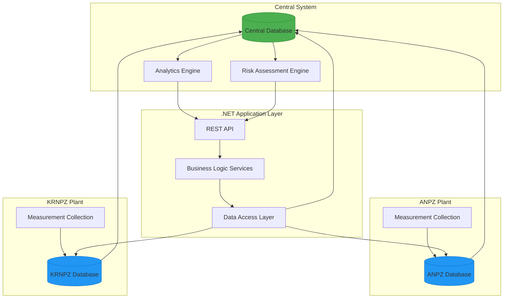
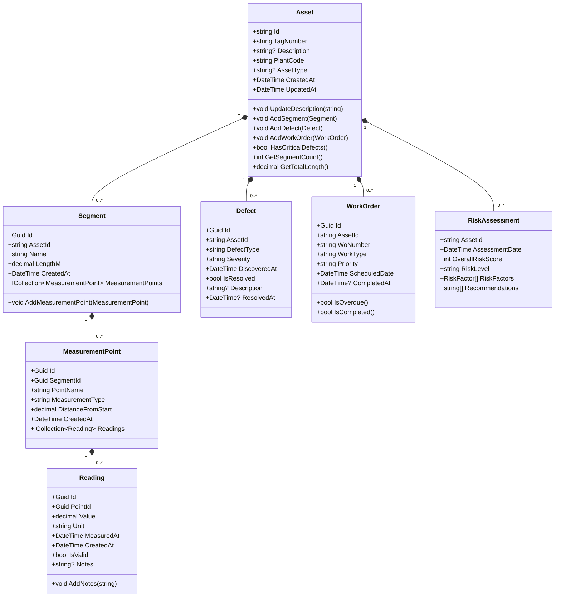
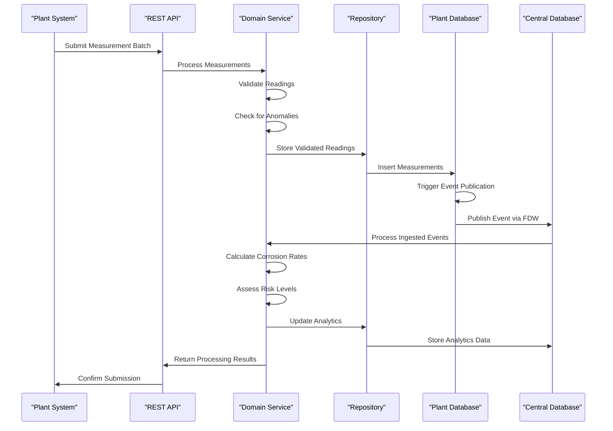

# Project Overview

<cite>
**Referenced Files in This Document**   
- [README.md](file://README.md)
- [IMPLEMENTATION_README.md](file://IMPLEMENTATION_README.md)
- [Asset.cs](file://src/OilErp.Domain/Entities/Asset.cs)
- [MeasurementService.cs](file://src/OilErp.Domain/Services/MeasurementService.cs)
- [RiskAssessmentService.cs](file://src/OilErp.Domain/Services/RiskAssessmentService.cs)
- [AnalyticsController.cs](file://src/OilErp.App/Controllers/AnalyticsController.cs)
- [AssetRepository.cs](file://src/OilErp.Data/Repositories/AssetRepository.cs)
- [01_tables.sql](file://sql/central/01_tables.sql)
- [02_fdw.sql](file://sql/central/02_functions_core.sql)
</cite>

## Table of Contents
1. [Introduction](#introduction)
2. [System Architecture](#system-architecture)
3. [Core Components](#core-components)
4. [Data Flow and Processing](#data-flow-and-processing)
5. [Technology Stack](#technology-stack)
6. [Use Cases](#use-cases)
7. [Implementation Details](#implementation-details)
8. [Conclusion](#conclusion)

## Introduction

The Oil ERP Asset Registry and Integrity Tracking System is a distributed enterprise resource planning (ERP) solution designed for comprehensive asset management in the oil industry. This system enables multi-plant data collection with centralized analytics, providing a unified platform for tracking asset integrity, measurements, defects, and work orders across multiple facilities. The architecture supports both local data collection at individual plants (ANPZ and KRNPZ) and global analytics through a central database, creating a cohesive system for risk assessment and operational decision-making.

The system's primary purpose is to ensure the safety, reliability, and regulatory compliance of oil industry assets by implementing a robust framework for continuous monitoring, risk evaluation, and maintenance planning. By integrating data from multiple plants into a central analytics hub, the system enables cross-facility comparisons, trend analysis, and enterprise-wide risk management.

## System Architecture

The Oil ERP system follows a distributed architecture with three main components: the central database, plant-specific databases, and the .NET application layer. This design enables decentralized data collection at the plant level while maintaining centralized analytics and coordination capabilities.

**Diagram sources**
- [README.md](file://README.md#L15-L25)
- [IMPLEMENTATION_README.md](file://IMPLEMENTATION_README.md#L15-L25)

**Section sources**
- [README.md](file://README.md#L1-L95)
- [IMPLEMENTATION_README.md](file://IMPLEMENTATION_README.md#L0-L263)

## Core Components

The system consists of several interconnected components that work together to provide comprehensive asset management capabilities. The central database serves as the primary repository for global asset information, risk policies, and analytical data. Plant databases (ANPZ and KRNPZ) handle local measurement collection and immediate processing, reducing network latency and ensuring data availability even during connectivity issues.

The .NET application layer implements a domain-driven design with clear separation of concerns. The domain layer contains business entities such as Asset, Defect, WorkOrder, and MeasurementPoint, along with domain services that encapsulate business logic. The data access layer uses the repository pattern with Dapper as a micro-ORM to interact with PostgreSQL databases, providing a clean abstraction over database operations.

The Asset entity serves as the primary aggregate root, containing essential information such as asset code, tag number, plant code, and creation metadata. It maintains relationships with related entities including segments, defects, and work orders, enabling comprehensive asset tracking and management.

**Diagram sources**
- [Asset.cs](file://src/OilErp.Domain/Entities/Asset.cs#L5-L71)
- [src/OilErp.Domain/Entities/Segment.cs](file://src/OilErp.Domain/Entities/Segment.cs)
- [src/OilErp.Domain/Entities/MeasurementPoint.cs](file://src/OilErp.Domain/Entities/MeasurementPoint.cs)
- [src/OilErp.Domain/Entities/Reading.cs](file://src/OilErp.Domain/Entities/Reading.cs)
- [src/OilErp.Domain/Entities/Defect.cs](file://src/OilErp.Domain/Entities/Defect.cs)
- [src/OilErp.Domain/Entities/WorkOrder.cs](file://src/OilErp.Domain/Entities/WorkOrder.cs)

**Section sources**
- [Asset.cs](file://src/OilErp.Domain/Entities/Asset.cs#L5-L71)
- [src/OilErp.Domain/Entities/Segment.cs](file://src/OilErp.Domain/Entities/Segment.cs)
- [src/OilErp.Domain/Entities/MeasurementPoint.cs](file://src/OilErp.Domain/Entities/MeasurementPoint.cs)

## Data Flow and Processing

The system implements a sophisticated data flow that begins with measurement collection at the plant level and culminates in centralized analytics and risk assessment. When measurements are submitted to a plant database, a trigger automatically processes the data and publishes events to a central inbox through Foreign Data Wrappers (FDW). This event-driven architecture ensures that the central system remains updated with the latest measurement data without requiring direct, real-time connections to plant databases.

The measurement processing workflow begins with validation of incoming readings based on measurement type (wall thickness, pressure, temperature, etc.). The system checks for valid value ranges and flags potential anomalies by comparing new readings against historical data. For wall thickness measurements, the system calculates corrosion rates and assesses risk levels based on configurable thresholds.

Risk assessment follows a comprehensive approach that considers multiple factors including current measurements, unresolved defects, and maintenance history. The RiskAssessmentService evaluates each asset by analyzing defect severity and age, measurement trends, and overdue work orders. It calculates an overall risk score using a weighted average based on severity levels, with critical and emergency issues receiving higher weight. The service then generates actionable recommendations based on the assessment results.

**Diagram sources**
- [MeasurementService.cs](file://src/OilErp.Domain/Services/MeasurementService.cs#L9-L207)
- [RiskAssessmentService.cs](file://src/OilErp.Domain/Services/RiskAssessmentService.cs#L9-L276)
- [AnalyticsController.cs](file://src/OilErp.App/Controllers/AnalyticsController.cs#L9-L371)

**Section sources**
- [MeasurementService.cs](file://src/OilErp.Domain/Services/MeasurementService.cs#L9-L207)
- [RiskAssessmentService.cs](file://src/OilErp.Domain/Services/RiskAssessmentService.cs#L9-L276)
- [AnalyticsController.cs](file://src/OilErp.App/Controllers/AnalyticsController.cs#L9-L371)

## Technology Stack

The Oil ERP system is built on a modern technology stack designed for performance, scalability, and maintainability. The backend is implemented using .NET 8, leveraging C# 12 features and the ASP.NET Core framework for building the REST API. PostgreSQL serves as the database engine, chosen for its robust feature set, reliability, and support for advanced capabilities like Foreign Data Wrappers (FDW) that enable the distributed architecture.

Dapper is used as the micro-ORM for database access, providing a lightweight and high-performance alternative to full-featured ORMs. This choice allows for fine-grained control over SQL queries while maintaining code readability and reducing overhead. The domain-driven design approach ensures clear separation between business logic, data access, and presentation layers, making the system easier to maintain and extend.

The system incorporates several additional technologies to enhance functionality and reliability. Serilog provides structured logging for comprehensive monitoring and troubleshooting. FluentValidation handles input validation at both the API and domain levels, ensuring data integrity. The testing strategy includes unit tests with xUnit, integration tests with TestContainers, and end-to-end system validation tests, providing confidence in the system's correctness and reliability.

## Use Cases

### Asset Registration
The asset registration process allows users to create and manage asset records in the system. When a new asset is registered, the system stores essential information including asset code, tag number, plant code, and description. The AssetService handles the business logic for asset creation, ensuring data consistency and enforcing business rules. The AssetRepository persists the asset data to the central database, making it available for analytics and risk assessment.

### Measurement Processing
Measurement processing involves collecting wall thickness, pressure, temperature, and other readings from inspection activities. The MeasurementService validates incoming readings based on measurement type, checking for valid value ranges and flagging potential anomalies. For wall thickness measurements, the system calculates corrosion rates and updates the asset's risk profile accordingly. The batch processing capability allows for efficient submission of multiple measurements, reducing network overhead and improving performance.

### Risk Assessment
Risk assessment is a critical function that evaluates the integrity of assets based on multiple factors. The RiskAssessmentService analyzes current measurements, unresolved defects, and maintenance history to calculate an overall risk score. The system categorizes risk levels as Minimal, Low, Medium, High, or Critical, with corresponding recommendations for action. For example, assets with critical risk levels trigger immediate inspection and maintenance recommendations, while those with medium risk may require scheduled follow-up.

## Implementation Details

The implementation follows a clean architecture with well-defined layers and separation of concerns. The domain layer contains rich business entities with behavior, not just data containers. For example, the Asset class includes methods like AddSegment, AddDefect, and HasCriticalDefects, encapsulating business rules and ensuring data consistency.

The data access layer implements the repository pattern with a base repository class that provides common CRUD operations. Specific repositories like AssetRepository extend this base class and implement additional methods required for their respective entities. The use of interfaces (IAssetRepository, IUnitOfWork) enables dependency injection and makes the system more testable.

Database scripts in the sql/ directory define the schema for both central and plant databases. The central database contains tables for global assets, risk policies, and analytics, while plant databases include tables for local measurements and measurement points. Foreign Data Wrapper (FDW) configurations enable cross-database queries and event publishing between systems.

The REST API follows RESTful principles with resource-based URLs and appropriate HTTP verbs. API endpoints are documented with OpenAPI/Swagger, providing interactive documentation and client code generation capabilities. The system includes comprehensive error handling with structured error responses and detailed logging for troubleshooting.

## Conclusion

The Oil ERP Asset Registry and Integrity Tracking System provides a comprehensive solution for managing asset integrity in the oil industry. Its distributed architecture enables efficient data collection at multiple plants while maintaining centralized analytics and risk assessment capabilities. The system's modular design, based on domain-driven principles and clean architecture, ensures maintainability and extensibility.

By integrating data from multiple sources and applying sophisticated risk assessment algorithms, the system enables proactive maintenance planning and helps prevent costly failures. The technology stack, combining .NET 8, PostgreSQL, and Dapper, provides a robust foundation for performance and reliability. With its comprehensive feature set and well-structured implementation, the system serves as a valuable tool for ensuring the safety and efficiency of oil industry operations.