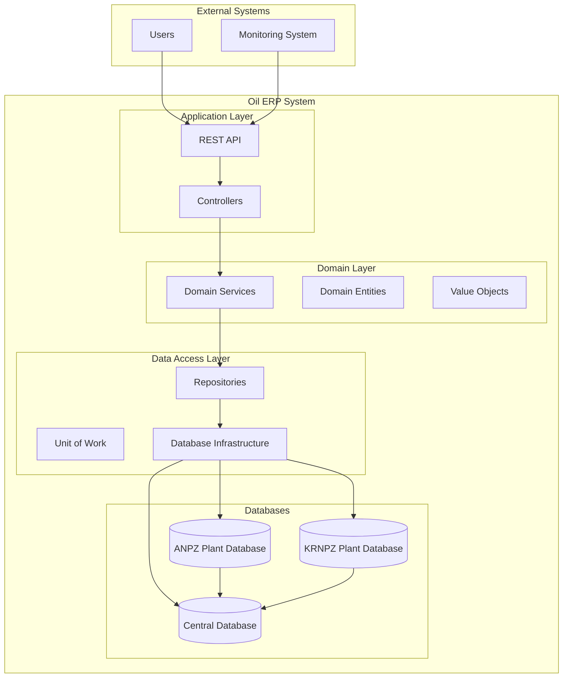
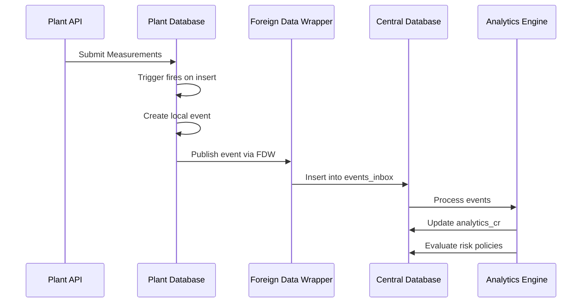
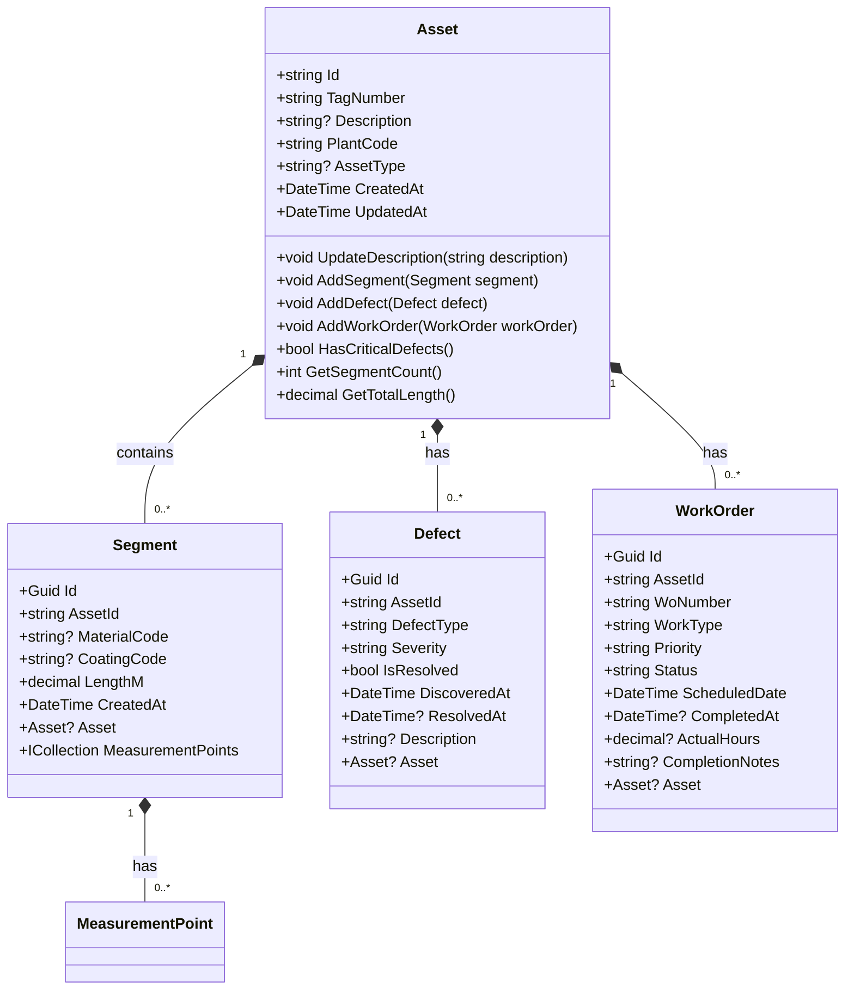
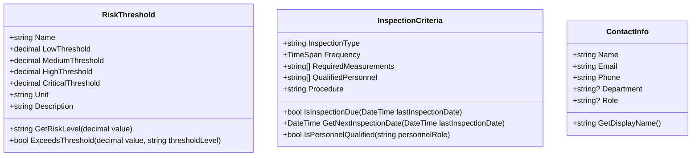
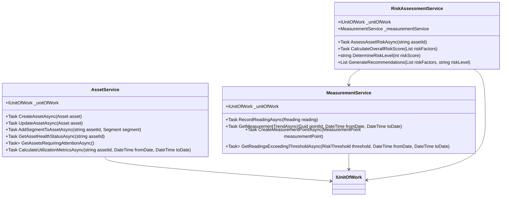
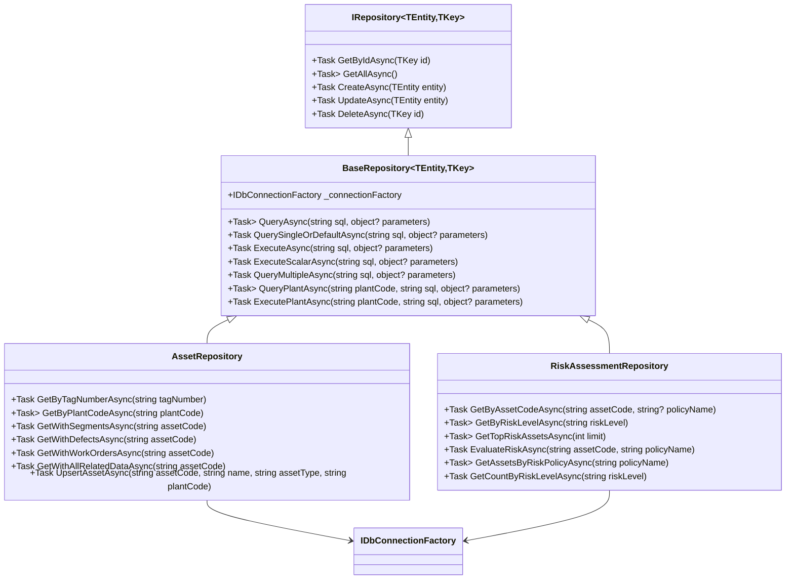
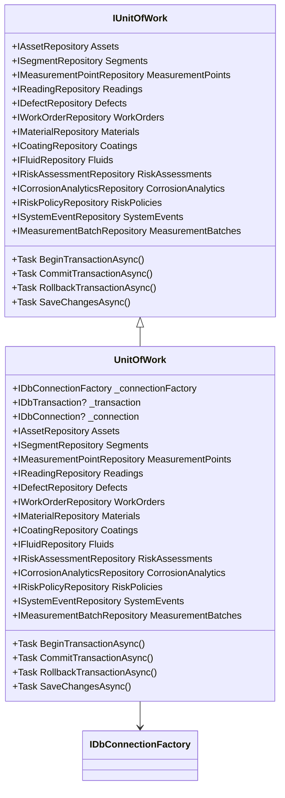

# System Architecture

<cite>
**Referenced Files in This Document**   
- [Asset.cs](file://src/OilErp.Domain/Entities/Asset.cs)
- [RiskAndInspection.cs](file://src/OilErp.Domain/ValueObjects/RiskAndInspection.cs)
- [AssetService.cs](file://src/OilErp.Domain/Services/AssetService.cs)
- [MeasurementService.cs](file://src/OilErp.Domain/Services/MeasurementService.cs)
- [RiskAssessmentService.cs](file://src/OilErp.Domain/Services/RiskAssessmentService.cs)
- [UnitOfWork.cs](file://src/OilErp.Data/UnitOfWork.cs)
- [BaseRepository.cs](file://src/OilErp.Data/Repositories/BaseRepository.cs)
- [DatabaseInfrastructure.cs](file://src/OilErp.Data/Infrastructure/DatabaseInfrastructure.cs)
- [ServiceCollectionExtensions.cs](file://src/OilErp.App/Extensions/ServiceCollectionExtensions.cs)
- [Program.cs](file://src/OilErp.App/Program.cs)
- [AssetsController.cs](file://src/OilErp.App/Controllers/AssetsController.cs)
- [AnalyticsController.cs](file://src/OilErp.App/Controllers/AnalyticsController.cs)
- [MeasurementsController.cs](file://src/OilErp.App/Controllers/MeasurementsController.cs)
- [WorkOrdersController.cs](file://src/OilErp.App/Controllers/WorkOrdersController.cs)
- [IDataServices.cs](file://src/OilErp.Domain/Interfaces/IDataServices.cs)
- [IRepositories.cs](file://src/OilErp.Domain/Interfaces/IRepositories.cs)
</cite>

## Table of Contents
1. [Introduction](#introduction)
2. [System Context](#system-context)
3. [Distributed Database Architecture](#distributed-database-architecture)
4. [Domain-Driven Design Implementation](#domain-driven-design-implementation)
5. [Repository Pattern and Unit of Work](#repository-pattern-and-unit-of-work)
6. [Component Interactions and Data Flows](#component-interactions-and-data-flows)
7. [Technology Stack and Dependencies](#technology-stack-and-dependencies)
8. [Deployment Topology](#deployment-topology)
9. [Cross-Cutting Concerns](#cross-cutting-concerns)
10. [Conclusion](#conclusion)

## Introduction

The Oil ERP system is a comprehensive asset registry and integrity tracking solution designed for oil industry operations. The system implements a distributed architecture with central and plant databases to manage asset integrity across multiple facilities with centralized analytics and distributed data collection. This document provides a detailed architectural overview of the system, focusing on its distributed nature, domain-driven design principles, repository pattern implementation, and component interactions.

The system is built using .NET 8 with C# 12, PostgreSQL for data storage, Dapper as a micro ORM for database access, and ASP.NET Core for the web API framework. It follows a layered architecture with clear separation of concerns between the application layer, domain layer, and data access layer.

**Section sources**
- [README.md](file://README.md#L0-L73)
- [IMPLEMENTATION_README.md](file://IMPLEMENTATION_README.md#L0-L263)

## System Context

The Oil ERP system consists of multiple interconnected components that work together to provide a comprehensive asset management solution. The system context diagram below illustrates the high-level components and their interactions.

**Diagram sources**
- [README.md](file://README.md#L0-L73)
- [IMPLEMENTATION_README.md](file://IMPLEMENTATION_README.md#L0-L263)

The system provides REST API endpoints for asset management, measurement operations, analytics, and work order management. The application layer handles HTTP requests and responses, while the domain layer contains the business logic and rules. The data access layer manages database operations and transactions.

**Section sources**
- [README.md](file://README.md#L0-L73)
- [IMPLEMENTATION_README.md](file://IMPLEMENTATION_README.md#L0-L263)

## Distributed Database Architecture

The Oil ERP system features a distributed database architecture with a central database and multiple plant databases. This architecture enables local data collection at plant level while maintaining centralized analytics and coordination.

### Central Database

The central database serves as the main analytical and coordination hub for the system. It stores global asset registry information, risk policies, analytics data, and incident records. The central database is implemented using PostgreSQL and contains tables such as `assets_global`, `risk_policies`, `analytics_cr`, and `events_inbox`.

### Plant Databases

Each plant has its own database for local measurement collection and defect tracking. The system currently supports ANPZ and KRNPZ plant databases, with potential for additional plants. Plant databases store local asset information, measurement points, readings, and work orders. This decentralized approach allows for efficient data collection at the plant level without network dependency on the central system.

### Foreign Data Wrappers

The system uses PostgreSQL's Foreign Data Wrapper (FDW) feature to enable communication between the central and plant databases. FDW allows the central database to access data from plant databases as if they were local tables. This integration enables cross-database operations and data synchronization without requiring complex ETL processes.

The data flow between plant and central databases follows a publish-subscribe pattern:
1. Measurements are submitted via API to the plant-specific database
2. A trigger activates on the measurements table and publishes an event to the local events queue
3. FDW publishes the event to the central `events_inbox` table
4. The central system processes events and updates analytics
5. Risk assessments are automatically evaluated using configured policies

This architecture provides several benefits:
- **Scalability**: Each plant database can scale independently based on local requirements
- **Resilience**: Local data collection continues even if the central system is unavailable
- **Performance**: Local operations are fast and don't require network round-trips
- **Data Sovereignty**: Plant-specific data remains in the local database while only necessary information is shared centrally

**Diagram sources**
- [IMPLEMENTATION_README.md](file://IMPLEMENTATION_README.md#L158-L184)
- [sql/README.md](file://sql/README.md#L0-L33)

**Section sources**
- [README.md](file://README.md#L0-L73)
- [IMPLEMENTATION_README.md](file://IMPLEMENTATION_README.md#L0-L263)
- [sql/README.md](file://sql/README.md#L0-L33)

## Domain-Driven Design Implementation

The Oil ERP system implements Domain-Driven Design (DDD) principles to model the complex business domain of oil industry asset management. The system focuses on rich domain entities, value objects, and domain services to encapsulate business logic and rules.

### Aggregate Roots

The primary aggregate root in the system is the `Asset` entity, which represents a physical asset in the oil industry pipeline system. The `Asset` aggregate includes related entities such as segments, defects, and work orders, ensuring consistency and transactional boundaries.

**Diagram sources**
- [Asset.cs](file://src/OilErp.Domain/Entities/Asset.cs#L5-L71)
- [AssetService.cs](file://src/OilErp.Domain/Services/AssetService.cs#L9-L211)

### Value Objects

The system uses value objects to represent complex values that don't have identity. Value objects are immutable and are compared by their properties rather than identity.

The `RiskThreshold` value object represents a risk threshold configuration with low, medium, high, and critical thresholds. It provides methods to determine the risk level based on a value and to check if a value exceeds a specific threshold level.

**Diagram sources**
- [RiskAndInspection.cs](file://src/OilErp.Domain/ValueObjects/RiskAndInspection.cs#L0-L162)

### Domain Services

Domain services encapsulate business logic that doesn't naturally belong to an entity or value object. The system implements several domain services for asset management, measurement operations, and risk assessment.

The `AssetService` provides operations for creating, updating, and managing assets. It includes methods for adding segments to assets, calculating asset utilization metrics, and determining asset health status based on defects and measurements.

The `MeasurementService` handles measurement operations and data validation. It includes methods for recording readings, creating measurement points, and analyzing measurement trends. The service validates reading values based on measurement type and checks for potential anomalies compared to historical data.

The `RiskAssessmentService` evaluates risk for assets based on current measurements and defects. It assesses risks related to defects, measurements, and maintenance, calculates an overall risk score, and generates recommendations for risk mitigation.

**Diagram sources**
- [AssetService.cs](file://src/OilErp.Domain/Services/AssetService.cs#L9-L211)
- [MeasurementService.cs](file://src/OilErp.Domain/Services/MeasurementService.cs#L9-L225)
- [RiskAssessmentService.cs](file://src/OilErp.Domain/Services/RiskAssessmentService.cs#L9-L301)

**Section sources**
- [Asset.cs](file://src/OilErp.Domain/Entities/Asset.cs#L5-L71)
- [RiskAndInspection.cs](file://src/OilErp.Domain/ValueObjects/RiskAndInspection.cs#L0-L162)
- [AssetService.cs](file://src/OilErp.Domain/Services/AssetService.cs#L9-L211)
- [MeasurementService.cs](file://src/OilErp.Domain/Services/MeasurementService.cs#L9-L225)
- [RiskAssessmentService.cs](file://src/OilErp.Domain/Services/RiskAssessmentService.cs#L9-L301)

## Repository Pattern and Unit of Work

The Oil ERP system implements the Repository Pattern with interface segregation and Unit of Work for transaction management. This design provides a clean separation of data access concerns and enables consistent transaction management across repositories.

### Repository Pattern Implementation

The system uses a base repository class that provides common functionality for all repositories. The `BaseRepository<TEntity, TKey>` class implements the `IRepository<TEntity, TKey>` interface and provides methods for basic CRUD operations.

**Diagram sources**
- [BaseRepository.cs](file://src/OilErp.Data/Repositories/BaseRepository.cs#L9-L145)
- [IRepositories.cs](file://src/OilErp.Domain/Interfaces/IRepositories.cs#L0-L218)

### Interface Segregation

The system follows the Interface Segregation Principle by defining specific repository interfaces for each entity. This allows clients to depend only on the methods they need and enables more focused and maintainable code.

The `IAssetRepository` interface defines methods specific to asset operations, including advanced queries for retrieving assets with related data and statistics. Similarly, the `IRiskAssessmentRepository` interface defines methods for risk assessment operations, such as evaluating risk for an asset and retrieving top risk assets.

### Unit of Work for Transaction Management

The system implements the Unit of Work pattern to manage transactions across multiple repositories. The `UnitOfWork` class implements the `IUnitOfWork` interface and provides access to all repositories through properties.

**Diagram sources**
- [UnitOfWork.cs](file://src/OilErp.Data/UnitOfWork.cs#L9-L127)
- [IDataServices.cs](file://src/OilErp.Domain/Interfaces/IDataServices.cs#L55-L81)

The `UnitOfWork` class manages the database transaction and ensures that all operations within a transaction are committed or rolled back together. It creates repository instances on demand and shares the same database connection and transaction across all repositories.

When a transaction is started with `BeginTransactionAsync`, the `UnitOfWork` creates a database connection and begins a transaction. All subsequent operations on repositories use this connection and transaction. When `CommitTransactionAsync` is called, the transaction is committed, and when `RollbackTransactionAsync` is called, the transaction is rolled back.

This implementation provides several benefits:
- **Consistency**: All operations within a transaction are atomic and consistent
- **Performance**: Multiple operations can be performed within a single transaction without opening and closing connections
- **Simplicity**: Clients don't need to manage transactions manually; they can use the Unit of Work pattern to group related operations

**Section sources**
-