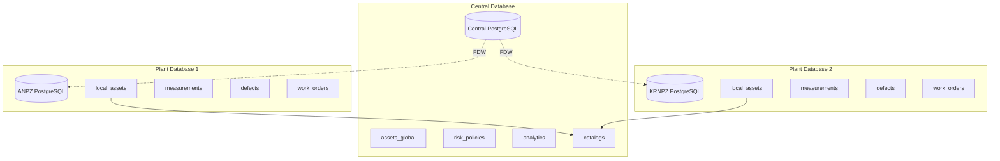
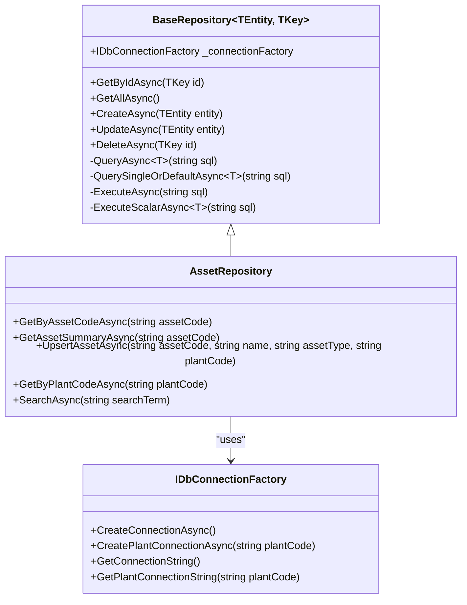
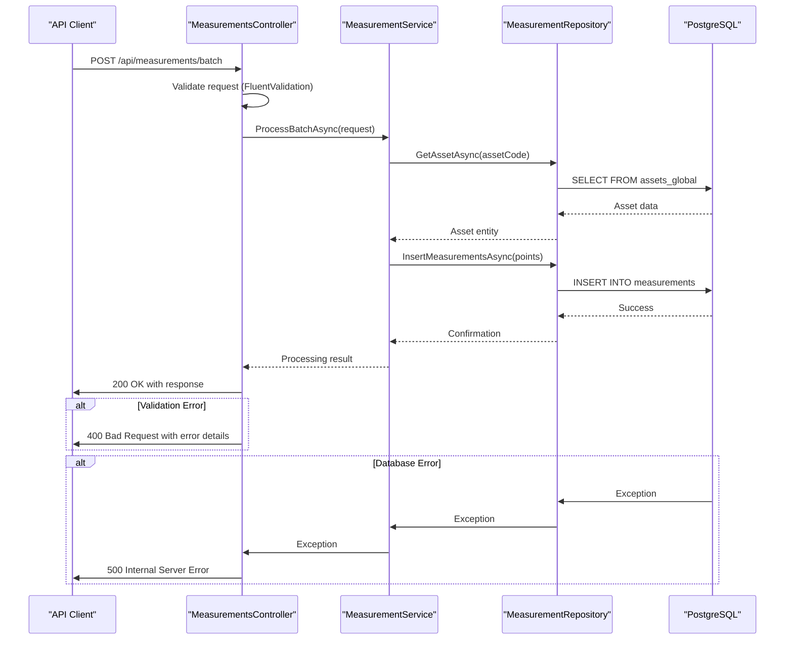
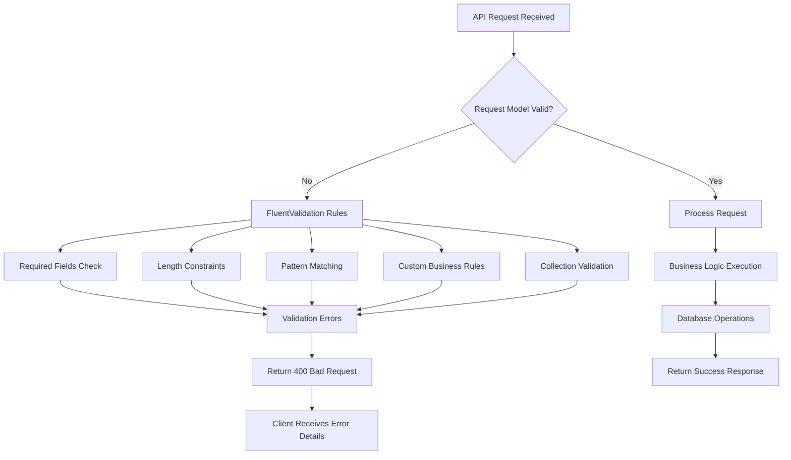
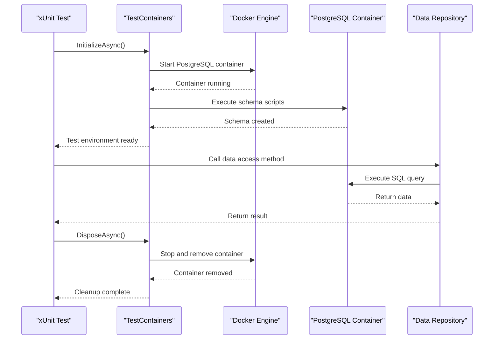

# Technology Stack & Dependencies

<cite>
**Referenced Files in This Document**   
- [Program.cs](file://src/OilErp.App/Program.cs)
- [DatabaseInfrastructure.cs](file://src/OilErp.Data/Infrastructure/DatabaseInfrastructure.cs)
- [UnitOfWork.cs](file://src/OilErp.Data/UnitOfWork.cs)
- [BaseRepository.cs](file://src/OilErp.Data/Repositories/BaseRepository.cs)
- [AssetRepository.cs](file://src/OilErp.Data/Repositories/AssetRepository.cs)
- [AssetValidators.cs](file://src/OilErp.App/Validators/AssetValidators.cs)
- [appsettings.json](file://src/OilErp.App/appsettings.json)
- [DatabaseIntegrationTests.cs](file://src/OilErp.Tests/Integration/DatabaseIntegrationTests.cs)
- [ServiceCollectionExtensions.cs](file://src/OilErp.App/Extensions/ServiceCollectionExtensions.cs)
- [ExceptionHandlingMiddleware.cs](file://src/OilErp.App/Middleware/ExceptionHandlingMiddleware.cs)
</cite>

## Table of Contents
1. [Introduction](#introduction)
2. [.NET 8 Framework](#net-8-framework)
3. [PostgreSQL Database with FDW](#postgresql-database-with-fdw)
4. [Dapper Micro ORM](#dapper-micro-orm)
5. [ASP.NET Core REST API](#aspnet-core-rest-api)
6. [Serilog Structured Logging](#serilog-structured-logging)
7. [FluentValidation for Input Validation](#fluentvalidation-for-input-validation)
8. [xUnit Testing Framework](#xunit-testing-framework)
9. [TestContainers for Integration Testing](#testcontainers-for-integration-testing)
10. [Technology Integration Example](#technology-integration-example)

## Introduction
The Oil ERP system is built on a modern technology stack designed for high performance, reliability, and maintainability in industrial asset management scenarios. This document details the core technologies used in the system, explaining their roles, configuration, and integration patterns. The architecture combines .NET 8's robust runtime capabilities with PostgreSQL's advanced database features, particularly Foreign Data Wrappers (FDW) for distributed operations across central and plant databases. The technology choices reflect a balance between performance, developer productivity, and enterprise requirements for a distributed oil industry ERP system.

## .NET 8 Framework
.NET 8 serves as the foundational runtime and framework for the Oil ERP system, providing the execution environment, base class libraries, and development platform for all application components. As the latest long-term support (LTS) version of Microsoft's open-source, cross-platform framework, .NET 8 offers significant performance improvements, enhanced developer productivity features, and long-term stability for enterprise applications.

The framework provides essential services including garbage collection, just-in-time (JIT) compilation, security model, exception handling, and a comprehensive standard library. In the Oil ERP system, .NET 8 enables the creation of high-performance REST APIs, efficient data processing, and reliable background services for industrial asset management.

Key benefits in this implementation include:
- **Performance**: Optimized runtime with improved garbage collection and native AOT compilation options
- **Cross-platform capability**: Ability to deploy on Windows, Linux, and containerized environments
- **Modern C# features**: Utilization of C# 12 features like primary constructors and collection expressions
- **Built-in dependency injection**: Native support for inversion of control and service lifecycle management
- **Configuration system**: Flexible configuration providers for different environments

The framework's maturity and Microsoft's LTS support model make it ideal for mission-critical industrial applications requiring long-term stability and security updates.

**Section sources**
- [Program.cs](file://src/OilErp.App/Program.cs#L0-L102)
- [ServiceCollectionExtensions.cs](file://src/OilErp.App/Extensions/ServiceCollectionExtensions.cs#L0-L70)

## PostgreSQL Database with FDW
PostgreSQL 14+ serves as the primary database engine for the Oil ERP system, chosen for its reliability, advanced features, and support for distributed database operations through Foreign Data Wrappers (FDW). The system implements a distributed architecture where a central database coordinates with multiple plant-level databases, enabling localized data collection while maintaining centralized analytics and reporting.

The FDW implementation allows plant databases to access reference data from the central database without data duplication. This is configured through PostgreSQL's `postgres_fdw` extension, which creates foreign servers and user mappings to establish secure connections between databases. The central database maintains master catalogs for materials, coatings, and risk policies, which are accessed by plant databases via FDW.

Key configuration elements include:
- Central database hosting global assets, risk policies, and analytics data
- Plant databases (ANPZ, KRNPZ) storing local measurements, defects, and work orders
- FDW setup enabling plant databases to query central catalog data
- Connection pooling and optimized query planning for cross-database operations

The SQL configuration establishes foreign servers and imports central catalog schemas into plant databases, enabling seamless access to reference data while maintaining data locality for operational efficiency.

**Diagram sources **
- [DatabaseInfrastructure.cs](file://src/OilErp.Data/Infrastructure/DatabaseInfrastructure.cs#L10-L83)
- [appsettings.json](file://src/OilErp.App/appsettings.json#L0-L27)

**Section sources**
- [DatabaseInfrastructure.cs](file://src/OilErp.Data/Infrastructure/DatabaseInfrastructure.cs#L10-L83)
- [appsettings.json](file://src/OilErp.App/appsettings.json#L0-L27)

## Dapper Micro ORM
Dapper is implemented as the micro ORM for efficient database access in the Oil ERP system, providing a lightweight alternative to full-featured ORMs like Entity Framework. As a simple object mapper, Dapper extends IDbConnection with extension methods that enable direct execution of SQL queries and mapping of results to strongly-typed objects with minimal overhead.

The implementation follows a repository pattern with a base `BaseRepository` class that provides common database operations while allowing specific repositories to implement custom queries. This approach balances the need for performance with maintainable code organization. Dapper's minimal abstraction layer ensures that database queries are explicit and optimized, avoiding the performance penalties of complex ORM query generation.

Key usage patterns in the system include:
- **Parameterized queries**: Using Dapper's automatic parameter mapping to prevent SQL injection
- **Async operations**: Leveraging Dapper's async methods for non-blocking database access
- **Multiple result sets**: Using `QueryMultipleAsync` for efficient retrieval of related data
- **Scalar operations**: Executing functions and retrieving single values with `ExecuteScalarAsync`
- **Batch operations**: Processing multiple records efficiently with `ExecuteAsync`

The repository pattern implementation encapsulates Dapper operations while exposing methods that return domain entities, maintaining separation between data access logic and business logic.

**Diagram sources **
- [BaseRepository.cs](file://src/OilErp.Data/Repositories/BaseRepository.cs#L0-L145)
- [AssetRepository.cs](file://src/OilErp.Data/Repositories/AssetRepository.cs#L0-L214)
- [DatabaseInfrastructure.cs](file://src/OilErp.Data/Infrastructure/DatabaseInfrastructure.cs#L10-L83)

**Section sources**
- [BaseRepository.cs](file://src/OilErp.Data/Repositories/BaseRepository.cs#L0-L145)
- [AssetRepository.cs](file://src/OilErp.Data/Repositories/AssetRepository.cs#L0-L214)

## ASP.NET Core REST API
ASP.NET Core provides the REST API framework for the Oil ERP system, enabling the creation of high-performance, cross-platform web APIs for asset management operations. The implementation follows modern API design principles with controller-based endpoints, dependency injection, and middleware for cross-cutting concerns.

The API configuration includes Swagger/OpenAPI documentation through Swashbuckle, providing interactive API documentation and client code generation capabilities. Health checks are implemented to monitor system status, and CORS policies allow controlled access from frontend applications. The middleware pipeline handles global exception handling, request logging, and error response formatting.

Key features of the implementation:
- **Attribute routing**: Clean, RESTful endpoint design with HTTP method attributes
- **Model binding**: Automatic mapping of JSON request bodies to strongly-typed models
- **Validation integration**: Seamless integration with FluentValidation for request validation
- **Swagger documentation**: Auto-generated API documentation with examples
- **Global exception handling**: Consistent error response format across all endpoints
- **Health checks**: Built-in endpoint for monitoring system health

The API serves as the primary interface for both the desktop UI and external systems, providing CRUD operations for assets, measurements, work orders, and other domain entities.

**Diagram sources **
- [Program.cs](file://src/OilErp.App/Program.cs#L0-L102)
- [MeasurementsController.cs](file://src/OilErp.App/Controllers/MeasurementsController.cs)
- [AssetValidators.cs](file://src/OilErp.App/Validators/AssetValidators.cs#L0-L221)

**Section sources**
- [Program.cs](file://src/OilErp.App/Program.cs#L0-L102)

## Serilog Structured Logging
Serilog is implemented for structured logging throughout the OilERP system, providing rich, searchable log data that supports operational monitoring and troubleshooting. Unlike traditional text-based logging, Serilog captures log events as structured data with properties that can be easily queried and analyzed.

The configuration in `Program.cs` sets up Serilog with multiple sinks, including console output for development and file logging with daily rolling for production. The structured approach enables detailed logging of request parameters, execution times, and error details while maintaining readability. Log enrichment adds contextual information like thread ID and process ID to each log event.

Key benefits in this implementation:
- **Structured data**: Log events contain named properties rather than formatted strings
- **Multiple sinks**: Simultaneous output to console, files, and potentially other destinations
- **Rolling files**: Automatic log file rotation by day to manage disk space
- **Configuration flexibility**: Settings can be adjusted via appsettings.json
- **Exception logging**: Full exception details including stack traces

The logging strategy supports both development debugging and production monitoring, with different verbosity levels configured for development and production environments through separate appsettings files.

**Section sources**
- [Program.cs](file://src/OilErp.App/Program.cs#L0-L102)
- [appsettings.json](file://src/OilErp.App/appsettings.json#L0-L27)
- [appsettings.Development.json](file://src/OilErp.App/appsettings.Development.json#L0-L12)

## FluentValidation for Input Validation
FluentValidation is used for input validation in the Oil ERP system, providing a fluent, readable syntax for defining complex validation rules for API request models. The library integrates seamlessly with ASP.NET Core's model validation pipeline, automatically validating incoming requests and returning appropriate error responses.

Validation rules are defined in dedicated validator classes that inherit from `AbstractValidator<T>`, with rules expressed through a fluent interface. The system implements validators for key request models including `AssetRequest`, `BatchMeasurementRequest`, and `WorkOrderRequest`, each containing comprehensive validation logic for business rules and data integrity.

Key validation patterns in the implementation:
- **Required fields**: Ensuring mandatory properties are present
- **Length constraints**: Enforcing maximum and minimum string lengths
- **Pattern matching**: Validating format with regular expressions
- **Custom business rules**: Implementing domain-specific validation logic
- **Conditional validation**: Applying rules based on other property values
- **Collection validation**: Validating lists with `RuleForEach`

The validation system prevents invalid data from entering the system while providing clear, user-friendly error messages that help clients correct their requests.

**Diagram sources **
- [AssetValidators.cs](file://src/OilErp.App/Validators/AssetValidators.cs#L0-L221)
- [ApiModels.cs](file://src/OilErp.App/Models/ApiModels.cs#L0-L266)

**Section sources**
- [AssetValidators.cs](file://src/OilErp.App/Validators/AssetValidators.cs#L0-L221)
- [ApiModels.cs](file://src/OilErp.App/Models/ApiModels.cs#L0-L266)

## xUnit Testing Framework
xUnit is the testing framework used for unit and integration testing in the Oil ERP system, providing a modern, extensible platform for test automation. The framework's design emphasizes clean, readable tests with minimal boilerplate, supporting both unit testing of isolated components and integration testing of system components.

The test suite is organized into unit and integration test projects, with unit tests focusing on business logic in the domain layer and integration tests verifying database interactions and service coordination. xUnit's theory and member data features enable parameterized testing of validation rules and edge cases, while its async test support ensures proper testing of asynchronous operations.

Key testing patterns in the implementation:
- **Fact tests**: For tests with a single outcome
- **Theory tests**: For parameterized tests with multiple data points
- **Async testing**: Support for testing asynchronous methods
- **Dependency injection**: Integration with test service providers
- **Collection fixtures**: Shared test state across test classes
- **Assertion library**: Integration with FluentAssertions for readable assertions

The testing strategy ensures high code coverage and reliable regression testing, supporting continuous integration and deployment practices.

**Section sources**
- [DatabaseIntegrationTests.cs](file://src/OilErp.Tests/Integration/DatabaseIntegrationTests.cs#L0-L326)
- [SystemValidationTests.cs](file://src/OilErp.Tests/EndToEnd/SystemValidationTests.cs)

## TestContainers for Integration Testing
TestContainers is used for integration testing in the Oil ERP system, providing isolated, containerized database instances for reliable integration tests. This approach eliminates dependencies on external database servers and ensures test consistency across different environments.

The implementation uses the Testcontainers.PostgreSql library to create and manage PostgreSQL container instances during test execution. Each test run gets a fresh database instance, preventing test pollution and enabling parallel test execution. The containers run the same PostgreSQL version as production, ensuring test accuracy.

Key benefits of this approach:
- **Isolation**: Each test run has its own database instance
- **Consistency**: Tests run against the same database version as production
- **No external dependencies**: Eliminates need for shared test databases
- **Automatic cleanup**: Containers are destroyed after tests complete
- **Realistic testing**: Tests against actual PostgreSQL, not in-memory databases

The integration tests verify repository implementations, database schema correctness, and complex data operations, providing confidence in the data access layer before deployment.

**Diagram sources **
- [DatabaseIntegrationTests.cs](file://src/OilErp.Tests/Integration/DatabaseIntegrationTests.cs#L0-L326)

**Section sources**
- [DatabaseIntegrationTests.cs](file://src/OilErp.Tests/Integration/DatabaseIntegrationTests.cs#L0-L326)

## Technology Integration Example
The technologies in the Oil ERP system work together seamlessly to handle a typical business scenario: creating a new asset through the API. This example demonstrates how the various components integrate to process a request from validation through to persistence.

When a client submits an asset creation request, the ASP.NET Core middleware pipeline first routes the request to the appropriate controller. FluentValidation automatically validates the request model against defined business rules, rejecting invalid requests with descriptive error messages. Serilog captures the request details and processing timeline for monitoring and debugging.

Valid requests are processed by domain services that coordinate with repositories using the Unit of Work pattern. Dapper executes optimized SQL statements against PostgreSQL, with the database connection managed by the connection factory. The entire operation benefits from .NET 8's performance optimizations and the reliability of the underlying infrastructure.

The integration of TestContainers ensures that this workflow is thoroughly tested against real database instances, while the layered architecture maintains separation of concerns and testability. This cohesive technology stack enables the development of a robust, maintainable enterprise application for industrial asset management.

**Section sources**
- [Program.cs](file://src/OilErp.App/Program.cs#L0-L102)
- [ServiceCollectionExtensions.cs](file://src/OilErp.App/Extensions/ServiceCollectionExtensions.cs#L0-L70)
- [UnitOfWork.cs](file://src/OilErp.Data/UnitOfWork.cs#L0-L127)
- [ExceptionHandlingMiddleware.cs](file://src/OilErp.App/Middleware/ExceptionHandlingMiddleware.cs#L0-L50)