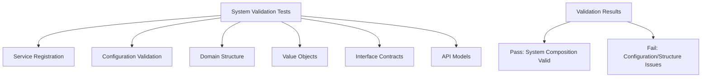
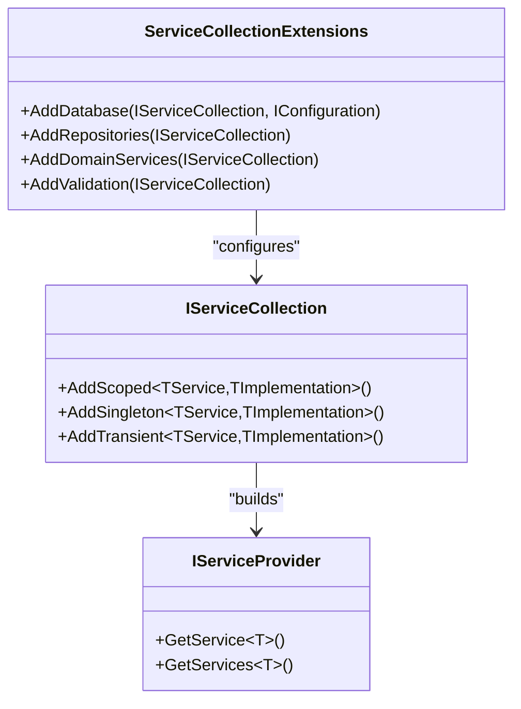
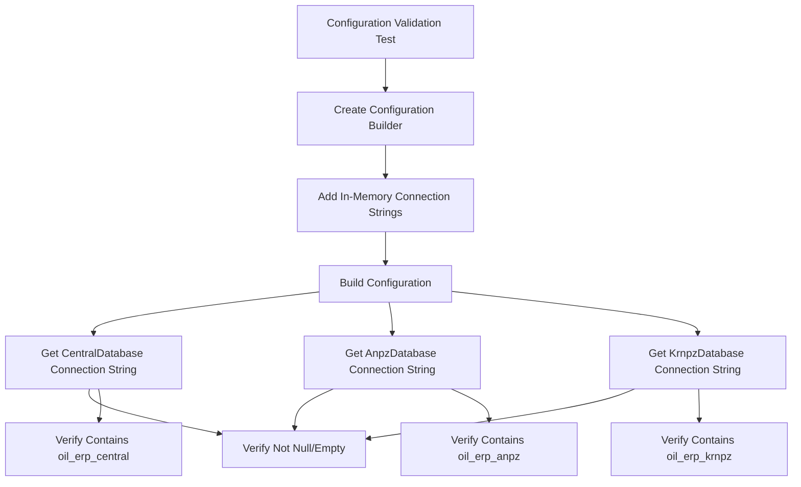
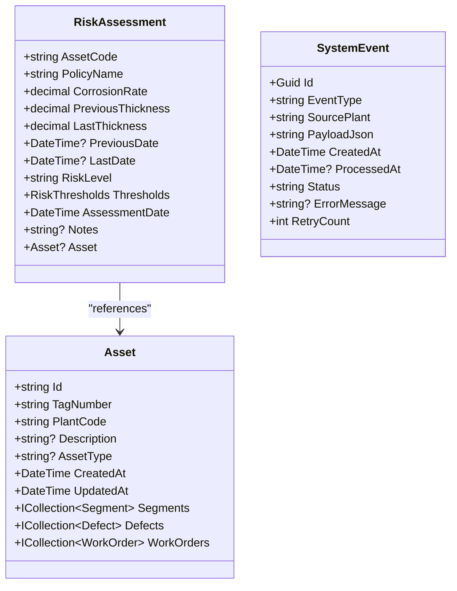
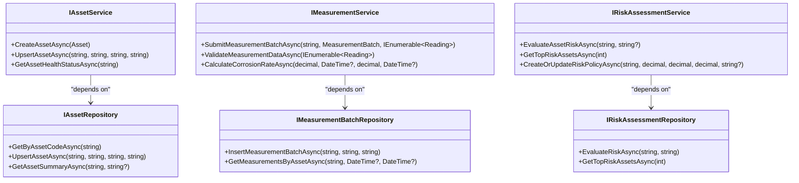
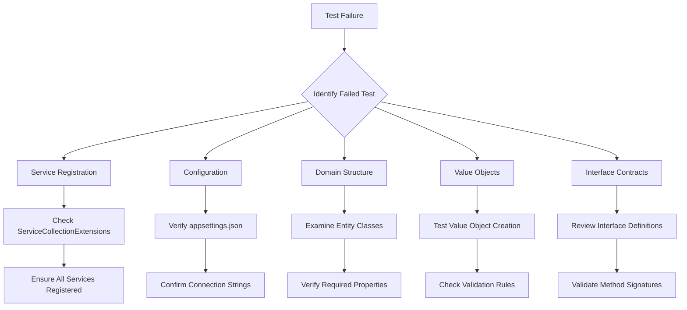

# End-to-End Testing

<cite>
**Referenced Files in This Document**   
- [SystemValidationTests.cs](file://src/OilErp.Tests/EndToEnd/SystemValidationTests.cs)
- [Program.cs](file://src/OilErp.App/Program.cs)
- [ServiceCollectionExtensions.cs](file://src/OilErp.App/Extensions/ServiceCollectionExtensions.cs)
- [IRepositories.cs](file://src/OilErp.Domain/Interfaces/IRepositories.cs)
- [Asset.cs](file://src/OilErp.Domain/Entities/Asset.cs)
- [Analytics.cs](file://src/OilErp.Domain/Entities/Analytics.cs)
- [ValueObjects.cs](file://src/OilErp.Domain/ValueObjects/ValueObjects.cs)
</cite>

## Table of Contents
1. [Introduction](#introduction)
2. [System Validation Tests Overview](#system-validation-tests-overview)
3. [Service Registration Validation](#service-registration-validation)
4. [Configuration Validation](#configuration-validation)
5. [Domain Entity Structure Validation](#domain-entity-structure-validation)
6. [Value Object Validation](#value-object-validation)
7. [Interface Contract Validation](#interface-contract-validation)
8. [Common Issues and Troubleshooting](#common-issues-and-troubleshooting)
9. [Extending the Validation Framework](#extending-the-validation-framework)
10. [Conclusion](#conclusion)

## Introduction

The Oil ERP system employs a comprehensive end-to-end testing strategy focused on system validation. Unlike traditional integration or unit tests that verify business logic execution, SystemValidationTests serve as architectural guardians that ensure the proper composition and configuration of the entire system. These tests validate structural integrity without executing actual business workflows, providing early detection of configuration errors, missing dependencies, and architectural inconsistencies. This documentation explains the purpose, implementation, and extension of these critical validation tests that form the foundation of the system's reliability.

## System Validation Tests Overview

SystemValidationTests are implemented as a suite of unit tests within the OilErp.Tests.EndToEnd namespace, specifically designed to validate the complete system composition and configuration. These tests operate at the structural level, verifying that all components are properly registered, configured, and interconnected according to architectural specifications. The primary purpose of these tests is to catch configuration errors and architectural inconsistencies early in the development cycle, before they manifest as runtime failures.

The test suite follows a comprehensive validation approach that covers multiple aspects of system integrity:
- Service registration in the dependency injection container
- Configuration settings and connection strings
- Domain entity structure and required properties
- Value object validation and business rules
- Repository and service interface contracts
- API model validation attributes

These tests are designed to be fast and reliable, providing immediate feedback on system composition issues without the overhead of full integration testing. By validating the system structure independently of business logic execution, they enable developers to identify and fix configuration problems before attempting to run or test actual functionality.



**Diagram sources**
- [SystemValidationTests.cs](file://src/OilErp.Tests/EndToEnd/SystemValidationTests.cs#L12-L148)

**Section sources**
- [SystemValidationTests.cs](file://src/OilErp.Tests/EndToEnd/SystemValidationTests.cs#L12-L148)

## Service Registration Validation

The service registration validation tests ensure that all required services are properly registered in the dependency injection (DI) container. Although the specific test method `ServiceCollection_Should_Register_All_Required_Services` is currently disabled due to compilation dependencies, the architectural intent is clear: to verify that the application's service composition follows the defined patterns and requirements.

The service registration is configured through extension methods in the ServiceCollectionExtensions class, which organizes services into logical groups:
- Database services (AddDatabase)
- Repository services (AddRepositories)
- Domain services (AddDomainServices)
- Validation services (AddValidation)

Each extension method follows the same pattern of registering services with appropriate lifetimes (typically scoped) and mapping interfaces to concrete implementations. For example, the AddRepositories method registers all repository interfaces with their corresponding implementations, ensuring that the DI container can resolve these dependencies when requested.

The validation of service registration would typically involve:
1. Creating a service collection instance
2. Applying all registration extension methods
3. Building the service provider
4. Attempting to resolve each expected service
5. Verifying that resolution succeeds without exceptions

This approach ensures that all services required by the application are available in the DI container, preventing runtime errors caused by missing service registrations. The test would also verify that services are registered with the correct lifetime (transient, scoped, or singleton) to ensure proper resource management and state isolation.



**Diagram sources**
- [ServiceCollectionExtensions.cs](file://src/OilErp.App/Extensions/ServiceCollectionExtensions.cs#L17-L69)
- [Program.cs](file://src/OilErp.App/Program.cs#L25-L30)

**Section sources**
- [ServiceCollectionExtensions.cs](file://src/OilErp.App/Extensions/ServiceCollectionExtensions.cs#L17-L69)
- [Program.cs](file://src/OilErp.App/Program.cs#L25-L30)

## Configuration Validation

The configuration validation tests verify that essential configuration settings, particularly connection strings, are properly defined and configured. The `ConnectionStrings_Should_Be_Configured_Correctly` test demonstrates this validation by checking that the three primary database connection strings (CentralDatabase, AnpzDatabase, and KrnpzDatabase) are present and contain the expected database names.

The test uses an in-memory configuration builder to simulate the application's configuration environment without requiring actual configuration files. It creates a configuration collection with sample connection strings and then verifies that:
1. Each connection string is not null or empty
2. Each connection string contains the expected database name

This approach allows the test to validate configuration requirements independently of the actual deployment environment. The test focuses on the structure and content of the connection strings rather than their ability to establish actual database connections, making it fast and reliable.

The configuration validation is critical for the Oil ERP system, which relies on multiple distributed databases for different plants (Central, ANPZ, KRNPZ). Ensuring that these connection strings are correctly configured prevents runtime failures when the application attempts to access database resources. The test also serves as documentation for the required configuration settings, making it easier for developers and operations teams to understand the system's configuration requirements.



**Diagram sources**
- [SystemValidationTests.cs](file://src/OilErp.Tests/EndToEnd/SystemValidationTests.cs#L22-L43)

**Section sources**
- [SystemValidationTests.cs](file://src/OilErp.Tests/EndToEnd/SystemValidationTests.cs#L22-L43)

## Domain Entity Structure Validation

The domain entity structure validation tests ensure that key domain entities have the required properties and follow the expected structure. The `Domain_Entities_Should_Have_Required_Properties` test uses reflection to examine the structure of three critical domain entities: Asset, RiskAssessment, and SystemEvent.

For the Asset entity, the test verifies the presence of essential properties:
- Id: Unique identifier for the asset
- TagNumber: Asset tag number for identification
- PlantCode: Code identifying the plant where the asset is located

For the RiskAssessment entity, the test checks for:
- AssetCode: Reference to the assessed asset
- RiskLevel: Current risk level classification
- CorrosionRate: Calculated corrosion rate value

For the SystemEvent entity, the validation includes:
- EventType: Type of system event
- SourcePlant: Plant that generated the event
- PayloadJson: JSON payload containing event data

This structural validation ensures that domain entities maintain their essential properties, which are critical for business operations and data integrity. By validating these properties at the test level, the system prevents breaking changes that could affect data persistence, API contracts, and business logic. The use of reflection allows the test to verify structure without instantiating objects or accessing database resources, making it fast and reliable.



**Diagram sources**
- [Asset.cs](file://src/OilErp.Domain/Entities/Asset.cs#L5-L71)
- [Analytics.cs](file://src/OilErp.Domain/Entities/Analytics.cs#L7-L68)
- [Analytics.cs](file://src/OilErp.Domain/Entities/Analytics.cs#L118-L157)

**Section sources**
- [SystemValidationTests.cs](file://src/OilErp.Tests/EndToEnd/SystemValidationTests.cs#L53-L76)
- [Asset.cs](file://src/OilErp.Domain/Entities/Asset.cs#L5-L71)
- [Analytics.cs](file://src/OilErp.Domain/Entities/Analytics.cs#L7-L68)
- [Analytics.cs](file://src/OilErp.Domain/Entities/Analytics.cs#L118-L157)

## Value Object Validation

The value object validation tests ensure that critical value objects enforce their business rules and validation constraints. The `Value_Objects_Should_Have_Proper_Validation` test demonstrates this by creating instances of two key value objects: RiskThresholds and MeasurementBatch.

For RiskThresholds, the test verifies:
1. Successful creation with valid threshold values (0.1, 0.3, 0.6, 1.0)
2. Correct risk level determination (0.5m corrosion rate returns "Medium")
3. Proper validation of invalid inputs (throws ArgumentException when thresholds are not in ascending order)

For MeasurementBatch, the validation includes:
1. Successful creation with valid parameters
2. Proper validation of batch completeness (IsValidForProcessing returns true)
3. Validation of required fields (asset code, source plant, operator ID)
4. Validation of point count (must be positive)

These tests ensure that value objects maintain their invariants and enforce business rules at the domain level. The RiskThresholds object, for example, ensures that threshold values are non-negative and in ascending order (Low < Medium < High < Critical), preventing invalid risk assessment configurations. The MeasurementBatch object validates that essential metadata is present before processing, ensuring data quality and integrity.

The validation approach combines positive and negative testing to verify both successful creation with valid data and proper rejection of invalid data. This comprehensive validation ensures that value objects serve as reliable guardians of business rules and data integrity throughout the system.

```mermaid
classDiagram
class RiskThresholds {
+decimal Low
+decimal Medium
+decimal High
+decimal Critical
+RiskThresholds(decimal, decimal, decimal, decimal)
+string GetRiskLevel(decimal)
+decimal GetThresholdValue(string)
+decimal GetProximityToNextThreshold(decimal)
}
class MeasurementBatch {
+string AssetCode
+string SourcePlant
+DateTime Timestamp
+string OperatorId
+string? Notes
+int PointCount
+MeasurementBatch(string, string, DateTime, string, string?, int)
+bool IsValidForProcessing()
}
note right of RiskThresholds
Validation Rules :
- All values non-negative
- Low < Medium < High < Critical
- Throws ArgumentException on invalid input
end note
note right of MeasurementBatch
Validation Rules :
- Required fields not null/empty
- Point count >= 0
- Throws ArgumentException on invalid input
end note
```

**Diagram sources**
- [ValueObjects.cs](file://src/OilErp.Domain/ValueObjects/ValueObjects.cs#L173-L282)
- [Analytics.cs](file://src/OilErp.Domain/Entities/Analytics.cs#L7-L17)

**Section sources**
- [SystemValidationTests.cs](file://src/OilErp.Tests/EndToEnd/SystemValidationTests.cs#L78-L96)
- [ValueObjects.cs](file://src/OilErp.Domain/ValueObjects/ValueObjects.cs#L173-L282)

## Interface Contract Validation

The interface contract validation tests ensure that repository and service interfaces are properly defined with the required methods. These tests use reflection to verify that interfaces expose the expected methods, maintaining consistency across the application's service layer.

For repository interfaces, the test validates three key interfaces:
- IAssetRepository: Verifies methods like GetByAssetCodeAsync, UpsertAssetAsync, and GetAssetSummaryAsync
- IRiskAssessmentRepository: Checks for EvaluateRiskAsync and GetTopRiskAssetsAsync
- IMeasurementBatchRepository: Confirms InsertMeasurementBatchAsync and GetMeasurementsByAssetAsync

For service interfaces, the validation includes:
- IAssetService: Validates CreateAssetAsync, UpsertAssetAsync, and GetAssetHealthStatusAsync
- IMeasurementService: Checks SubmitMeasurementBatchAsync, ValidateMeasurementDataAsync, and CalculateCorrosionRateAsync
- IRiskAssessmentService: Verifies EvaluateAssetRiskAsync, GetTopRiskAssetsAsync, and CreateOrUpdateRiskPolicyAsync

This contract validation ensures that all components adhere to the defined service interfaces, promoting consistency and maintainability. By verifying method signatures at the test level, the system prevents breaking changes that could affect service consumers. The tests also serve as living documentation of the expected service contracts, making it easier for developers to understand and implement new services or modify existing ones.



**Diagram sources**
- [IRepositories.cs](file://src/OilErp.Domain/Interfaces/IRepositories.cs#L7-L218)
- [IServices.cs](file://src/OilErp.Domain/Interfaces/IServices.cs#L8-L47)

**Section sources**
- [SystemValidationTests.cs](file://src/OilErp.Tests/EndToEnd/SystemValidationTests.cs#L98-L139)
- [IRepositories.cs](file://src/OilErp.Domain/Interfaces/IRepositories.cs#L7-L218)

## Common Issues and Troubleshooting

System validation tests help identify several common issues in the Oil ERP system:

**Missing Service Registrations**: When services are not properly registered in the DI container, the application fails to start or throws resolution exceptions at runtime. The service registration validation test would catch these issues early by verifying that all expected services can be resolved.

**Configuration Mismatches**: Incorrect connection strings or missing configuration values prevent the application from accessing required resources. The configuration validation test ensures that essential settings like database connection strings are present and correctly formatted.

**Assembly Loading Problems**: When assemblies fail to load or reference incorrect versions, the application may experience TypeLoadException or FileNotFoundException errors. The structural validation tests help identify these issues by attempting to load and inspect types at test time.

**Interface Contract Breaks**: Changes to service or repository interfaces that are not properly coordinated across components can cause runtime errors. The interface contract validation tests detect these breaks by verifying that expected methods exist and have the correct signatures.

**Domain Model Inconsistencies**: Changes to domain entities that remove or rename essential properties can break data persistence and API contracts. The domain entity structure validation ensures that critical properties remain present and correctly named.

To troubleshoot validation failures:
1. Examine the specific test that failed and understand what it was validating
2. Check the implementation code for the component being validated
3. Verify that configuration files contain the expected values
4. Ensure that all required assemblies are properly referenced
5. Confirm that interface implementations match their contracts
6. Validate that domain entities maintain their essential properties



**Section sources**
- [SystemValidationTests.cs](file://src/OilErp.Tests/EndToEnd/SystemValidationTests.cs#L12-L148)
- [ServiceCollectionExtensions.cs](file://src/OilErp.App/Extensions/ServiceCollectionExtensions.cs#L17-L69)

## Extending the Validation Framework

The SystemValidationTests framework can be extended to cover additional architectural constraints and validation requirements. Here are several approaches for enhancing the validation suite:

**Add New Validation Categories**: Create additional test methods to validate other aspects of system composition, such as:
- API controller structure and routing
- Middleware pipeline configuration
- Health check endpoints
- Swagger/OpenAPI configuration
- CORS policy settings

**Enhance Existing Tests**: Improve the depth and coverage of existing validation tests by:
- Adding more comprehensive property validation for domain entities
- Testing edge cases for value objects
- Validating method parameters and return types in interfaces
- Checking service lifetimes and scoping

**Implement Assembly Validation**: Add tests that verify assembly-level concerns:
- Ensure all assemblies have the correct version information
- Validate that assemblies reference the expected dependencies
- Check for prohibited assembly references
- Verify strong naming and signing

**Add Performance Constraints**: Incorporate validation of performance-related architectural constraints:
- Verify that services implement appropriate caching strategies
- Check that database queries use efficient patterns
- Validate that long-running operations are properly async
- Ensure that memory-intensive operations have appropriate limits

**Implement Security Validation**: Add tests that verify security-related architectural requirements:
- Ensure all API endpoints have appropriate authorization attributes
- Validate that sensitive data is properly encrypted
- Check that input validation is consistently applied
- Verify that error handling doesn't leak sensitive information

When extending the validation framework, follow these best practices:
1. Keep tests focused on structural validation rather than business logic
2. Use reflection and configuration APIs to avoid tight coupling
3. Make tests fast and reliable by minimizing external dependencies
4. Provide clear error messages that help developers understand and fix issues
5. Document the purpose and scope of each validation test

```mermaid
flowchart TD
A[Extend Validation Framework] --> B[New Validation Categories]
A --> C[Enhanced Existing Tests]
A --> D[Assembly Validation]
A --> E[Performance Constraints]
A --> F[Security Validation]
B --> B1[API Controller Structure]
B --> B2[Middleware Pipeline]
B --> B3[Health Checks]
B --> B4[Swagger Configuration]
C --> C1[Comprehensive Property Validation]
C --> C2[Edge Case Testing]
C --> C3[Parameter Validation]
C --> C4[Lifetime Validation]
D --> D1[Assembly Versioning]
D --> D2[Dependency Validation]
D --> D3[Reference Checking]
D --> D4[Strong Naming]
E --> E1[Caching Strategies]
E --> E2[Query Efficiency]
E --> E3[Async Patterns]
E --> E4[Resource Limits]
F --> F1[Authorization Attributes]
F --> F2[Data Encryption]
F --> F3[Input Validation]
F --> F4[Error Handling]
```



**Section sources**
- [SystemValidationTests.cs](file://src/OilErp.Tests/EndToEnd/SystemValidationTests.cs#L12-L148)

## Conclusion

The SystemValidationTests in the Oil ERP system provide a critical layer of architectural validation that ensures system-wide consistency and reliability. By validating service registration, configuration, domain structure, value objects, and interface contracts, these tests serve as early warning systems for configuration errors and architectural inconsistencies. The tests verify the proper composition of the system without executing business workflows, providing fast and reliable feedback on system integrity.

The validation framework demonstrates several best practices in software architecture:
- Separation of structural validation from business logic testing
- Use of reflection for non-invasive structural verification
- Comprehensive coverage of critical system components
- Clear, focused tests with specific validation objectives
- Fast execution without external dependencies

While some tests are currently disabled due to compilation issues, the overall approach provides a solid foundation for ensuring system reliability. By extending and enhancing this validation framework, the Oil ERP system can maintain high architectural standards and prevent common configuration and structural issues that could otherwise lead to runtime failures. The tests also serve as valuable documentation of the system's architectural requirements and constraints, making it easier for developers to understand and maintain the codebase.