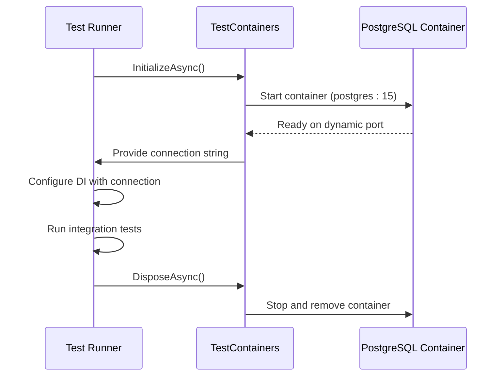
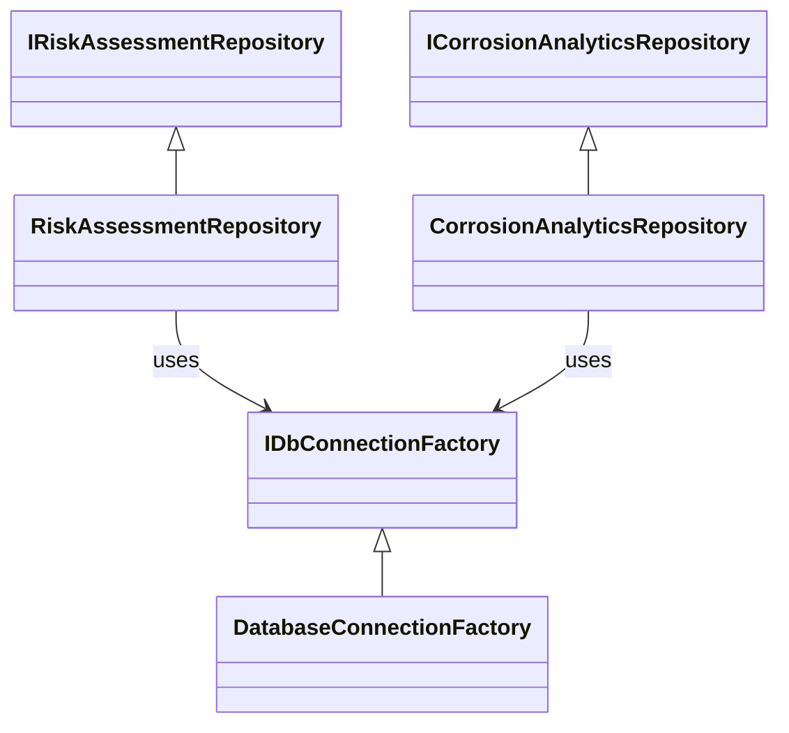
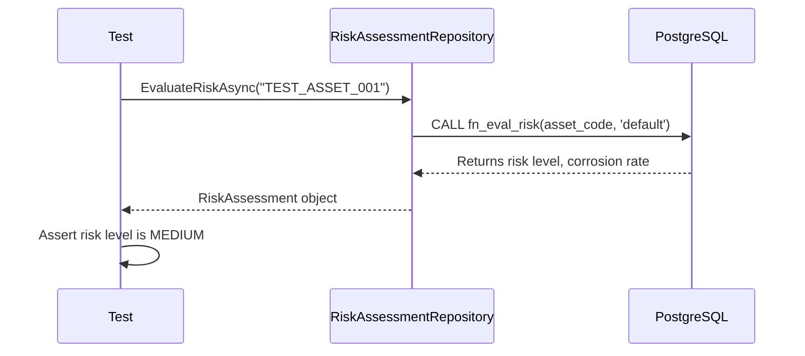

# Integration Testing

<cite>
**Referenced Files in This Document**   
- [DatabaseIntegrationTests.cs](file://src/OilErp.Tests/Integration/DatabaseIntegrationTests.cs)
- [AnalyticsRepositories.cs](file://src/OilErp.Data/Repositories/AnalyticsRepositories.cs)
- [RiskAssessmentRepository.cs](file://src/OilErp.Data/Repositories/RiskAssessmentRepository.cs)
- [ServiceCollectionExtensions.cs](file://src/OilErp.App/Extensions/ServiceCollectionExtensions.cs)
- [Program.cs](file://src/OilErp.App/Program.cs)
- [01_tables.sql](file://sql/central/01_tables.sql)
- [02_functions_core.sql](file://sql/central/02_functions_core.sql)
</cite>

## Table of Contents
1. [Introduction](#introduction)
2. [TestContainers Setup and Isolation](#testcontainers-setup-and-isolation)
3. [Database Schema Initialization](#database-schema-initialization)
4. [Dependency Injection and Service Registration](#dependency-injection-and-service-registration)
5. [Integration Testing of Key Repositories](#integration-testing-of-key-repositories)
6. [Test Data Seeding and Verification](#test-data-seeding-and-verification)
7. [Common Issues and Troubleshooting](#common-issues-and-troubleshooting)
8. [Performance Optimization and Parallel Execution](#performance-optimization-and-parallel-execution)
9. [Conclusion](#conclusion)

## Introduction

The Oil ERP system employs a robust integration testing strategy to ensure data access layers function correctly against a real PostgreSQL database. This document details the implementation of `DatabaseIntegrationTests` using TestContainers to create isolated, ephemeral database instances for each test run. This approach enables realistic testing of repository logic, stored functions, and schema interactions without relying on mocks or shared databases, thereby improving test reliability and reducing flakiness.

The integration test suite validates core components such as `RiskAssessmentRepository` and `CorrosionAnalyticsRepository`, which depend on complex SQL functions and cross-table relationships. By spinning up a fresh PostgreSQL container per test session, the system guarantees test isolation, reproducibility, and consistency across environments.

**Section sources**
- [DatabaseIntegrationTests.cs](file://src/OilErp.Tests/Integration/DatabaseIntegrationTests.cs#L1-L334)

## TestContainers Setup and Isolation

TestContainers is used to launch a PostgreSQL 15 container during test initialization. Each test class inherits from `IAsyncLifetime`, ensuring the container starts before any tests and disposes afterward. The container is configured with a dedicated test database (`oil_erp_test`), credentials, and a dynamically bound port to prevent conflicts.



**Diagram sources**
- [DatabaseIntegrationTests.cs](file://src/OilErp.Tests/Integration/DatabaseIntegrationTests.cs#L15-L35)

The container setup ensures complete isolation between test runs, eliminating side effects from previous executions. This isolation is critical for testing stateful operations such as risk assessment calculations and event processing.

**Section sources**
- [DatabaseIntegrationTests.cs](file://src/OilErp.Tests/Integration/DatabaseIntegrationTests.cs#L15-L35)

## Database Schema Initialization

Upon container startup, the test suite initializes the database schema by executing DDL and DML statements that mirror the production SQL scripts located in the `/sql/central` directory. This includes creating tables such as `assets_global`, `risk_policies`, and `analytics_cr`, along with essential indexes and constraints.

Additionally, core database functions like `fn_calc_cr` (corrosion rate calculation) and `fn_eval_risk` (risk level evaluation) are defined during initialization. These functions are critical for business logic and are tested directly through repository calls.

```sql
-- Example: Corrosion Rate Calculation Function
CREATE OR REPLACE FUNCTION public.fn_calc_cr(
    prev_thk numeric, 
    prev_date timestamptz, 
    last_thk numeric, 
    last_date timestamptz
) RETURNS numeric AS $$
  SELECT CASE
    WHEN prev_thk IS NOT NULL AND last_thk IS NOT NULL AND prev_date IS NOT NULL AND last_date IS NOT NULL
      THEN (prev_thk - last_thk) / GREATEST(1, DATE_PART('day', last_date - prev_date))
    ELSE NULL
  END
$$ LANGUAGE sql IMMUTABLE;
```

A default risk policy is also inserted to support testing of risk evaluation logic.

**Section sources**
- [DatabaseIntegrationTests.cs](file://src/OilErp.Tests/Integration/DatabaseIntegrationTests.cs#L85-L180)
- [01_tables.sql](file://sql/central/01_tables.sql#L1-L52)
- [02_functions_core.sql](file://sql/central/02_functions_core.sql)

## Dependency Injection and Service Registration

The integration test environment replicates the application's dependency injection (DI) container using `ServiceCollection`. Configuration values, particularly connection strings, are injected via an in-memory collection that points to the TestContainer's connection string.

Key services registered include:
- `IDbConnectionFactory`: Provides database connections using the container's connection string
- Repository implementations: Such as `IRiskAssessmentRepository` and `ICorrosionAnalyticsRepository`
- Logging: Console logging is enabled for debugging test failures



**Diagram sources**
- [ServiceCollectionExtensions.cs](file://src/OilErp.App/Extensions/ServiceCollectionExtensions.cs#L25-L65)
- [DatabaseIntegrationTests.cs](file://src/OilErp.Tests/Integration/DatabaseIntegrationTests.cs#L55-L75)

This setup ensures that the same service resolution logic used in production is exercised during tests, validating both the DI configuration and repository behavior.

**Section sources**
- [ServiceCollectionExtensions.cs](file://src/OilErp.App/Extensions/ServiceCollectionExtensions.cs#L25-L65)
- [DatabaseIntegrationTests.cs](file://src/OilErp.Tests/Integration/DatabaseIntegrationTests.cs#L55-L75)

## Integration Testing of Key Repositories

### RiskAssessmentRepository Testing

The `RiskAssessmentRepository` is tested for its ability to evaluate asset risk levels using the `fn_eval_risk` database function. The test seeds an asset and its corrosion analytics data, then invokes `EvaluateRiskAsync` to verify correct risk categorization based on threshold values.



**Diagram sources**
- [RiskAssessmentRepository.cs](file://src/OilErp.Data/Repositories/RiskAssessmentRepository.cs#L45-L75)
- [DatabaseIntegrationTests.cs](file://src/OilErp.Tests/Integration/DatabaseIntegrationTests.cs#L250-L280)

### CorrosionAnalyticsRepository Testing

The `CorrosionAnalyticsRepository` test validates the `CalculateCorrosionRateAsync` method, which delegates to the `fn_calc_cr` SQL function. The test confirms that the calculated corrosion rate matches expected values based on thickness and date inputs.

**Section sources**
- [AnalyticsRepositories.cs](file://src/OilErp.Data/Repositories/AnalyticsRepositories.cs#L50-L65)
- [DatabaseIntegrationTests.cs](file://src/OilErp.Tests/Integration/DatabaseIntegrationTests.cs#L200-L220)

## Test Data Seeding and Verification

Test data is seeded directly via Dapper SQL execution within test methods. This approach allows precise control over initial state and supports testing edge cases such as null values or boundary conditions.

For example, the `RiskAssessmentRepository_Should_Evaluate_Asset_Risk` test inserts test data into `assets_global` and `analytics_cr` tables before invoking the repository method. After execution, assertions verify both the output object and underlying data consistency.

Data verification is performed using FluentAssertions, ensuring type-safe and readable assertions. The use of real SQL queries during tests validates both the repository logic and the correctness of the underlying schema and functions.

**Section sources**
- [DatabaseIntegrationTests.cs](file://src/OilErp.Tests/Integration/DatabaseIntegrationTests.cs#L255-L265)
- [AnalyticsRepositories.cs](file://src/OilErp.Data/Repositories/AnalyticsRepositories.cs)

## Common Issues and Troubleshooting

### Container Startup Failures

Container startup may fail due to Docker daemon unavailability or resource constraints. Ensure Docker is running and allocate sufficient memory (at least 2GB) for PostgreSQL.

### Connection Timeouts

Connection timeouts can occur if the database takes longer to initialize. The current implementation assumes immediate readiness, but adding retry logic or health checks can improve resilience.

```csharp
// Suggested improvement: Wait for database readiness
await _dbContainer.WaitUntilContainerStartedAsync(cancellationToken);
```

### Transaction Isolation

Since each test runs in isolation, no explicit transaction rollback is needed. However, ensure that test data uses unique identifiers to prevent conflicts during parallel execution.

**Section sources**
- [DatabaseIntegrationTests.cs](file://src/OilErp.Tests/Integration/DatabaseIntegrationTests.cs#L40-L50)

## Performance Optimization and Parallel Execution

To optimize performance:
- Reuse the same container across multiple test classes by managing lifecycle at assembly level
- Minimize schema initialization overhead by using database snapshots (if supported)
- Run tests in parallel using `[Collection]` attributes to group tests that share containers

However, caution is advised with parallel execution, as concurrent access to the same container may cause connection pool exhaustion. Limiting parallelism or using container-per-test-class strategies can mitigate this.

**Section sources**
- [DatabaseIntegrationTests.cs](file://src/OilErp.Tests/Integration/DatabaseIntegrationTests.cs)

## Conclusion

The integration testing approach in the Oil ERP system effectively leverages TestContainers to provide realistic, isolated database testing. By replicating production schema and logic, the tests validate critical components such as risk assessment and corrosion analytics with high fidelity. The combination of dependency injection, schema initialization, and direct SQL interaction ensures comprehensive coverage of data access layers, making the system more reliable and maintainable.

Future improvements could include container reuse strategies, enhanced error recovery, and expanded test coverage for edge cases and failure modes.