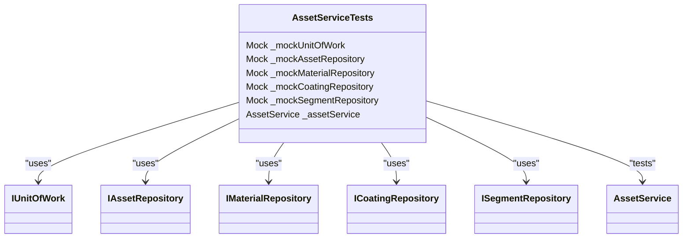
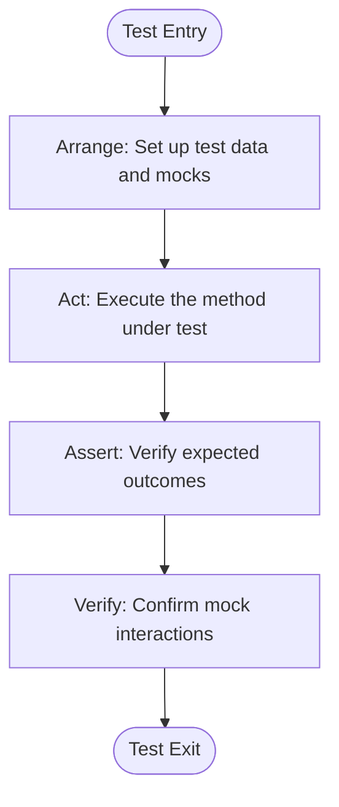
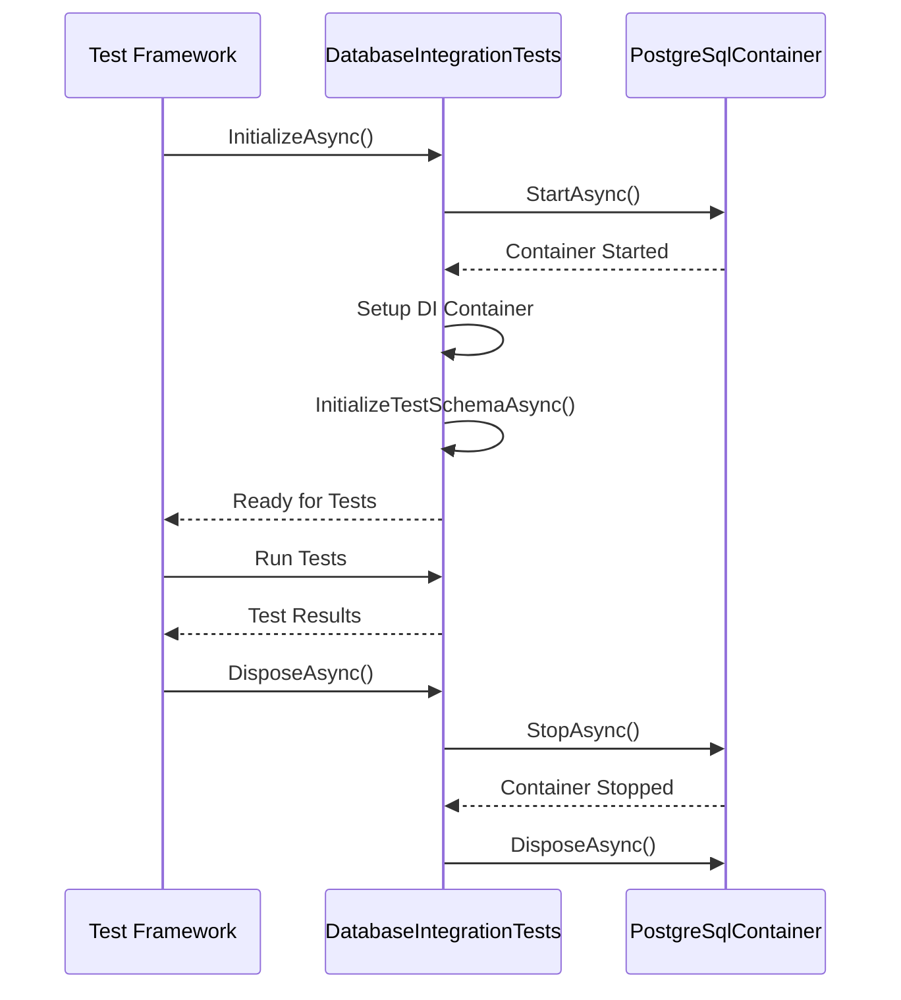
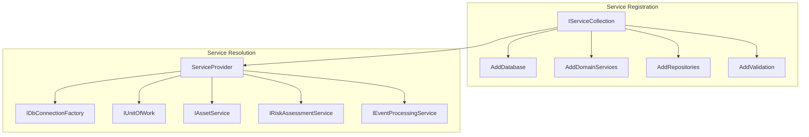

# Testing Strategy

<cite>
**Referenced Files in This Document**   
- [AssetServiceTests.cs](file://src/OilErp.Tests/Unit/AssetServiceTests.cs)
- [DatabaseIntegrationTests.cs](file://src/OilErp.Tests/Integration/DatabaseIntegrationTests.cs)
- [SystemValidationTests.cs](file://src/OilErp.Tests/EndToEnd/SystemValidationTests.cs)
- [AssetService.cs](file://src/OilErp.Domain/Services/AssetService.cs)
- [DatabaseInfrastructure.cs](file://src/OilErp.Data/Infrastructure/DatabaseInfrastructure.cs)
- [UnitOfWork.cs](file://src/OilErp.Data/UnitOfWork.cs)
</cite>

## Table of Contents
1. [Introduction](#introduction)
2. [Test Categories and Purposes](#test-categories-and-purposes)
3. [Unit Testing Strategy](#unit-testing-strategy)
4. [Integration Testing with TestContainers](#integration-testing-with-testcontainers)
5. [End-to-End System Validation](#end-to-end-system-validation)
6. [Test Data Management](#test-data-management)
7. [Testing Patterns and Examples](#testing-patterns-and-examples)
8. [Running Tests and Coverage](#running-tests-and-coverage)

## Introduction

The Oil ERP system implements a comprehensive testing strategy that ensures reliability, correctness, and maintainability across all layers of the application. The testing approach follows a pyramid model with a strong emphasis on unit tests at the base, integration tests in the middle layer, and end-to-end tests at the top. This document details the testing architecture, patterns, and practices used throughout the codebase to validate business logic, database operations, and system-wide functionality.

The test suite is organized into three distinct categories based on scope and purpose, each serving a specific role in the quality assurance process. The testing infrastructure leverages modern tools and techniques including TestContainers for database isolation, Moq for service mocking, and FluentAssertions for expressive test assertions.

**Section sources**
- [AssetServiceTests.cs](file://src/OilErp.Tests/Unit/AssetServiceTests.cs)
- [DatabaseIntegrationTests.cs](file://src/OilErp.Tests/Integration/DatabaseIntegrationTests.cs)
- [SystemValidationTests.cs](file://src/OilErp.Tests/EndToEnd/SystemValidationTests.cs)

## Test Categories and Purposes

The Oil ERP system employs a three-tiered testing strategy designed to validate different aspects of the application at appropriate levels of abstraction. Each test category serves a distinct purpose and operates at a different scope within the system.

### Unit Tests for Business Logic Validation

Unit tests focus on isolated validation of business logic within domain services. These tests are designed to be fast, deterministic, and independent of external dependencies. They verify the correctness of individual methods and ensure that business rules are properly enforced.

The primary objectives of unit tests include:
- Validating input validation and error handling
- Ensuring business rule enforcement
- Testing edge cases and boundary conditions
- Verifying proper exception throwing for invalid scenarios
- Confirming correct state transitions

Unit tests achieve isolation through the use of mocking frameworks, particularly Moq, which allows for the creation of mock implementations of dependencies such as repositories and unit of work.

### Integration Tests for Database Operations

Integration tests validate the interaction between the application and the database using real PostgreSQL instances managed by TestContainers. These tests ensure that data access logic, stored procedures, and database schema work correctly in a production-like environment.

Key aspects validated by integration tests:
- Database connection and transaction management
- Repository method correctness with real SQL execution
- Stored procedure and function behavior
- Data consistency and referential integrity
- Complex queries and joins across multiple tables

The use of TestContainers provides isolated, ephemeral database instances for each test run, ensuring test independence and eliminating the need for test data cleanup.

### End-to-End System Validation Tests

End-to-end tests perform comprehensive validation of the entire system architecture and configuration. These tests verify that all components are properly wired together and that the system can be successfully bootstrapped with the correct configuration.

Primary validation points include:
- Dependency injection container configuration
- Service registration and resolution
- Connection string configuration
- API controller structure and attributes
- Domain entity definitions
- Repository and service interface contracts

Unlike unit and integration tests, end-to-end tests are typically non-executable in the traditional sense and focus on structural validation rather than behavioral testing.

**Section sources**
- [AssetServiceTests.cs](file://src/OilErp.Tests/Unit/AssetServiceTests.cs#L12-L337)
- [DatabaseIntegrationTests.cs](file://src/OilErp.Tests/Integration/DatabaseIntegrationTests.cs#L17-L334)
- [SystemValidationTests.cs](file://src/OilErp.Tests/EndToEnd/SystemValidationTests.cs#L12-L221)

## Unit Testing Strategy

The unit testing strategy for the Oil ERP system focuses on validating business logic in isolation, ensuring that domain services correctly implement business rules without dependencies on external systems.

### Isolation Through Mocking

Unit tests achieve complete isolation by mocking all external dependencies using the Moq framework. The `AssetServiceTests` class demonstrates this approach by creating mock instances of `IUnitOfWork` and its constituent repositories:



**Diagram sources**
- [AssetServiceTests.cs](file://src/OilErp.Tests/Unit/AssetServiceTests.cs#L14-L20)

**Section sources**
- [AssetServiceTests.cs](file://src/OilErp.Tests/Unit/AssetServiceTests.cs#L12-L337)

### Business Logic Validation

Unit tests validate complex business logic implemented in the `AssetService` class. For example, the `CreateAssetAsync` method enforces several business rules:

1. **Asset uniqueness validation**: Ensures no duplicate asset codes exist
2. **Plant code requirement**: Validates that plant code is provided
3. **Timestamp management**: Automatically sets creation and update timestamps

The test suite includes comprehensive coverage for both success and failure scenarios, ensuring that all business rules are properly enforced.

### Test Structure and Patterns

The unit tests follow the Arrange-Act-Assert (AAA) pattern, which provides a clear and consistent structure for test cases:



**Diagram sources**
- [AssetServiceTests.cs](file://src/OilErp.Tests/Unit/AssetServiceTests.cs#L45-L65)

## Integration Testing with TestContainers

The integration testing strategy leverages TestContainers to create isolated, ephemeral PostgreSQL database instances for testing database operations in a production-like environment.

### TestContainers Configuration

The `DatabaseIntegrationTests` class implements the `IAsyncLifetime` interface to manage the lifecycle of the TestContainer. The container is configured with specific PostgreSQL settings and automatically started and stopped for each test run:



**Diagram sources**
- [DatabaseIntegrationTests.cs](file://src/OilErp.Tests/Integration/DatabaseIntegrationTests.cs#L23-L32)
- [DatabaseIntegrationTests.cs](file://src/OilErp.Tests/Integration/DatabaseIntegrationTests.cs#L42-L55)

**Section sources**
- [DatabaseIntegrationTests.cs](file://src/OilErp.Tests/Integration/DatabaseIntegrationTests.cs#L17-L334)

### Database Schema Initialization

Integration tests initialize the database schema by executing SQL scripts that mirror the production database structure. The `InitializeTestSchemaAsync` method creates tables, functions, and constraints that match the actual database schema:

```sql
-- Create tables matching central/01_tables.sql
CREATE TABLE IF NOT EXISTS public.assets_global (
    id BIGINT GENERATED BY DEFAULT AS IDENTITY PRIMARY KEY,
    asset_code TEXT NOT NULL UNIQUE,
    name TEXT,
    type TEXT,
    plant_code TEXT,
    created_at TIMESTAMPTZ DEFAULT now()
);

-- Create functions matching central/02_functions_core.sql
CREATE OR REPLACE FUNCTION public.fn_calc_cr(prev_thk numeric, prev_date timestamptz, last_thk numeric, last_date timestamptz)
RETURNS numeric
LANGUAGE sql
IMMUTABLE
AS $$
  SELECT CASE
    WHEN prev_thk IS NOT NULL AND last_thk IS NOT NULL AND prev_date IS NOT NULL AND last_date IS NOT NULL
      THEN (prev_thk - last_thk) / GREATEST(1, DATE_PART('day', last_date - prev_date))
    ELSE NULL
  END
$$;
```

This approach ensures that integration tests validate against the actual database schema rather than a simplified test version.

### Real Database Operations

Integration tests validate repository methods against a real PostgreSQL database, ensuring that data access logic works correctly with actual SQL execution. For example, the `RiskAssessmentRepository_Should_Evaluate_Asset_Risk` test verifies that the risk assessment logic correctly calculates corrosion rates and determines risk levels based on threshold values.

## End-to-End System Validation

End-to-end tests provide comprehensive validation of the system's architecture and configuration, ensuring that all components can be properly initialized and wired together.

### Dependency Injection Validation

The `ServiceCollection_Should_Register_All_Required_Services` test verifies that all necessary services are properly registered in the dependency injection container:



**Diagram sources**
- [SystemValidationTests.cs](file://src/OilErp.Tests/EndToEnd/SystemValidationTests.cs#L18-L48)

**Section sources**
- [SystemValidationTests.cs](file://src/OilErp.Tests/EndToEnd/SystemValidationTests.cs#L12-L221)

### Configuration Validation

End-to-end tests validate that connection strings are properly configured for all database instances:

```csharp
configuration.GetConnectionString("CentralDatabase").Should().NotBeNullOrEmpty();
configuration.GetConnectionString("AnpzDatabase").Should().NotBeNullOrEmpty();
configuration.GetConnectionString("KrnpzDatabase").Should().NotBeNullOrEmpty();
```

This ensures that the application can connect to the central database and plant-specific databases (ANPZ and KRNPZ).

### Structural Validation

The end-to-end tests perform structural validation of key components:
- **API models**: Verify that validation attributes are properly applied
- **Domain entities**: Confirm that required properties are defined
- **Value objects**: Ensure proper validation logic
- **Repository interfaces**: Validate method signatures
- **Service interfaces**: Check contract completeness
- **API controllers**: Verify proper routing and controller attributes

This comprehensive structural validation helps catch configuration and design issues early in the development process.

## Test Data Management

The Oil ERP system employs several strategies for effective test data management across different test categories.

### TestContainers for Isolated Database Instances

TestContainers provides isolated database instances for each test run, eliminating test data pollution and ensuring test independence. Each integration test runs against a fresh database instance with a clean schema, preventing tests from interfering with each other.

The container configuration ensures consistency across environments:
- PostgreSQL 15 image
- Dedicated database name (oil_erp_test)
- Specific username and password
- Port binding for local access

### Fixtures for Reusable Test Data

The test suite defines reusable test data fixtures that can be shared across multiple test cases. For example, common asset, segment, and measurement data structures are consistently used throughout the test suite to ensure uniformity.

### Mocking for Service Isolation

Unit tests use mocking to isolate the system under test from external dependencies. The mocking strategy includes:
- **Repository mocking**: Simulating database operations without actual data access
- **Service mocking**: Isolating domain services from their dependencies
- **Configuration mocking**: Providing controlled configuration values
- **Connection factory mocking**: Simulating database connections

This approach enables fast, deterministic tests that focus solely on business logic validation.

## Testing Patterns and Examples

The test suite demonstrates several common testing patterns that ensure comprehensive coverage and maintainable test code.

### Arrange-Act-Assert Pattern

The AAA pattern is consistently used throughout the test suite:

```csharp
// Arrange: Set up test data and mocks
var asset = new Asset { Id = "TEST_ASSET_001", TagNumber = "TEST-001", PlantCode = "ANPZ" };
_mockAssetRepository.Setup(r => r.GetByAssetCodeAsync(asset.Id, It.IsAny<CancellationToken>()))
    .ReturnsAsync((Asset?)null);

// Act: Execute the method under test
var result = await _assetService.CreateAssetAsync(asset);

// Assert: Verify expected outcomes
result.Should().Be(asset.Id);
_mockAssetRepository.Verify(r => r.CreateAsync(It.Is<Asset>(a => 
    a.Id == asset.Id && 
    a.CreatedAt != default && 
    a.UpdatedAt != default), It.IsAny<CancellationToken>()), Times.Once);
```

### Boundary Condition Testing

The test suite includes comprehensive coverage of boundary conditions and edge cases:
- Empty or null input validation
- Duplicate data handling
- Invalid reference data
- Error condition propagation
- Exception message verification

### Asynchronous Testing

All tests properly handle asynchronous operations using async/await patterns, ensuring that timing issues and race conditions are properly tested.

## Running Tests and Coverage

The test suite can be executed using standard .NET testing tools and supports various filtering options for targeted test execution.

### Test Execution

Tests can be run using the `dotnet test` command with various options:
- Run all tests: `dotnet test`
- Run specific test category: `dotnet test --filter "TestCategory=Unit"`
- Run specific test: `dotnet test --filter "FullyQualifiedName=OilErp.Tests.Unit.AssetServiceTests.CreateAssetAsync_Should_Create_Asset_When_Valid"`

### Test Coverage

The testing strategy ensures comprehensive coverage of critical system components:
- **Business logic**: Full coverage of domain service methods
- **Validation rules**: Complete coverage of input validation
- **Error handling**: Thorough testing of exception scenarios
- **Database operations**: Validation of complex queries and transactions
- **System configuration**: Comprehensive structural validation

The combination of unit, integration, and end-to-end tests provides a robust safety net for the Oil ERP system, enabling confident refactoring and ensuring system reliability.