# Unit Testing

<cite>
**Referenced Files in This Document**   
- [AssetService.cs](file://src/OilErp.Domain/Services/AssetService.cs)
- [MeasurementService.cs](file://src/OilErp.Domain/Services/MeasurementService.cs)
- [AssetServiceTests.cs](file://src/OilErp.Tests/Unit/AssetServiceTests.cs)
- [MeasurementServiceTests.cs](file://src/OilErp.Tests/Unit/MeasurementServiceTests.cs)
- [UnitOfWork.cs](file://src/OilErp.Data/UnitOfWork.cs)
- [IRepositories.cs](file://src/OilErp.Domain/Interfaces/IRepositories.cs)
- [Asset.cs](file://src/OilErp.Domain/Entities/Asset.cs)
- [Segment.cs](file://src/OilErp.Domain/Entities/Segment.cs)
- [Reading.cs](file://src/OilErp.Domain/Entities/Reading.cs)
- [MeasurementPoint.cs](file://src/OilErp.Domain/Entities/MeasurementPoint.cs)
</cite>

## Table of Contents
1. [Introduction](#introduction)
2. [Core Components](#core-components)
3. [Test Setup and Mocking Strategy](#test-setup-and-mocking-strategy)
4. [AssetService Unit Testing](#assetservice-unit-testing)
5. [MeasurementService Unit Testing](#measurementservice-unit-testing)
6. [Test Assertion Patterns](#test-assertion-patterns)
7. [Common Testing Issues and Solutions](#common-testing-issues-and-solutions)
8. [Conclusion](#conclusion)

## Introduction

This document provides a comprehensive guide to the unit testing strategy implemented in the Oil ERP system, focusing on the core business logic within the AssetService and MeasurementService classes. The unit testing approach emphasizes isolation of business logic through dependency mocking, comprehensive test coverage of success scenarios, validation rules, and error conditions, and the use of modern testing practices to ensure code quality and maintainability.

The testing framework leverages Moq for creating mock objects that simulate the behavior of real dependencies such as IUnitOfWork and repository interfaces. This allows tests to focus exclusively on the business logic within the service classes without requiring a real database connection or external dependencies. The tests are written using xUnit as the testing framework and FluentAssertions for more expressive and readable assertions.

The unit testing strategy follows the Arrange-Act-Assert (AAA) pattern, ensuring consistent test structure across the codebase. Each test clearly separates the setup phase (Arrange), the execution of the method under test (Act), and the verification of expected outcomes (Assert). This approach makes tests easier to understand, maintain, and debug.

**Section sources**
- [AssetServiceTests.cs](file://src/OilErp.Tests/Unit/AssetServiceTests.cs#L1-L50)
- [MeasurementServiceTests.cs](file://src/OilErp.Tests/Unit/MeasurementServiceTests.cs#L1-L50)

## Core Components

The unit testing strategy focuses on two primary service classes that encapsulate critical business logic in the Oil ERP system: AssetService and MeasurementService. These services coordinate operations between the application layer and data access layer, implementing business rules, validation, and complex domain logic.

The AssetService handles operations related to physical assets in the oil and gas infrastructure, including creation, updating, and management of assets and their components. It enforces business rules such as unique tag number constraints, plant code requirements, and validation of associated materials and coatings.

The MeasurementService manages the recording and analysis of measurement data from various sensors and inspection points. It implements validation rules for measurement values based on measurement type, detects potential anomalies by comparing readings to historical data, and provides trend analysis capabilities.

Both services follow the dependency injection pattern, receiving an IUnitOfWork instance through their constructors. This design enables easy mocking in unit tests, allowing the business logic to be tested in isolation from the data persistence layer.

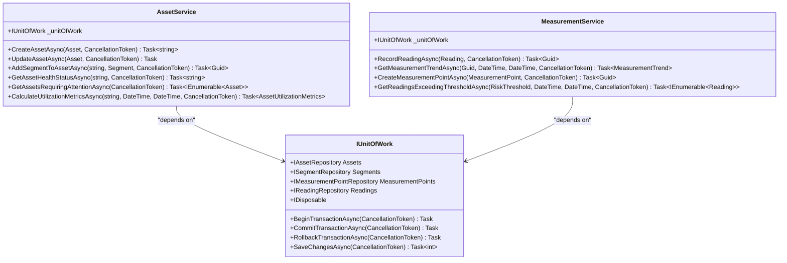

**Diagram sources**
- [AssetService.cs](file://src/OilErp.Domain/Services/AssetService.cs#L9-L196)
- [MeasurementService.cs](file://src/OilErp.Domain/Services/MeasurementService.cs#L9-L207)
- [IRepositories.cs](file://src/OilErp.Domain/Interfaces/IRepositories.cs#L58-L81)

**Section sources**
- [AssetService.cs](file://src/OilErp.Domain/Services/AssetService.cs#L9-L50)
- [MeasurementService.cs](file://src/OilErp.Domain/Services/MeasurementService.cs#L9-L50)

## Test Setup and Mocking Strategy

The unit testing strategy employs a comprehensive mocking approach to isolate the business logic in AssetService and MeasurementService from their dependencies. The primary dependency for both services is the IUnitOfWork interface, which provides access to various repository interfaces for data access operations.

In the test setup, Moq is used to create mock instances of IUnitOfWork and the required repository interfaces. The AssetServiceTests class demonstrates this pattern with multiple mock objects for different repositories:

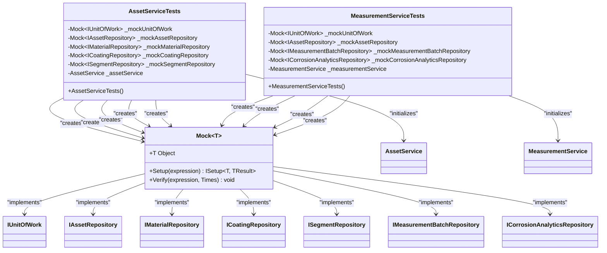

**Diagram sources**
- [AssetServiceTests.cs](file://src/OilErp.Tests/Unit/AssetServiceTests.cs#L21-L35)
- [MeasurementServiceTests.cs](file://src/OilErp.Tests/Unit/MeasurementServiceTests.cs#L20-L32)

**Section sources**
- [AssetServiceTests.cs](file://src/OilErp.Tests/Unit/AssetServiceTests.cs#L12-L50)
- [MeasurementServiceTests.cs](file://src/OilErp.Tests/Unit/MeasurementServiceTests.cs#L12-L50)

The test constructor sets up the mock relationships, configuring the IUnitOfWork mock to return the appropriate repository mocks when its properties are accessed. This creates a realistic test environment where the service under test can access what appears to be a fully functional unit of work, but all operations are actually performed on mock objects that can be controlled and verified within the tests.

For example, in AssetServiceTests, the constructor configures the mock unit of work to return the mock asset repository when the Assets property is accessed:

```csharp
_mockUnitOfWork.Setup(u => u.Assets).Returns(_mockAssetRepository.Object);
```

This pattern is repeated for all required repositories, creating a complete mock environment for the service under test. The actual service instance is then created by injecting the mock unit of work through its constructor, allowing the service to function normally while all data access operations are intercepted by the mocks.

## AssetService Unit Testing

The AssetService unit tests comprehensively cover the core business logic for asset management operations, including asset creation, segment management, and health status calculation. The tests validate both successful scenarios and various error conditions to ensure robustness and proper error handling.

### Asset Creation Testing

The `CreateAssetAsync` method is tested for both success and failure scenarios. The success test verifies that a valid asset can be created and that the appropriate repository methods are called with correct parameters:

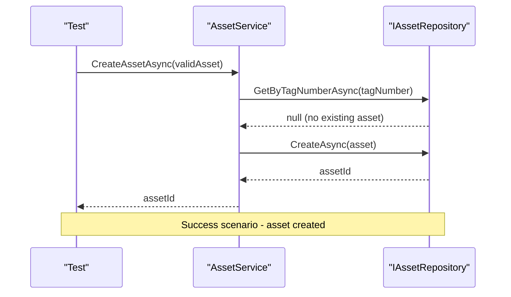

**Diagram sources**
- [AssetServiceTests.cs](file://src/OilErp.Tests/Unit/AssetServiceTests.cs#L52-L75)
- [AssetService.cs](file://src/OilErp.Domain/Services/AssetService.cs#L25-L50)

**Section sources**
- [AssetServiceTests.cs](file://src/OilErp.Tests/Unit/AssetServiceTests.cs#L52-L75)

The test verifies that the asset is created with the correct ID and that timestamps are properly set. It also confirms that the repository's CreateAsync method is called exactly once with an asset that has the expected properties.

Error conditions are also thoroughly tested. The test for duplicate asset creation verifies that an InvalidOperationException is thrown when attempting to create an asset with a tag number that already exists:

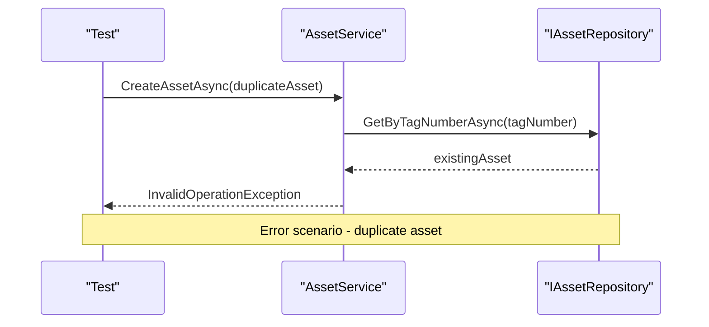

**Diagram sources**
- [AssetServiceTests.cs](file://src/OilErp.Tests/Unit/AssetServiceTests.cs#L77-L95)
- [AssetService.cs](file://src/OilErp.Domain/Services/AssetService.cs#L30-L35)

**Section sources**
- [AssetServiceTests.cs](file://src/OilErp.Tests/Unit/AssetServiceTests.cs#L77-L95)

Additionally, validation rules are tested, such as ensuring that a plant code is required for asset creation. This test verifies that an ArgumentException is thrown when attempting to create an asset with an empty plant code.

### Segment Management Testing

The `AddSegmentToAssetAsync` method is tested to ensure proper validation and business rule enforcement. The success test verifies that a segment can be added to an existing asset when all validation rules are satisfied:

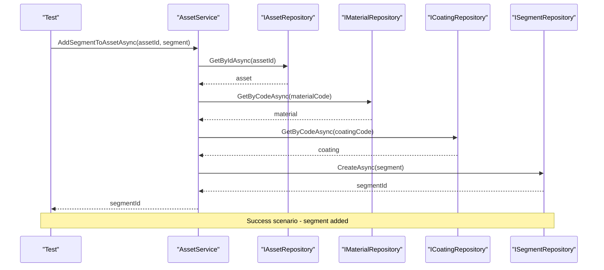

**Diagram sources**
- [AssetServiceTests.cs](file://src/OilErp.Tests/Unit/AssetServiceTests.cs#L152-L185)
- [AssetService.cs](file://src/OilErp.Domain/Services/AssetService.cs#L77-L110)

**Section sources**
- [AssetServiceTests.cs](file://src/OilErp.Tests/Unit/AssetServiceTests.cs#L152-L185)

The test verifies that the segment is properly associated with the asset, that creation timestamps are set, and that all validation checks pass. It also confirms that the segment repository's CreateAsync method is called exactly once.

Error conditions are also tested, including scenarios where the asset does not exist, or when referenced materials or coatings are not found in the system. These tests ensure that appropriate validation is performed and that meaningful error messages are provided.

### Asset Health Status Testing

The `GetAssetHealthStatusAsync` method is tested to verify that it correctly calculates the health status of an asset based on its defects. The test for critical defects verifies that an asset with unresolved critical defects returns a "Critical" status:

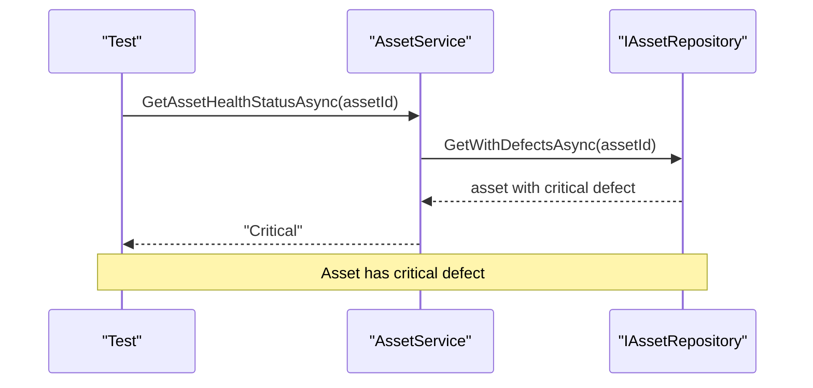

**Diagram sources**
- [AssetServiceTests.cs](file://src/OilErp.Tests/Unit/AssetServiceTests.cs#L232-L250)
- [AssetService.cs](file://src/OilErp.Domain/Services/AssetService.cs#L112-L140)

**Section sources**
- [AssetServiceTests.cs](file://src/OilErp.Tests/Unit/AssetServiceTests.cs#L232-L250)

Additional tests verify the status calculation for assets with high, medium, and low severity defects, as well as assets with no defects. This comprehensive testing ensures that the health status calculation logic is correct and consistent with business requirements.

## MeasurementService Unit Testing

The MeasurementService unit tests focus on validating the business logic for recording and analyzing measurement data, with comprehensive coverage of validation rules, error handling, and complex calculations.

### Measurement Validation Testing

The MeasurementService includes extensive validation logic for measurement data, which is thoroughly tested in the unit tests. The `ValidateMeasurementDataAsync` method is tested for various scenarios, including valid data and multiple types of invalid data.

The success test verifies that valid measurement data passes validation:

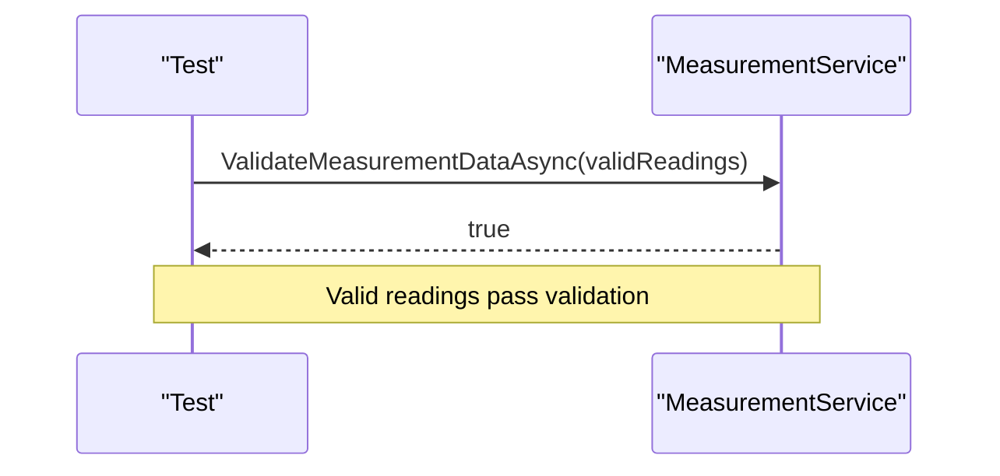

**Diagram sources**
- [MeasurementServiceTests.cs](file://src/OilErp.Tests/Unit/MeasurementServiceTests.cs#L102-L115)
- [MeasurementService.cs](file://src/OilErp.Domain/Services/MeasurementService.cs#L25-L50)

**Section sources**
- [MeasurementServiceTests.cs](file://src/OilErp.Tests/Unit/MeasurementServiceTests.cs#L102-L115)

Multiple failure scenarios are tested to ensure comprehensive validation coverage:

1. **Invalid thickness values**: Tests verify that negative thickness values are rejected
2. **Future timestamps**: Tests ensure that measurements with timestamps in the future are rejected
3. **Excessively old timestamps**: Tests validate that measurements with timestamps too far in the past are rejected
4. **Unreasonably high thickness values**: Tests confirm that implausible thickness values are flagged as invalid

These tests demonstrate a thorough approach to data validation, ensuring that only valid measurement data can be processed by the system.

### Measurement Submission Testing

The `SubmitMeasurementBatchAsync` method is tested to verify the complete workflow for submitting a batch of measurements. The success test confirms that a valid measurement batch can be submitted when the associated asset exists:

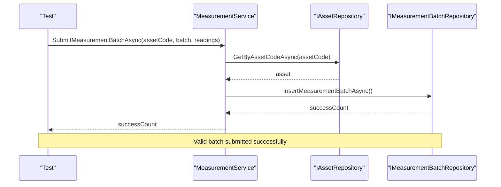

**Diagram sources**
- [MeasurementServiceTests.cs](file://src/OilErp.Tests/Unit/MeasurementServiceTests.cs#L52-L75)
- [MeasurementService.cs](file://src/OilErp.Domain/Services/MeasurementService.cs#L25-L50)

**Section sources**
- [MeasurementServiceTests.cs](file://src/OilErp.Tests/Unit/MeasurementServiceTests.cs#L52-L75)

The test verifies that the measurement batch repository's InsertMeasurementBatchAsync method is called exactly once with the correct parameters. It also confirms that the returned success count matches expectations.

Error conditions are also tested, particularly the scenario where an attempt is made to submit measurements for a non-existent asset. This test verifies that an InvalidOperationException is thrown with an appropriate error message:

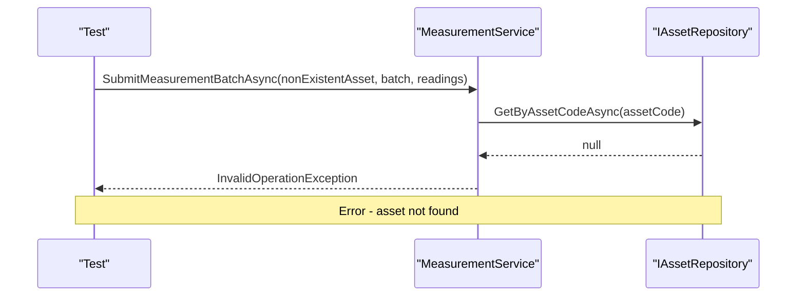

**Diagram sources**
- [MeasurementServiceTests.cs](file://src/OilErp.Tests/Unit/MeasurementServiceTests.cs#L77-L95)
- [MeasurementService.cs](file://src/OilErp.Domain/Services/MeasurementService.cs#L30-L35)

**Section sources**
- [MeasurementServiceTests.cs](file://src/OilErp.Tests/Unit/MeasurementServiceTests.cs#L77-L95)

### Corrosion Rate Calculation Testing

The `CalculateCorrosionRateAsync` method is tested to ensure accurate calculation of corrosion rates based on historical measurement data. The success test verifies that the method correctly delegates to the corrosion analytics repository:

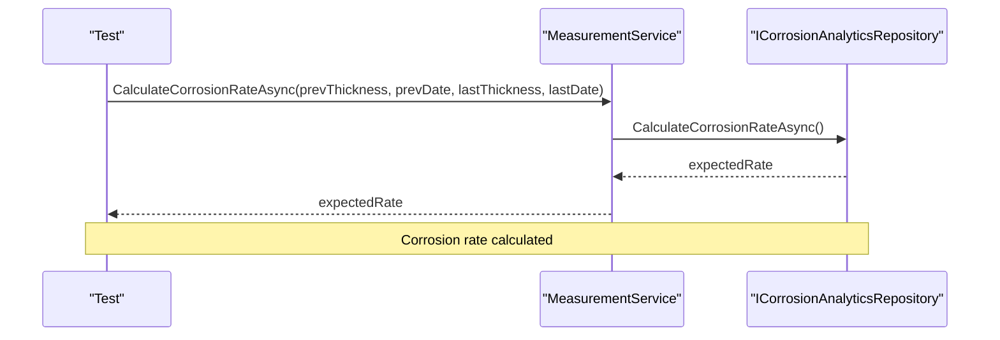

**Diagram sources**
- [MeasurementServiceTests.cs](file://src/OilErp.Tests/Unit/MeasurementServiceTests.cs#L152-L165)
- [MeasurementService.cs](file://src/OilErp.Domain/Services/MeasurementService.cs#L77-L90)

**Section sources**
- [MeasurementServiceTests.cs](file://src/OilErp.Tests/Unit/MeasurementServiceTests.cs#L152-L165)

The test verifies that the corrosion analytics repository's CalculateCorrosionRateAsync method is called exactly once with the correct parameters. It also confirms that the returned corrosion rate matches the expected value.

Error conditions are also tested, such as when invalid thickness values are provided. This test ensures that appropriate validation is performed and that meaningful error messages are provided to prevent incorrect calculations.

## Test Assertion Patterns

The unit tests in the Oil ERP system employ consistent and effective assertion patterns using FluentAssertions, which provides a more expressive and readable syntax compared to traditional assertion methods.

### Result Verification

For verifying return values, the tests use the Should().Be() pattern to ensure expected outcomes:

```csharp
result.Should().Be(asset.Id);
```

This pattern is used throughout the tests to verify that methods return the expected values. For collection results, more specific assertions are used:

```csharp
result.Should().HaveCount(2);
result.Should().AllSatisfy(a => a.PlantCode.Should().Be(plantCode));
```

These assertions verify both the count of items in a collection and that all items satisfy specific conditions.

### Exception Testing

Exception handling is tested using FluentAssertions' exception assertion syntax:

```csharp
await action.Should().ThrowAsync<InvalidOperationException>()
    .WithMessage("Asset with code 'TEST_ASSET_001' already exists");
```

This pattern allows for verification of both the exception type and the specific error message, ensuring that appropriate exceptions are thrown with meaningful messages for debugging and user feedback.

### Mock Verification

The tests extensively use Moq's verification capabilities to ensure that the correct methods are called on dependencies with the expected parameters:

```csharp
_mockAssetRepository.Verify(r => r.CreateAsync(It.Is<Asset>(a => 
    a.Id == asset.Id && 
    a.CreatedAt != default && 
    a.UpdatedAt != default), It.IsAny<CancellationToken>()), Times.Once);
```

This verification pattern ensures that the service under test interacts correctly with its dependencies, calling the appropriate methods with valid parameters. The Times.Once constraint verifies that the method is called exactly once, preventing issues with multiple or missing calls.

### Property and State Verification

For verifying object properties and state changes, the tests use direct property assertions:

```csharp
segment.AssetId.Should().Be(assetId);
segment.CreatedAt.Should().BeCloseTo(DateTime.UtcNow, TimeSpan.FromMinutes(1));
```

The BeCloseTo assertion is particularly useful for timestamp verification, allowing for a small time difference between when the timestamp is set and when the assertion is made.

## Common Testing Issues and Solutions

The unit testing implementation in the Oil ERP system addresses several common testing challenges through careful design and implementation patterns.

### Proper Mock Configuration

One common issue in unit testing is improper mock configuration, which can lead to tests that pass for the wrong reasons or fail unexpectedly. The tests in this system avoid this issue by carefully configuring mock behavior for each test scenario.

For example, when testing the CreateAssetAsync method, the mock asset repository is configured to return null when checking for existing assets, simulating the case where the asset does not already exist:

```csharp
_mockAssetRepository.Setup(r => r.GetByAssetCodeAsync(asset.Id, It.IsAny<CancellationToken>()))
    .ReturnsAsync((Asset?)null);
```

This explicit configuration ensures that the test is testing the intended scenario and that the mock behavior is predictable and consistent.

### Test Determinism

Ensuring test determinism is critical for reliable test results. The tests in this system achieve determinism through several strategies:

1. **Isolation of tests**: Each test is independent and does not rely on the state created by other tests
2. **Fresh mock instances**: New mock objects are created for each test, preventing state leakage between tests
3. **Controlled test data**: Test data is explicitly defined within each test, avoiding reliance on external data sources
4. **Time handling**: For timestamp verification, the BeCloseTo assertion is used with a reasonable tolerance, accounting for the small time difference between when a timestamp is set and when it is verified

### Handling Complex Validation

The MeasurementService includes complex validation logic that considers multiple factors such as measurement type, value ranges, and temporal constraints. The tests address this complexity by testing each validation rule in isolation:

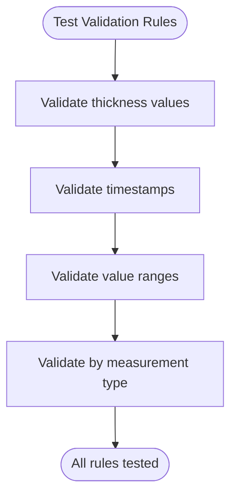

**