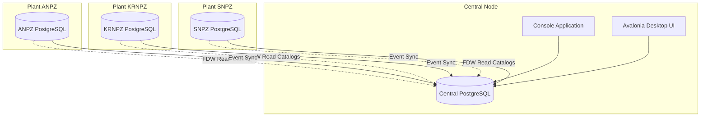

# System Architecture

## Overview

The Oil ERP Asset Registry system follows a distributed architecture pattern with a central hub managing global data and analytics, while individual plants handle local operations.

## Architecture Diagram

## Components

### Central Hub
- Global asset registry
- Analytics and reporting
- Risk assessment policies
- Incident management
- Event synchronization

### Plant Operations
- Local asset instances
- Measurement data collection
- Defect tracking
- Work order management
- Local event generation

### Data Synchronization
- Outbox/Inbox pattern for event synchronization
- Foreign Data Wrappers for catalog access
- Eventual consistency model

## Design Patterns

- **Repository Pattern**: Data access abstraction
- **Domain-Driven Design**: Clear separation of business logic
- **MVVM Pattern**: UI architecture (Avalonia)
- **Event Sourcing**: Change tracking and synchronization
- **Foreign Data Wrapper**: Distributed data access